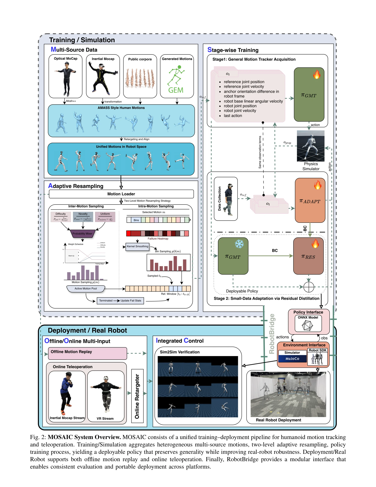
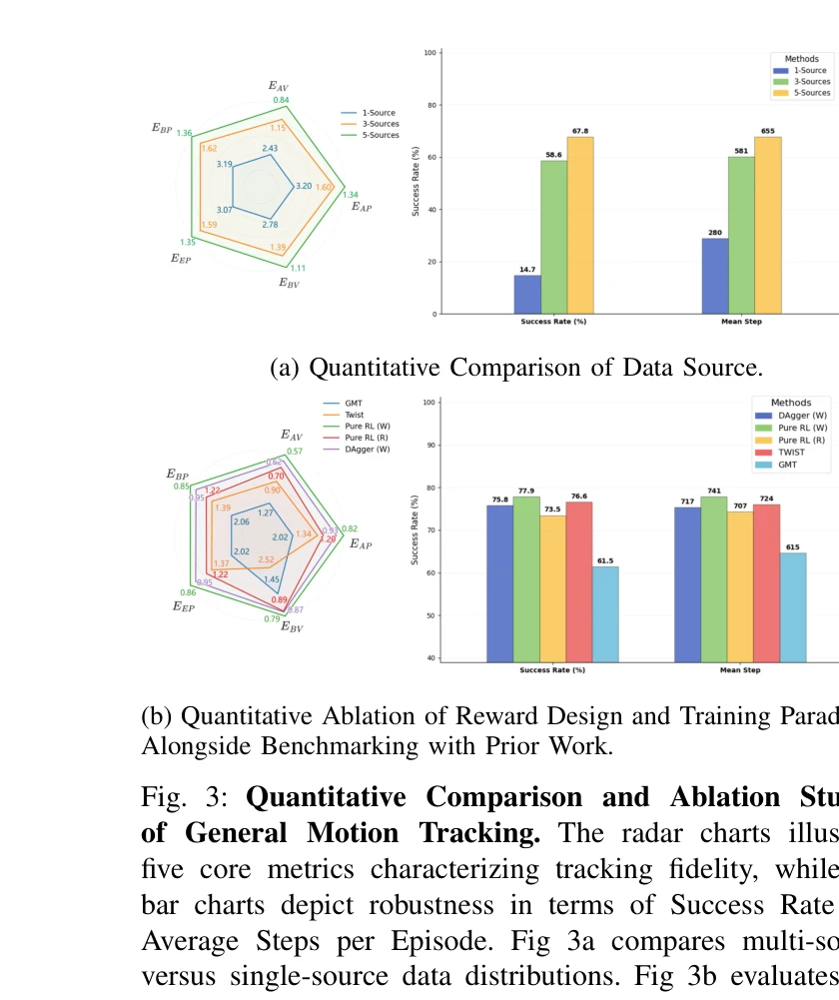

# MOSAIC: Bridging the Sim-to-Real Gap in Generalist Humanoid Motion Tracking and Teleoperation with Rapid Residual Adaptation

> **저자**: Zhenguo Sun, Bo-Sheng Huang, Yibo Peng, Xukun Li, Jingyu Ma, Yu Sun, Zhe Li, Haojun Jiang, Biao Gao, Zhenshan Bing, Xinlong Wang, Alois Knoll | **날짜**: 2026-02-11 | **DOI**: [10.48550/arXiv.2602.08594](https://doi.org/10.48550/arXiv.2602.08594)

---

## Essence

*Fig. 2: MOSAIC System Overview. MOSAIC consists of a unified training–deployment pipeline for humanoid motion tracking*

MOSAIC는 강화학습을 통해 학습한 범용 humanoid 동작 추적기와 빠른 residual 적응 메커니즘을 결합하여 시뮬레이션과 실제 로봇 간의 gap을 줄이고 장시간의 텔레오퍼레이션을 안정적으로 지원하는 시스템이다.

## Motivation

- **Known**: RL 기반 motion imitation은 DeepMimic 이후 발전하여 GMT, Any2Track, UniTracker 등의 범용 motion tracker가 등장했으며, TWIST, SONIC 등의 텔레오퍼레이션 시스템도 개발되었다. 하지만 시뮬레이션에서의 성능이 실제 로봇에서는 보장되지 않는다.
- **Gap**: 범용 motion tracker가 시뮬레이션에서 높은 성능을 보이더라도 실제 로봇에서의 장시간 텔레오퍼레이션 중에는 interface 오류와 dynamics 오류로 인해 불안정해진다. 또한 heterogeneous 데이터와 다양한 텔레오퍼레이션 interface의 특성 차이를 동시에 처리하기 어렵다.
- **Why**: 범용 humanoid 로봇의 텔레오퍼레이션은 원격 조작과 대규모 시연 수집의 기초이며, 이를 위해서는 다양한 동작을 일반화하면서도 실제 환경의 interface-induced error에 강건한 시스템이 필수적이다.
- **Approach**: 먼저 multi-source motion bank와 adaptive resampling, world-frame motion consistency를 강조하는 보상 설계를 통해 RL로 범용 motion tracker를 학습하고, 이후 소량의 interface-specific 데이터로 학습한 적응 정책을 residual 모듈로 범용 tracker에 distill하여 빠른 interface 적응을 달성한다.

## Achievement

*Fig. 3: Quantitative Comparison and Ablation Studies*

- **MOSAIC 시스템**: 오프라인 motion replay와 온라인 다중 interface 텔레오퍼레이션을 지원하는 통합 humanoid motion tracking 시스템으로, 실제 로봇에서 분당 단위의 robust한 tracking 성능을 달성했다.
- **Residual adaptation 메커니즘**: 일반 tracker에 소량의 interface-specific 데이터(약 30분)만으로 새로운 interface에 빠르게 적응하며, naive fine-tuning이나 continual learning보다 우수한 성능을 제공한다.
- **RobotBridge 배포 프레임워크**: motion reference, policy execution, simulator/robot backend, low-level controller 간의 interface를 표준화하여 여러 humanoid 플랫폼 간 포팅성을 향상시켰다.
- **공개 리소스 및 실증**: 학습 및 배포 파이프라인, 고품질 motion dataset, trained checkpoint와 함께 광범위한 ablation study와 실제 로봇 실험 결과를 공개했다.

## How

*Fig. 2: MOSAIC System Overview. MOSAIC consists of a unified training–deployment pipeline for humanoid motion tracking*

- Multi-source motion bank에서 동작을 수집하고 two-level adaptive resampling을 적용하여 dataset 불균형을 완화
- RL 보상 함수를 설계하여 전체 신체 pose tracking과 함께 world-frame motion consistency(body position, global motion 추적)를 명시적으로 강조
- Interface-specific policy를 소량의 데이터로 학습한 후, 이를 additive residual module로 범용 tracker에 distill하여 interface 적응
- RobotBridge를 통해 motion reference, policy executor, simulator/robot backend, low-level controller를 모듈화하여 일관된 평가 및 포팅 지원
- Offline motion replay(다양한 동작 재현)와 online teleoperation(실시간 human motion stream 반영)을 동일한 정책으로 통합 지원

## Originality

- 텔레오퍼레이션 환경의 requirements를 명시적으로 반영한 RL 보상 설계(world-frame motion consistency 강조)로 단순 pose tracking을 넘어 deployment-ready 성능 달성
- Residual distillation을 통한 interface 적응 방식은 기존 residual learning의 관례를 따르되, 범용성 보존과 interface-specific correction의 balance를 new system 관점에서 실증적으로 검증
- Multi-source heterogeneous dataset 처리를 위한 two-level adaptive resampling과 stage-wise training 전략으로 기존 motion scaling 방식의 한계 극복
- RobotBridge라는 modular 배포 프레임워크를 통해 시뮬레이션과 실제 로봇 간의 재현성 및 공정한 비교를 향상

## Limitation & Further Study

- Residual adaptation이 interface-specific 특성에만 집중하므로, 로봇의 dynamics 변화(예: embodiment 변경)에 대한 일반화 능력은 명확하지 않음
- 약 30분의 interface-specific 데이터 수집이 여전히 필요하므로, 완전한 zero-shot adaptation은 달성하지 못함
- 현재 방법론이 특정 humanoid 플랫폼(BAAI H-1 등) 중심으로 평가되었으므로, 다양한 형태의 humanoid에 대한 일반화 검증이 필요
- World-frame motion consistency 보상이 중요하다는 발견은 실증적이지만, 이를 정량적으로 설계하는 일반 원칙 제시 부족
- **후속 연구**: (1) 다양한 embodiment dynamics 변화에 대한 domain randomization 또는 meta-learning 기법 통합, (2) 적응 데이터 요구량 최소화를 위한 few-shot learning 기법 적용, (3) 다양한 humanoid 플랫폼에서의 cross-embodiment 전이 학습 검증

## Evaluation

- Novelty: 4/5
- Technical Soundness: 3/5
- Significance: 4/5
- Clarity: 4/5
- Overall: 4/5

**총평**: MOSAIC는 시뮬레이션-실제 로봇 간 격차를 체계적으로 해결하기 위해 텔레오퍼레이션 지향의 RL 설계와 residual adaptation을 결합한 실용적이고 잘 설계된 시스템으로, RobotBridge 프레임워크와 함께 공개되어 재현성과 확장성을 크게 향상시킨다. 다만 완전한 zero-shot adaptation과 다양한 embodiment에 대한 더욱 강력한 일반화가 향후 과제이다.
