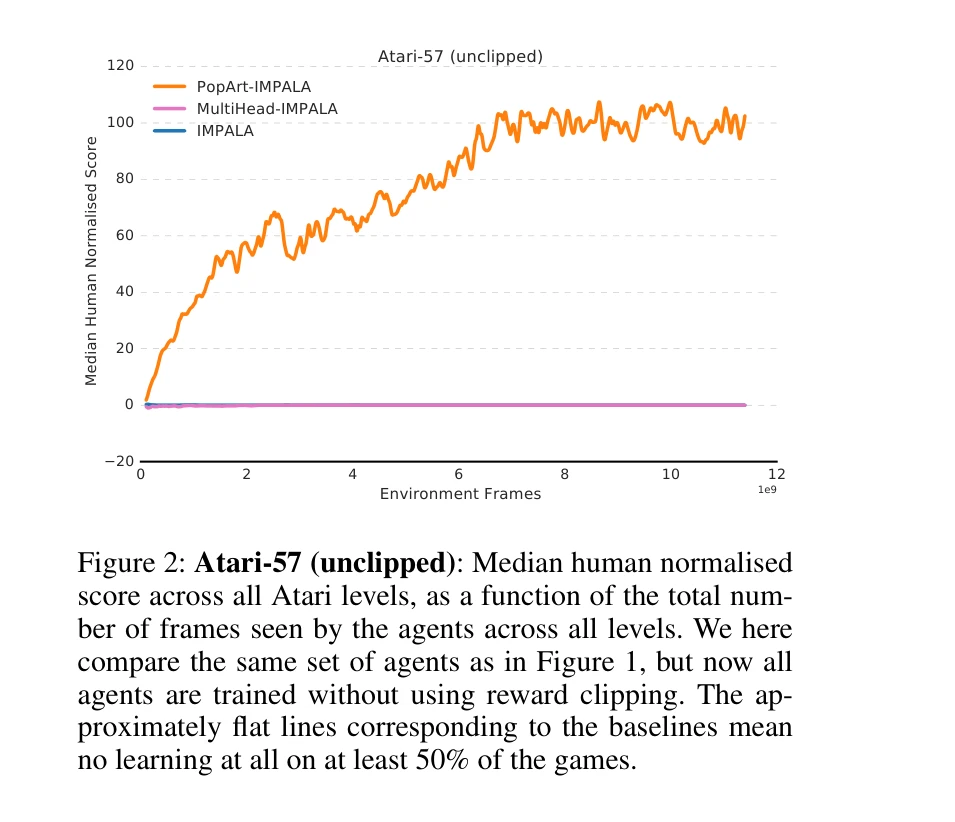
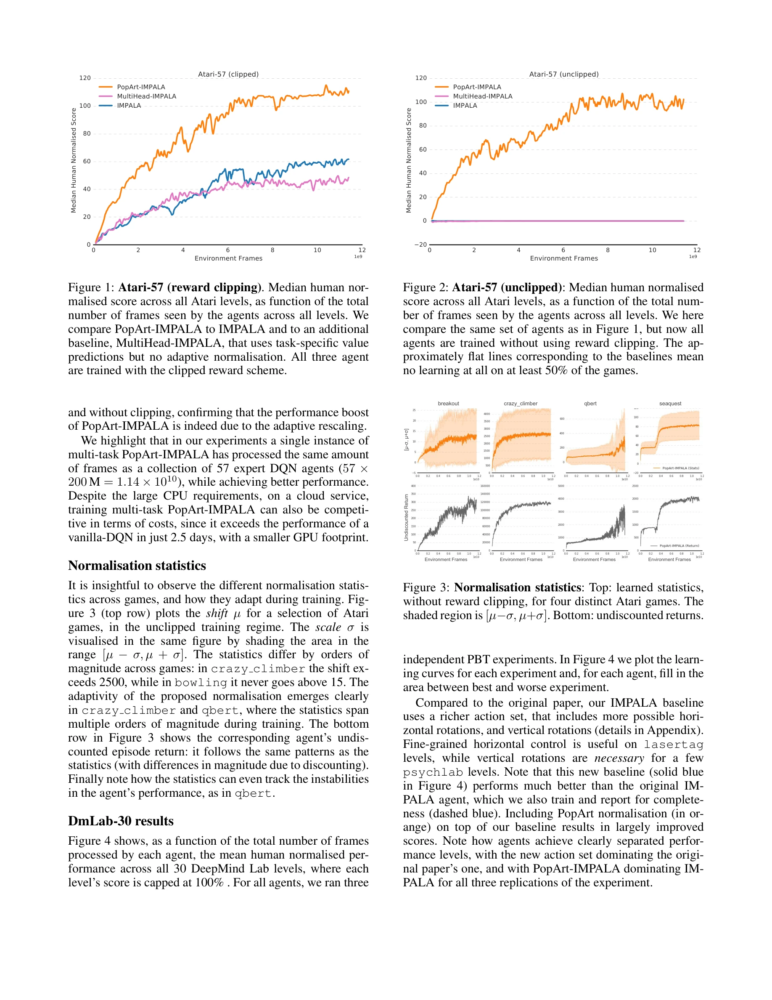

# Multi-task Deep Reinforcement Learning with PopArt

> **저자**: Matteo Hessel, Hubert Soyer, Lasse Espeholt, Wojciech Czarnecki, Simon Schmitt, Hado van Hasselt | **날짜**: 2018-09-12 | **URL**: [https://arxiv.org/abs/1809.04474](https://arxiv.org/abs/1809.04474)

---

## Essence

*Figure 2: Atari-57 (unclipped): Median human normalised*

Multi-task Deep Reinforcement Learning에서 task 간의 reward scale과 sparsity 차이로 인한 불균형 문제를 PopArt 정규화를 통해 해결하여, 57개 Atari 게임을 단일 정책으로 인간 수준 이상의 성능으로 학습.

## Motivation

- **Known**: Deep RL은 단일 task에서 인간 성능을 초과하지만, 기존 multi-task learning 방법들은 reward magnitude와 sparsity 차이로 인해 특정 task에 편향되는 문제가 있다. IMPALA는 57개 Atari 게임에서 59.7% median human normalised score를 달성했다.
- **Gap**: Multi-task learning에서 task들이 서로 다른 reward scale과 sparsity를 가질 때, 단순 reward clipping으로는 학습 역학에서 균형을 맞추기 어렵다. 특히 non-stationary learning dynamics 때문에 사전 정규화가 불가능하다.
- **Why**: 다양한 task를 단일 정책으로 학습할 수 있으면 일반화 능력이 뛰어나고, 인간 수준의 multi-task 성능 달성은 RL의 실용적 응용성을 크게 향상시킨다.
- **Approach**: PopArt 정규화를 actor-critic 업데이트에 적용하여 모든 task가 학습 역학에 유사한 영향을 미치도록 자동으로 각 task의 contribution을 조정. 이를 통해 reward scale, sparsity, agent competence에 불변적인 업데이트를 실현.

## Achievement

*Figure 2: Atari-57 (unclipped): Median human normalised*

- **Atari-57 벤치마크**: 단일 정책으로 110% median human normalised score 달성 (이전 IMPALA 59.7% 대비 대폭 향상)
- **DeepMind Lab-30**: 72.8% mean human normalised score로 SOTA 성능 달성
- **역사적 이정표**: 인간을 초과하는 다중 task 정책을 단일 agent로 처음 실현
- **일반화 가능한 방법론**: PopArt 정규화가 task 간 불균형 문제에 대한 일반적 해결책 제시

## How

*Figure 3: Normalisation statistics: Top: learned statistics,*

- PopArt 정규화를 value function 업데이트에 적용하여 return의 scale을 자동으로 정규화
- Actor-critic framework에서 value loss와 policy gradient 모두에 정규화된 return을 적용
- IMPALA의 분산 actor-learner 구조를 유지하면서 multi-step return Gv_t와 Gπ_t에 적응적 정규화 추가
- Task index를 training 시점에만 사용하고, test 시에는 raw observation에서만 task를 추론하도록 설계
- Off-policy correction (importance sampling)을 통해 분산 학습으로 인한 off-policy 효과 보정

## Originality

- PopArt를 multi-task RL의 task 불균형 문제에 최초로 적용
- Non-stationary reward dynamics 하에서 적응적 정규화를 통해 online 조정 가능한 솔루션 제시
- Task index를 latent하게 유지하면서도 test 시 일반 정책 사용 (기존 multi-task learning 보다 더 도전적 설정)
- IMPALA 구조의 효율성을 유지하면서 multi-task 성능 대폭 개선

## Limitation & Further Study

- PopArt 정규화의 hyperparameter (update rate, scaling factor)에 대한 민감도 분석 부재
- 57개 Atari 게임과 30개 DeepMind Lab 게임으로만 검증되었으며, 더 diverse한 도메인에서의 일반화 가능성 미확인
- Continuous control 또는 sparse reward 환경에서의 성능 미평가
- 계산 복잡도 및 메모리 오버헤드에 대한 상세 분석 부족
- Reward clipping과의 직접 비교보다 상세한 ablation study 필요 (특히 정규화 방식별 성능 차이)

## Evaluation

- Novelty: 4/5
- Technical Soundness: 4/5
- Significance: 4/5
- Clarity: 4/5
- Overall: 4/5

**총평**: PopArt를 multi-task RL에 적용한 실용적이고 효과적인 솔루션으로, 단일 정책이 다양한 task에서 인간 수준 성능을 달성한 것은 RL 분야의 중요한 이정표다. 명확한 문제 정의, 우아한 솔루션, 그리고 강력한 실험 결과로 높은 가치의 논문이다.
