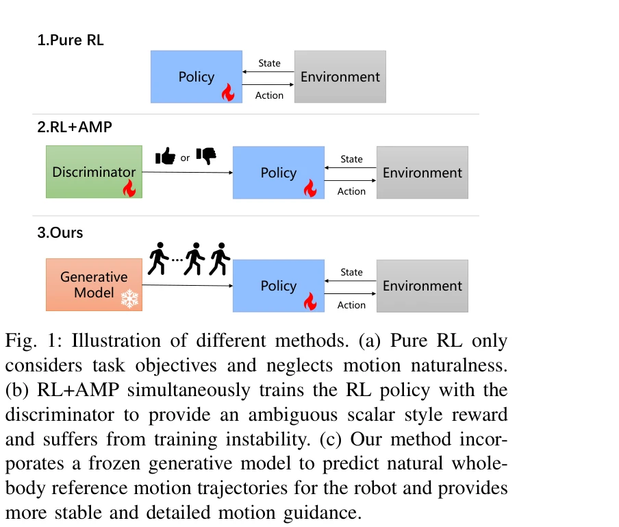
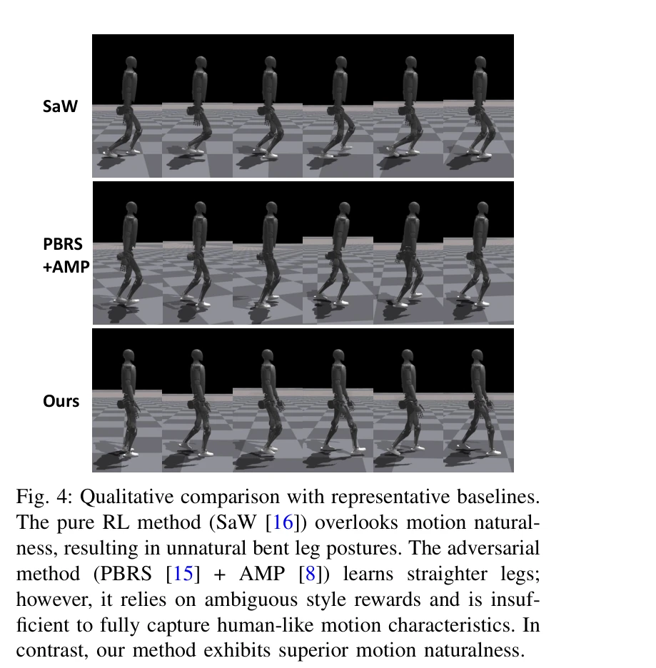
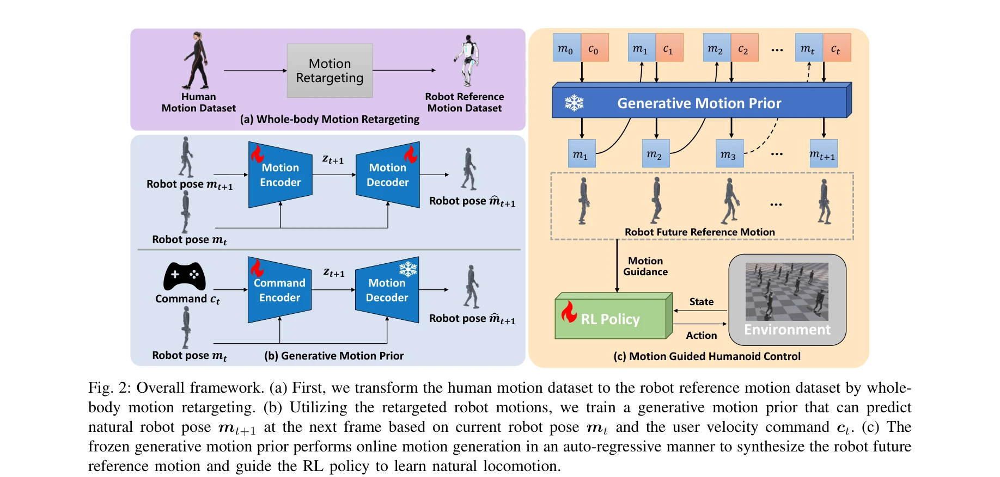

# Natural Humanoid Robot Locomotion with Generative Motion Prior

> **저자**: Haodong Zhang, Liang Zhang, Zhenghan Chen, Lu Chen, Yue Wang, Rong Xiong | **날짜**: 2025-03-12 | **URL**: [https://arxiv.org/abs/2503.09015](https://arxiv.org/abs/2503.09015)

---

## Essence

*Fig. 1: Illustration of different methods. (a) Pure RL only*

본 논문은 Generative Motion Prior (GMP)를 활용하여 인간의 자연스러운 보행 데이터로부터 휴머노이드 로봇의 자연스러운 보행을 학습하는 방법을 제안한다. 기존의 adversarial motion prior 대신 frozen generative model을 사용하여 fine-grained motion-level 감독을 제공함으로써 학습 안정성과 해석 가능성을 향상시킨다.

## Motivation

- **Known**: 휴머노이드 로봇 제어는 MPC와 RL 기반 방법으로 발전해왔으며, 최근 Adversarial Motion Prior (AMP)를 통해 인간의 움직임 스타일을 모방하려는 시도가 이루어지고 있다. 하지만 기존 방법들은 motion naturalness를 무시하거나 불안정한 style reward에 의존한다.
- **Gap**: AMP 기반 방법은 adversarial training의 내재적 불안정성으로 인해 학습이 불안정하며, discriminator가 제공하는 scalar style reward는 세분화되지 않고 해석 가능성이 부족하다. 따라서 보다 안정적이고 상세한 motion guidance가 필요하다.
- **Why**: 휴머노이드 로봇이 인간 사회와 상호작용하고 가정에 진입하기 위해서는 자연스럽고 유연한 인간 같은 보행 능력이 필수적이다. 기계적이고 부자연스러운 움직임은 사람-로봇 상호작용을 저해한다.
- **Approach**: 본 연구는 (1) whole-body motion retargeting을 통해 인간 보행 데이터를 로봇으로 변환하고, (2) Conditional Variational Auto-encoder (CVAE) 기반 generative model을 오프라인에서 학습한 후, (3) 학습 중 frozen generative model을 온라인 motion generator로 사용하여 joint angles과 keypoint positions 수준의 fine-grained guidance를 제공한다.

## Achievement

*Fig. 4: Qualitative comparison with representative baselines.*

- **GMP 프레임워크 제안**: Frozen generative model을 expert로 활용하는 혁신적 프레임워크로 robust하고 stable한 guidance 제공
- **Fine-grained motion guidance**: Whole-body reference motion trajectories를 생성하고 motion guidance rewards를 설계하여 granular하고 interpretable한 RL policy 학습 실현
- **SOTA 성능 달성**: 시뮬레이션 및 실제 환경에서 기존 방법들 대비 superior motion naturalness 달성
- **Learning stability 개선**: Adversarial training을 제거함으로써 mode collapse 없이 안정적인 학습 실현

## How

*Fig. 2: Overall framework. (a) First, we transform the human motion dataset to the robot reference motion dataset by who*

- 인간 보행 모션 캡처 데이터를 로봇의 kinematics에 맞게 whole-body motion retargeting 수행
- Retargeted robot motion dataset에 대해 CVAE 기반 motion generator를 conditional (현재 로봇 포즈와 사용자 속도 명령)으로 학습
- Motion generator를 auto-regressive manner로 미래 robot pose 예측하도록 학습하되 오프라인에서 완료
- RL policy 학습 중 frozen generative model에서 생성된 reference motion trajectories에 대해 joint angle과 keypoint position 차원의 motion guidance rewards 설계 적용
- Task reward (속도 추적, 에너지 효율성)와 motion guidance rewards를 결합하여 RL policy 최적화

## Originality

- Motion generation network를 humanoid robot natural locomotion 학습에 처음으로 활용 (기존는 human motion generation 또는 style discrimination만 수행)
- Adversarial training을 제거하고 frozen generative model 기반 접근으로 training stability 획기적 개선
- Joint angles과 keypoint positions 수준의 dual-level fine-grained motion guidance 설계 (기존 scalar style reward 대비 획기적 개선)

## Limitation & Further Study

- CVAE 기반 motion generator의 diversity와 expressiveness가 제한될 수 있으며, 학습 데이터의 질과 양에 크게 의존
- Motion retargeting 과정에서 발생하는 오류가 생성된 reference motion의 정확성에 영향을 미칠 수 있음
- 다양한 지형 및 방해물 환경에서의 일반화 능력에 대한 평가 부재
- Real-world 실험이 제한적이므로 다양한 로봇 플랫폼에서의 적용 가능성 검증 필요
- 후속 연구로 diffusion model 등 더 표현력 높은 generative model 활용, 온라인 적응 메커니즘 추가, 다양한 locomotion skill 확장 고려

## Evaluation

- Novelty: 4/5
- Technical Soundness: 3/5
- Significance: 4/5
- Clarity: 4/5
- Overall: 4/5

**총평**: 본 논문은 generative motion prior를 활용한 혁신적 접근으로 humanoid robot의 자연스러운 보행 학습 문제를 효과적으로 해결하며, adversarial training의 불안정성을 제거하고 fine-grained guidance를 제공함으로써 motion naturalness에서 SOTA 성능을 달성한다. 다만 real-world 실험 확대와 다양한 환경에서의 일반화 능력 검증이 필요하다.
