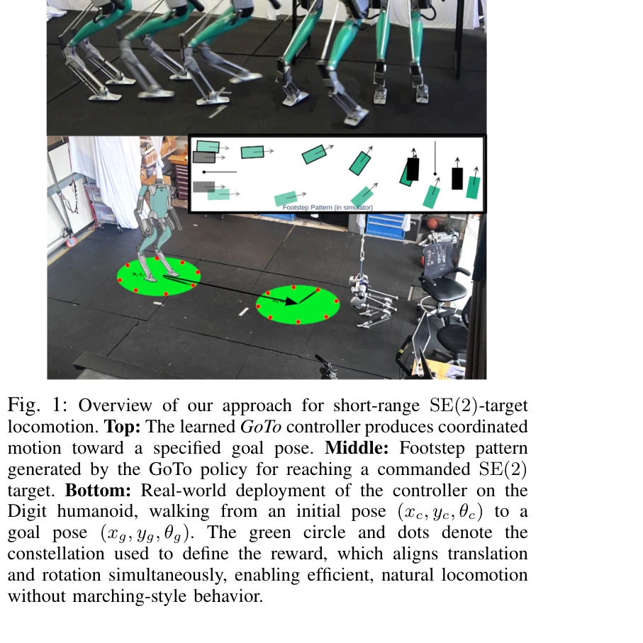
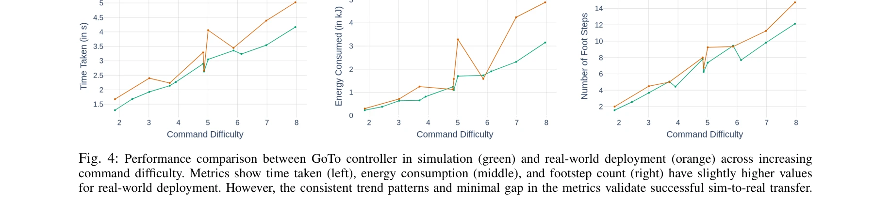
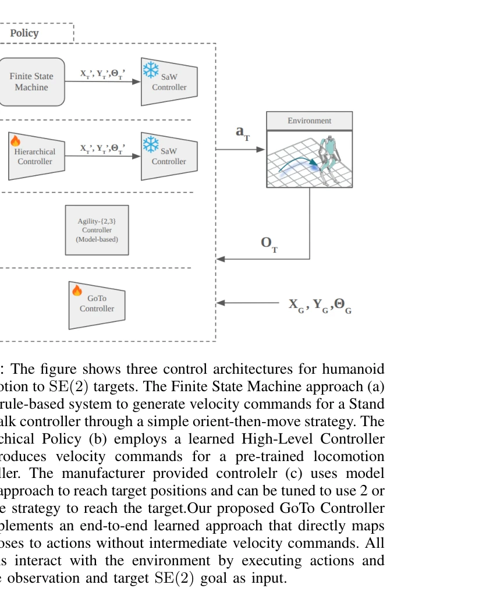

# No More Marching: Learning Humanoid Locomotion for Short-Range SE(2) Targets

> **저자**: Pranay Dugar, Mohitvishnu S. Gadde, Jonah Siekmann, Yesh Godse, Aayam Shrestha, Alan Fern | **날짜**: 2025-08-16 | **URL**: [https://arxiv.org/abs/2508.14098](https://arxiv.org/abs/2508.14098)

---

## Essence

*Fig. 1: Overview of our approach for short-range SE(2)-target*

본 논문은 휴머노이드 로봇의 단거리 SE(2) 목표 위치 도달을 위해 constellation 기반 보상 함수를 활용한 강화학습 접근법을 제시하며, 속도 추적 기반의 기존 방법들이 생성하는 비효율적인 행진 동작을 제거한다.

## Motivation

- **Known**: 강화학습 기반 휴머노이드 로봇 이동 제어는 장거리 속도 추적 작업에서 성공했으나, 대부분의 기존 방법은 velocity-tracking을 최적화하기 때문에 단거리 작업에서 비효율적이다.
- **Gap**: 기존 velocity-tracking 기반 보상 함수는 위치와 방향을 동시에 고려해야 하는 SE(2) 목표 도달 작업에 부적합하며, 단거리 작업 특화 보상 함수의 설계가 필요하다.
- **Why**: 실제 작업 환경에서 휴머노이드는 상자 이동 등 제한된 공간에서 빠르고 에너지 효율적인 단거리 이동이 필요하므로, 이를 위한 자연스럽고 효율적인 제어 방법이 실무적으로 중요하다.
- **Approach**: 점 constellation을 이용하여 로봇의 현재 위치와 목표 위치의 기하학적 유사성을 직접 비교하는 보상 함수를 설계하고, 이를 통해 위치와 회전을 통합적으로 최적화하는 end-to-end RL 정책을 학습한다.

## Achievement

*Fig. 4: Performance comparison between GoTo controller in simulation (green) and real-world deployment (orange) across i*

- **constellation 기반 보상 함수**: 점 구름의 기하학적 정렬을 통해 위치와 회전을 동시에 자연스럽게 균형 맞추며, constellation의 관성 모멘트로 trade-off를 직관적으로 제어 가능
- **벤치마킹 프레임워크**: 에너지 소비, time-to-target, footstep count 등 해석 가능한 메트릭을 통해 단거리 SE(2) 이동 성능을 정량적으로 평가
- **sim-to-real 전이 성공**: 시뮬레이션에서 학습한 정책이 Digit v3 휴머노이드 하드웨어에 성공적으로 전이되어 실무 적용 가능성 입증
- **성능 개선**: 제시된 접근법이 velocity-tracking 기반 방법들보다 에너지 효율, 속도, 자연스러움 측면에서 일관되게 우수한 성능 달성

## How

*Fig. 2: The figure shows three control architectures for humanoid*

- Goal-conditioned MDP로 문제 공식화하여 SE(2) 목표 위치와 로봇의 현재 상태를 입력으로 정의
- 로봇 베이스에 부착된 가상 2D 점 constellation과 목표 위치의 constellation 간 정렬 정도를 기하학적 거리 척도로 계산
- constellation 정렬 거리를 직접 보상 신호로 사용하여 위치와 방향 진행을 동시에 촉진
- PPO 또는 유사 RL 알고리즘으로 end-to-end 정책 학습 또는 사전 학습된 velocity 컨트롤러 위의 hierarchical 정책 학습
- 다양한 SE(2) 목표 분포에서 시뮬레이션 평가 후 sim-to-real 전이 수행

## Originality

- 고정 기반 조작기의 loss function에서 영감을 받은 constellation 기반 보상을 bipedal SE(2)-target 이동에 최초 적용
- 위치와 회전 균형을 constellation의 물리적 특성(관성 모멘트)으로 제어하는 새로운 접근
- velocity-tracking 기반이 아닌 직접 pose reaching 최적화를 통해 단거리 작업 특화 행동 생성
- 단거리 SE(2) 목표 도달에 대한 명시적 벤치마킹 프레임워크 최초 제시

## Limitation & Further Study

- constellation 설계의 자유도가 높아 작업별 최적 구성 찾기에 추가 튜닝 필요할 수 있음
- 복잡한 장애물 환경이나 3D 불균형 지형에서의 성능 미평가
- 긴 경로에서의 누적 오차나 재계획 메커니즘에 대한 논의 부재
- 시뮬레이션-실제 환경 간 물리 특성 차이(마찰, 센서 노이즈 등)에 대한 강건성 추가 검증 필요
- 후속 연구로 동적 장애물 회피, 3D 지형 적응, 더 긴 거리의 복합 네비게이션 작업 확장 필요

## Evaluation

- Novelty: 4/5
- Technical Soundness: 3/5
- Significance: 4/5
- Clarity: 4/5
- Overall: 4/5

**총평**: 이 논문은 단거리 SE(2) 목표 도달이라는 실제 작업에 특화된 새로운 보상 함수와 RL 접근법을 제시하며, 직관적인 설계와 sim-to-real 전이 성공으로 휴머노이드 로봇의 실무 적용 가능성을 크게 향상시킨다.

## Related Papers

- 🔄 다른 접근: [[papers/2105_MoRE_Mixture_of_Residual_Experts_for_Humanoid_Lifelike_Gaits/review]] — 둘 다 휴머노이드의 효율적 이동을 다루지만, No More Marching은 단거리 목표 도달 최적화에, MoRE는 복잡 지형의 자연스러운 보행에 초점을 둔다.
- 🏛 기반 연구: [[papers/1932_FocusNav_Spatial_Selective_Attention_with_Waypoint_Guidance/review]] — FocusNav의 공간 선택적 주의와 waypoint 안내 기법이 No More Marching의 constellation 기반 보상 함수 설계에 이론적 기반을 제공한다.
- 🔗 후속 연구: [[papers/2111_NoMaD_Goal_Masked_Diffusion_Policies_for_Navigation_and_Expl/review]] — NoMaD의 goal masking 기반 내비게이션 기법을 단거리 SE(2) 목표 도달이라는 더 구체적인 작업으로 특화한 연구이다.
- 🔄 다른 접근: [[papers/1660_RuN_Residual_Policy_for_Natural_Humanoid_Locomotion/review]] — 단거리 목표 도달과 자연스러운 보행을 위한 다른 접근법으로, constellation 기반과 residual policy의 차이를 비교할 수 있다.
- 🏛 기반 연구: [[papers/1693_STATE-NAV_Stability-Aware_Traversability_Estimation_for_Bipe/review]] — STATE-NAV의 안정성 인식 횡단성 추정이 단거리 SE(2) 목표 도달의 안정성 보장을 위한 기술적 기반을 제공한다.
- 🔄 다른 접근: [[papers/2105_MoRE_Mixture_of_Residual_Experts_for_Humanoid_Lifelike_Gaits/review]] — 둘 다 휴머노이드의 효율적인 이동을 다루지만, MoRE는 복잡한 지형에서의 인간다운 보행에, No More Marching은 단거리 목표 도달에 집중한다.
- 🏛 기반 연구: [[papers/2111_NoMaD_Goal_Masked_Diffusion_Policies_for_Navigation_and_Expl/review]] — NoMaD의 goal masking을 활용한 통합 정책이 No More Marching의 constellation 기반 목표 지향 보상 설계에 방법론적 기반을 제공한다.
