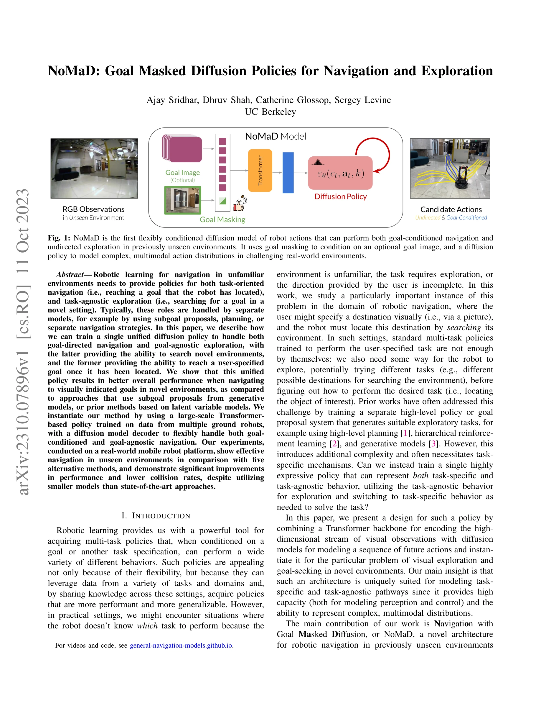
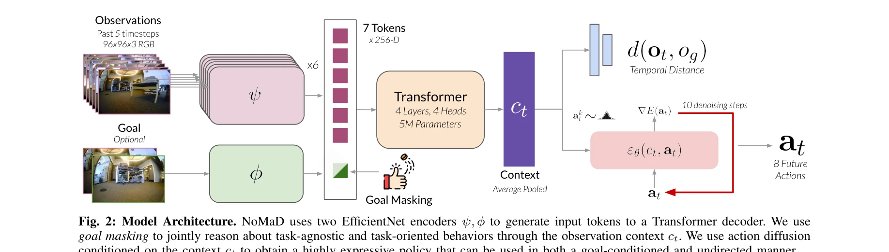

# NoMaD: Goal Masked Diffusion Policies for Navigation and Exploration

> **저자**: Ajay Sridhar, Dhruv Shah, Catherine Glossop, Sergey Levine | **날짜**: 2023-10-11 | **URL**: [https://arxiv.org/abs/2310.07896](https://arxiv.org/abs/2310.07896)

---

## Essence

*Fig. 1: NoMaD is the first flexibly conditioned diffusion model of robot actions that can perform both goal-conditioned *

NoMaD는 goal masking을 활용한 unified diffusion policy로 로봇의 목표 지향 네비게이션과 목표 무관 탐색을 단일 모델로 처리하며, Transformer 기반 정책과 diffusion model decoder를 결합하여 미지의 환경에서 효과적인 네비게이션을 구현한다.

## Motivation

- **Known**: 로봇 네비게이션은 일반적으로 목표 지정 네비게이션과 탐색을 별도의 모델로 처리해왔으며, ViNT 같은 Transformer 기반 goal-conditioned 정책들이 높은 성능을 보여주었다. 또한 diffusion model의 multimodal action distribution 모델링 능력이 주목받고 있다.
- **Gap**: 기존 방법들은 subgoal proposal, planning, 또는 별도의 exploration 정책을 사용하여 두 역할을 분리적으로 처리했으며, ViNT는 goal-conditioned 네비게이션에만 최적화되어 undirected exploration 능력이 부족하다. 또한 두 행동 양식을 통합하면서도 효율적인 단일 모델이 부재하다.
- **Why**: 로봇이 미지의 환경에서 목표를 찾기 위해서는 탐색과 목표 추구를 능하게 수행해야 하는데, 별도 모델 사용은 복잡성을 증가시키고 전체 시스템 성능을 제약한다. 단일 unified 모델은 데이터 공유를 통한 일반화 성능 향상과 시스템 효율성을 제공한다.
- **Approach**: NoMaD는 Transformer 백본으로 고차원 시각 정보를 인코딩하고, goal masking 메커니즘으로 선택적 goal conditioning을 구현하며, diffusion policy decoder로 복잡한 multimodal action distribution을 모델링한다. 또한 topological graph 기반 고레벨 플래너와 결합하여 long-horizon 탐색과 목표 추구를 수행한다.

## Achievement

- **통합 정책 구현**: 단일 diffusion policy로 goal-conditioned navigation과 goal-agnostic exploration을 모두 수행하는 최초의 성공적 사례를 제시했다.
- **성능 향상**: ViNT 대비 undirected exploration에서 25% 이상, novel environment의 goal-directed navigation에서 유의미한 성능 개선을 달성했다.
- **계산 효율성**: ViNT의 300M 파라미터 subgoal proposal model을 사용하지 않아 15배 이상의 계산 효율성을 확보하며 더 작은 모델로 더 나은 성능을 달성했다.
- **실제 로봇 배포**: 복수의 ground robot 데이터로 학습한 모델을 실제 로봇 플랫폼에 성공적으로 배포하여 indoor/outdoor 환경에서 충돌률 감소와 안정적 네비게이션을 입증했다.

## How

*Fig. 2: Model Architecture. NoMaD uses two EfficientNet encoders ψ, ϕ to generate input tokens to a Transformer decoder.*

- **비전 인코딩**: EfficientNet-B0 encoder ψ를 사용하여 과거 5 timestep의 RGB 관찰을 독립적으로 처리
- **Goal Fusion**: goal fusion encoder ϕ(ot, og)로 현재 관찰과 목표 이미지를 결합하여 토큰화
- **Goal Masking**: 목표 이미지 og를 선택적으로 마스킹하여 goal-agnostic 모드와 goal-conditioned 모드를 같은 아키텍처에서 수행 가능하게 함
- **Transformer Context 생성**: Multi-headed attention 레이어 f(ψ(oi), ϕ(ot, og))로 컨텍스트 벡터 ct 생성
- **Diffusion Policy**: 컨텍스트 ct에 조건화된 action diffusion으로 미래 action sequence at:t+H와 temporal distance d(ot, og)를 모델링
- **Topological Memory와 High-level Planning**: 로봇의 환경 탐색 궤적을 topological graph로 유지하고 unexplored region으로의 navigation을 계획
- **Frontier Exploration**: frontier method를 기반으로 미탐색 영역을 식별하고 우선적으로 탐색

## Originality

- **Goal-conditioned Action Diffusion**: 최초로 goal-conditioned action diffusion policy를 성공적으로 구현하여 기존 latent variable model 대비 더 효과적인 multimodal action 모델링 제시
- **Goal Masking 메커니즘**: 선택적 goal conditioning을 통해 두 가지 행동 양식(exploration vs. goal-seeking)을 단일 아키텍처에서 통합하는 혁신적 접근
- **Unified Architecture**: ViNT와 달리 별도의 subgoal proposal 모델 없이 단일 정책으로 두 역할을 수행하여 간결성과 효율성 제고
- **Real Robot Deployment**: 복잡한 indoor/outdoor 환경에서의 실제 로봇 배포를 통해 실용성 입증

## Limitation & Further Study

- **시뮬레이션 부재**: 실험이 실제 로봇에만 제한되어 있어 다양한 환경과 시나리오에 대한 광범위한 검증이 부족할 수 있다.
- **Goal Image 표현**: goal masking 방식이 goal 이미지에 의존하기 때문에 다른 형식의 goal specification(예: 자연어, 좌표 등)으로의 확장이 제한될 수 있다.
- **Topological Memory 의존성**: high-level planner가 topological graph에 의존하므로 밀집된 환경이나 복잡한 지형에서의 성능 한계 가능성
- **후속 연구 방향**: (1) Goal conditioning의 다양한 모달리티 지원 (2) Sim-to-real 전이 학습 메커니즘 개발 (3) 더 복잡한 의미론적 탐색 과제(semantic navigation)로의 확장 (4) 다중 로봇 협력 시나리오 적용

## Evaluation

- Novelty: 4/5
- Technical Soundness: 3/5
- Significance: 4/5
- Clarity: 4/5
- Overall: 4/5

**총평**: NoMaD는 goal masking과 diffusion policy를 결합하여 exploration과 goal-seeking을 통합한 혁신적 아키텍처를 제시하며, ViNT 대비 25% 이상의 성능 향상과 15배 효율성 개선을 실제 로봇에서 달성하여 로봇 네비게이션 분야에 상당한 기여를 한다.

## Related Papers

- 🏛 기반 연구: [[papers/2110_No_More_Marching_Learning_Humanoid_Locomotion_for_Short-Rang/review]] — NoMaD의 goal masking을 활용한 통합 정책이 No More Marching의 constellation 기반 목표 지향 보상 설계에 방법론적 기반을 제공한다.
- 🔄 다른 접근: [[papers/1701_Taming_Diffusion_Probabilistic_Models_for_Character_Control/review]] — 둘 다 diffusion 기반 제어를 다루지만, NoMaD는 goal masking을 통한 내비게이션에, Taming Diffusion은 캐릭터 제어에 특화된다.
- 🧪 응용 사례: [[papers/2087_LookOut_Real-World_Humanoid_Egocentric_Navigation/review]] — NoMaD의 목표 지향 내비게이션과 탐색을 통합한 정책이 LookOut의 실세계 egocentric 내비게이션에 직접 적용될 수 있다.
- 🏛 기반 연구: [[papers/1932_FocusNav_Spatial_Selective_Attention_with_Waypoint_Guidance/review]] — FocusNav의 waypoint guidance가 NoMaD의 goal-oriented navigation과 goal-free exploration 통합 설계에 영감을 제공했다
- 🔗 후속 연구: [[papers/1642_RGMP_Recurrent_Geometric-prior_Multimodal_Policy_for_General/review]] — RGMP의 geometric-prior multimodal policy가 NoMaD의 unified diffusion policy로 더욱 일반화된 것이다
- 🔗 후속 연구: [[papers/1713_Thinking_in_360_Humanoid_Visual_Search_in_the_Wild/review]] — NoMaD의 goal masked diffusion을 360도 시각 탐색과 결합하여 더 포괄적인 야생 환경 내비게이션을 달성할 수 있다.
- 🔄 다른 접근: [[papers/1638_Reinforcement_Learning_with_Data_Bootstrapping_for_Dynamic_S/review]] — Hierarchical navigation을 goal-masked diffusion으로 해결한 다른 접근법
- 🔗 후속 연구: [[papers/1798_AME-2_Agile_and_Generalized_Legged_Locomotion_via_Attention-/review]] — NoMaD의 goal masked diffusion 기반 navigation이 AME-2의 attention 기반 지형 인식을 목표 지향적 경로 계획으로 확장할 수 있다.
- 🏛 기반 연구: [[papers/2064_Learning_Social_Navigation_from_Positive_and_Negative_Demons/review]] — 목표 마스킹 확산 정책을 통한 네비게이션의 이론적 기반을 제공한다.
- 🏛 기반 연구: [[papers/2080_Let_Humanoids_Hike_Integrative_Skill_Development_on_Complex/review]] — NoMaD의 goal masking을 활용한 unified diffusion policy가 하이킹에서의 목표 지향적 내비게이션의 기반 기술을 제공한다.
- 🔄 다른 접근: [[papers/2087_LookOut_Real-World_Humanoid_Egocentric_Navigation/review]] — 둘 다 navigation을 위한 diffusion policy이지만 LookOut은 egocentric head pose 예측에, NoMaD는 goal masking 기반 탐색에 중점을 둔다
- 🔗 후속 연구: [[papers/2110_No_More_Marching_Learning_Humanoid_Locomotion_for_Short-Rang/review]] — NoMaD의 goal masking 기반 내비게이션 기법을 단거리 SE(2) 목표 도달이라는 더 구체적인 작업으로 특화한 연구이다.
