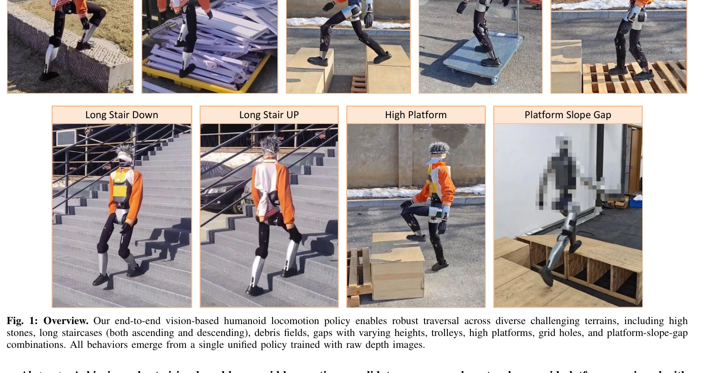
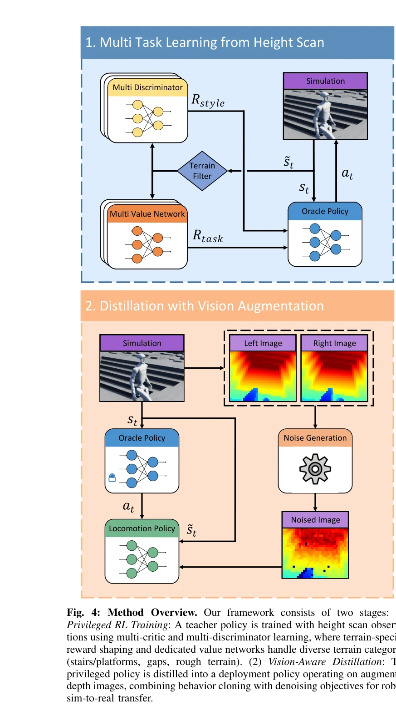

# Now You See That: Learning End-to-End Humanoid Locomotion from Raw Pixels

> **저자**: Wandong Sun, Yongbo Su, Leoric Huang, Alex Zhang, Dwyane Wei, Mu San, Daniel Tian, Ellie Cao, Finn Yan, Ethan Xie, Zongwu Xie | **날짜**: 2026-02-06 | **URL**: [https://arxiv.org/abs/2602.06382](https://arxiv.org/abs/2602.06382)

---

## Essence

*Fig. 1: Overview. Our end-to-end vision-based humanoid locomotion policy enables robust traversal across diverse challen*

Raw 깊이 이미지로부터 end-to-end 휴머노이드 로봇 보행을 학습하기 위해, 현실적인 depth 센서 시뮬레이션과 vision-aware behavior distillation, 그리고 terrain-specific multi-critic/multi-discriminator 학습을 결합한 프레임워크를 제시한다.

## Motivation

- **Known**: LiDAR 기반 elevation map 방식이 quadruped 로봇에 성공했으나, 휴머노이드 로봇의 동적 불안정성으로 인한 odometry drift 문제와 perception noise로 인한 fine-grained 제어 어려움이 존재한다.
- **Gap**: Vision 기반 휴머노이드 보행 시 sim-to-real gap에서 비롯된 perception noise가 센티미터 단위 정확도 요구 작업에서 성능을 심각하게 저하시키고, 다양한 terrain에서 단일 통합 정책 학습이 상충하는 학습 목표로 인해 어렵다.
- **Why**: 휴머노이드 로봇의 비전 기반 보행은 embodied intelligence의 중요한 벤치마크이며, 극한 장애물(높은 플랫폼, 넓은 간격)부터 fine-grained 작업(계단 오르내리기)까지 다양한 환경에서 robust하게 작동하는 정책이 필요하다.
- **Approach**: 두 단계 학습 파이프라인을 제시한다: (1) height scan으로 multi-critic/multi-discriminator RL을 사용해 privileged policy 학습, (2) 현실적인 depth 센서 시뮬레이션과 vision-aware behavior distillation을 통해 depth 이미지 기반 deployment policy로 distill.

## Achievement

*Fig. 1: Overview. Our end-to-end vision-based humanoid locomotion policy enables robust traversal across diverse challen*

- **현실적 Depth 센서 시뮬레이션**: Stereo matching artifacts, depth-dependent noise, optical distortions, calibration uncertainties를 재현하는 8단계 augmentation 파이프라인 개발
- **Vision-aware Behavior Distillation**: Latent space alignment과 noise-invariant auxiliary tasks를 결합하여 privileged height map에서 noisy depth 관찰로의 효과적인 지식 전이 달성
- **Multi-Critic/Multi-Discriminator 학습**: 각 terrain 타입의 고유한 dynamics와 motion priors를 포착하는 dedicated networks로 통합 정책 내에서 terrain-specific 적응 구현
- **Cross-Platform 검증**: 서로 다른 stereo depth 카메라가 장착된 두 휴머노이드 로봇에서 실제 배포 검증, 극한 terrain과 fine-grained 작업 모두 성공적으로 수행

## How

*Fig. 4: Method Overview. Our framework consists of two stages: (1)*

- Stereo depth fusion을 시뮬레이션하여 occlusion과 textureless 영역의 hole pattern 재현
- Depth-dependent noise, optical distortion (radial/tangential), calibration uncertainty를 순차적으로 적용하는 augmentation 파이프라인 구성
- Terrain-specific reward shaping으로 diverse terrain에 대한 상충 목표 문제 해결
- Multi-critic 구조로 각 terrain별 value function을 학습하고, multi-discriminator로 terrain-specific motion priors 포착
- Latent space alignment과 DrAC 스타일의 consistency regularization을 통합한 behavior distillation으로 noise 불변성 확보
- 8개 난이도 레벨을 포함한 각 terrain 타입에 대한 curriculum learning 적용

## Originality

- Vision-based 휴머노이드 로봇 보행에서 처음으로 end-to-end depth 기반 접근과 현실적인 센서 시뮬레이션을 결합
- Stereo 카메라의 구체적인 artifacts (hole patterns, stereo matching errors)를 체계적으로 모델링한 depth augmentation 파이프라인 제시
- Vision-aware behavior distillation 프레임워크로 privileged policy로부터 noise-robust한 정책 추출
- Multi-critic과 multi-discriminator를 활용한 terrain-specific 학습으로 단일 통합 정책에서 diverse terrain 지원
- Extreme parkour (높은 플랫폼, 넓은 간격)와 fine-grained 작업(양방향 장시간 계단 통과)을 모두 처리하는 최초의 휴머노이드 정책

## Limitation & Further Study

- 현재 시뮬레이션은 특정 stereo 카메라 모델에 기반하며, 다른 센서 타입(ToF, structured light 등)에 대한 일반화 가능성 미검증
- 두 단계 학습 파이프라인으로 인한 학습 복잡성 증가, end-to-end 단일 단계 학습의 가능성 미탐색
- 실험이 indoor/outdoor 환경에 국한되어 있으며, 극도로 동적인 환경(강한 조명 변화, 반사 표면 등)에서의 성능 미평가
- Multi-critic/discriminator 구조의 computational overhead와 training 시간에 대한 분석 부재
- 후속 연구로 다양한 센서 모달리티에 대한 일반화된 simulation 파이프라인 개발, 단일 단계 end-to-end 학습 접근법 탐색, 실시간 환경 적응 메커니즘 추가 필요

## Evaluation

- Novelty: 4/5
- Technical Soundness: 4/5
- Significance: 4/5
- Clarity: 4/5
- Overall: 4/5

**총평**: 본 논문은 휴머노이드 로봇의 vision-based 보행에서 sim-to-real gap과 다양한 terrain 통합 학습의 근본적인 두 과제를 체계적으로 해결하며, 현실적인 센서 모델링과 behavior distillation, terrain-specific 학습을 결합한 창의적인 프레임워크를 제시한다. 두 개의 실제 로봇 플랫폼에서 극한 장애물부터 fine-grained 작업까지 광범위한 성능 검증을 통해 학술적·실무적 가치가 높다.

## Related Papers

- 🔄 다른 접근: [[papers/2117_Omni-Perception_Omnidirectional_Collision_Avoidance_for_Legg/review]] — 둘 다 지각 기반 end-to-end 학습을 다루지만, Now You See That은 깊이 이미지 기반 보행에, Omni-Perception은 LiDAR 기반 충돌 회피에 초점을 둔다.
- 🏛 기반 연구: [[papers/1884_DPL_Depth-only_Perceptive_Humanoid_Locomotion_via_Realistic/review]] — DPL의 depth-only 지각 기반 보행 학습 기법이 Now You See That의 raw depth 이미지 기반 end-to-end 학습에 방법론적 기반을 제공한다.
- 🔗 후속 연구: [[papers/2010_HumanoidPano_Hybrid_Spherical_Panoramic-LiDAR_Cross-Modal_Pe/review]] — HumanoidPano의 하이브리드 구형 파노라마-LiDAR 교차 모달 지각을 단순한 깊이 센서만으로 달성하려는 연구이다.
- 🔄 다른 접근: [[papers/2095_MeshMimic_Geometry-Aware_Humanoid_Motion_Learning_through_3D/review]] — 둘 다 복잡한 지형에서의 locomotion이지만 Now You See That은 raw pixel input에, MeshMimic은 3D reconstruction에 중점을 둔다
- 🔄 다른 접근: [[papers/2095_MeshMimic_Geometry-Aware_Humanoid_Motion_Learning_through_3D/review]] — 둘 다 복잡한 지형에서의 humanoid locomotion이지만 MeshMimic은 3D scene reconstruction에, Now You See That은 raw depth perception에 중점을 둔다
- 🔄 다른 접근: [[papers/2117_Omni-Perception_Omnidirectional_Collision_Avoidance_for_Legg/review]] — 둘 다 센서 기반 end-to-end 학습을 다루지만, Omni-Perception은 LiDAR 기반 충돌 회피에, Now You See That은 깊이 이미지 기반 보행에 특화된다.
