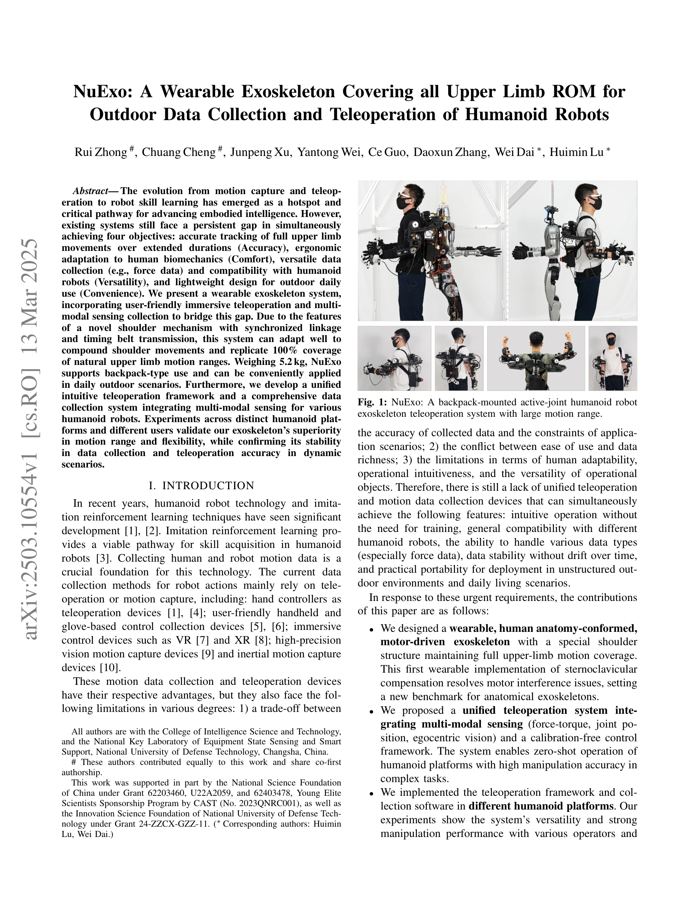
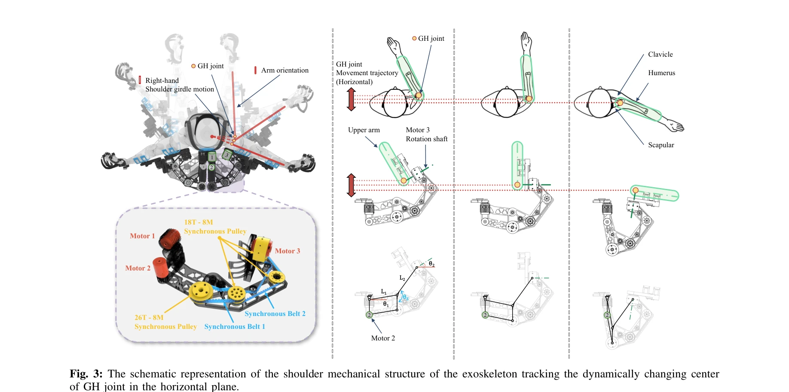

# NuExo: A Wearable Exoskeleton Covering all Upper Limb ROM for Outdoor Data Collection and Teleoperation of Humanoid Robots

> **저자**: Rui Zhong, Chuang Cheng, Junpeng Xu, Yantong Wei, Ce Guo, Daoxun Zhang, Wei Dai, Huimin Lu | **날짜**: 2025-03-13 | **URL**: [https://arxiv.org/abs/2503.10554](https://arxiv.org/abs/2503.10554)

---

## Essence

*Fig. 1: NuExo: A backpack-mounted active-joint humanoid robot*

상지의 전체 운동 범위를 커버하면서 야외 환경에서 사용 가능한 경량 웨어러블 외골격계(exoskeleton) NuExo를 개발하여 인간형 로봇의 원격조종과 모션 데이터 수집을 동시에 수행한다.

## Motivation

- **Known**: 인간형 로봇의 기술 학습을 위해 motion capture와 teleoperation이 사용되어 왔으며, 기존 장치들은 정확성, 편의성, 다재다능성, 휴대성 중 일부만 만족한다.
- **Gap**: 기존 시스템들은 정확한 추적(Accuracy), 인체공학적 편의성(Comfort), 다양한 센서 데이터 수집과 로봇 호환성(Versatility), 야외 사용을 위한 경량화(Convenience)의 네 가지 목표를 동시에 달성하지 못하고 있다.
- **Why**: 인간형 로봇의 숙련도 학습(imitation learning)은 대규모의 다양한 모션 데이터에 의존하므로, 통합된 데이터 수집 및 원격조종 장치의 개발이 로봇 지능 발전의 핵심이다.
- **Approach**: synchronized linkage와 timing belt transmission을 활용한 혁신적인 shoulder mechanism을 설계하고, multi-modal sensing(force-torque, joint position, egocentric vision)을 통합한 통일된 teleoperation framework를 제안한다.

## Achievement

*Fig. 2: Overview of the NuExo teleoperation exoskeleton data collection system (a) and the NuExo in daily scene (b).*

- **해부학적 shoulder 구조**: sternoclavicular compensation을 최초로 경량 웨어러블로 구현하여 기계적 간섭을 해결하고 상지 운동의 100% 커버리지를 달성
- **시스템 무게**: 5.2 kg으로 경량화하여 백팩 형태로 일상적 야외 사용을 가능하게 함
- **통합 teleoperation 프레임워크**: calibration-free 제어로 다양한 인간형 로봇 플랫폼과 호환되며 zero-shot operation 지원
- **Multi-modal 데이터 수집**: force-torque 센서, joint position, 자아중심 비전을 통합하여 장시간 안정적 데이터 수집
- **실증 평가**: 서로 다른 인간형 로봇 플랫폼과 다양한 피험자를 대상으로 운동 범위, 유연성, 동적 시나리오에서의 안정성을 검증

## How

*Fig. 3: The schematic representation of the shoulder mechanical structure of the exoskeleton tracking the dynamically ch*

- Novel shoulder mechanism: synchronized linkage와 timing belt transmission을 통해 compound shoulder movements에 적응하는 구조 설계
- Multi-modal sensing integration: force-torque 센서(KunWei®), IMU(hand/forearm/base), RGBD camera(Intel® D435)를 통합
- Immersive teleoperation: VR glasses(Rayneo® Air2), 햅틱 데이터 글러브(Dexmo®)를 활용한 사용자 친화적 인터페이스
- Control framework: calibration-free 접근으로 다양한 로봇 플랫폼에 대한 zero-shot compatibility 달성
- Software implementation: 상이한 인간형 로봇 플랫폼들에 대해 통일된 teleoperation 및 데이터 수집 소프트웨어 배포

## Originality

- **혁신적 shoulder 메커니즘**: 기존의 5개 액추에이터 대신 synchronized linkage와 timing belt를 결합하여 한 개 액추에이터를 제거하면서도 equivalent active motion compensation 성능 유지
- **해부학적 설계의 경량화 최초 구현**: sternoclavicular compensation을 백팩 형태의 경량 외골격계로 최초 실장
- **통합 teleoperation 프레임워크**: force data를 포함한 multi-modal sensing과 calibration-free 제어를 결합한 통일된 시스템
- **야외 적용 가능성**: 기존 cockpit 기반 설계의 한계를 벗어나 야외 및 일상 환경에서의 실용성 확보

## Limitation & Further Study

- **전신 운동 커버리지 부재**: 현재 상지만 커버하며 하지나 몸통의 운동은 포함되지 않음. 후속 연구에서 전신 외골격계로 확장 필요
- **장시간 착용 편의성**: 5.2 kg의 무게가 여전히 장시간 야외 사용 시 사용자 피로도에 영향을 미칠 수 있음
- **사용자 적응도 분석 부족**: 다양한 신체 크기의 사용자 집단에 대한 시스템 적응성에 대한 체계적 평가 필요
- **실시간 성능 평가**: 동적 시나리오에서의 지연(latency) 및 제어 안정성에 대한 정량적 분석 추가 필요

## Evaluation

- Novelty: 4/5
- Technical Soundness: 4/5
- Significance: 4/5
- Clarity: 4/5
- Overall: 4/5

**총평**: NuExo는 해부학적으로 영감받은 외골격계 설계와 경량화, multi-modal sensing의 통합을 통해 teleoperation과 로봇 모션 데이터 수집의 네 가지 핵심 목표를 동시에 달성한 혁신적 시스템이다. 야외 환경에서의 실용성과 다양한 로봇 플랫폼 호환성은 인간형 로봇의 imitation learning 분야에 중대한 기여를 한다.

## Related Papers

- 🔄 다른 접근: [[papers/1786_ACE_A_Cross-Platform_Visual-Exoskeletons_System_for_Low-Cost/review]] — NuExo는 상지 전체 ROM 커버, ACE는 cross-platform visual-exoskeletons로 서로 다른 범위와 플랫폼의 외골격 시스템을 제공한다.
- 🔗 후속 연구: [[papers/1983_HOMIE_Humanoid_Loco-Manipulation_with_Isomorphic_Exoskeleton/review]] — NuExo의 경량 웨어러블 외골격을 HOMIE의 isomorphic exoskeleton과 결합하여 더 자연스러운 전신 휴머노이드 조작이 가능하다.
- 🏛 기반 연구: [[papers/2008_HumanoidExo_Scalable_Whole-Body_Humanoid_Manipulation_via_We/review]] — NuExo의 상지 모션 데이터 수집이 HumanoidExo의 scalable whole-body manipulation에서 상체 제어 정책 학습에 필요한 데이터 기반을 제공한다.
- 🏛 기반 연구: [[papers/1876_DIAL_Distilling_Intent-Aware_Latents_for_Vision-Language-Act/review]] — 상지 전체 ROM을 다루는 착용형 외골격이 SoftHand Model-W의 손목 통합 설계에 필요한 인간공학적 기초를 제공한다
