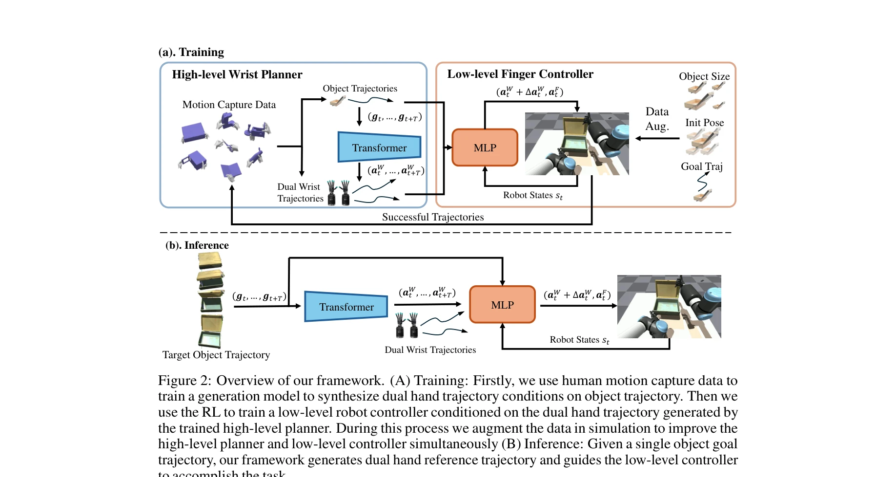
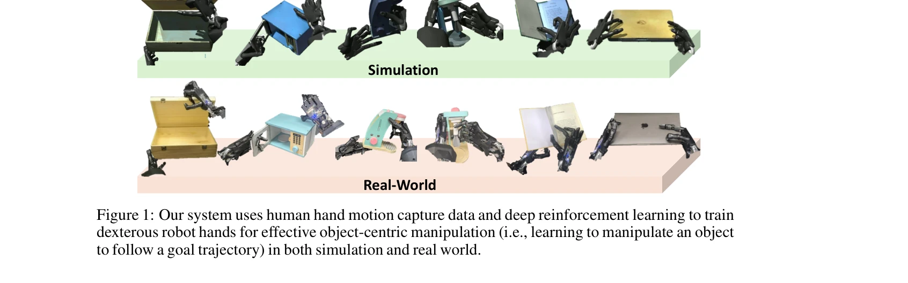

# Object-Centric Dexterous Manipulation from Human Motion Data

> **저자**: Yuanpei Chen, Chen Wang, Yaodong Yang, C. Karen Liu | **날짜**: 2024-11-06 | **URL**: [https://arxiv.org/abs/2411.04005](https://arxiv.org/abs/2411.04005)

---

## Essence

*Figure 2: Overview of our framework. (A) Training: Firstly, we use human motion capture data to*

인간의 손 모션 캡처 데이터를 활용하여 로봇 다지털 조작을 학습하는 계층적 정책 학습 프레임워크를 제안한다. 고수준의 손목 궤적 생성 모델과 저수준의 손가락 제어기를 조합하여 embodiment gap을 극복한다.

## Motivation

- **Known**: Deep reinforcement learning은 다지털 조작 학습에 성공했으나 높은 자유도로 인한 훈련의 어려움이 있다. Imitation learning은 인간 데이터를 활용할 수 있으나 인간과 로봇 손의 형태적 차이(embodiment gap)로 인해 직접적인 retargeting이 어렵다.
- **Gap**: 기존 방법들은 손가락 움직임만 학습하거나 embodiment gap을 충분히 해결하지 못한다. 인간 wrist 모션이 embodiment gap에 덜 민감하다는 통찰을 활용한 계층적 접근이 부족하다.
- **Why**: 로봇 다지털 조작은 로봇공학의 오랜 목표이며, 인간 수준의 조작 능력 달성은 실세계 로봇 응용의 핵심이다. 인간 모션 캡처 데이터의 대규모 활용으로 효율적인 학습이 가능하다.
- **Approach**: Human wrist 모션은 embodiment에 덜 민감하다는 관찰을 기반으로, 고수준 planner에서 인간 데이터로부터 손목 궤적을 생성하고 저수준 controller에서 RL을 통해 손가락 제어를 학습한다. 두 컴포넌트를 통해 시뮬레이션에서 학습하고 실세계로 전이한다.

## Achievement

*Figure 1: Our system uses human hand motion capture data and deep reinforcement learning to train*

- **계층적 정책 학습 프레임워크**: Embodiment gap을 극복하기 위해 wrist 궤적 생성과 finger 제어를 분리하여 각각 imitation learning과 reinforcement learning으로 학습
- **다양한 객체에 대한 일반화**: 10개의 가정용 객체에서 superior performance 달성하고 novel object geometry와 goal state에 대한 일반화 능력 입증
- **실세계 전이 성공**: 시뮬레이션에서 학습한 정책을 실제 이중팔 다지털 로봇 시스템으로 성공적으로 전이
- **대규모 인간 모션 데이터 활용**: ARCTIC 데이터셋(51시간)을 활용하여 확장 가능한 학습 환경 구성

## How

*Figure 2: Overview of our framework. (A) Training: Firstly, we use human motion capture data to*

- High-level planner: Transformer 기반의 generative model을 사용하여 ARCTIC 모션 캡처 데이터로부터 객체 궤적 조건의 dual wrist 궤적 생성
- Low-level controller: Deep RL을 통해 생성된 wrist 궤적을 따르면서 손가락 제어(a_F)와 residual wrist 제어(Δa_W)를 동시에 학습
- Reward function: 상호작용 중 객체 움직임과 참조 궤적 간의 likelihood로 정의
- Data augmentation loop: 시뮬레이션에서 성공한 궤적으로 고수준 planner를 개선하고 저수준 controller와 함께 반복 학습
- Sim-to-real transfer: 시뮬레이션과 실세계 간의 도메인 차이를 극복하기 위한 정책 전이 기법 적용

## Originality

- Wrist-centric 접근: 기존의 finger-centric 학습과 달리, wrist 모션의 embodiment 불변성을 활용한 novel 통찰
- 계층적 decomposition: High-level imitation과 low-level RL을 조합하여 action space complexity 감소
- Human motion capture 기반 학습: 로봇 조작 분야에서 대규모 인간 모션 데이터의 새로운 활용 방식
- Bimanual dexterous manipulation: 기존 단일 손이나 간단한 bimanual 작업과 달리, 다지털 이중팔 조작에 대한 comprehensive 해결책

## Limitation & Further Study

- Embodiment gap 해결 불완전: Wrist 모션의 embodiment 불변성 가정이 모든 로봇 설계에 적용되지 않을 수 있음
- 데이터셋 특정성: ARCTIC 데이터셋의 특성에 의존하므로 다른 도메인의 인간 모션에 대한 일반화 미검증
- 실세계 성능 제한: 시뮬레이션-실세계 간 도메인 차이로 인한 성능 저하 가능성
- 계산 복잡도: Transformer 기반 생성 모델과 RL 훈련의 computational cost 분석 부재
- 후속 연구 방향: 더 복잡한 sequential manipulation, 다양한 로봇 형태에 대한 일반화, 실시간 성능 최적화

## Evaluation

- Novelty: 4/5
- Technical Soundness: 3/5
- Significance: 4/5
- Clarity: 4/5
- Overall: 4/5

**총평**: 본 논문은 인간 wrist 모션의 embodiment 불변성을 창의적으로 활용하여 embodiment gap 문제를 해결하고, 계층적 학습 프레임워크로 복잡한 다지털 조작을 효과적으로 학습한다. 실세계 전이와 일반화 능력 모두 입증하여 로봇 조작 분야에 significant한 기여를 한다.

## Related Papers

- 🔄 다른 접근: [[papers/2103_MobileH2R_Learning_Generalizable_Human_to_Mobile_Robot_Hando/review]] — 둘 다 인간 모션을 활용한 로봇 조작 학습이지만, Object-Centric은 손가락 세밀 조작에, MobileH2R은 전신 협조 handover에 집중한다.
- 🏛 기반 연구: [[papers/1900_EgoDex_Learning_Dexterous_Manipulation_from_Large-Scale_Egoc/review]] — EgoDex의 egocentric 대규모 손목 조작 데이터가 Object-Centric의 계층적 정책 학습에서 고수준 손목 궤적 생성 모델 개발에 활용된다.
- 🔗 후속 연구: [[papers/2075_Learning_Visuotactile_Skills_with_Two_Multifingered_Hands/review]] — Learning Visuotactile Skills의 이중 다지 손 기법을 인간 모션 캡처 데이터 기반의 embodiment gap 해결로 확장한 연구이다.
- 🏛 기반 연구: [[papers/1867_DexCap_Scalable_and_Portable_Mocap_Data_Collection_System_fo/review]] — DexCap의 mocap data collection이 Object-Centric Dexterous Manipulation의 human hand motion capture 활용에 기술적 기반을 제공했다
- 🔗 후속 연구: [[papers/1871_Dexterity_from_Smart_Lenses_Multi-Fingered_Robot_Manipulatio/review]] — Dexterity from Smart Lenses의 multi-fingered manipulation이 Object-Centric의 hierarchical policy로 더욱 체계화된 것이다
- 🔄 다른 접근: [[papers/2093_Masquerade_Learning_from_In-the-wild_Human_Videos_using_Data/review]] — 둘 다 human motion에서 robot manipulation 학습이지만 Object-Centric은 mocap data에, Masquerade는 in-the-wild video에 중점을 둔다
- 🏛 기반 연구: [[papers/1868_DexHub_and_DART_Towards_Internet_Scale_Robot_Data_Collection/review]] — DexHub의 대규모 로봇 데이터 수집이 인간 손 모션 데이터 기반 다지털 조작 학습의 데이터 인프라 기반을 제공한다.
- 🔗 후속 연구: [[papers/1957_GraspDreamer_생성형_인간_시연_기반_기능적_파지_모방_학습/review]] — Object-centric 다지털 조작을 생성형 기능적 파지 학습으로 확장하여 더 지능적인 물체 조작을 달성할 수 있다.
- 🔄 다른 접근: [[papers/1779_A_Humanoid_Visual-Tactile-Action_Dataset_for_Contact-Rich_Ma/review]] — 두 연구 모두 접촉 기반 조작을 위한 다중모달 데이터를 다루지만 하나는 시각-촉각-행동을, 다른 하나는 object-centric 접근을 사용합니다.
- 🧪 응용 사례: [[papers/1900_EgoDex_Learning_Dexterous_Manipulation_from_Large-Scale_Egoc/review]] — EgoDex의 자아중심 손 추적 데이터를 Object-Centric Dexterous Manipulation 프레임워크에 적용하여 물체 중심의 조작 학습을 개선할 수 있다.
- 🔄 다른 접근: [[papers/1909_Embracing_Bulky_Objects_with_Humanoid_Robots_Whole-Body_Mani/review]] — Object-Centric Dexterous Manipulation이 인간 동작 사전 없이 물체 중심적 접근으로 조작 문제를 해결하는 다른 관점을 제시한다.
- 🧪 응용 사례: [[papers/2009_HumanoidGen_Data_Generation_for_Bimanual_Dexterous_Manipulat/review]] — object-centric dexterous manipulation이 HumanoidGen의 원자적 손 동작과 LLM 추론을 실제 조작 작업에 적용하는 구체적 사례를 제시합니다.
- 🔗 후속 연구: [[papers/2093_Masquerade_Learning_from_In-the-wild_Human_Videos_using_Data/review]] — Object-Centric Dexterous Manipulation의 human motion 활용을 일반적인 manipulation으로 확장한 연구다
- 🔄 다른 접근: [[papers/2103_MobileH2R_Learning_Generalizable_Human_to_Mobile_Robot_Hando/review]] — 둘 다 인간 모션 데이터를 활용한 로봇 조작 학습이지만, MobileH2R은 전신 handover에, Object-Centric은 손가락 dexterous manipulation에 특화된다.
- 🏛 기반 연구: [[papers/2169_UniDex_A_Robot_Foundation_Suite_for_Universal_Dexterous_Hand/review]] — object-centric manipulation learning이 UniDex의 3D VLA policy에서 물체 중심 dexterous control의 이론적 토대가 됨
