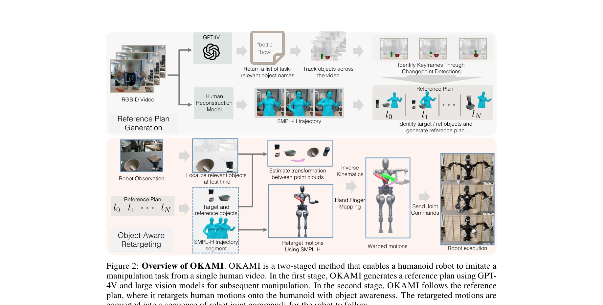
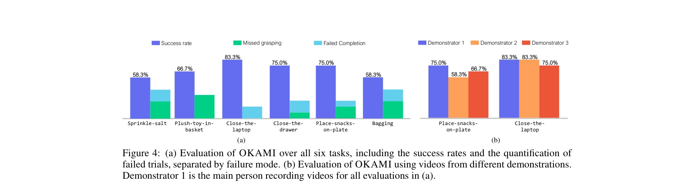

# OKAMI: Teaching Humanoid Robots Manipulation Skills through Single Video Imitation

> **저자**: Jinhan Li, Yifeng Zhu, Yuqi Xie, Zhenyu Jiang, Mingyo Seo, Georgios Pavlakos, Yuke Zhu | **날짜**: 2024-10-15 | **URL**: [https://arxiv.org/abs/2410.11792](https://arxiv.org/abs/2410.11792)

---

## Essence

*Figure 2: Overview of OKAMI. OKAMI is a two-staged method that enables a humanoid robot to imitate a*

OKAMI는 단일 RGB-D 비디오 시연으로부터 인형 로봇의 조작 기술을 학습하도록 하는 방법으로, object-aware retargeting을 통해 인간의 움직임을 로봇 기구학에 맞게 변환하면서 테스트 시 객체 위치에 적응한다.

## Motivation

- **Known**: 인형 로봇을 위한 깊은 모방 학습은 대량의 원격 조작 시연을 필요로 하며, 기존 motion retargeting 기법은 물체 상호작용을 고려하지 않는다.
- **Gap**: 단일 비디오에서 인형 로봇이 객체 위치 변화에 적응하면서 조작 기술을 학습할 수 있는 방법이 부족하며, 기존 retargeting 기법은 자유도가 높은 인형 로봇의 관절 중복성을 처리하지 못한다.
- **Why**: 인간처럼 한 번의 시연으로 로봇이 새로운 기술을 학습할 수 있으면 사용자의 부담을 크게 줄이고, 인터넷 규모의 인간 활동 비디오로부터 로봇 기초 모델을 학습할 수 있게 한다.
- **Approach**: OKAMI는 두 단계 파이프라인으로, 첫 단계에서 RGB-D 비디오로부터 reference manipulation plan을 생성하고, 두 번째 단계에서 object-aware retargeting을 통해 인간 동작을 로봇 동작으로 변환하며 테스트 시 객체 위치에 맞게 조정한다.

## Achievement

*Figure 4: (a) Evaluation of OKAMI over all six tasks, including the success rates and the quantification of*

- **Object-aware retargeting**: vision foundation model(GPT4V)으로 작업 관련 객체를 자동 식별하고, 신체 동작과 손 포즈를 분리하여 retarget함으로써 객체 위치 변화에 적응
- **강한 일반화 능력**: 다양한 공간 레이아웃, 배경, 새로운 객체 인스턴스에 걸쳐 71.7% 평균 성공률 달성, ORION 베이스라인 대비 58.3% 개선
- **실제 로봇 검증**: visuomotor policy를 통해 79.2% 평균 성공률을 달성하며, 노동 집약적인 원격 조작 없이 자율 배포 가능
- **다양한 작업 지원**: picking, placing, pushing, pouring 등 풍부한 객체 상호작용을 포함하는 다양한 작업 수행

## How

*Figure 2: Overview of OKAMI. OKAMI is a two-staged method that enables a humanoid robot to imitate a*

- **Human reconstruction**: SMPL-H 모델을 사용하여 RGB-D 비디오에서 인간의 신체 자세와 손 포즈 복원
- **Reference plan generation**: GPT4V를 통해 작업 관련 객체 식별, changepoint detection으로 keyframe 추출, 원본 및 타겟 객체 추적
- **Factorized retargeting**: 신체 동작을 먼저 작업 공간에서 retarget한 후, 객체 위치 기반으로 궤적 변형(warp)
- **Inverse kinematics**: 변형된 신체 궤적으로부터 관절 각도 계산
- **Hand finger mapping**: 계획으로부터 손가락 관절 각도를 매핑하여 손-객체 상호작용 재현
- **Visuomotor policy training**: OKAMI 롤아웃 궤적으로 behavioral cloning을 통해 폐루프 비전 기반 조작 정책 학습

## Originality

- **Object-aware retargeting의 도입**: 기존 motion retargeting에 객체 문맥 정보를 통합하여 테스트 시 객체 위치 적응 가능하게 함
- **분리된 retargeting 프로세스**: 신체 동작과 손 포즈를 분리하여 retarget함으로써 복잡한 조작 작업 처리
- **Vision foundation model 활용**: GPT4V를 사용한 열린 세계 객체 인식으로, 추가 인간 입력 없이 작업 관련 객체 자동 식별
- **단일 비디오 학습**: 대량의 시연이나 메타 학습 대신 단일 RGB-D 비디오로부터 조작 기술 학습

## Limitation & Further Study

- **RGB-D 센서 의존성**: RGB-D 비디오 입력이 필요하므로 일반적인 RGB 비디오 적용에 제한
- **객체 접촉 가정**: vision model이 접촉하지 않은 객체도 식별할 수 있으나, 작업 관련성 판단에 여전히 한계 가능
- **손 포즈 정확도**: SMPL-H 모델의 손 포즈 복원 정확도에 의존하며, 복잡한 손가락 상호작용에서 정확도 저하 가능
- **장면 복잡도 제한**: 현재 평가에서 비교적 단순한 구성의 작업 중심이며, 극도로 복잡한 다중 객체 상호작용 처리 미검증
- **후속 연구**: RGB 비디오만으로 작동하는 depth estimation 통합, 더 정밀한 손 포즈 재구성, 다단계 복잡 조작 작업 확장

## Evaluation

- Novelty: 4/5
- Technical Soundness: 3/5
- Significance: 4/5
- Clarity: 4/5
- Overall: 4/5

**총평**: OKAMI는 object-aware retargeting이라는 핵심 개념으로 단일 비디오로부터 인형 로봇의 조작 학습을 효과적으로 해결하며, 실제 하드웨어에서 강한 일반화 능력을 입증하여 로봇 학습의 실용성을 크게 향상시킨다.

## Related Papers

- 🏛 기반 연구: [[papers/2124_Open-TeleVision_Teleoperation_with_Immersive_Active_Visual_F/review]] — Open-TeleVision의 RGB-D 비디오 기반 텔레오퍼레이션 데이터 수집 시스템이 OKAMI의 단일 시연 기반 학습에 필요한 고품질 데이터를 제공한다.
- 🔄 다른 접근: [[papers/1863_DemoHLM_From_One_Demonstration_to_Generalizable_Humanoid_Loc/review]] — 둘 다 단일 시연에서 조작 기술을 학습하지만, OKAMI는 object-aware retargeting에, DemoHLM은 일반화 가능한 loco-manipulation에 초점을 둔다.
- 🧪 응용 사례: [[papers/1997_Humanoid_Manipulation_Interface_Humanoid_Whole-Body_Manipula/review]] — Humanoid Manipulation Interface의 전신 조작 인터페이스가 OKAMI의 object-aware retargeting 기법과 결합되어 더 직관적인 휴머노이드 제어를 가능하게 한다.
- 🏛 기반 연구: [[papers/1903_EgoMimic_Scaling_Imitation_Learning_via_Egocentric_Video/review]] — EgoMimic의 single video demonstration learning이 OKAMI의 single RGB-D video 기반 manipulation skill 학습에 방법론적 토대를 제공했다
- 🔄 다른 접근: [[papers/2099_MimicDroid_In-Context_Learning_for_Humanoid_Robot_Manipulati/review]] — 둘 다 human video에서 humanoid manipulation 학습이지만 OKAMI는 single demonstration에, MimicDroid는 ICL 방식을 사용한다
- 🔗 후속 연구: [[papers/1775_A_Closed-Form_Geometric_Retargeting_Solver_for_Upper_Body_Hu/review]] — A Closed-Form Geometric Retargeting Solver의 upper body retargeting이 OKAMI의 object-aware retargeting으로 확장된 것이다
- 🔗 후속 연구: [[papers/1678_SkillBlender_Towards_Versatile_Humanoid_Whole-Body_Loco-Mani/review]] — primitive skill blending이 human demonstration을 통한 manipulation skill teaching으로 확장됩니다.
- 🏛 기반 연구: [[papers/1616_PICO_Reconstructing_3D_People_In_Contact_with_Objects/review]] — OKAMI의 인간 모션 데이터 활용 조작 학습에 PICO의 3D 접촉 주석 데이터셋이 중요한 입력 자료가 된다
- 🔗 후속 연구: [[papers/2009_HumanoidGen_Data_Generation_for_Bimanual_Dexterous_Manipulat/review]] — HumanoidGen의 자동 데이터 생성이 OKAMI의 인간 시연 기반 조작 학습과 결합되어 더 효율적인 학습 파이프라인 구성 가능
- 🔗 후속 연구: [[papers/2055_Learning_Humanoid_End-Effector_Control_for_Open-Vocabulary_V/review]] — 정밀한 end-effector 추적을 인간 모션 데이터 기반 조작 기술과 결합하여 더 자연스럽고 효과적인 객체 조작을 구현할 수 있다.
- 🔄 다른 접근: [[papers/2099_MimicDroid_In-Context_Learning_for_Humanoid_Robot_Manipulati/review]] — 둘 다 human video에서 humanoid manipulation을 학습하지만 MimicDroid는 ICL 방식을, OKAMI는 single video demonstration을 사용한다
- 🔗 후속 연구: [[papers/2124_Open-TeleVision_Teleoperation_with_Immersive_Active_Visual_F/review]] — Open-TeleVision의 VR 기반 텔레오퍼레이션 시스템에서 수집된 데이터가 OKAMI의 단일 RGB-D 시연 기반 학습에 활용될 수 있다.
- 🏛 기반 연구: [[papers/2130_OSMO_Open-Source_Tactile_Glove_for_Human-to-Robot_Skill_Tran/review]] — OKAMI의 인간 동작 데이터 기반 manipulation 학습이 OSMO 촉각 데이터와 결합되면 더 정교한 skill transfer 가능
