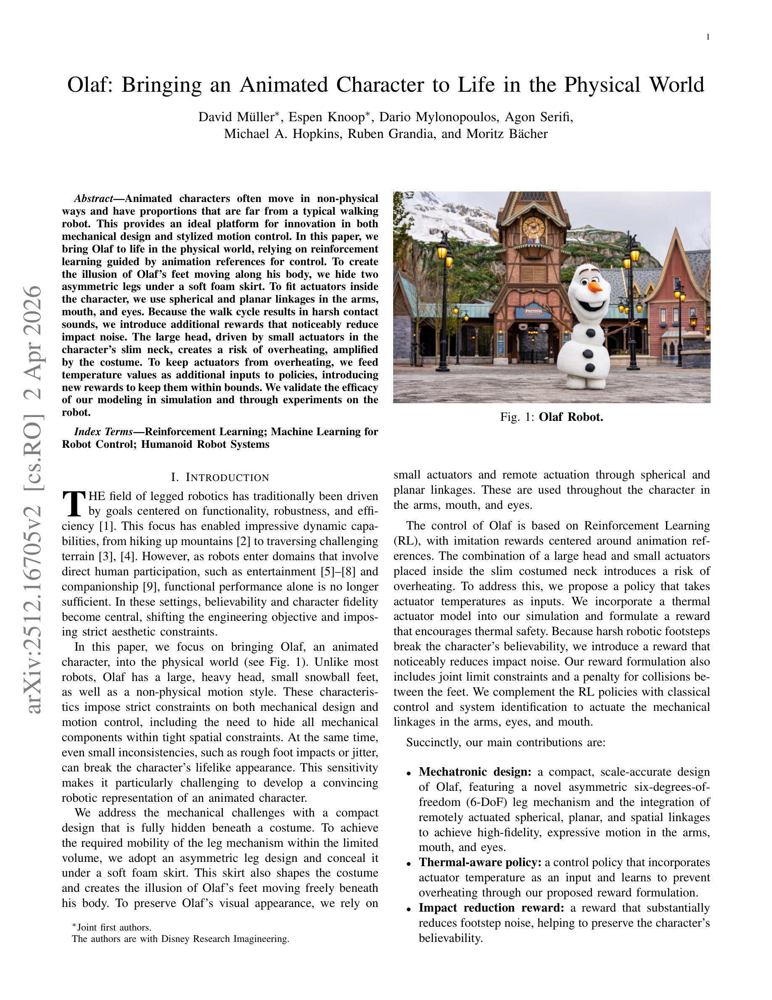
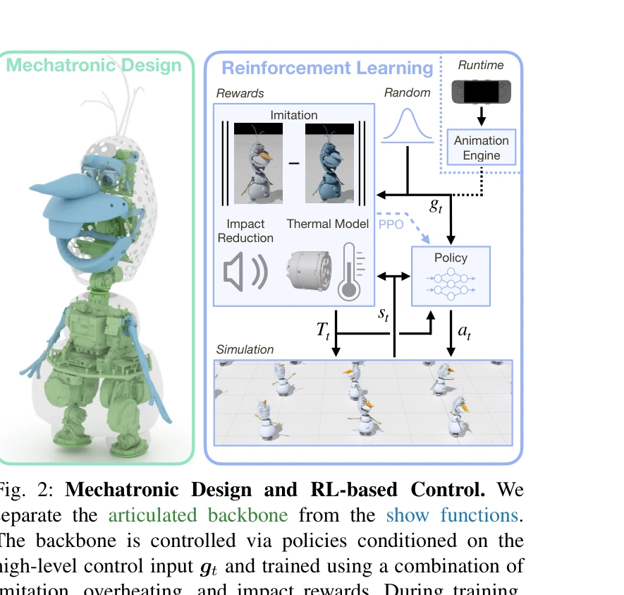

# Olaf: Bringing an Animated Character to Life in the Physical World

> **저자**: David Müller, Espen Knoop, Dario Mylonopoulos, Agon Serifi, Michael A. Hopkins, Ruben Grandia, Moritz Bächer | **날짜**: 2025-12-18 | **URL**: [https://arxiv.org/abs/2512.16705](https://arxiv.org/abs/2512.16705)

---

## Essence

*Fig. 1: Olaf Robot.*

애니메이션 캐릭터 올라프를 실제 물리 로봇으로 구현하기 위해 RL 기반 제어와 혁신적인 기계설계를 결합한 연구이다. 비물리적 움직임과 부자연스러운 비율을 가진 캐릭터를 believable하게 현실화했다.

## Motivation

- **Known**: 로봇 공학 분야는 기능성, 견고성, 효율성에 중점을 두고 있으며, RL을 통한 로봇 제어가 확립된 기술이다. 기계 링크를 이용한 원격 구동과 임퓨테이션 학습이 기존에 사용되어왔다.
- **Gap**: 기존 연구는 기능성 위주의 로봇 설계에 집중했으나, 엔터테인먼트 도메인에서는 believability와 캐릭터 충실도가 중요하다. 비정상적인 비율과 공간 제약이 있는 애니메이션 캐릭터를 물리 로봇으로 구현한 사례가 부족하다.
- **Why**: 엔터테인먼트와 인간-로봇 상호작용 분야가 확대되면서 단순한 기능성을 넘어 believability 있는 캐릭터 표현이 필수적이다. 미세한 부자연스러움(발소리, jitter)도 캐릭터의 생생함을 크게 해칠 수 있기 때문에 정밀한 제어가 필요하다.
- **Approach**: novel asymmetric 6-DoF 다리 메커니즘과 spherical, planar linkages를 이용한 compact 설계로 공간 제약을 극복했다. PPO 기반 RL에 imitation rewards, thermal awareness, impact reduction rewards를 결합하여 제어 정책을 학습했다.

## Achievement

*Fig. 2: Mechatronic Design and RL-based Control. We*

- **Compact 기계설계**: 역대칭 6-DoF 다리 메커니즘과 원격 구동 linkages를 통해 88.7cm 높이, 25개 DoF의 축척 정확 설계 달성
- **Thermal-aware 정책**: actuator 온도를 정책 입력으로 포함하고 열관리 rewards를 도입하여 과열 방지
- **Impact reduction rewards**: 발걸음 소음을 현저히 감소시켜 캐릭터의 believability 보존
- **High-fidelity 표현**: Animation engine과의 통합으로 puppeteering 기반 인터랙티브 제어 실현

## How

*Fig. 2: Mechatronic Design and RL-based Control. We*

- Mechatronic design: 한쪽 다리를 역방향으로 배치하는 asymmetric 6-DoF leg 구조로 공간 효율성 극대화
- 원격 구동: shoulder, mouth, eyes에 spherical 5-bar linkage와 4-bar linkage를 적용하여 actuator를 torso 내부에 배치
- Soft foam skirt: PU foam으로 된 유연한 스커트로 숨겨진 다리의 움직임을 자연스럽게 표현
- RL 정책 학습: PPO를 이용한 imitation learning에 thermal model 기반 rewards와 impact reduction rewards 추가
- Thermal modeling: simulation에 actuator 온도 동역학을 포함하고 과열 방지 reward 공식 개발
- Classical control: show functions(팔, 입, 눈)은 system identification을 통한 classical control로 구동
- Animation engine 통합: 고수준 제어 입력을 생성하는 real-time animation engine과 정책 연동

## Originality

- Asymmetric 다리 설계: 기존의 symmetric bipedal robot 설계를 벗어나 공간 제약 극복의 새로운 해결책 제시
- Thermal-aware RL policy: 실제 하드웨어의 열관리 문제를 정책 학습 단계에서 직접 다룬 첫 시도
- Impact reduction rewards: 캐릭터의 believability를 위해 noise 감소를 explicit reward로 공식화
- Animation reference 기반 제어: 기능성 기반이 아닌 animation fidelity 기반의 robot control framework

## Limitation & Further Study

- 설계의 특수성: Olaf 캐릭터의 특정 형태에 최적화되어 다른 캐릭터로의 일반화 가능성 미검증
- Thermal model의 단순성: 실제 costume의 단열 효과나 복잡한 열 분산이 완전히 모델링되었는지 불명확
- Energy efficiency 미고려: 기능성과 expressiveness 중심으로 에너지 효율성은 secondary consideration으로 처리
- 후속 연구: 다양한 애니메이션 캐릭터에 대한 design methodology 일반화, 더 정교한 thermal dynamics 모델링, 실외 환경에서의 안정성 검증 필요

## Evaluation

- Novelty: 4/5
- Technical Soundness: 4/5
- Significance: 4/5
- Clarity: 4/5
- Overall: 4/5

**총평**: 애니메이션 캐릭터를 물리 로봇으로 현실화하는 문제에 대해 기계설계와 제어 알고리즘을 창의적으로 결합한 우수한 연구이며, thermal awareness와 impact reduction 같은 실무적 고려사항을 RL에 반영한 점이 특히 주목할 만하다.
