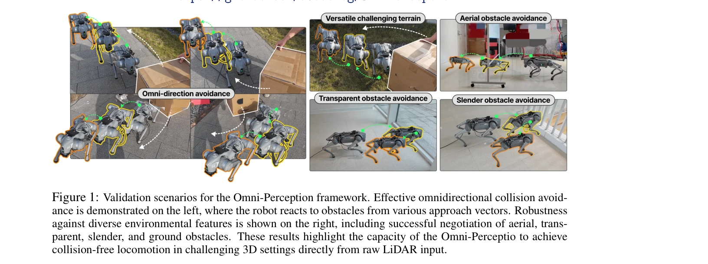
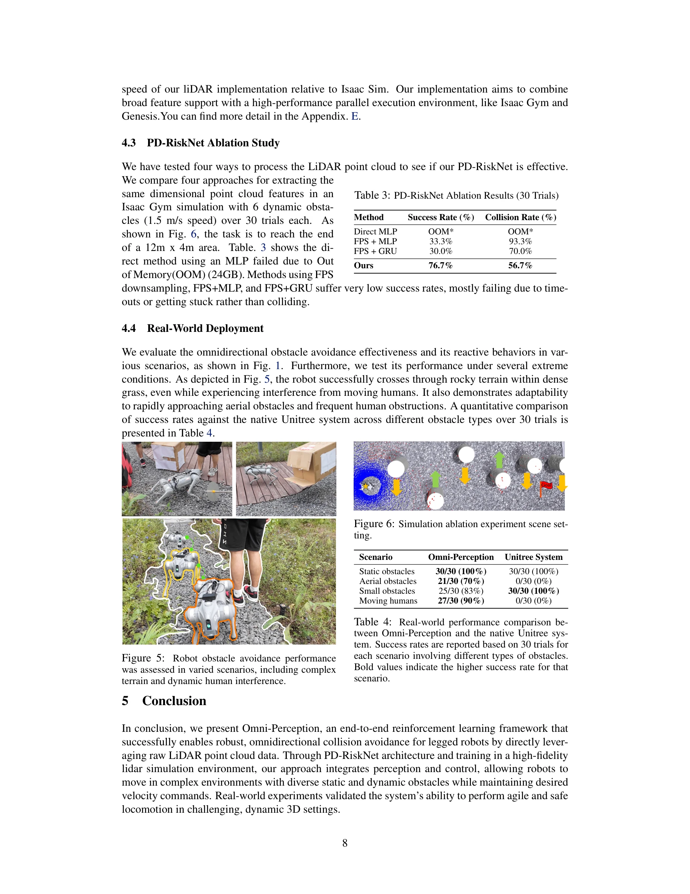
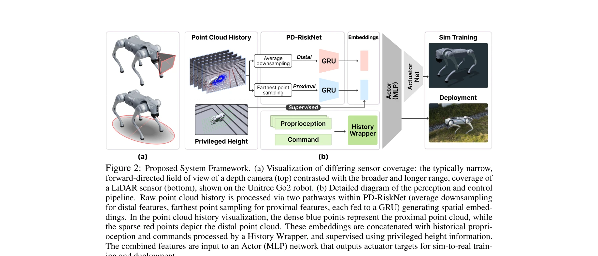

# Omni-Perception: Omnidirectional Collision Avoidance for Legged Locomotion in Dynamic Environments

> **저자**: Zifan Wang, Teli Ma, Yufei Jia, Xun Yang, Jiaming Zhou, Wenlong Ouyang, Qiang Zhang, Junwei Liang | **날짜**: 2025-05-25 | **URL**: [https://arxiv.org/abs/2505.19214](https://arxiv.org/abs/2505.19214)

---

## Essence

*Figure 1: Validation scenarios for the Omni-Perception framework. Effective omnidirectional collision avoid-*

본 논문은 LiDAR 포인트 클라우드를 직접 처리하는 end-to-end 강화학습 정책 Omni-Perception을 제안하여 동적 환경에서 다리 로봇의 전방향 충돌 회피를 실현한다. PD-RiskNet이라는 새로운 지각 모듈을 통해 시공간적 LiDAR 데이터를 해석하여 환경 위험을 평가한다.

## Motivation

- **Known**: 기존 depth 기반 접근법은 조명 변화, 센서 노이즈, elevation map 같은 중간 표현의 계산 오버헤드로 인해 한계가 있으며, LiDAR은 자율주행과 조작 분야에서 활용되었으나 end-to-end 다리 로봇 제어에의 직접 적용은 미흡하다.
- **Gap**: LiDAR의 풍부한 3D 정보를 raw point cloud 형태로 직접 활용한 end-to-end 학습 기반 다리 로봇 제어 프레임워크가 부재하며, 실시간 포인트 클라우드 처리와 정확한 LiDAR 물리 모델링 어려움이 존재한다.
- **Why**: 다리 로봇이 복잡한 3D 환경(공중 장애물, 불규칙한 지형, 동적 에이전트)에서 민첩하게 움직이며 안전하게 충돌을 회피하려면 강건한 공간 인식과 실시간 반응 제어가 필수적이다.
- **Approach**: Raw LiDAR 포인트 클라우드를 직접 처리하는 PD-RiskNet을 통합한 RL 기반 end-to-end 정책을 학습하며, 현실적인 노이즈 모델링과 빠른 raycasting을 갖춘 cross-platform LiDAR 시뮬레이션 툴킷을 개발하여 sim-to-real 전이를 용이하게 한다.

## Achievement

*Figure 5: Robot obstacle avoidance performance*

- **End-to-End LiDAR 기반 제어**: 다리 로봇이 raw LiDAR 포인트 클라우드를 직접 처리하여 3D 공간 인식과 전방향 충돌 회피를 실현하는 첫 번째 프레임워크
- **PD-RiskNet 지각 아키텍처**: 시공간적 LiDAR 데이터를 효율적으로 처리하여 다층 환경 위험도를 평가하는 새로운 신경망 구조 제안
- **고충실도 LiDAR 시뮬레이션 툴킷**: 현실적 노이즈 모델과 빠른 병렬 raycasting을 지원하며 Isaac Gym, Genesis, MuJoCo 등 다중 물리 엔진과 호환
- **강건한 실제 환경 검증**: 정적/동적 3D 장애물이 있는 복잡한 환경에서 우수한 속도 추적과 전방향 회피 성능을 시뮬레이션과 실제 실험으로 입증

## How

*Figure 2: Proposed System Framework. (a) Visualization of differing sensor coverage: the typically narrow,*

- 관찰 공간 O를 proprioceptive state(관절 위치/속도, 베이스 속도, 기울기), exteroceptive state(raw 3D point cloud 히스토리 Nhist), 작업 명령(속도 커맨드)으로 구성
- RL 정책 π: O → Δ(A)를 학습하여 관찰을 행동 분포로 매핑
- PD-RiskNet을 핵심 지각 모듈로 사용하여 spatio-temporal LiDAR 데이터 처리 및 multi-level 환경 위험 평가
- 고충실도 시뮬레이터에서 현실적 LiDAR 노이즈 모델링과 효율적 raycasting 구현으로 빠른 학습 가능
- 학습된 정책을 실제 로봇(Unitree G1 등)에 직접 배포하여 sim-to-real 전이 달성

## Originality

- Raw LiDAR point cloud를 직접 end-to-end RL 정책에 통합한 첫 사례로, 기존 elevation map 같은 중간 표현에 의존하지 않음
- PD-RiskNet의 Proximal-Distal 계층적 구조는 근접/원거리 장애물을 차별화하여 처리하는 새로운 위험 평가 방식
- Isaac Gym, Genesis, MuJoCo를 모두 지원하는 cross-platform LiDAR 시뮬레이션 툴킷으로 생태계 호환성 확대
- 정적, 동적, 공중, 투명, 가늘기 등 다양한 장애물 유형에 대한 전방향 회피 능력 통합 입증

## Limitation & Further Study

- 논문에서 PD-RiskNet의 내부 아키텍처 상세(계층 수, 채널 수, attention 메커니즘 등)가 부분적으로만 공개됨
- 실제 환경 실험이 제한적(주로 실내/통제된 환경)이며, 극단적 기후 조건이나 매우 복잡한 야외 환경에서의 성능 미검증
- LiDAR 노이즈 모델이 특정 센서(예: Livox Mid360 등)에 최적화되었을 가능성으로 다른 LiDAR 센서로의 일반화 정도 미명확
- 계산 비용 분석(inference 시간, 메모리 사용량) 및 실시간성 검증 부족
- 후속 연구: 초고속 장애물 회피, 멀티 로봇 협력 시나리오, 극단적 환경 적응성 강화 필요

## Evaluation

- Novelty: 4/5
- Technical Soundness: 3/5
- Significance: 4/5
- Clarity: 4/5
- Overall: 4/5

**총평**: 본 논문은 다리 로봇의 동적 환경 네비게이션에 LiDAR을 직접 활용한 end-to-end 학습 프레임워크라는 참신한 접근을 제시하며, 실용적인 시뮬레이션 툴킷과 함께 강건한 sim-to-real 전이를 입증한다. 다만 기술 상세 공개 수준과 극단 환경 검증 보강이 필요하다.
