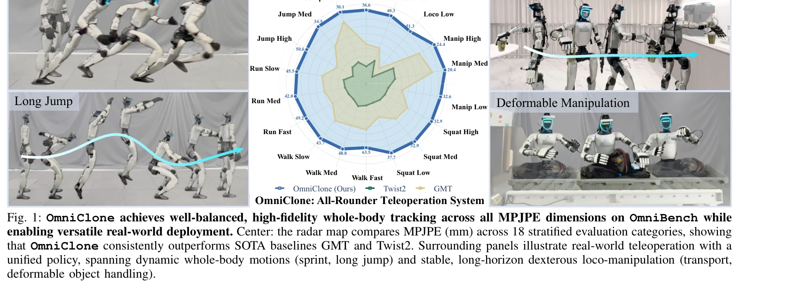
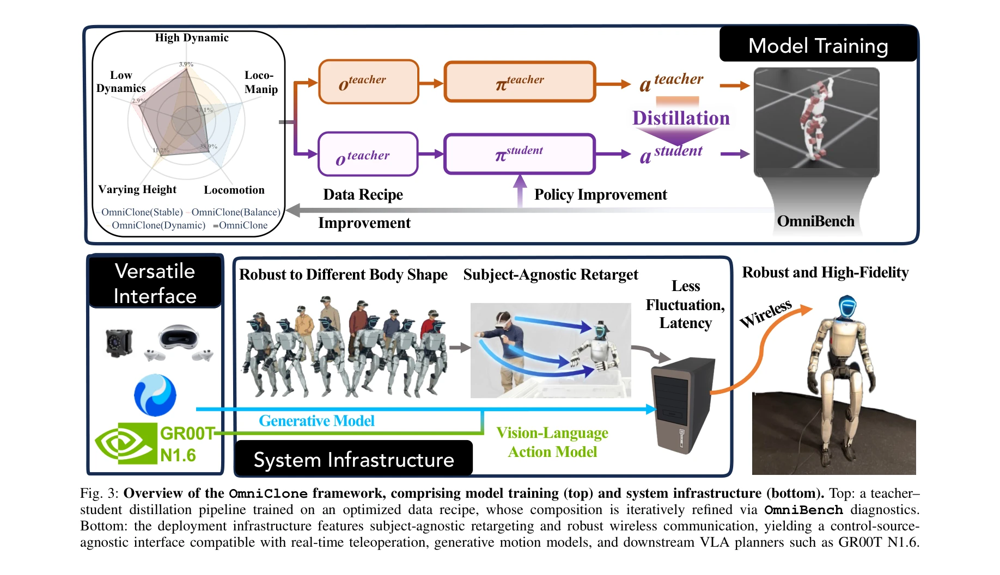

# OmniClone: Engineering a Robust, All-Rounder Whole-Body Humanoid Teleoperation System

> **저자**: Yixuan Li, Le Ma, Yutang Lin, Yushi Du, Mengya Liu, Kaizhe Hu, Jieming Cui, Yixin Zhu, Wei Liang, Baoxiong Jia, Siyuan Huang | **날짜**: 2026-03-15 | **URL**: [https://arxiv.org/abs/2603.14327](https://arxiv.org/abs/2603.14327)

---

## Essence

*Fig. 1: OmniClone achieves well-balanced, high-fidelity whole-body tracking across all MPJPE dimensions on OmniBench whi*

OmniClone은 단일 소비자 GPU에서 전신 휴머노이드 텔레오퍼레이션을 실현하는 시스템으로, OmniBench 진단 벤치마크를 통해 기존 시스템의 동작별 성능 격차를 노출하고 이를 바탕으로 최적화된 정책과 시스템 기술을 통합하여 MPJPE를 66% 이상 감소시켰다.

## Motivation

- **Known**: 최근 휴머노이드 텔레오퍼레이션 연구는 고도화되었으나, 기존 평가 방식은 집계 지표만 보고하여 동적 운동과 정밀 조작 등 상이한 운동 모식 간의 성능 차이를 모호하게 한다. 또한 시스템 구성이 특정 방법에 밀접하게 결합되어 있어 재현성과 확장성이 제한적이다.
- **Gap**: 기존 시스템들은 고도로 이질적이고 견고한 실시간 재타겟팅 메커니즘과 네트워크 불안정성 처리 기술이 부족하며, 통합된 진단 평가 기준이 없어서 어느 동작 범주에서 실패하는지 파악하기 어렵다.
- **Why**: 휴머노이드 로봇의 실용적 배포를 위해서는 동적 민첩성과 안정적 조작을 모두 처리할 수 있는 견고한 시스템이 필수적이며, 진단적 평가를 통한 체계적 개선이 필요하다. 또한 다양한 신체 체형의 오퍼레이터에 대한 일반화 능력과 자율 학습용 데이터 수집 엔진으로서의 활용이 중요하다.
- **Approach**: OmniBench라는 진단 벤치마크를 개발하여 18개의 계층화된 동작 범주별로 성능을 평가하고, 이러한 진단 정보를 바탕으로 데이터 균형 최적화와 제어원 무관(control-source-agnostic) 단일 통합 정책을 설계하며, subject-agnostic retargeting과 robust communication을 통해 실세계 배포의 불확실성을 처리한다.

## Achievement

*Fig. 1: OmniClone achieves well-balanced, high-fidelity whole-body tracking across all MPJPE dimensions on OmniBench whi*

- **OmniBench 진단 벤치마크**: 동작 범주와 난이도별로 계층화된 첫 포괄적 평가 스위트를 제안하여 기존 시스템의 좁은 전문성을 노출하고 실질적 개선 방향을 제시
- **높은 성능 개선**: 기존 SOTA 기준(GMT, Twist2)과 비교하여 모든 MPJPE 차원에서 66% 이상의 오차 감소를 달성
- **저렴한 계산 비용**: 30시간의 모션 데이터와 단일 소비자 GPU만으로 학습 가능하며, 기타 방법 대비 수 배 적은 계산 자원 필요
- **제어원 무관 통합 정책**: 실시간 텔레오퍼레이션, 생성된 모션 재생, Vision-Language-Action 모델을 단일 정책으로 지원
- **신체 비례 일반화**: 1.47m에서 1.94m까지의 다양한 신체 체형을 가진 오퍼레이터에 일반화
- **자율 학습 검증**: OmniClone 수집 데이터로 학습한 VLA 정책이 Pick-and-Place 85.71%, Squat to Pick-and-Place 80.00%의 성공률 달성

## How

*Fig. 3: Overview of the OmniClone framework, comprising model training (top) and system infrastructure (bottom). Top: a *

- **OmniBench 설계**: 18개 계층화 범주(Loco High/Med/Low, Manip High/Med/Low, Squat/Walk/Run/Jump 각 3단계)로 미학습 모션에 대해 평가
- **데이터 레시피 최적화**: 진단 벤치마크 결과를 바탕으로 동적 동작과 안정적 조작 간의 데이터 균형을 조정하여 학습 데이터 구성 개선
- **Subject-agnostic Retargeting**: 모션 캡처 시스템과 오퍼레이터 신체 특성의 변동성을 처리하기 위한 재타겟팅 메커니즘 개발
- **Robust Communication**: 네트워크 지연과 변동성을 완화하기 위한 통신 레이어 설계
- **Transformer 기반 정책**: 고용량의 transformer 아키텍처를 사용하여 전신 추적 정책 학습
- **다중 제어원 호환성**: 원격 제어, 모션 재생, VLA 모델의 출력을 단일 정책에서 처리 가능하도록 설계

## Originality

- 진단적 벤치마킹 접근: 기존 텔레오퍼레이션 연구는 집계 지표를 사용했으나, OmniBench는 처음으로 동작 범주와 난이도별 계층화 평가를 도입하여 시스템의 구체적 약점을 노출
- 시스템 공학적 관점: 단순한 모델 개선이 아니라 데이터 레시피, 재타겟팅, 통신 인프라 등 전체 파이프라인을 통합적으로 최적화
- 제어원 무관 설계: 기존 텔레오퍼레이션 시스템은 특정 입력 소스(MoCap, VR 등)에 최적화되었으나, OmniClone은 여러 제어원을 단일 정책으로 처리하는 유연성 제시
- 실용적 재현성: 30시간 데이터와 소비자 GPU로 SOTA 성능을 달성하여 기존의 복잡하고 비싼 시스템과 구별되는 접근성 제공

## Limitation & Further Study

- 평가 범위 한정: OmniBench는 제안된 벤치마크이지만, 실제 응급 상황이나 극한 환경(매우 좁은 공간, 높은 외란 등)에서의 성능은 명확하지 않음
- 네트워크 조건 다양성 부족: robust communication이 구현되었으나, 극도로 불안정한 네트워크 환경(높은 지연, 심각한 패킷 손실)에 대한 평가 부재
- 하드웨어 의존성: 단일 소비자 GPU에서의 동작을 강조하나, 다양한 GPU 모델에 대한 호환성과 성능 변동성이 상세히 논의되지 않음
- 데이터 기반 한계: 30시간의 학습 데이터는 적지만, 매우 특이한 동작이나 긴급 상황에 대한 데이터 부족 시 성능 저하 가능성
- 후속 연구: (1) 매우 높은 지연과 불안정한 네트워크 환경에서의 적응형 제어 전략 개발, (2) 실제 응급 상황 또는 외란이 있는 환경에서의 견고성 검증, (3) 더 다양한 휴머노이드 로봇 플랫폼으로의 이전(transfer) 성능 평가

## Evaluation

- Novelty: 4/5
- Technical Soundness: 3/5
- Significance: 4/5
- Clarity: 4/5
- Overall: 4/5

**총평**: OmniClone은 진단적 벤치마킹과 시스템 공학을 결합하여 실용적이면서도 강력한 휴머노이드 텔레오퍼레이션 시스템을 제시한다. OmniBench는 기존 평가 방식의 근본적 한계를 지적하고 이를 기반으로 한 체계적 개선이 뒤따르는 점, 그리고 소비자 GPU로 SOTA 성능을 달성하면서도 높은 접근성을 제공하는 점에서 학술적, 실용적 가치가 모두 높다.

## Related Papers

- 🔄 다른 접근: [[papers/2107_MOSAIC_Bridging_the_Sim-to-Real_Gap_in_Generalist_Humanoid_M/review]] — 둘 다 전신 휴머노이드 텔레오퍼레이션과 sim-to-real 문제를 다루지만, OmniClone은 진단 벤치마크 기반 최적화에, MOSAIC은 residual 적응에 집중한다.
- 🏛 기반 연구: [[papers/1839_CLONE_Closed-Loop_Whole-Body_Humanoid_Teleoperation_for_Long/review]] — CLONE의 closed-loop 전신 텔레오퍼레이션 기술이 OmniClone의 robust한 전신 휴머노이드 텔레오퍼레이션 시스템 개발에 핵심적인 기반을 제공한다.
- 🔗 후속 연구: [[papers/2164_TWIST2_Scalable_Portable_and_Holistic_Humanoid_Data_Collecti/review]] — TWIST2의 확장 가능한 휴머노이드 데이터 수집을 OmniBench 진단 벤치마크를 통한 성능 최적화로 발전시킨 연구이다.
- 🔗 후속 연구: [[papers/2163_TWIST_Teleoperated_Whole-Body_Imitation_System/review]] — OmniClone의 robust whole-body teleoperation을 TWIST의 전신 모방 시스템과 결합하여 더 포괄적인 휴머노이드 데이터 수집이 가능하다.
- 🏛 기반 연구: [[papers/1866_Development_of_an_Intuitive_GUI_for_Non-Expert_Teleoperation/review]] — OmniClone의 최적화된 텔레오퍼레이션 시스템이 Development of an Intuitive GUI의 비전문가용 직관적 인터페이스 개발에 필요한 기술적 기반을 제공한다.
- 🏛 기반 연구: [[papers/1921_ExtremControl_Low-Latency_Humanoid_Teleoperation_with_Direct/review]] — ExtremControl의 low-latency teleoperation 기술이 OmniClone의 단일 GPU 실시간 전신 제어 시스템 구현의 기술적 기반을 제공합니다.
- 🔄 다른 접근: [[papers/2107_MOSAIC_Bridging_the_Sim-to-Real_Gap_in_Generalist_Humanoid_M/review]] — 둘 다 sim-to-real gap 해결과 전신 텔레오퍼레이션을 다루지만, MOSAIC은 residual 적응에, OmniClone은 최적화된 정책 통합에 집중한다.
