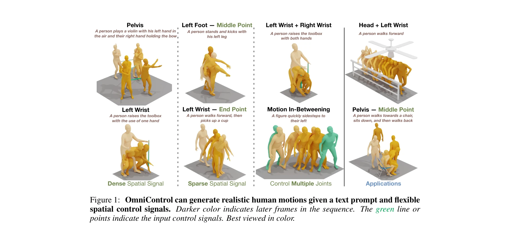

# OmniControl: Control Any Joint at Any Time for Human Motion Generation

> **저자**: Yiming Xie, Varun Jampani, Lei Zhong, Deqing Sun, Huaizu Jiang | **날짜**: 2023-10-12 | **URL**: [https://arxiv.org/abs/2310.08580](https://arxiv.org/abs/2310.08580)

---

## Essence

*Figure 1: OmniControl can generate realistic human motions given a text prompt and flexible*

OmniControl은 diffusion 기반 text-conditioned 인간 동작 생성 모델에 flexible spatial control signals을 통합하는 방법으로, 단일 모델로 임의의 관절을 임의의 시간에 제어할 수 있다.

## Motivation

- **Known**: 기존 diffusion 기반 human motion generation 방법들은 pelvis trajectory 제어에만 제한되어 있으며, 상대 좌표계 기반 표현으로 인해 다른 관절의 global spatial constraint 통합이 어렵다.
- **Gap**: text-conditioned motion generation에서 임의의 관절에 대한 flexible spatial control을 sparse signal로도 효과적으로 처리하면서 motion realism을 유지할 수 있는 통합 방법이 부재하다.
- **Why**: pick up cup이나 low-ceiling navigation 같은 현실적 응용에서 특정 관절의 정확한 위치 제어가 필수적이며, 이는 text prompt만으로는 충분히 표현하기 어렵다.
- **Approach**: OmniControl은 global coordinates로 변환하여 spatial guidance와 realism guidance를 함께 적용하는 dual guidance 전략으로, control accuracy와 motion realism을 균형있게 달성한다.

## Achievement

*Figure 1: OmniControl can generate realistic human motions given a text prompt and flexible*

- **Flexible multi-joint control**: 단일 모델로 임의의 관절과 시간대에 대해 spatial control signal을 통합하며, 여러 관절을 동시에 제어할 수 있음
- **Superior pelvis control**: HumanML3D와 KIT-ML 데이터셋에서 기존 SOTA 방법 대비 pelvis control에서 significant improvement 달성
- **Balanced control-realism trade-off**: spatial guidance와 realism guidance의 complementary 설계로 제약 조건 만족도와 동작 자연성을 동시에 보장
- **Practical applicability**: generated motion을 주변 objects와 scenes에 연결하는 downstream applications 가능

## How

*Figure 2: Overview of OmniControl. Our model generates human motions from the text prompt*

- Global coordinate 변환을 통한 analytic spatial guidance: 생성된 동작을 global coordinates로 변환하여 input control signals과 직접 비교하고 gradient를 이용한 반복적 refinement 수행
- Realism guidance: motion diffusion model의 각 attention layer 특성값에 대해 residual을 출력하여 whole-body motion을 dense하고 implicit하게 perturbation
- Dual guidance integration: spatial guidance와 realism guidance를 상호보완적으로 결합하여 iterative refinement 프로세스 진행
- Relative pose representation 유지: 모델의 input/output은 기존 relative representation 유지하면서 control module에서만 global coordinate 변환

## Originality

- Global coordinate 변환 기반 spatial guidance는 기존 inpainting 방식의 relative position 모호성을 근본적으로 해결하는 novel approach
- Motion diffusion model의 attention feature residual을 이용한 realism guidance는 image generation의 controllable diffusion 기법을 처음으로 human motion domain에 적용
- Single unified model로 임의의 joint 조합을 제어하는 generalized framework는 기존 joint별 별도 모델 필요성을 제거

## Limitation & Further Study

- Sparse control signal 외에 dense temporal trajectory에 대한 성능 평가와 비교가 부족할 수 있음
- Computational cost에 대한 분석이 없으며, iterative guidance refinement의 inference time overhead 미명시
- Complex multi-joint control 시 joint 간 physical consistency (예: hand-object interaction) 보장 메커니즘 명확하지 않음
- 후속 연구에서 scene-aware control signals을 통한 보다 정교한 spatial reasoning 통합 가능
- Long-horizon motion generation에서의 global position drift 문제에 대한 더 강력한 해결책 개발 필요

## Evaluation

- Novelty: 4/5
- Technical Soundness: 3/5
- Significance: 4/5
- Clarity: 4/5
- Overall: 4/5

**총평**: OmniControl은 기존 방법의 근본적 제약을 global coordinate 변환과 dual guidance로 해결하며, 단일 모델로 임의의 관절 제어를 가능하게 한 significant contribution이다. 실용적 응용성과 성능 면에서 human motion generation 분야의 중요한 진전을 이루었다.
