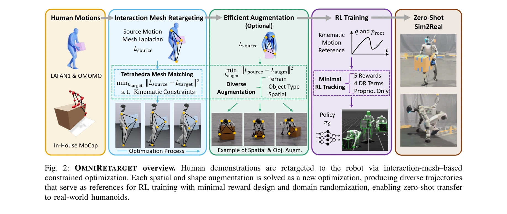
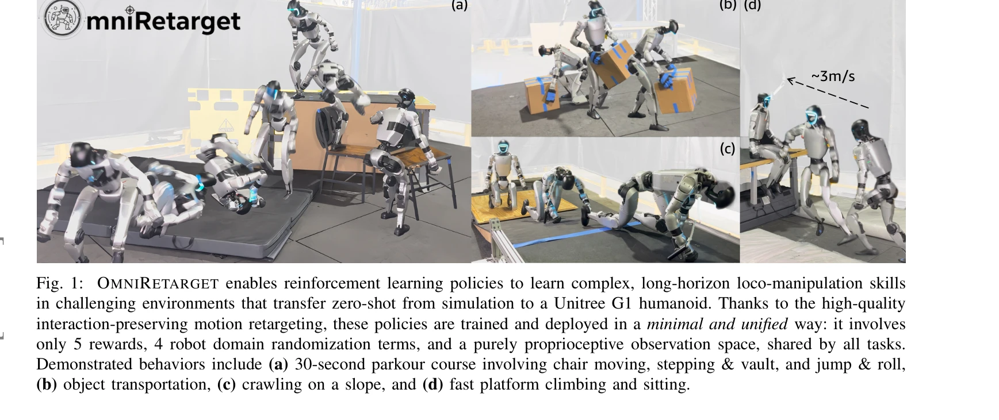

# OmniRetarget: Interaction-Preserving Data Generation for Humanoid Whole-Body Loco-Manipulation and Scene Interaction

> **저자**: Lujie Yang, Xiaoyu Huang, Zhen Wu, Angjoo Kanazawa, Pieter Abbeel, Carmelo Sferrazza, C. Karen Liu, Rocky Duan, Guanya Shi | **날짜**: 2025-10-08 | **DOI**: [10.48550/arXiv.2509.26633](https://doi.org/10.48550/arXiv.2509.26633)

---

## Essence

*Fig. 2: OMNIRETARGET overview. Human demonstrations are retargeted to the robot via interaction-mesh–based*

OmniRetarget은 interaction mesh 기반의 제약 최적화를 통해 human motion을 humanoid robot을 위한 고품질 kinematic reference로 retarget하며, 상호작용을 보존하면서 단일 시연으로부터 다양한 로봇 구체화, 지형, 물체 설정으로 효율적인 data augmentation을 수행한다.

## Motivation

- **Known**: Deep reinforcement learning을 통한 humanoid robot 제어는 높은 차원의 action space로 인해 어렵고, 기존 retargeting 방법들(PHC, GMR, VideoMimic)은 keypoint matching에 의존하여 foot-skating, penetration 등 물리적으로 부정확한 artifacts를 생성한다.
- **Gap**: 기존 retargeting 방법들은 hard kinematic constraints를 강제하지 않으며, robot-object-terrain 상호작용을 명시적으로 모델링하지 않아 품질이 낮은 reference를 생성하고, 다양한 변형을 위해서는 각각 별도의 시연이 필요하다.
- **Why**: 고품질의 interaction-preserving motion reference는 RL policy 학습을 가속화하고 reward engineering을 최소화하며, 단일 시연으로부터의 효율적 data augmentation은 대규모 데이터셋 수집의 병목을 해결하여 실제 humanoid robot으로의 zero-shot sim-to-real transfer를 가능하게 한다.
- **Approach**: OmniRetarget은 interaction mesh를 이용하여 robot, 지형, 물체 간의 공간적·접촉 관계를 명시적으로 모델링하고, Laplacian deformation을 최소화하면서 collision avoidance, joint limits, foot contact stability 등의 hard constraints를 enforcing하는 constrained optimization을 수행한다.

## Achievement

*Fig. 1:*

- **Interaction-preserving retargeting framework**: 처음으로 robot-object-terrain 상호작용을 처리하면서 hard physical constraints를 enforcing하는 humanoid retargeting 방법을 제시
- **Systematic data augmentation pipeline**: 단일 human 시연으로부터 다양한 robot embodiment, 지형, 물체 설정에 대한 대규모 고품질 kinematic trajectory 생성
- **대규모 공개 데이터셋**: OMOMO, LAFAN1, 자체 MoCap 데이터로부터 8시간 이상의 retargeted, kinematically-feasible loco-manipulation trajectory 공개
- **Zero-shot sim-to-real transfer**: 5개 reward term과 간단한 domain randomization만으로 Unitree G1 humanoid에서 30초 길이의 parkour 및 loco-manipulation 기술을 성공적으로 실행

## How

*Fig. 2: OMNIRETARGET overview. Human demonstrations are retargeted to the robot via interaction-mesh–based*

- Interaction mesh를 통해 source human motion과 target robot 간의 spatial/contact 관계를 명시적으로 모델링
- Tetrahedra mesh matching을 이용하여 human과 robot mesh 간 Laplacian deformation 최소화
- Collision avoidance, joint limits, velocity limits, foot contact stability 등의 hard kinematic constraints를 constrained optimization 문제에 포함
- Terrain height, object shape, robot embodiment, spatial configuration 등 다양한 차원의 systematic augmentation을 통해 단일 시연으로부터 diverse trajectories 생성
- 생성된 kinematic reference를 이용하여 proprioceptive RL policy를 minimal reward formulation으로 학습

## Originality

- Interaction mesh 기반 retargeting을 IMMA보다 확장하여 explicit environment/object interaction 보존 및 모든 hard kinematic constraints 통합
- Contact-rich manipulation 분야의 data augmentation 아이디어를 humanoid whole-body loco-manipulation에 적용한 최초의 시스템적 접근
- Minimal reward engineering과 proprioceptive-only observation만으로 long-horizon complex scene-interaction tasks를 수행하는 unified RL framework 실현

## Limitation & Further Study

- 현재 방법은 reference human motion의 품질에 의존하며, 잘못된 human 시연은 부정확한 augmentation을 생성할 수 있음
- Constrained optimization의 계산 비용이 실시간 또는 대규모 batch processing에서 병목이 될 수 있음
- 현재는 discrete 지형 변화와 특정 object 타입에 제한되어 있으며, continuous environment variation에 대한 확장이 필요
- Zero-shot sim-to-real transfer의 성공은 시뮬레이션-현실 격차(simulation-to-reality gap)에 의존하며, 더 복잡한 환경에서의 일반화 능력은 미검증
- 향후 work: learned models를 이용한 optimization 가속화, 더 복잡한 multi-agent interaction 시나리오 지원, 더 다양한 robot morphology에 대한 scalability 확대

## Evaluation

- Novelty: 4/5
- Technical Soundness: 3/5
- Significance: 4/5
- Clarity: 4/5
- Overall: 4/5

**총평**: OmniRetarget은 interaction-preserving motion retargeting과 체계적 data augmentation을 통해 humanoid robot 제어의 데이터 병목을 해결하는 실질적이고 영향력 있는 기여이며, 최소한의 reward engineering으로 complex whole-body loco-manipulation 기술의 zero-shot sim-to-real transfer를 성공적으로 입증하여 로보틱스 커뮤니티에 매우 유용한 공개 도구 및 데이터셋을 제공한다.

## Related Papers

- 🔗 후속 연구: [[papers/1628_PyRoki_A_Modular_Toolkit_for_Robot_Kinematic_Optimization/review]] — PyRoki의 모션 리타게팅 최적화 도구들을 활용하여 OmniRetarget의 interaction-preserving constraint optimization을 더욱 효율적으로 구현할 수 있다.
- 🏛 기반 연구: [[papers/1858_cuRoboV2_Dynamics-Aware_Motion_Generation_with_Depth-Fused_D/review]] — cuRoboV2의 동역학 인식 운동 생성이 OmniRetarget의 고품질 kinematic reference 생성에 필수적인 기술적 토대를 마련한다.
- 🧪 응용 사례: [[papers/1646_RoboMirror_Understand_Before_You_Imitate_for_Video_to_Humano/review]] — RoboMirror의 비디오-인간 모방 학습에 OmniRetarget의 interaction-preserving data augmentation 기법을 적용하여 학습 데이터의 질과 양을 크게 개선할 수 있다.
- 🏛 기반 연구: [[papers/1849_Contact-Aided_Invariant_Extended_Kalman_Filtering_for_Robot/review]] — Contact-aided motion capture 기술이 OmniRetarget의 interaction mesh 기반 제약 최적화에서 human-object interaction 보존의 기술적 토대를 제공합니다.
- 🔄 다른 접근: [[papers/2088_Make_Tracking_Easy_Neural_Motion_Retargeting_for_Humanoid_Wh/review]] — Make Tracking Easy의 neural retargeting이 OmniRetarget의 optimization-based retargeting과 다른 neural network 접근법으로 유사한 motion retargeting 문제를 해결합니다.
- 🔗 후속 연구: [[papers/1616_PICO_Reconstructing_3D_People_In_Contact_with_Objects/review]] — PICO의 3D people-object contact reconstruction이 OmniRetarget의 interaction 보존 retargeting을 실제 3D 접촉 데이터로 확장한 형태입니다.
- 🔗 후속 연구: [[papers/1628_PyRoki_A_Modular_Toolkit_for_Robot_Kinematic_Optimization/review]] — PyRoki의 역기구학과 모션 리타게팅 기능을 활용하여 OmniRetarget의 interaction-preserving retargeting을 더 효율적으로 구현할 수 있다.
- 🔗 후속 연구: [[papers/1785_A_Whole-Body_Motion_Imitation_Framework_from_Human_Data_for/review]] — OmniRetarget의 상호작용 보존 데이터 생성이 contact-aware 전신 모션 리타겟팅의 정확성과 안정성을 향상시킬 수 있다.
- 🏛 기반 연구: [[papers/1858_cuRoboV2_Dynamics-Aware_Motion_Generation_with_Depth-Fused_D/review]] — cuRoboV2의 동역학 인식 운동 생성 프레임워크가 OmniRetarget의 interaction-preserving data generation에 필수적인 기술적 기반을 제공한다.
- 🏛 기반 연구: [[papers/1987_HuBE_Cross-Embodiment_Human-like_Behavior_Execution_for_Huma/review]] — OmniRetarget의 interaction-preserving data generation이 HuBE의 cross-embodiment adaptation을 위한 데이터 생성 기법의 기초를 제공한다.
- 🔄 다른 접근: [[papers/1989_Human-Humanoid_Robots_Cross-Embodiment_Behavior-Skill_Transf/review]] — 교차 구현체 전이를 이 논문은 UDH 모델로, OmniRetarget은 상호작용 보존으로 접근한다.
