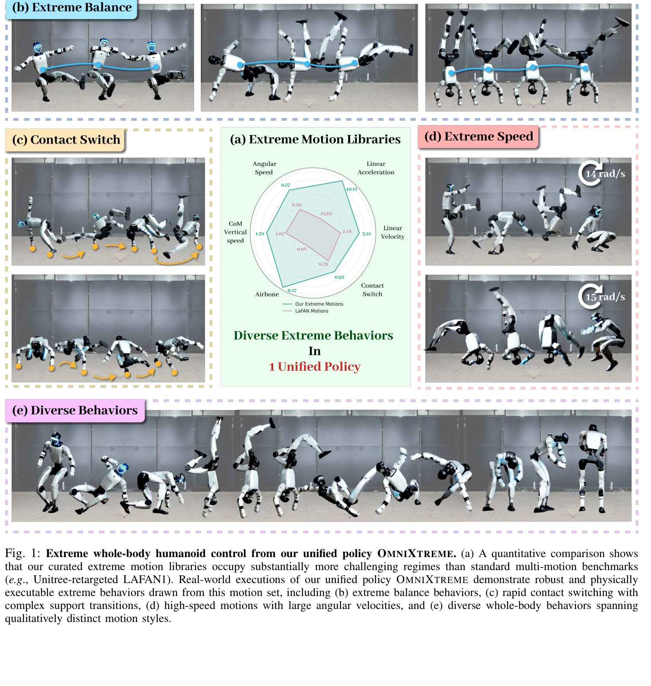
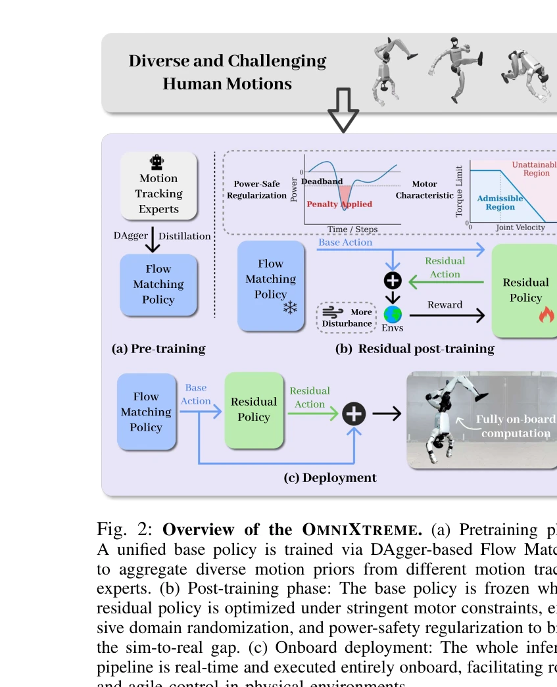

# OmniXtreme: Breaking the Generality Barrier in High-Dynamic Humanoid Control

> **저자**: Yunshen Wang, Shaohang Zhu, Peiyuan Zhi, Yuhan Li, Jiaxin Li, Yong-Lu Li, Yuchen Xiao, Xingxing Wang, Baoxiong Jia, Siyuan Huang | **날짜**: 2026-02-27 | **DOI**: [10.48550/arXiv.2602.23843](https://doi.org/10.48550/arXiv.2602.23843)

---

## Essence

*Fig. 1: Extreme whole-body humanoid control from our unified policy OMNIXTREME. (a) A quantitative comparison shows*

OmniXtreme는 flow-matching 기반의 생성형 정책과 actuation-aware residual RL을 결합하여 고동역 인간형 로봇의 다양한 극단적 동작을 고충실도로 추적할 수 있는 확장 가능한 프레임워크를 제시한다.

## Motivation

- **Known**: 기존 학습 기반 모션 추적은 단일 동작에서는 높은 정확도를 달성하지만, 동작 라이브러리의 규모와 다양성이 증가할수록 추적 충실도가 급격히 저하되는 fidelity-scalability trade-off 문제가 존재한다.
- **Gap**: 기존 접근법들은 (1) MLP 같은 단순한 정책 표현과 multi-motion RL의 gradient interference로 인한 학습 병목, (2) 실제 로봇 배포 시 모델링되지 않은 구동기 비선형성(토크-속도 특성, 재생 전력 현상 등)을 충분히 고려하지 못하고 있다.
- **Why**: 고동역 인간형 로봇이 일상적 작업과 복잡한 상호작용을 수행하려면 다양한 동작을 높은 충실도로 추적할 수 있는 범용적 제어 정책이 필수적이며, 이는 후속 로코-매니퓰레이션 및 표현적 상호작용의 기반이 된다.
- **Approach**: OmniXtreme은 (1) specialist 정책들로부터 flow-matching을 통한 behavior cloning으로 표현 학습을 수행하고, (2) 실제 구동 제약을 고려한 residual RL 기반의 actuation-aware 후처리 단계를 추가하여 두 병목을 명시적으로 해결한다.

## Achievement

*Fig. 1: Extreme whole-body humanoid control from our unified policy OMNIXTREME. (a) A quantitative comparison shows*

- **확장 가능한 생성형 정책**: Flow-matching과 고용량 아키텍처를 통해 multi-motion RL의 gradient interference 없이 표현 용량을 확장
- **Actuation-aware 실행 보장**: 토크-속도 특성, 속도 의존 손실, 재생 전력 현상 등을 모델링한 residual RL로 실제 로봇에서의 물리적 실행 가능성 확보
- **극단적 동작 추적**: 높은 속도(최대 15 rad/s), 빈번한 접촉 전환, 공중 동작을 포함한 다양한 극단적 행동을 Unitree G1에서 성공적으로 실행
- **Fidelity-scalability trade-off 해결**: 동작 다양성 증가에도 불구하고 높은 추적 충실도 유지

## How

*Fig. 2: Overview of the OMNIXTREME. (a) Pretraining phase:*

- Specialist 정책 학습: 각 동작 또는 동작 그룹에 대해 독립적인 RL 기반 specialist 정책 훈련
- Flow-matching을 이용한 통합 정책 사전학습: Specialist 정책들의 행동 데이터로부터 flow-matching 기반 생성형 정책을 behavior cloning으로 학습
- Actuation-aware 도메인 랜더마이제이션: 실제 구동기의 토크-속도 특성, 속도 의존 손실, 전력 제약을 시뮬레이션에 통합
- Residual RL 후처리: 사전학습된 정책을 기반으로 현실적 구동 제약 하에서 정책을 미세조정하는 보상 함수 설계
- 극단적 동작 데이터셋: 높은 가속도, 공중 접촉 전환, 고속 회전을 포함하는 curated 극단적 동작 라이브러리 구성

## Originality

- **Specialist-to-unified 생성형 프레임워크**: 기존의 end-to-end multi-motion RL 대신, 이미 학습된 specialist 정책들로부터 flow-matching을 통해 통합 정책을 도출하는 새로운 접근법
- **Actuation-aware 실행 개선**: 단순 effort bound가 아닌 토크-속도 곡선, 재생 전력 등 실제 구동 물리를 명시적으로 모델링하는 residial RL 단계의 도입
- **극단적 동작 벤치마크**: 기존 multi-motion 벤치마크보다 훨씬 도전적인 극단적 동작 라이브러리 구성 및 평가

## Limitation & Further Study

- 극단적 동작 데이터셋의 규모와 다양성이 특정 로봇 플랫폼(Unitree G1)에 편향될 수 있으며, 다른 형태의 인간형 로봇으로의 일반화 가능성이 명확하지 않음
- Flow-matching 사전학습 단계에서 specialist 정책들의 학습 품질이 최종 통합 정책에 미치는 영향에 대한 상세한 분석 부족
- Actuation-aware residual RL의 수렴 속도 및 샘플 효율성에 대한 상세한 비교 분석이 제한적
- 후속 연구는 (1) 다양한 로봇 플랫폼으로의 일반화, (2) Online learning을 통한 실시간 적응, (3) 더 복잡한 구동 제약(유압 액추에이터 등)의 통합에 초점을 맞춰야 함

## Evaluation

- Novelty: 4/5
- Technical Soundness: 3/5
- Significance: 4/5
- Clarity: 4/5
- Overall: 4/5

**총평**: OmniXtreme은 humanoid 동작 제어의 long-standing fidelity-scalability trade-off를 해결하기 위해 생성형 모델과 actuation-aware 정제라는 두 가지 보완적 기법을 창의적으로 결합한 강력한 프레임워크이며, 실제 로봇에서 극단적 동작의 성공적 실행으로 그 유효성을 입증했다.

## Related Papers

- 🔄 다른 접근: [[papers/2122_One_Policy_but_Many_Worlds_A_Scalable_Unified_Policy_for_Ver/review]] — 둘 다 생성형 정책을 활용하지만, OmniXtreme은 고동역 극단적 동작 추적에, One Policy는 다양한 지형에서의 통합 정책에 초점을 둔다.
- 🏛 기반 연구: [[papers/1885_DreamControl-v2_Simpler_and_Scalable_Autonomous_Humanoid_Ski/review]] — DreamControl-v2의 확장 가능한 자율 휴머노이드 기술이 OmniXtreme의 고동역 동작을 위한 확장 가능한 프레임워크 설계에 기반을 제공한다.
- 🔗 후속 연구: [[papers/2146_TEDi_Temporally-Entangled_Diffusion_for_Long-Term_Motion_Syn/review]] — TEDi의 장기간 모션 합성을 위한 시간적 얽힘 확산을 고동역 극단적 동작이라는 더 도전적인 영역으로 확장한 연구이다.
- 🔄 다른 접근: [[papers/2082_LHM-Humanoid_Learning_a_Unified_Policy_for_Long-Horizon_Huma/review]] — 둘 다 고성능 humanoid control이지만 OmniXtreme은 극단적 동작 추적에, LHM은 장시간 manipulation에 특화되어 있다
- 🔗 후속 연구: [[papers/1936_From_Motion_to_Behavior_Hierarchical_Modeling_of_Humanoid_Ge/review]] — From Motion to Behavior의 hierarchical modeling이 OmniXtreme의 flow-matching과 residual RL 결합으로 더욱 발전된 것이다
- 🏛 기반 연구: [[papers/1931_Flow_Matching_Imitation_Learning_for_Multi-Support_Manipulat/review]] — Flow matching을 통한 multi-support manipulation이 OmniXtreme의 flow-matching 기반 생성형 정책 구현의 이론적 기반을 제공합니다.
- 🧪 응용 사례: [[papers/1976_HiFAR_Multi-Stage_Curriculum_Learning_for_High-Dynamics_Huma/review]] — HiFAR의 고동역 humanoid control을 위한 multi-stage curriculum이 OmniXtreme의 극단적 동작 추적을 단계적으로 학습하는 실제 적용 사례입니다.
- 🔗 후속 연구: [[papers/2127_Optimizing_Bipedal_Locomotion_for_The_100m_Dash_With_Compari/review]] — 100m 대시 최적화의 체계적인 보행 매개변수 조정이 OmniXtreme의 고동역 humanoid 제어를 특정 고속 운동 성능으로 확장한 사례입니다.
- 🔄 다른 접근: [[papers/2082_LHM-Humanoid_Learning_a_Unified_Policy_for_Long-Horizon_Huma/review]] — 둘 다 diffusion 기반 humanoid control이지만 LHM은 장시간 조작에, OmniXtreme은 고동역학 동작에 특화되어 있다
- 🔄 다른 접근: [[papers/2122_One_Policy_but_Many_Worlds_A_Scalable_Unified_Policy_for_Ver/review]] — 둘 다 생성형 정책을 사용하지만, One Policy는 지형 다양성과 zero-shot 일반화에, OmniXtreme은 고동역 극단적 동작 추적에 특화된다.
- 🔄 다른 접근: [[papers/2145_TD-GRPC_Temporal_Difference_Learning_with_Group_Relative_Pol/review]] — 둘 다 고성능 휴머노이드 제어를 위한 정책 학습을 다루지만, TD-GRPC는 시간차 학습 안정화에, OmniXtreme은 생성형 정책 기반 극단 동작에 집중한다.
