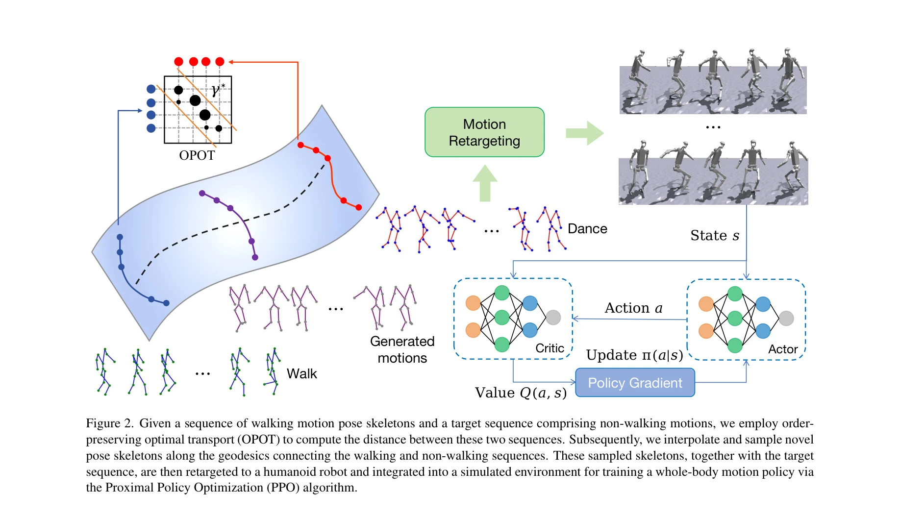
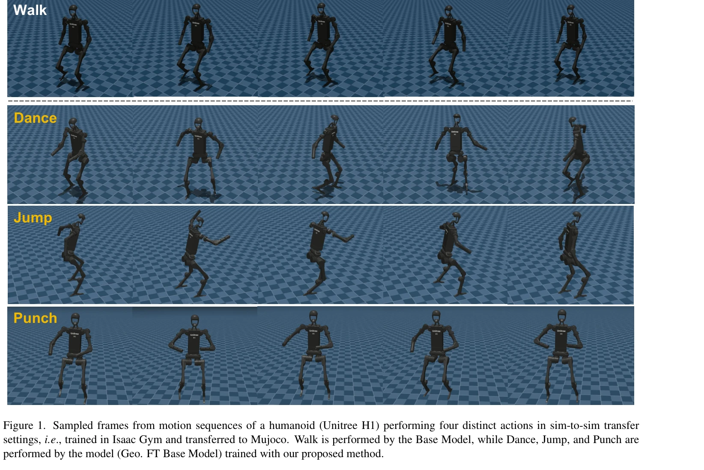

# One-shot Adaptation of Humanoid Whole-body Motion with Walking Priors

> **저자**: Hao Huang, Geeta Chandra Raju Bethala, Shuaihang Yuan, Congcong Wen, Mengyu Wang, Anthony Tzes, Yi Fang | **날짜**: 2026-04-07 | **DOI**: [10.48550/arXiv.2510.25241](https://doi.org/10.48550/arXiv.2510.25241)

---

## Essence

*Figure 2. Given a sequence of walking motion pose skeletons and a target sequence comprising non-walking motions, we emp*

단일 비보행 대상 샘플과 보행 사전 지식을 활용하여 휴머노이드 전신 운동을 원샷 적응하는 데이터 효율적 방법을 제안한다. Order-preserving optimal transport를 통해 보행과 비보행 시퀀스 간 거리를 계산하고 geodesic 보간으로 중간 포즈를 생성한 후 강화학습으로 정책을 적응한다.

## Motivation

- **Known**: 최근 심화 강화학습 기반 휴머노이드 운동 방법들은 Transformer 정책, world model, 계층적 제어 등으로 다양한 전신 운동을 수행할 수 있으나, 모두 대규모 모션 데이터셋(예: CMU MoCap, AMASS)의 다중 샘플을 필요로 한다.
- **Gap**: 휴머노이드 전신 운동에서 단일 대상 샘플로부터의 원샷 학습은 동적 균형과 다중 관절 조정이 필요해 거의 미탐색 상태이며, 대규모 모션 데이터 수집의 높은 비용과 노동력 문제가 존재한다.
- **Why**: 보행 외 복잡한 모션(댄스, 점프, 펀치 등) 비디오는 인터넷에서 수집하기 어려워 데이터 효율적 적응 기법이 필수이며, 이를 통해 모션 캡처 데이터셋 구축의 부담을 대폭 감소시킬 수 있다.
- **Approach**: 사전학습된 보행 기반 모델과 단일 대상 모션 클립으로부터 order-preserving optimal transport를 이용해 중간 포즈 골격을 생성하고, manifold 최적화로 충돌 회피를 보장한 후 강화학습으로 미세조정한다.

## Achievement

*Figure 1. Sampled frames from motion sequences of a humanoid (Unitree H1) performing four distinct actions in sim-to-sim*

- **데이터 효율성**: 단일 비보행 샷만으로 새로운 휴머노이드 운동에 적응 가능하며, 대량 모션 데이터 수집의 필요성을 제거
- **경량 생성 방식**: 신경망 훈련 없이 order-preserving optimal transport와 manifold 최적화만으로 합성 학습 샘플 생성
- **우수한 성능**: CMU MoCap 데이터셋에서 기준선 대비 일관되게 개선된 성능 달성
- **견고성**: Isaac Gym에서 MuJoCo로의 시뮬레이터 간 전이(sim-to-sim transfer) 성공

## How

*Figure 2. Given a sequence of walking motion pose skeletons and a target sequence comprising non-walking motions, we emp*

- Base Model: 약 130개의 보행 모션 클립으로 보행 기반 정책 사전학습 (PPO)
- OPOT 거리 계산: Order-preserving optimal transport로 보행과 대상 시퀀스 간 Wasserstein 거리 계산하여 시간적 일관성 보존
- Geodesic 보간: 계산된 거리를 따라 중간 포즈 골격 생성으로 pose skeleton manifold 상에서 부드러운 전이
- Manifold 최적화: 생성된 모션의 신체 부위 간 충돌 제거 및 운동학적 타당성 확보
- Retargeting: 최적화된 골격을 휴머노이드(Unitree H1, 19 DoF)의 관절 구조로 변환
- 정책 미세조정: Base Model을 생성된 합성 데이터로 강화학습(PPO)으로 재훈련

## Originality

- 휴머노이드 전신 운동에 원샷 학습 개념을 최초로 적용하며, 기존 조작 과제와 달리 동적 균형과 보행 사전 지식을 고려한 차별화된 접근
- Order-preserving optimal transport를 모션 생성에 활용하여 시간적 순서를 보존하면서 pose skeleton manifold상의 geodesic 보간 구현
- 신경망 훈련 없는 경량 생성 방식으로 기존 diffusion model 기반 방법과 차별화
- 보행 사전 모델을 활용한 점진적 적응 전략으로 단일 샷 학습의 불안정성 극복

## Limitation & Further Study

- Base Model 훈련에 약 130개의 보행 클립이 필요하므로 완전한 영샷 학습이 아니며, 보행이 아닌 다른 보조 모션으로 확장할 시 데이터 수집 필요성 존재
- 대상 모션과 보행 사이의 거리가 너무 클 경우 geodesic 보간의 효과 저감 가능성
- 현재 CMU MoCap 데이터셋에서만 평가되었으며, 실제 로봇 하드웨어 실험의 부재로 sim-to-real transfer 성능 미확인
- 충돌 회피와 운동학적 타당성을 위한 manifold 최적화 계산 비용이 명시되지 않음
- 후속 연구: 다양한 보조 모션 집합의 활용, real-world transfer learning, 더 복잡한 다중-상체 상호작용 모션 확장, 온라인 적응 메커니즘 개발

## Evaluation

- Novelty: 4/5
- Technical Soundness: 3/5
- Significance: 4/5
- Clarity: 4/5
- Overall: 4/5

**총평**: 휴머노이드 전신 운동에 원샷 학습을 효과적으로 적용하고, order-preserving optimal transport와 manifold 최적화를 통해 경량의 데이터 효율적 솔루션을 제시하는 높은 가치의 연구이다. 다만 실제 로봇 검증과 더 다양한 보조 모션 확장이 후속 과제이다.
