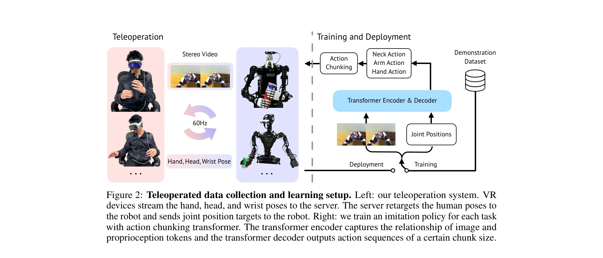
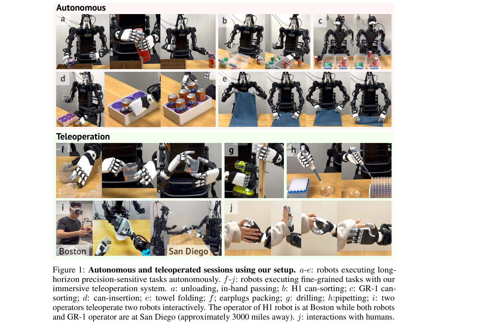

# Open-TeleVision: Teleoperation with Immersive Active Visual Feedback

> **저자**: Xuxin Cheng, Jialong Li, Shiqi Yang, Ge Yang, Xiaolong Wang | **날짜**: 2024-07-01 | **URL**: [https://arxiv.org/abs/2407.01512](https://arxiv.org/abs/2407.01512)

---

## Essence

*Figure 2: Teleoperated data collection and learning setup. Left: our teleoperation system. VR*

Apple VisionPro 등 VR 기기를 활용하여 스테레오 영상 피드백과 로봇 헤드의 능동적 카메라 제어를 통해 직관적이고 몰입감 있는 원격 조종 시스템을 구현하고, 이를 통해 수집한 데이터로 모방 학습 정책을 훈련하여 복잡한 조작 작업을 자동화함.

## Motivation

- **Known**: 원격 조종은 로봇 학습을 위한 시연 데이터 수집에 중요한 역할을 해왔으며, VR 기기, RGB 카메라, 웨어러블 장갑 등 다양한 방식이 연구되어 왔음.
- **Gap**: 기존 시스템은 로봇 팔이나 몸체에 의한 폐색으로 인해 작업 공간의 시각적 피드백이 제한적이고, 미세한 조작 작업에서 직관적인 근거리 관찰이 어려우며, 원격 제어 시 고정된 3인칭 또는 1인칭 뷰만 제공함.
- **Why**: 고품질의 다양하고 확장 가능한 시연 데이터 수집을 위해서는 직관적이고 사용하기 쉬운 원격 조종 시스템이 필수적이며, 이는 로봇 학습 정책의 성능과 일반화 능력을 크게 향상시킬 수 있음.
- **Approach**: 로봇 헤드에 장착된 능동적 스테레오 RGB 카메라가 작업자의 머리 움직임을 따라 2-3 DoF로 움직이며 1인칭 시점의 스테레오 영상을 전송하고, 작업자의 손과 팔 움직임을 역기구학(IK)과 dex-retargeting을 통해 로봇의 다중 지절 손이나 그리퍼로 변환하여 제어함.

## Achievement

*Figure 1: Autonomous and teleoperated sessions using our setup. a-e: robots executing long-*

- **몰입감 있는 원격 조종**: 능동적 헤드 카메라와 스테레오 영상 피드백을 통해 작업자가 로봇의 시점에서 직관적으로 광범위한 작업 공간을 탐색하고 세부 작업에 집중할 수 있음
- **다중 로봇 호환성**: Unitree H1(6 DoF 손)과 Fourier GR-1(그리퍼)이라는 상이한 하드웨어에 대해 동일한 시스템이 작동하며, 원격 조종의 범용성과 적응성을 입증함
- **원거리 원격 조종 실증**: MIT의 작업자가 3000마일 떨어진 UC San Diego의 H1 로봇을 인터넷을 통해 조종하는 coast-to-coast 원격 제어 성공
- **모방 학습 성능 향상**: 능동적 카메라 센싱은 추론 속도를 개선하고 스테레오 입력은 Can Sorting, Can Insertion, Folding, Unloading 등 4개 장기 정밀 조작 작업에서 정책의 성능을 향상시킴
- **오픈소스 공개**: 시스템 전체를 open-source로 공개하여 커뮤니티의 재현성과 활용을 높임

## How

*Figure 2: Teleoperated data collection and learning setup. Left: our teleoperation system. VR*

- **하드웨어 구성**: Unitree H1에는 2 DoF 짐벌(yaw, pitch)을, Fourier GR-1에는 제조사의 3 DoF 목(yaw, roll, pitch)을 사용하여 ZED Mini 스테레오 카메라 장착
- **팔 제어**: 작업자의 손목 자세를 로봇 좌표계로 변환하고, closed-loop IK (CLIK) 알고리즘과 Pinocchio 라이브러리를 사용하여 관절 각도 계산, SE(3) group filter로 안정성 강화
- **손 제어**: dex-retargeting 라이브러리를 이용한 벡터 최적화로 인간의 손 키포인트를 로봇 관절 명령으로 변환 (식 1)
- **스테레오 영상 스트리밍**: 로봇이 480x640 해상도의 스테레오 영상을 60 Hz로 VR 기기에 실시간 전송
- **데이터 수집 및 정책 훈련**: Action Chunking Transformer를 사용하여 이미지와 자체운동 감각 토큰의 관계를 포착하는 encoder와 일정 크기의 동작 시퀀스를 출력하는 decoder로 정책 학습

## Originality

- **능동적 헤드 카메라의 활용**: 기존의 고정 또는 수동 카메라 뷰 대신 작업자의 머리 움직임과 동기화되는 능동적 헤드-마운트 카메라로 1인칭 시점의 직관적 시각 피드백 제공
- **스테레오 영상의 통합**: 단순 RGB 모노 영상이 아닌 스테레오 영상 스트리밍으로 공간적 이해도와 정밀한 깊이 인식을 개선
- **능동 시각 감각의 정책 학습 통합**: 단순히 원격 조종의 직관성을 높일 뿐만 아니라, 학습된 정책이 능동적 헤드 움직임을 모방하여 자동 실행 시에도 자연스러운 주의 메커니즘을 구현
- **웹 기반 원거리 원격 조종**: Vuer 기반 웹 서버를 활용하여 인터넷을 통한 실시간 coast-to-coast 원격 제어 실현
- **다중 로봇 호환성**: 동일한 시스템이 서로 다른 손 형태(dexterous hand vs. gripper)를 가진 여러 로봇에 일반화 가능함을 입증

## Limitation & Further Study

- **하드웨어 의존성**: VR 기기(Apple VisionPro)와 특정 스테레오 카메라(ZED Mini) 선택에 따른 비용 및 접근성 제약
- **네트워크 레이턴시**: 인터넷 기반 원격 조종 시 통신 지연(latency)이 미세한 조작 작업의 성능에 미치는 영향에 대한 상세한 분석 부족
- **확장성 제한**: 현재 시스템이 humanoid 로봇 2개와 특정 조작 작업 4개에서만 검증되었으며, 다른 로봇 형태(산업용 로봇 팔, 사족 로봇 등)나 다양한 작업으로의 일반화 검증 필요
- **정책 성능의 상세 비교 부족**: 스테레오 입력과 능동 카메라의 각각의 기여도를 독립적으로 분석한 ablation study 결과 제시 필요
- **후속 연구 방향**: 네트워크 지연에 대한 강인성 개선, 더 다양한 로봇 플랫폼으로의 확대, 다중 작업자 협업 환경에서의 시스템 확장성, 자동 촉각 피드백 통합 등

## Evaluation

- Novelty: 4/5
- Technical Soundness: 3/5
- Significance: 4/5
- Clarity: 4/5
- Overall: 4/5

**총평**: 본 논문은 VR 기반 능동적 헤드 카메라와 스테레오 영상 피드백을 통해 직관적이고 몰입감 있는 원격 조종 시스템을 제시하며, 이를 통해 수집한 데이터로 복잡한 조작 작업을 성공적으로 자동화할 수 있음을 입증함으로써 로봇 학습 데이터 수집 분야에 실질적인 기여를 함.
