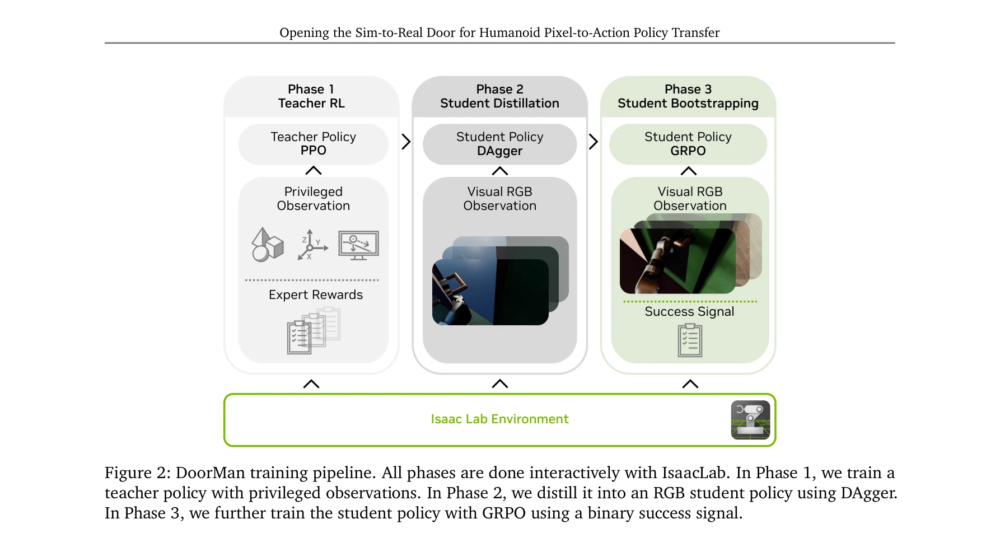
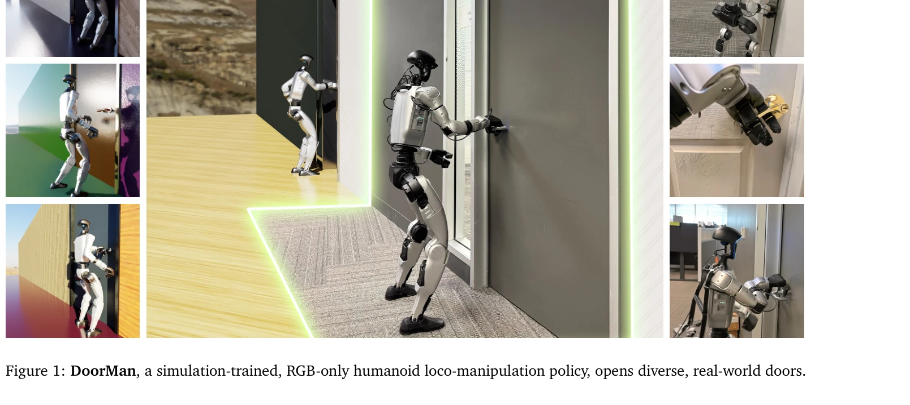
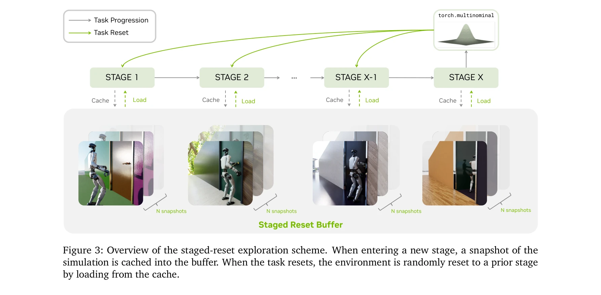

# Opening the Sim-to-Real Door for Humanoid Pixel-to-Action Policy Transfer

> **저자**: Haoru Xue, Tairan He, Zi Wang, Qingwei Ben, Wenli Xiao, Zhengyi Luo, Xingye Da, Fernando Castañeda, Guanya Shi, Shankar Sastry, Linxi "Jim" Fan, Yuke Zhu | **날짜**: 2025-11-30 | **DOI**: [10.48550/arXiv.2512.01061](https://doi.org/10.48550/arXiv.2512.01061)

---

## Essence

*Figure 2: DoorMan training pipeline. All phases are done interactively with IsaacLab. In Phase 1, we train a*

GPU 가속 포토리얼리스틱 시뮬레이션과 teacher-student-bootstrap 학습 프레임워크를 통해 순수 RGB 시각만 사용하여 인간형 로봇이 다양한 문을 열 수 있는 sim-to-real 정책을 개발했다.

## Motivation

- **Known**: 최근 GPU 가속 시뮬레이션과 물리 및 시각 무작위화를 통해 로봇 학습의 확장 가능한 데이터 생성 경로가 열렸다. 기존 문 열기 관련 연구들은 깊이 센싱, 객체 중심 특징, 또는 사전에 정의된 모션 프리미티브에 의존한다.
- **Gap**: 시각 기반 인간형 로보틱스에서 부분 관측성(partial observability)을 효과적으로 완화하고 장기간 균형 유지와 접촉 풍부한 제어가 필요한 로코-조작 작업의 일반화 가능한 파이프라인이 부족하다.
- **Why**: 일상적인 로코-조작 작업(문 열기, 서랍 당기기 등)은 인간형 로봇의 자율성을 위한 핵심 frontier이며, 정확한 지각-행동 결합, 전신 조정 및 불확실성 하에서의 접촉 제어가 필수적이다.
- **Approach**: 세 단계 학습 파이프라인을 제안한다: (1) 특권 정보를 가진 teacher 정책을 staged-reset 탐색 전략으로 훈련, (2) DAgger를 통해 RGB 기반 student 정책으로 증류, (3) GRPO를 사용한 bootstrapping으로 부분 관측성 완화 및 폐루프 일관성 개선.

## Achievement

*Figure 1: DoorMan, a simulation-trained, RGB-only humanoid loco-manipulation policy, opens diverse, real-world doors.*

- **첫 번째 순수 RGB 인간형 sim-to-real 정책**: 다양한 구조의 문에 대해 영점 샷(zero-shot) 성능으로 83% 성공률 달성
- **인간 텔레오퍼레이터 초과 성능**: 동일한 전신 제어 스택 하에서 31.7% 빠른 작업 완료 시간 달성
- **확장 가능한 합성 생성 파이프라인**: IsaacLab에서 물리적 정확도와 시각적 다양성을 갖춘 대규모 도메인 무작위화 파이프라인 구축
- **일반화 성능**: 다양한 핸들 유형, 패널 시각, 공간 배치에 대한 강건한 일반화

## How

*Figure 3: Overview of the staged-reset exploration scheme. When entering a new stage, a snapshot of the*

- Teacher 정책: PPO를 사용하여 특권 정보(ground-truth 로봇-도어 변환, 접촉 wrench, 근 선형 속도)에 기반한 보상 형성으로 훈련
- Staged-reset 탐색: 장기 작업의 안정적 훈련을 위해 시뮬레이션 스냅샷 캐시에서 무작위 복원 사용
- Student 증류: vision encoder(ResNet), 고유감각 정보, 2층 LSTM(512 단위)을 사용한 DAgger 기반 증류
- GRPO 기반 fine-tuning: 이진 성공 신호를 사용하여 부분 관측성 완화 및 폐루프 일관성 개선
- 도메인 무작위화: 문 유형, 크기, 힌지 감쇠, 래치 역학, 핸들 배치, 저항 토크(물리), 재료, 조명, 카메라 내재성/외재성(시각) 무작위화

## Originality

- Teacher-student-bootstrap 파이프라인의 novel 설계로 privileged 정보와 RGB-only 지각 간 간극 해소
- Staged-reset 탐색 메커니즘으로 장기 로코-조작 작업의 효율적 훈련 실현
- GRPO 기반 fine-tuning으로 부분 관측성 환경에서의 폐루프 일관성 개선 제시
- 포토리얼리스틱 시뮬레이션 환경에서 인간형 로봇의 다양한 articulated 객체 상호작용 달성

## Limitation & Further Study

- 평가가 문 열기 작업에 제한되어 있으며 다른 로코-조작 작업(서랍, 노브)으로의 일반화 검증 필요
- Staged-reset 탐색의 optimal stage 선택과 스냅샷 수에 대한 ablation study 부족
- 실제 도메인 갭(예: 손 조작, 동역학 모델 오차)에 대한 상세한 분석 및 실패 케이스 분석 필요
- 계산 비용과 훈련 시간에 대한 정량적 비교 부재
- 더 도전적인 객체 상호작용(복잡한 힌지, 높은 저항력)에 대한 확장성 평가 필요

## Evaluation

- Novelty: 4/5
- Technical Soundness: 3/5
- Significance: 4/5
- Clarity: 4/5
- Overall: 4/5

**총평**: 순수 RGB 시각만을 사용하여 다양한 실제 문을 여는 인간형 로봇 정책을 시뮬레이션에서만 훈련하여 영점 샷 전이에 성공한 획기적인 연구로, staged-reset 탐색과 GRPO 기반 bootstrapping 등의 novel 방법론이 실질적 성능 개선을 입증한다.

## Related Papers

- 🏛 기반 연구: [[papers/2107_MOSAIC_Bridging_the_Sim-to-Real_Gap_in_Generalist_Humanoid_M/review]] — MOSAIC의 sim-to-real gap 해결을 위한 빠른 적응 메커니즘이 Opening the Sim-to-Real Door의 순수 RGB 기반 정책 전이에 방법론적 기반을 제공한다.
- 🔄 다른 접근: [[papers/1673_Sim-and-Real_Co-Training_A_Simple_Recipe_for_Vision-Based_Ro/review]] — 둘 다 sim-to-real 문제를 다루지만, Opening the Sim-to-Real Door는 포토리얼리스틱 시뮬레이션 기반 문열기에, Sim-and-Real Co-Training은 공동 훈련에 집중한다.
- 🔗 후속 연구: [[papers/1951_Genie_Sim_30__A_High-Fidelity_Comprehensive_Simulation_Platf/review]] — Genie Sim 3.0의 고품질 시뮬레이션 플랫폼을 GPU 가속 포토리얼리스틱 시뮬레이션과 teacher-student 학습으로 특화한 연구이다.
- 🏛 기반 연구: [[papers/1620_PolySim_Bridging_the_Sim-to-Real_Gap_for_Humanoid_Control_vi/review]] — GPU 가속 시뮬레이션과 sim-to-real 전이를 위한 기본 프레임워크를 제공하는 선행 연구이다.
- 🔄 다른 접근: [[papers/2061_Learning_Sim-to-Real_Humanoid_Locomotion_in_15_Minutes/review]] — teacher-student 방식 대신 더 빠른 15분 내 학습 방법으로 sim-to-real 휴머노이드 제어를 달성한다.
- 🧪 응용 사례: [[papers/1774_A_Behavior_Architecture_for_Fast_Humanoid_Robot_Door_Travers/review]] — 문 열기 특화 정책을 실제 빠른 문 통과 행동 아키텍처에 적용할 수 있는 구체적 사례이다.
- 🔄 다른 접근: [[papers/1749_VIRAL_Visual_Sim-to-Real_at_Scale_for_Humanoid_Loco-Manipula/review]] — VIRAL의 visual sim-to-real at scale이 Opening the Door의 GPU 가속 포토리얼리스틱 시뮬레이션과 다른 스케일로 유사한 visual policy transfer 문제를 해결합니다.
- 🔗 후속 연구: [[papers/1908_Embrace_Collisions_Humanoid_Shadowing_for_Deployable_Contact/review]] — Embrace Collisions의 deployable contact control이 문 열기 정책의 RGB-only visual policy를 물리적 접촉이 필요한 더 복잡한 manipulation으로 확장합니다.
- 🏛 기반 연구: [[papers/2124_Open-TeleVision_Teleoperation_with_Immersive_Active_Visual_F/review]] — Open-TeleVision의 immersive visual feedback이 pixel-to-action policy의 순수 RGB 시각 기반 제어 시스템 구현의 기술적 토대를 제공합니다.
- 🔗 후속 연구: [[papers/1667_SCDP_Learning_Humanoid_Locomotion_from_Partial_Observations/review]] — pixel-to-action 정책의 sim-to-real 전이를 센서 조건부 diffusion으로 더 발전시킨다.
- 🔗 후속 연구: [[papers/1673_Sim-and-Real_Co-Training_A_Simple_Recipe_for_Vision-Based_Ro/review]] — 시뮬레이션과 실제 데이터 혼합 학습 전략이 휴머노이드 pixel-to-action 정책의 sim-to-real 전이에 적용될 수 있다.
- 🔗 후속 연구: [[papers/1749_VIRAL_Visual_Sim-to-Real_at_Scale_for_Humanoid_Loco-Manipula/review]] — VIRAL의 visual sim-to-real 프레임워크가 pixel-to-action 정책 배포의 기반이 됩니다.
- 🔗 후속 연구: [[papers/1829_Bridging_the_Sim-to-Real_Gap_for_Athletic_Loco-Manipulation/review]] — 픽셀 기반 정책의 sim-to-real 전이와 함께 athletic loco-manipulation의 현실 배포를 위한 완전한 파이프라인을 구성한다.
- 🧪 응용 사례: [[papers/1947_Generalizable_Humanoid_Manipulation_with_3D_Diffusion_Polici/review]] — 3D Diffusion Policy 기반 시스템을 sim-to-real humanoid pixel-to-action에 적용하여 더 robust한 실제 환경 조작이 가능하다.
- 🔗 후속 연구: [[papers/2006_Humanoid-Gym_Reinforcement_Learning_for_Humanoid_Robot_with/review]] — 시뮬레이션 기반 학습이 pixel-to-action 정책의 sim-to-real 전이로 확장될 수 있다.
- 🔗 후속 연구: [[papers/2107_MOSAIC_Bridging_the_Sim-to-Real_Gap_in_Generalist_Humanoid_M/review]] — Opening the Sim-to-Real Door의 순수 시각 기반 정책을 범용 동작 추적과 빠른 적응 메커니즘으로 확장한 연구이다.
