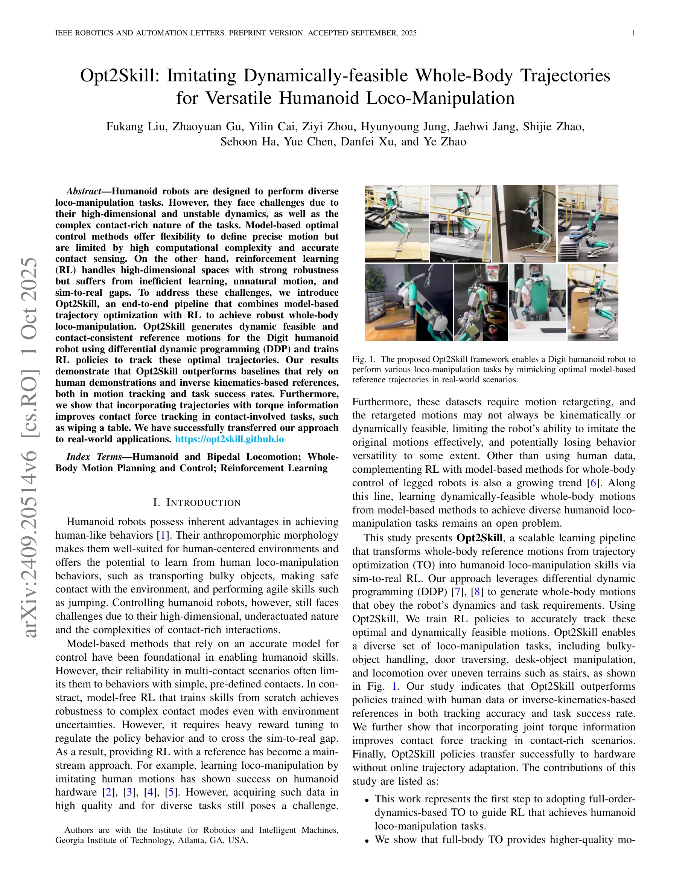

# Opt2Skill: Imitating Dynamically-feasible Whole-Body Trajectories for Versatile Humanoid Loco-Manipulation

> **저자**: Fukang Liu, Zhaoyuan Gu, Yilin Cai, Ziyi Zhou, Hyunyoung Jung, Jaehwi Jang, Shijie Zhao, Sehoon Ha, Yue Chen, Danfei Xu, Ye Zhao | **날짜**: 2024-09-30 | **URL**: [https://arxiv.org/abs/2409.20514](https://arxiv.org/abs/2409.20514)

---

## Essence

*Fig. 1. The proposed Opt2Skill framework enables a Digit humanoid robot to*

Opt2Skill은 Differential Dynamic Programming (DDP)로 생성한 동역학적으로 실현 가능한 궤적을 Reinforcement Learning (RL)으로 모방하게 함으로써 인간형 로봇의 다양한 로코-조작 작업을 효과적으로 수행하는 통합 파이프라인이다.

## Motivation

- **Known**: Model-based trajectory optimization은 정확한 동역학 제약을 만족하는 고품질 궤적을 생성할 수 있으나 계산 복잡도가 높고, RL은 고차원 공간에서 강건하지만 학습 효율성이 낮고 sim-to-real 갭이 크다.
- **Gap**: 특히 인간형 로봇의 전신 로코-조작 작업에서 동역학적으로 실현 가능한 기준 궤적을 RL로 학습하는 방법이 부재했으며, 기존 mocap 기반이나 IK 기반 기준은 동역학 실현 가능성을 보장하지 못한다.
- **Why**: 인간형 로봇은 고차원 불안정 동역학과 복잡한 접촉 상호작용으로 인해 제어가 어려우므로, 동역학적으로 실현 가능하면서도 강건한 제어 정책이 필수적이다.
- **Approach**: DDP를 사용하여 로봇 동역학과 접촉 제약을 만족하는 최적 궤적을 생성한 후, RL 정책이 이 궤적을 모방하도록 훈련하며, 토크 정보를 포함시켜 접촉 풍부한 작업 성능을 향상시킨다.

## Achievement

*Fig. 1. The proposed Opt2Skill framework enables a Digit humanoid robot to*

- **첫 전신 동역학 기반 TO를 RL 가이드로 적용**: Digit 30-DOF 인간형 로봇에서 full-order-dynamics-based TO로부터의 참조 궤적을 통해 RL을 학습하는 첫 사례 제시
- **기준 궤적 품질 우월성**: Full-body TO 기반 참조가 mocap 및 inverse kinematics 기반 기준보다 추적 정확도와 작업 성공률에서 우수함을 입증
- **토크 정보의 중요성**: TO에서만 얻을 수 있는 조인트 토크 정보가 접촉 풍부한 시나리오에서 접촉력 추적 성능을 현저히 개선함을 입증
- **다양한 작업에서의 실제 전이**: 탁상 닦기, 문 통과, 계단 오르기, 야외 환경 보행 등 7개의 다양한 로코-조작 작업에서 온라인 적응 없이 성공적인 sim-to-real 전이 달성

## How

*Fig. 2. Overall structure of the Opt2Skill framework. (a) We first generate structured, dynamically feasible reference t*

- DDP를 통해 task structure와 contact sequence를 지정하여 로봇 동역학과 토크 제약을 만족하는 최적 전신 궤적 생성
- 생성된 참조 궤적 (위치, 속도, 토크)을 imitation learning 목표로 사용하여 RL 정책 훈련
- Digit 로봇의 30-DOF 전신 제어를 위해 full-order dynamics model 활용으로 운동학적 제약만 사용하는 IK 기반 방식과 차별화
- 접촉 풍부한 작업 (테이블 닦기 등)에서 참조 토크 정보를 손실 함수에 포함시켜 접촉력 추적 향상
- Simulation에서 정책 학습 후 실제 하드웨어로 직접 전이하며, 실제 환경의 불확실성에 대한 강건성 검증

## Originality

- 인간형 로봇 전신 로코-조작에 full-order-dynamics-based TO를 RL 가이드로 처음 적용하여 동역학 실현 가능성과 학습 효율성을 동시에 달성
- 조인트 토크 정보를 RL 학습에 명시적으로 활용함으로써 접촉 풍부한 작업 성능 개선이라는 새로운 통찰 제시
- Mocap 기반 motion retargeting의 embodiment gap과 IK 기반의 동역학 실현 불가능성 문제를 이론적으로 분석하고, TO 기반 방식의 우월성을 광범위한 실험으로 입증
- 단순 주기적 보행을 넘어 비주기적 복합 로코-조작 작업에까지 확장함으로써 방법의 범용성 입증

## Limitation & Further Study

- DDP의 계산 비용이 여전히 높아 실시간 MPC 수준의 온라인 재계획은 어려우며, 오프라인 궤적 생성에 제한됨
- 환경 접촉 모델의 정확성에 의존하므로, 예측 불가능한 환경 변화나 새로운 물체에 대한 일반화 능력이 제한될 수 있음
- DDP 기반 TO의 수렴성이 초기 추정값에 민감하므로, 다양한 작업마다 문제 형식화와 파라미터 튜닝이 필요할 수 있음
- 후속 연구로 adaptive trajectory replanning, online contact estimation, cross-task generalization 메커니즘 개발이 필요함

## Evaluation

- Novelty: 4/5
- Technical Soundness: 3/5
- Significance: 4/5
- Clarity: 4/5
- Overall: 4/5

**총평**: Opt2Skill은 model-based trajectory optimization과 reinforcement learning을 효과적으로 결합하여 인간형 로봇의 동역학적으로 실현 가능한 다양한 로코-조작 작업을 체계적으로 해결하며, 실제 하드웨어 전이까지 성공한 중요한 기여로, 토크 정보 활용과 광범위한 실험 검증을 통해 높은 과학적 가치를 갖춘다.

## Related Papers

- 🔄 다른 접근: [[papers/2123_One-shot_Adaptation_of_Humanoid_Whole-body_Motion_with_Walki/review]] — 둘 다 궤적 기반 학습을 다루지만, Opt2Skill은 DDP 최적화 궤적의 RL 모방에, One-shot Adaptation은 보행 사전 지식 기반 원샷 적응에 집중한다.
- 🏛 기반 연구: [[papers/1973_Hierarchical_Planning_and_Control_for_Box_Loco-Manipulation/review]] — Hierarchical Planning and Control의 계층적 계획 제어 기법이 Opt2Skill의 최적화와 RL을 결합한 통합 파이프라인 설계에 이론적 기반을 제공한다.
- 🔗 후속 연구: [[papers/2159_TrajBooster_Boosting_Humanoid_Whole-Body_Manipulation_via_Tr/review]] — TrajBooster의 궤적 기반 전신 조작 향상을 DDP로 생성한 동역학적 실현 가능 궤적의 RL 모방으로 발전시킨 연구이다.
- 🏛 기반 연구: [[papers/1820_BeyondMimic_From_Motion_Tracking_to_Versatile_Humanoid_Contr/review]] — Opt2Skill의 DDP-RL 통합 파이프라인이 BeyondMimic의 모션 추적에서 다목적 휴머노이드 제어로 확장하는 이론적 기반을 제공한다.
- 🔄 다른 접근: [[papers/1855_Cost-Matching_Model_Predictive_Control_for_Efficient_Reinfor/review]] — Opt2Skill은 DDP-RL 결합, Cost-Matching Model Predictive Control은 MPC-RL 결합으로 서로 다른 최적화 방법과 강화학습을 통합한다.
- 🔄 다른 접근: [[papers/1615_Physics-Based_Motion_Imitation_with_Adversarial_Differential/review]] — Physics-based motion imitation with adversarial differential이 Opt2Skill의 DDP 기반 궤적 생성과 다른 adversarial 접근법으로 물리적으로 실현 가능한 동작을 생성합니다.
- 🏛 기반 연구: [[papers/2049_Learning_Differentiable_Reachability_Maps_for_Optimization-b/review]] — Learning differentiable reachability maps가 Opt2Skill의 optimization-based trajectory generation에서 동역학적 실현 가능성 보장의 이론적 기반을 제공합니다.
- 🏛 기반 연구: [[papers/1680_SLAC_Simulation-Pretrained_Latent_Action_Space_for_Whole-Bod/review]] — 동적으로 실행 가능한 궤적 모방에서 잠재 행동 공간과 최적화 기반 접근법이 상호 보완적이다.
- 🔄 다른 접근: [[papers/1628_PyRoki_A_Modular_Toolkit_for_Robot_Kinematic_Optimization/review]] — PyRoki는 범용 역기구학 최적화를, Opt2Skill은 동적 실행가능 궤적 모방을 통해 로봇 운동학 문제를 다르게 해결함
- 🔄 다른 접근: [[papers/1799_AMO_Adaptive_Motion_Optimization_for_Hyper-Dexterous_Humanoi/review]] — 둘 다 adaptive motion optimization을 다루지만 AMO는 sim-to-real RL에, Opt2Skill은 dynamically-feasible trajectory 모방에 중점을 둔다.
- 🔄 다른 접근: [[papers/1891_DynaRetarget_Dynamically-Feasible_Retargeting_using_Sampling/review]] — Opt2Skill이 dynamically-feasible trajectory imitation을 다른 최적화 접근법으로 해결하여 DynaRetarget과 비교 연구가 가능하다.
- 🔗 후속 연구: [[papers/1989_Human-Humanoid_Robots_Cross-Embodiment_Behavior-Skill_Transf/review]] — dynamically-feasible trajectory imitation이 UDH 모델의 cross-embodiment skill transfer를 물리적으로 실현 가능한 동작으로 확장합니다.
