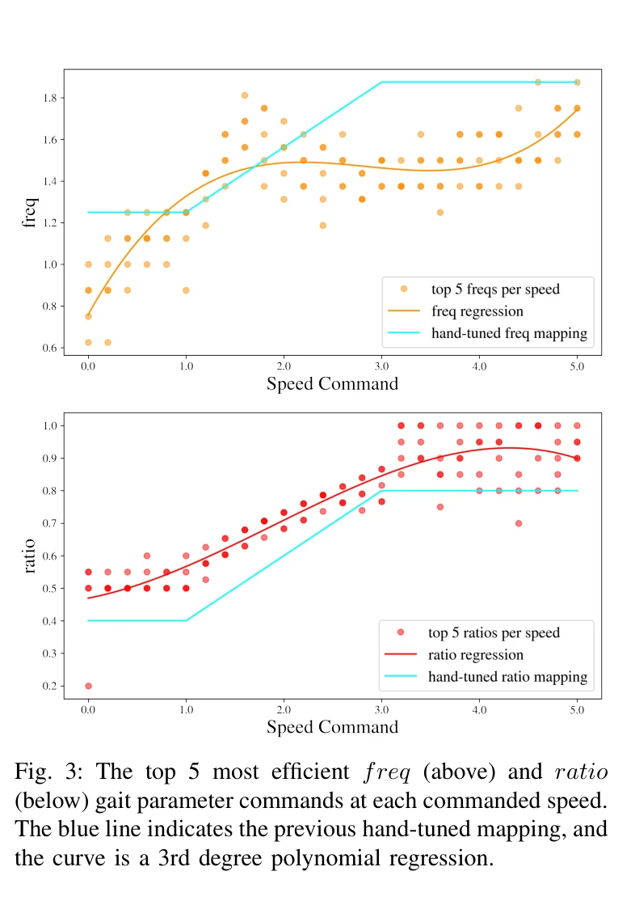
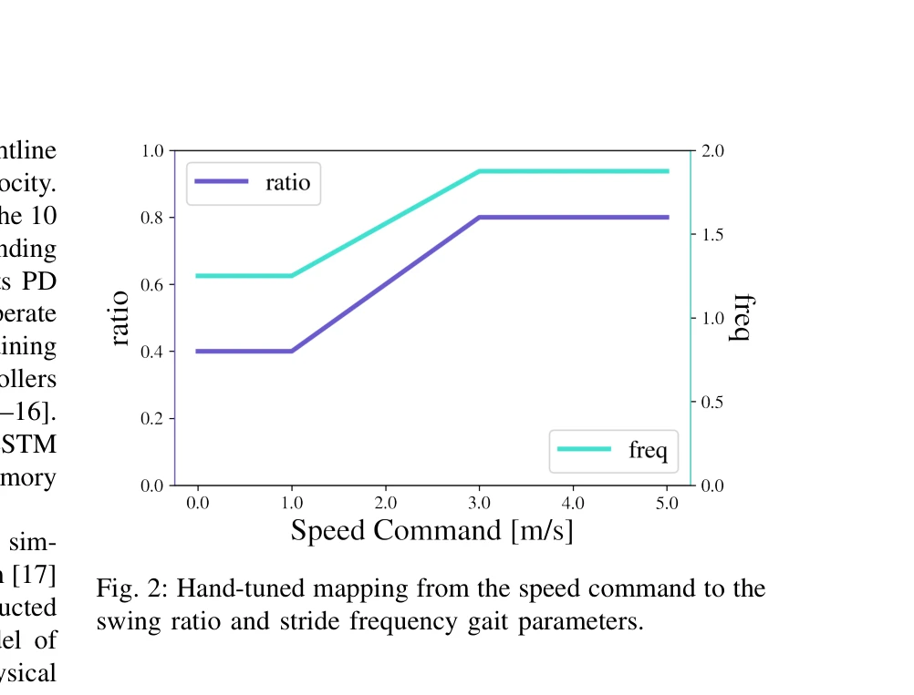

# Optimizing Bipedal Locomotion for The 100m Dash With Comparison to Human Running

> **저자**: Devin Crowley, Jeremy Dao, Helei Duan, Kevin Green, Jonathan Hurst, Alan Fern | **날짜**: 2025-08-05 | **URL**: [https://arxiv.org/abs/2508.03070](https://arxiv.org/abs/2508.03070)

---

## Essence

*Fig. 3: The top 5 most efficient freq (above) and ratio*

이 논문은 이족 로봇 Cassie의 고속 주행 보행을 위해 보행 매개변수(stride frequency, swing ratio)를 체계적으로 최적화하고, 그 결과를 인간의 주행 역학과 비교하며, 최종적으로 100m 대시 기네스 월드레코드를 달성한 완전한 컨트롤러를 제시한다.

## Motivation

- **Known**: Sim-to-real RL을 이용한 이족 보행 학습이 효과적이며, 선행 연구에서는 고정된 보행 매개변수나 손으로 튜닝한 매핑을 사용했다. 인간의 주행 역학은 사족동물 대비 효율적으로 알려져 있다.
- **Gap**: 이족 로봇의 고속 주행을 위해 속도에 따라 동적으로 조절되는 보행 매개변수의 최적화 방법이 부재했으며, 로봇 보행과 인간 주행 역학의 체계적 비교 연구가 미흡했다.
- **Why**: 보행 매개변수의 원리 있는 최적화는 이족 로봇이 높은 속도에서 안정적이고 효율적으로 달릴 수 있게 하며, 이는 실제 로봇 응용으로의 확장 가능성을 보여주는 것이 중요하다.
- **Approach**: PPO 기반 sim-to-real RL을 통해 광범위한 보행 매개변수 조합과 속도에서 정책을 훈련한 후, 시뮬레이션에서 에너지 효율 기반 점수 메트릭으로 각 속도에서 최적의 매개변수를 선택하고, 이를 완전한 100m 대시 컨트롤러에 통합한다.

## Achievement

*Fig. 3: The top 5 most efficient freq (above) and ratio*

- **보행 매개변수 최적화**: 손으로 튜닝한 매핑과 질적으로 다른 속도-매개변수 곡선을 발견하여, 특히 중간 속도(2-4 m/s)에서 더 낮은 stride frequency가 효율적임을 보임
- **인간-로봇 보행 비교**: 형태학적 차이에도 불구하고 Cassie의 최적화된 보행 역학이 광범위한 속도에서 인간 주행의 핵심 특성과 유사함을 입증
- **기네스 월드레코드 달성**: 최적화된 보행을 통합한 컨트롤러로 이족 로봇 100m 대시 기록 수립
- **완전한 100m 대시 컨트롤러**: 정지 상태에서의 시작, 고속 주행, 안정적 정지를 포함한 실제 규칙을 만족하는 컨트롤러 개발

## How

*Fig. 2: Hand-tuned mapping from the speed command to the*

- MuJoCo 물리 엔진과 dynamics randomization을 사용한 sim-to-real PPO 훈련으로 35차원 상태(관절 위치/속도, 골반 방향), clock signal, 보행 매개변수, 목표 속도를 입력으로 받아 10개 액추에이터 제어
- 0-5 m/s 속도 범위에서 hand-tuned 매핑의 ±0.2(ratio), ±0.625(freq) 오프셋 내 균등분포에서 모든 매개변수 조합으로 정책 훈련
- 각 속도에서 100 policy step 동안 수집한 궤적에 대해 속도 오차, Cost of Transport, 토크 비용, 모터 속도의 4가지 비용을 가중 결합하여 각 매개변수 조합 평가
- 상위 5개 효율적인 매개변수 조합의 추이를 3차 다항식 회귀로 분석하여 속도별 최적 매개변수 곡선 도출
- 최적화된 보행을 LSTM 기반 고수준 컨트롤러에 통합하고 실제 로봇 하드웨어에 배포

## Originality

- **체계적 매개변수 탐색**: 선행 연구의 고정값이나 임의 손-튜닝 대신 광범위한 매개변수 공간을 원리적으로 탐색하는 첫 시도
- **이족 로봇 고속 주행**: 기존 2.0 m/s 수준을 넘어 5 m/s 이상의 고속 주행을 달성한 첫 사례
- **정량적 인간-로봇 비교**: 기존 생체역학 문헌을 바탕으로 로봇과 인간의 주행 역학을 정량적으로 비교한 첫 체계적 연구
- **실제 기록 달성**: 이론적 기여를 넘어 기네스 월드레코드라는 구체적 실세계 성과로 검증

## Limitation & Further Study

- 직선 주행만 대상으로 하며, 회전이나 불규칙한 지형 등 복잡한 환경에서의 보행 최적화는 미다룸
- 점수 메트릭이 효율성 3개 항목 vs 속도 충실도 1개 항목으로 비균형적이어서 속도 추적 성능이 제약될 수 있음
- 시뮬레이션 기반 최적화이므로 sim-to-real gap으로 인한 하드웨어 성능 저하 가능성 존재
- Cassie의 특정 형태에 최적화된 것으로 다른 이족 로봇 플랫폼으로의 일반화 가능성 불명확
- 후속 연구로 동적 환경, 불규칙 지형, 방향 변경을 포함한 보행 최적화 및 다양한 로봇 형태에 대한 확장 필요

## Evaluation

- Novelty: 4/5
- Technical Soundness: 3/5
- Significance: 4/5
- Clarity: 4/5
- Overall: 4/5

**총평**: 이 논문은 이족 로봇의 고속 주행을 위한 보행 매개변수의 첫 체계적 최적화를 제시하고, 인간 주행 역학과의 흥미로운 비교를 통해 이론적 깊이를 제공하며, 기네스 월드레코드 달성으로 실질적 임팩트를 입증한 우수한 연구이다.
