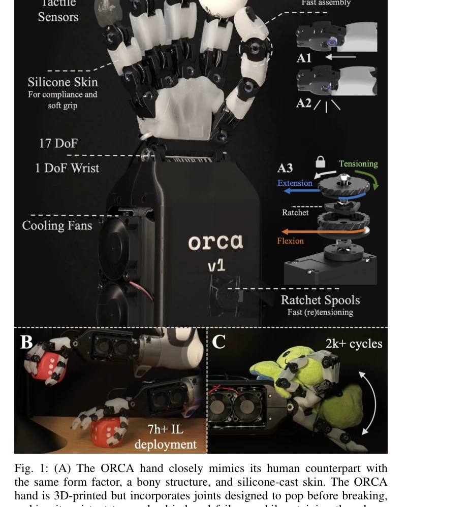
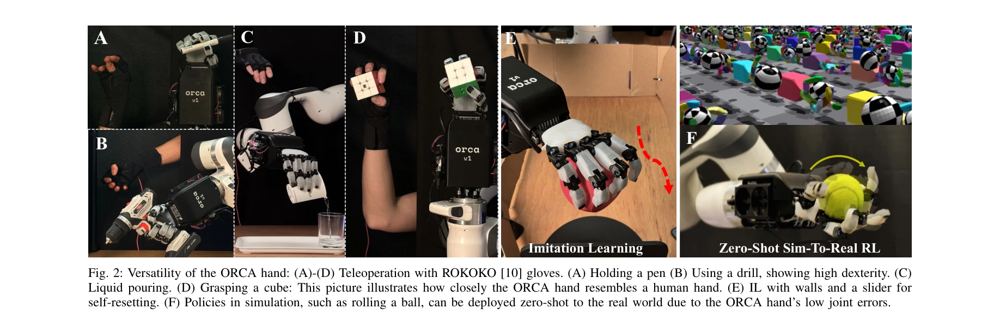
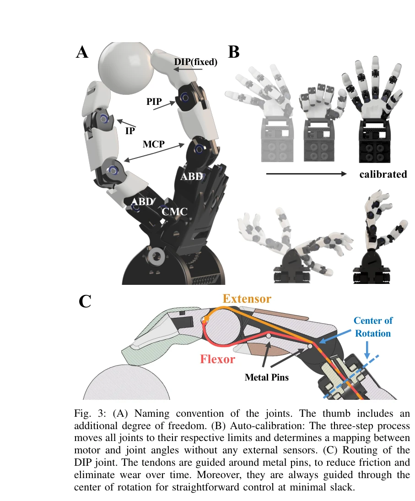

# ORCA: An Open-Source, Reliable, Cost-Effective, Anthropomorphic Robotic Hand for Uninterrupted Dexterous Task Learning

> **저자**: Clemens C. Christoph, Maximilian Eberlein, Filippos Katsimalis, Arturo Roberti, Aristotelis Sympetheros, Michel R. Vogt, Davide Liconti, Chenyu Yang, Barnabas Gavin Cangan, Ronan J. Hinchet, Robert K. Katzschmann | **날짜**: 2025-04-05 | **URL**: [https://arxiv.org/abs/2504.04259](https://arxiv.org/abs/2504.04259)

---

## Essence

*Fig. 1: (A) The ORCA hand closely mimics its human counterpart with*

ORCA는 2,000 CHF 미만의 재료비로 8시간 내에 조립 가능한 오픈소스 tendon-driven 인간형 로봇 손이며, popping joints와 자동 캘리브레이션 등의 설계로 높은 신뢰성과 정확도를 달성한다.

## Motivation

- **Known**: 인간형 로봇 손은 일반 로봇에 필요하지만, 기존의 고가 손(Shadow Hand 100,000+ CHF)이나 조립이 어려운 오픈소스 손(InMoov, DexHand)들은 실무 적용에 제약이 있다.
- **Gap**: 조립 용이성, 비용 효율성, 신뢰성을 모두 만족하면서 인간 수준의 민첩성을 제공하는 tendon-driven 로봇 손이 부족하다.
- **Why**: 접근 가능한 고성능 로봇 손은 manipulation 연구의 하드웨어 병목을 해결하고, 인간 손 상호작용 데이터셋을 활용 가능하게 하며, 더 넓은 연구 커뮤니티의 참여를 촉진한다.
- **Approach**: 3D-printable tendon-driven 설계를 기반으로 popping pin joints, auto-calibration, 마찰 감소 tendon routing, 래칫 스풀 시스템 등의 혁신 기능을 통합하여 복잡성을 최소화하면서 신뢰성을 극대화한다.

## Achievement

*Fig. 2: Versatility of the ORCA hand: (A)-(D) Teleoperation with ROKOKO [10] gloves. (A) Holding a pen (B) Using a drill*

1. **저비용 고성능 플랫폼**: 2,000 CHF 미만의 재료비로 17-DoF 인간형 로봇 손을 구현하고 8시간 내 단독 조립 가능
2. **높은 내구성**: 10,000회 이상의 연속 작동 사이클(약 20시간) 동안 하드웨어 고장 없음을 실증
3. **다양한 작업 성능**: 원격 조종, imitation learning, zero-shot sim-to-real RL을 포함한 광범위한 manipulation 작업 수행
4. **신뢰성과 정확도**: Auto-calibration을 통해 joint 오류를 최소화하고 높은 반복성 달성
5. **통합 촉각 센서**: 완전 통합된 tactile sensor로 compact하고 모듈화된 솔루션 제공

## How

*Fig. 3: (A) Naming convention of the joints. The thumb includes an*

• Tendon-driven 액추에이션으로 작은 형태 인자와 낮은 finger 관성 구현
• Popping pin joint 설계: 과도한 방사형 및 축방향 부하 시 부러지는 대신 탈구되도록 하는 원형 호형 홈 사용
• Auto-calibration: 모터와 joint 각도 간의 매핑을 외부 센서 없이 자동 결정
• Tendon routing: 금속 핀과 Teflon 튜브를 통해 PLA와의 직접 접촉 회피하여 마찰 및 마모 감소
• 래칫 스풀 메커니즘: 분해 없이 수초 내 tendon 재장력 가능
• 인간 해부학 기반 설계: 인간 손과 유사한 joint 범위(RoM) 및 형태 인자 채택

## Originality

• Popping pin joint 설계의 혁신: rolling contact joint의 복잡성 없이 pinhole joint의 안정성과 ligament 기반 설계의 견고성을 결합
• Auto-calibration 기법: tendon 라우팅을 rotation 중심을 통과하도록 설계하여 외부 센서 없이 정확한 joint 매핑 자동화
• 래칫 기반 tendon 재장력 시스템: 부품 재조립 없이 빠른 유지보수 가능성 제공
• 오픈소스 기반 high-fidelity 시뮬레이션: zero-shot sim-to-real 성과로 설계 정확도 입증

## Limitation & Further Study

• 실험 기간이 20시간으로 제한되어 장기 내구성 검증 필요
• Tendon-driven 시스템의 고유한 마찰 및 슬랙 누적 문제에 대한 장기 추적 데이터 부족
• Sim-to-real transfer 성공이 특정 작업(공 굴리기)에 국한되며 더 복잡한 dexterous task로의 확장 검증 필요
• 촉각 센서 통합의 상세 성능 평가 및 closed-loop control 활용 사례 제한적
• 후속 연구에서 더 다양한 조작 작업에서의 learning curve 및 generalization 능력 평가 필요

## Evaluation

- Novelty: 4/5
- Technical Soundness: 3/5
- Significance: 4/5
- Clarity: 4/5
- Overall: 4/5

**총평**: ORCA는 tendon-driven 로봇 손의 조립 용이성과 신뢰성을 획기적으로 개선하여 dexterous manipulation 연구의 하드웨어 접근 장벽을 크게 낮춘 중요한 공헌이며, 오픈소스 공개를 통해 연구 커뮤니티의 광범위한 채택과 확장을 촉진할 것으로 기대된다.
