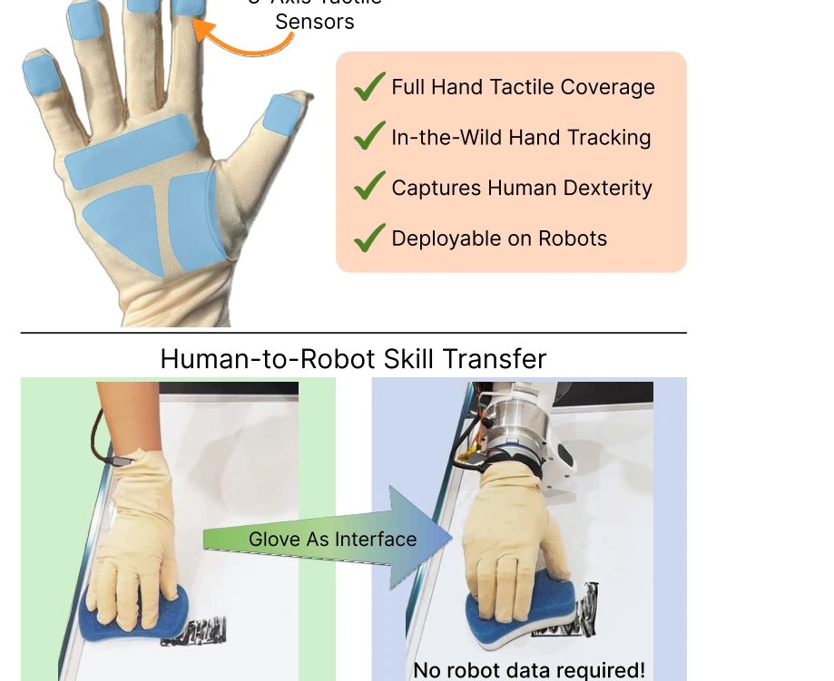
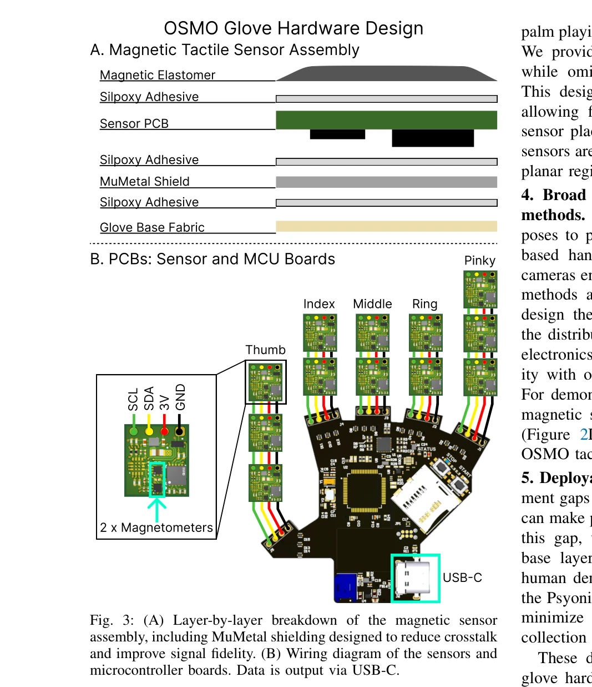

# OSMO: Open-Source Tactile Glove for Human-to-Robot Skill Transfer

> **저자**: Jessica Yin, Haozhi Qi, Youngsun Wi, Sayantan Kundu, Mike Lambeta, William Yang, Changhao Wang, Tingfan Wu, Jitendra Malik, Tess Hellebrekers | **날짜**: 2025-12-09 | **URL**: [https://arxiv.org/abs/2512.08920](https://arxiv.org/abs/2512.08920)

---

## Essence

*Fig. 1: (A) The OSMO tactile glove for collecting in-the-wild*

OSMO는 인간의 촉각 데이터를 캡처하는 오픈소스 웨어러블 촉각 장갑으로, 촉각-시각 embodiment 격차를 최소화하여 인간 시연만으로 로봇 접촉 조작 정책을 학습할 수 있게 한다.

## Motivation

- **Known**: 로봇 정책 학습을 위해 인간 비디오 시연이 광범위하게 활용되고 있으나, 영상만으로는 접촉 조작에 필수적인 힘 정보를 캡처할 수 없다. 로봇 손가락에 센서를 부착하는 방식이나 exoskeleton 장갑이 연구되었으나 유연성이나 센서 종류에 제약이 있었다.
- **Gap**: 기존 웨어러블 촉각 센서는 normal force만 측정하거나, shear force와 normal force 모두를 측정할 수 있더라도 인간의 손가락 자유도를 제약하며, 다양한 로봇 핸드와 호환되는 통합 플랫폼이 부재했다.
- **Why**: 접촉 압력 유지가 필요한 작업(예: 닦기)은 시각만으로는 실패 모드를 제거할 수 없으며, 촉각 정보를 직접 전달함으로써 로봇이 인간 수준의 손재주를 달성할 수 있다.
- **Approach**: 인간과 로봇 모두에 동일한 OSMO 장갑을 장착하여 촉각-시각 embodiment 격차를 최소화하고, 12개의 3축 magnetic tactile sensor를 손가락과 손바닥에 분산 배치하여 인간 시연 데이터를 수집한 후 이를 로봇 정책 학습에 직접 활용한다.

## Achievement

*Fig. 1: (A) The OSMO tactile glove for collecting in-the-wild*

- **오픈소스 촉각 장갑 개발**: 인간의 손가락 자유도를 제약하지 않으면서 12개의 3축 센서로 shear와 normal force를 모두 측정할 수 있는 얇고 착용 가능한 장갑 설계 및 제작
- **다중 hand-tracking 호환성**: Aria Gen 2, Quest 3, Apple Vision Pro, Manus glove 등 다양한 hand-tracking 시스템과 seamless하게 통합되어 in-the-wild 데이터 수집 가능
- **로봇 정책 학습**: 인간 시연 데이터만으로 학습한 tactile-aware 정책이 닦기 작업에서 72% 성공률을 달성하며 vision-only baseline을 outperform
- **완전 공개**: 하드웨어 설계, 펌웨어, 조립 설명서를 모두 공개하여 커뮤니티 채택 지원

## How

*Fig. 3: (A) Layer-by-layer breakdown of the magnetic sensor*

- Magnetic elastomer와 3축 magnetometer로 구성된 sensor 설계로 0.3 N - 80 N 범위의 force 측정
- MuMetal 차폐를 통한 crosstalk 감소 및 signal fidelity 향상
- 손가락 5개와 손바닥 영역에 분산 배치된 12개 taxel로 full-hand tactile coverage 제공
- Human kinematic retargeting 기법을 통해 인간 손 자세를 로봇 손 자세로 변환
- 수집된 인간 촉각 데이터를 특성 공학 및 정책 학습 파이프라인을 통해 로봇 정책 훈련에 활용
- Psyonic Ability Hand 로봇 손을 사용하여 접촉 유지가 필요한 닦기 작업 실험

## Originality

- **웨어러블 촉각 센서의 새로운 형태**: 기존 optical 또는 resistive sensor 대신 magnetic tactile sensor를 12개 분산 배치하여 shear와 normal force를 모두 측정하는 첫 번째 flexible platform
- **dense sensor array의 crosstalk 해결**: 단일 sensor-magnet 쌍의 rigid affixation에서 벗어나 다중 센서 배치 시 crosstalk를 체계적으로 완화하는 기술 제시
- **인간-로봇 embodiment 동일화**: 인간과 로봇에 동일한 센서 플랫폼을 적용함으로써 force 정보의 direct transfer 가능
- **in-the-wild 다중 hand-tracking 통합**: 한 장갑이 서로 다른 hand-tracking 시스템(egocentric, glove-based, vision-based)과 호환되도록 설계

## Limitation & Further Study

- **평가 범위의 제한**: 닦기 작업 단일 과제에 대해서만 검증되었으며, 다양한 contact-rich manipulation 작업으로의 일반화 가능성이 불명확함
- **로봇 플랫폼 단일성**: Psyonic Ability Hand에서만 실험되었으며, 다른 anthropomorphic 로봇 손으로의 확장성이 검증되지 않음
- **센서 해상도 및 범위**: 0.3 N - 80 N의 측정 범위와 12개 센서의 커버리지가 더 세밀한 manipulation이나 광범위한 contact 영역을 필요로 하는 작업에 충분한지 불명확
- **kinematic retargeting의 정확성**: 인간 손가락 길이 변이에 대한 적응성과 손가락 위치 정확성에 대한 검증 부족
- **후속 연구**: 다양한 manipulation 과제(assembly, surgery 등), 더 높은 해상도의 센서 배치, 실시간 haptic feedback 통합, 다양한 로봇 핸드 및 학습 알고리즘과의 호환성 검증 필요

## Evaluation

- Novelty: 4/5
- Technical Soundness: 4/5
- Significance: 4/5
- Clarity: 4/5
- Overall: 4/5

**총평**: OSMO는 웨어러블 촉각 센싱 분야에서 주목할 만한 하드웨어 기여를 하며, 인간-로봇 skill transfer에서 촉각 정보의 중요성을 실증적으로 입증했다. 완전 공개 설계와 다양한 hand-tracking 호환성은 커뮤니티 영향력을 높일 것으로 예상되나, 단일 작업 평가와 로봇 플랫폼 제한성이 일반화 가능성에 대한 의문을 남긴다.
