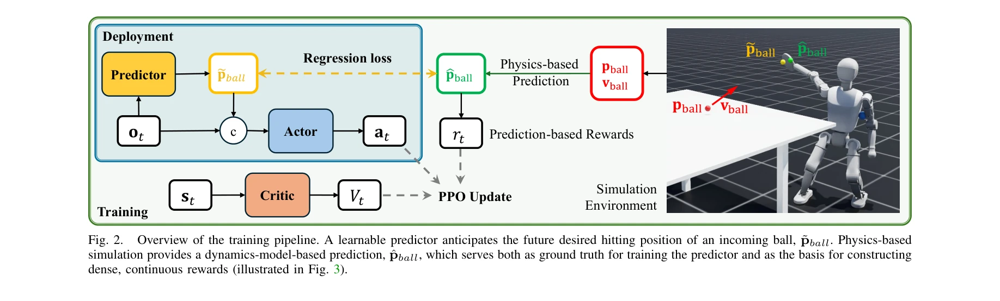
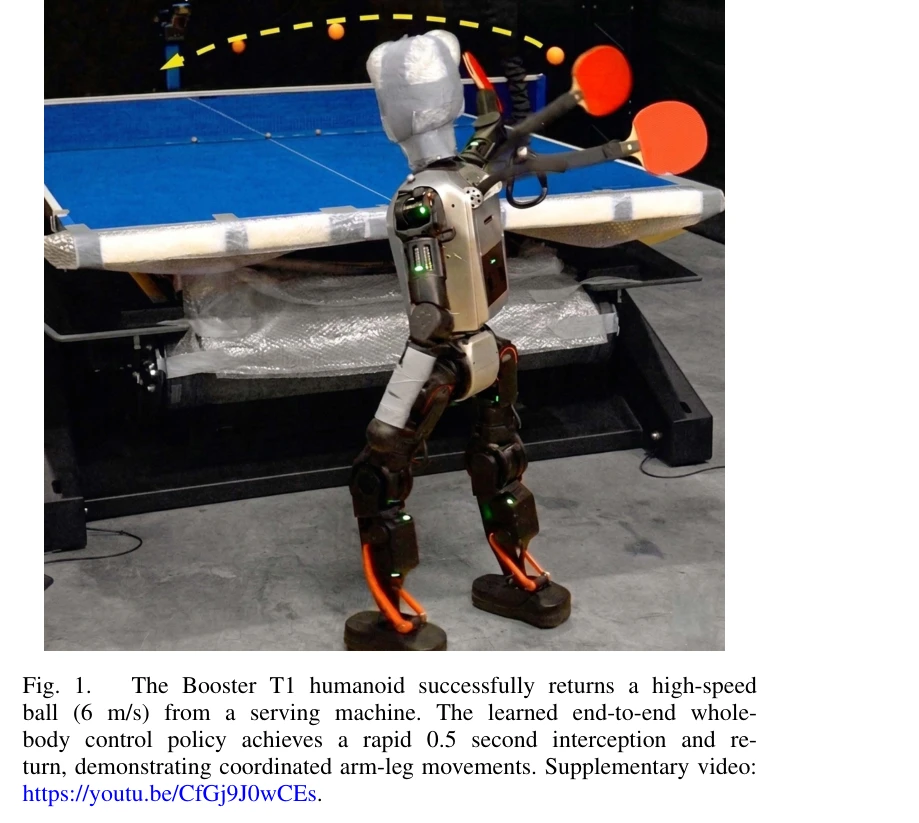

# PACE: Physics Augmentation for Coordinated End-to-end Reinforcement Learning toward Versatile Humanoid Table Tennis

> **저자**: Muqun Hu, Wenxi Chen, Wenjing Li, Falak Mandali, Zijian He, Renhong Zhang, Praveen Krisna, Katherine Christian, Leo Benaharon, Dizhi Ma, Karthik Ramani, Yan Gu | **날짜**: 2026-03-21 | **DOI**: [10.48550/arXiv.2509.21690](https://doi.org/10.48550/arXiv.2509.21690)

---

## Essence

*Fig. 2.*

본 논문은 휴머노이드 로봇의 탁구 경기를 위해 학습된 예측기와 물리 기반 보상을 결합한 end-to-end RL 프레임워크 PACE를 제안하여, 전신 협응 제어와 민첩한 풋워크를 동시에 달성한다.

## Motivation

- **Known**: 휴머노이드 로봇의 탁구 제어는 주로 가상 hitting plane 가정 하에 분석적 물리 기반 모델과 역 운동학을 조합하거나, Google DeepMind의 end-to-end RL이 6 DoF 로봇 팔에 적용되었으나 다리 있는 휴머노이드에 효과적으로 확장되지 못했다.
- **Gap**: 고차원 동작 공간과 로코모션 불안정성으로 인해 휴머노이드의 end-to-end RL 학습은 탐색 효율이 낮고, 희소한 볼 히팅 보상으로 인한 샘플 효율 문제가 미해결되어 있다.
- **Why**: 탁구는 고속 인지, 능동적 전신 운동, 엄격한 타이밍 제약을 요구하므로 휴머노이드 로봇의 실제 동적 작업 수행 능력을 검증하는 강력한 벤치마크이며, 이를 해결하면 범용 로봇 에이전트의 실용성이 크게 향상된다.
- **Approach**: 경량 학습된 예측기가 미래 볼 상태를 추정하여 정책의 관찰을 보강하고, 학습 중 physics-based 예측기가 정확한 미래 상태를 제공하여 밀집하고 정보량 많은 보상을 구성함으로써 효율적 탐색과 proactive decision-making을 가능하게 한다.

## Achievement

*Fig. 1.*

- **시뮬레이션 성능**: 다양한 serve 범위에서 hit rate ≥96%, success rate ≥92% 달성
- **하드웨어 배포**: 23개 revolute joint를 가진 Booster T1 휴머노이드에 zero-shot으로 배포되어 협응된 lateral 및 forward-backward footwork과 정확하고 빠른 리턴 생성
- **통합 설계**: 모듈식 분해나 계층적 planning 없이 로코모션과 암 스트라이크를 직접 조율하는 unified RL 프레임워크 최초 제시
- **오픈소스**: RL 학습 코드 공개로 재현성과 커뮤니티 접근성 향상

## How

*Fig. 2.*

- POMDP 공식화: 부분 관찰 가능한 마르코프 결정 과정으로 실시간 센서 노이즈를 고려한 문제 정의
- 학습된 예측기: 최근 볼 위치 정보로부터 미래 볼 상태를 경량으로 추정하여 정책에 제공
- Physics-based 예측: 시뮬레이션 물리 엔진으로 정확한 미래 궤적 예측 및 ground truth 제공
- Prediction-based 보상 설계: hit-guidance reward와 return-guidance reward를 결합하여 밀집 연속 보상 구성
- PPO 업데이트: 정책과 가치함수를 학습된 예측기와 함께 end-to-end로 최적화
- 저수준 제어: PD 컨트롤러로 생성된 reference joint trajectory 추적

## Originality

- 학습된 예측기와 physics-based 예측기의 이중 예측 전략으로 proactive 제어와 밀집 보상을 동시에 달성
- 휴머노이드 전신 제어(23 DoF)에 대한 end-to-end RL 적용으로 기존 arm-only 또는 계층적 방법의 한계 극복
- Virtual hitting plane 가정을 완전히 제거하여 진정한 적응형 footwork와 arm-leg 협응 실현
- 실시간 ball-position 관찰로부터 직접 whole-body reference motion 생성하는 unified 프레임워크

## Limitation & Further Study

- 시뮬레이션과 실제 로봇 간의 sim-to-real gap에 대한 상세한 분석 부족 (zero-shot 배포가 성공했으나 일반화 성능 미분석)
- Physics-based 예측기의 의존성: 정확한 물리 모델링에 크게 의존하며, 모델 오류에 대한 강건성 평가 부재
- 제한된 실험 범위: 단일 serving machine에서의 테스트이며, 실제 상대 선수와의 동적 경기 상황 미검증
- Footwork 전략의 제한성: 현재 lateral 및 forward-backward 움직임으로 제한되며, 회전 및 더 복잡한 발 움직임 미포함
- 후속 연구 방향: (1) 다양한 로봇 플랫폼 간 일반화, (2) 실시간 대인 탁구 경기 학습, (3) 적응형 전략 학습, (4) 부분 관찰 조건에서의 견고성 강화

## Evaluation

- Novelty: 4/5
- Technical Soundness: 4/5
- Significance: 4/5
- Clarity: 4/5
- Overall: 4/5

**총평**: 본 논문은 학습된 예측기와 physics-augmented 보상 설계를 통해 휴머노이드 탁구의 end-to-end RL을 성공적으로 구현한 강력한 작업이며, 시뮬레이션과 실제 하드웨어 모두에서 높은 성능을 입증하여 로봇 동적 제어의 실질적 진전을 보여준다.

## Related Papers

- 🔄 다른 접근: [[papers/2106_MorphoGuard_A_Morphology-Based_Whole-Body_Interactive_Motion/review]] — 둘 다 전신 접촉 제어를 다루지만, PACE는 물리 기반 보상과 RL의 결합에, MorphoGuard는 Material Point Method 기반 접촉 관리에 집중한다.
- 🏛 기반 연구: [[papers/1979_HITTER_A_HumanoId_Table_TEnnis_Robot_via_Hierarchical_Planni/review]] — HITTER의 계층적 계획 기반 휴머노이드 탁구 로봇 기술이 PACE의 탁구 경기를 위한 end-to-end RL 프레임워크 개발에 기반을 제공한다.
- 🔗 후속 연구: [[papers/2003_Humanoid_Whole-Body_Badminton_via_Multi-Stage_Reinforcement/review]] — Humanoid Whole-Body Badminton의 다단계 강화학습을 탁구라는 더 빠른 반응이 필요한 스포츠로 확장하여 물리 증강 학습을 적용한 연구이다.
- 🏛 기반 연구: [[papers/1855_Cost-Matching_Model_Predictive_Control_for_Efficient_Reinfor/review]] — Cost-matching model predictive control이 PACE의 learned predictor와 physics-based reward 결합에서 예측 기반 제어의 이론적 토대를 제공합니다.
- 🔗 후속 연구: [[papers/2047_Learning_Athletic_Humanoid_Tennis_Skills_from_Imperfect_Huma/review]] — Learning athletic tennis skills의 imperfect human data 활용이 PACE의 탁구 경기 학습을 인간 시연 데이터의 불완전성을 고려한 확장된 접근법입니다.
- 🏛 기반 연구: [[papers/1971_Heracles_Bridging_Precise_Tracking_and_Generative_Synthesis/review]] — physics augmentation을 통한 강화학습이 Heracles의 물리적으로 정확한 복구 동작 생성의 이론적 기반을 제공합니다.
- 🔄 다른 접근: [[papers/2106_MorphoGuard_A_Morphology-Based_Whole-Body_Interactive_Motion/review]] — 둘 다 전신 접촉 제어를 다루지만, MorphoGuard는 Material Point Method 기반 접촉 관리에, PACE는 물리 증강 RL에 중점을 둔다.
