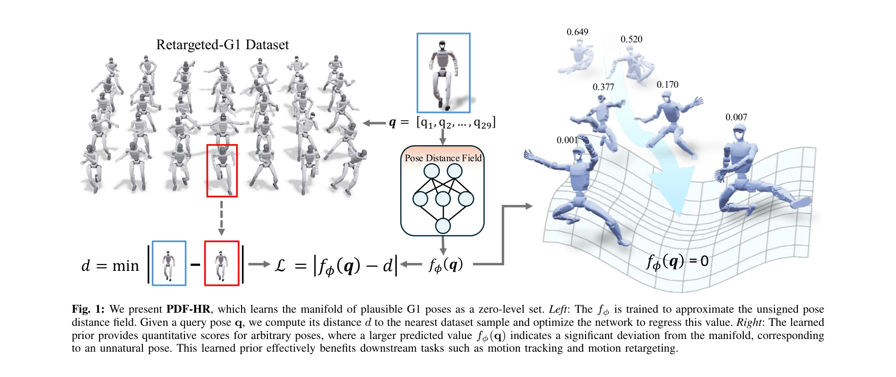

# PDF-HR: Pose Distance Fields for Humanoid Robots

> **저자**: Yi Gu, Yukang Gao, Yangchen Zhou, Xingyu Chen, Yixiao Feng, Mingle Zhao, Yunyang Mo, Zhaorui Wang, Lixin Xu, Renjing Xu | **날짜**: 2026-02-04 | **DOI**: [10.48550/arXiv.2602.04851](https://doi.org/10.48550/arXiv.2602.04851)

---

## Essence

*Fig. 1: We present PDF-HR, which learns the manifold of plausible G1 poses as a zero-level set. Left: The fϕ is trained *

Humanoid 로봇을 위한 pose distance field인 PDF-HR을 제안하여, 학습된 로봇 포즈 분포를 연속 미분 가능한 manifold로 표현하고 포즈의 plausibility를 평가한다.

## Motivation

- **Known**: Human motion recovery 분야에서는 pose와 motion prior가 광범위하게 연구되어 왔으며, 최근 NRDF 및 NRMF 같은 implicit manifold representation 방식이 효과적으로 입증되었다. Physics-based imitation learning과 motion retargeting도 humanoid robotics에서 중요한 과제로 활발히 연구되고 있다.
- **Gap**: Humanoid 로봇에 적용 가능한 고품질의 일반적인 pose prior가 부족하며, 고가의 데이터 수집과 robot morphology의 다양성으로 인해 human motion prior를 직접 전이하기 어렵다. 기존 방식들은 task-specific 또는 controller-specific constraints에 의존하여 재사용성과 일반화성이 제한된다.
- **Why**: Humanoid 로봇의 motion generation은 joint limit, self-collision, contact feasibility, balance 등 복잡한 제약을 동시에 만족해야 하며, 작은 오류도 부자연스럽거나 불안정한 configuration으로 이어질 수 있으므로 robust한 pose prior가 필수적이다.
- **Approach**: MLP 기반의 lightweight prior로 임의의 로봇 포즈를 학습된 retargeted 포즈 corpus의 nearest pose까지의 거리로 매핑하는 continuous distance field를 학습한다. 이를 reward shaping, regularizer, 또는 standalone plausibility scorer로 다양한 pipeline에 plug-and-play 방식으로 통합할 수 있도록 설계했다.

## Achievement

- **PDF-HR 모델 제안**: Riemannian geometry와 product manifold 구조를 활용하여 SO(3) configuration space에서 continuous하고 differentiable한 pose distance field를 구현
- **Plug-and-play 통합 메커니즘**: Motion tracking (reward shaping term)과 motion retargeting (regularizer)을 포함한 diverse humanoid task에 재사용 가능한 prior 제공
- **광범위한 실험 검증**: Single-trajectory motion tracking, general motion tracking, style-based motion mimicry, motion retargeting 등 4가지 humanoid task에서 강력한 baseline을 일관되게 향상

## How

*Fig. 2: Visualization of joint orientation distributions of Sideflip at early*

- Retargeted robot pose의 대규모 corpus를 생성하여 pose space를 커버하면서 near-manifold samples를 강조하는 training distribution 설계
- Cross-validation을 통해 reliable positive samples를 선택하고, low-rank metric approximation과 Riemannian geometry를 활용하여 manifold 근처 및 원거리에서 모두 의미 있는 gradient 제공
- Pose distance를 RL tracking에서는 reward term으로, motion retargeting에서는 regularization objective로 통합
- MLP 기반의 compact model로 계산 효율성을 보장하고 기존 시스템에 쉽게 배포 가능하도록 설계

## Originality

- Human motion prior의 implicit manifold representation 패러다임을 humanoid robot에 처음으로 확장하여 robot morphology의 특수성을 반영
- Distance field 기반의 접근으로 full generative model 대신 pose plausibility scoring에 집중하여 sparse humanoid data 문제를 우회
- Riemannian gradient descent와 product manifold 구조를 활용한 기하학적으로 일관된 optimization 제공
- Task-agnostic하고 data collection 없이 재사용 가능한 modular prior 제공으로 generalization 향상

## Limitation & Further Study

- Retargeted robot pose corpus의 품질과 다양성에 크게 의존하며, corpus에 부족한 pose 영역에서는 prior의 효과 제한 가능
- Distance field의 training distribution 설계와 positive sample selection이 핵심이나 이 과정의 자동화 및 최적화 방법이 미흡할 수 있음
- 현재 pose prior만 다루므로 motion continuity나 dynamic feasibility를 직접 제약하지 못하며, 이를 위해서는 temporal extension 필요
- Real-world deployment 검증이 제한적이므로 sim-to-real transfer에서의 성능 저하 가능성과 극단적 out-of-distribution 상황에서의 robustness 추가 검증 필요

## Evaluation

- Novelty: 4/5
- Technical Soundness: 3/5
- Significance: 4/5
- Clarity: 4/5
- Overall: 4/5

**총평**: 이 논문은 humanoid robotics에 implicit manifold representation을 처음 적용하여 scarce data 문제를 효과적으로 해결하고, lightweight하면서도 재사용 가능한 pose prior를 제안한 점에서 높은 학술적 기여를 한다. 다양한 task에서 일관된 성능 향상을 보이며 실용적 가치도 우수하나, corpus 의존성과 temporal modeling의 미흡이 향후 개선 과제이다.
