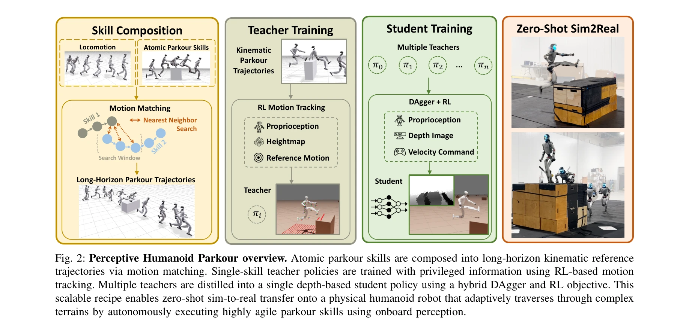
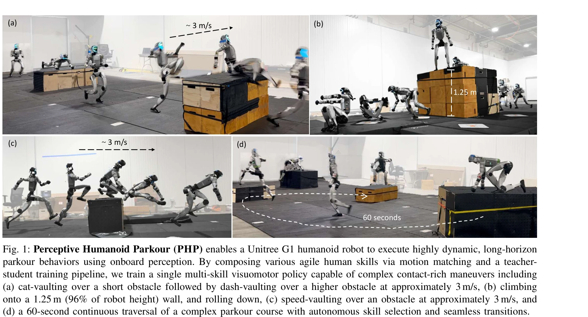

# Perceptive Humanoid Parkour: Chaining Dynamic Human Skills via Motion Matching

> **저자**: Zhen Wu, Xiaoyu Huang, Lujie Yang, Yuanhang Zhang, Koushil Sreenath, Xi Chen, Pieter Abbeel, Rocky Duan, Angjoo Kanazawa, Carmelo Sferrazza, Guanya Shi, C. Karen Liu | **날짜**: 2026-02-17 | **DOI**: [10.48550/arXiv.2602.15827](https://doi.org/10.48550/arXiv.2602.15827)

---

## Essence

*Fig. 2: Perceptive Humanoid Parkour overview. Atomic parkour skills are composed into long-horizon kinematic reference*

Motion matching을 통해 인간의 동작 데이터를 원자적 기술로 합성하고, DAgger와 RL을 결합한 teacher-student 파이프라인으로 단일 깊이 기반 정책으로 증류하여 휴머노이드 로봇이 복잡한 장애물 코스에서 자율적으로 장시간 파쿠르를 수행하도록 한다.

## Motivation

- **Known**: 휴머노이드 로봇의 안정적인 보행은 다양한 지형에서 구현되었지만, 높은 역학적 동작의 민첩성과 적응성을 포착하는 것과 환경에 대한 인식 기반의 장시간 기술 합성은 여전히 미해결 과제이다.
- **Gap**: 인간의 동작 데이터는 일반적으로 매우 희소하며(기술당 1-2개 데모), 기술 간 부드러운 전환과 장시간 과제에서의 적응적 변화 생성이 어렵고, 여러 동적 기술을 단일 정책으로 통합할 때 순수 DAgger 증류의 한계가 있다.
- **Why**: 파쿠르는 높은 차원의 제어 공간에서 동적 기술 실행, 시각 인식을 통한 환경 적응, 다양한 기술의 자동 선택과 전환이 필요한 복합적 도전이며, 이를 해결하면 불규칙한 지형에서 휴머노이드 로봇의 민첩성을 획기적으로 향상시킬 수 있다.
- **Approach**: Motion matching을 nearest-neighbor search 기반으로 원자적 기술들을 장시간 운동학 궤적으로 합성하고, privileged state로 training된 motion-tracking RL expert policies를 depth-conditioned student policy로 DAgger와 RL 목적함수의 결합을 통해 증류한다.

## Achievement

*Fig. 1: Perceptive Humanoid Parkour (PHP) enables a Unitree G1 humanoid robot to execute highly dynamic, long-horizon*

- **Motion matching 기반 기술 합성**: OmniRetarget으로 인간 동작을 재타겟팅한 원자적 기술들을 feature space에서의 nearest-neighbor search로 구성하여 다양한 접근 거리와 시간에 적응적인 장시간 궤적 생성
- **확장 가능한 증류 파이프라인**: DAgger와 RL을 결합한 hybrid 목적함수로 여러 expert policies를 단일 depth 기반 multi-skill 정책으로 효율적으로 증류
- **실제 로봇 구현**: Unitree G1 휴머노이드에서 1.25m(로봇 높이의 96%) 높이의 장애물 등반, ~3m/s 속도의 vault, 60초 연속 복합 파쿠르 코스 자율 수행 실증
- **Zero-shot sim-to-real transfer**: 시뮬레이션에서 학습한 depth 정책이 실제 로봇에서 추가 fine-tuning 없이 작동하며, 실시간 장애물 교란에 대한 closed-loop 적응 달성

## How

*Fig. 2: Perceptive Humanoid Parkour overview. Atomic parkour skills are composed into long-horizon kinematic reference*

- OmniRetarget을 사용하여 인간 모션 캡처 데이터를 로봇 호환 형태로 재타겟팅
- Motion matching 알고리즘으로 feature space에서 nearest-neighbor search를 수행하여 기술 간 부드러운 전환을 포함한 장시간 kinematic 궤적 생성
- 각 기술별로 motion-tracking RL expert policies를 proprioception과 heightmap으로 training하여 정확한 궤적 추종 학습
- DAgger를 통한 behavior cloning으로 초기 depth 기반 student policy 부트스트랩
- RL 보상 신호(task-level 성공도)를 추가하여 student policy 최적화 및 compounding error 감소
- 학습된 정책에서 depth image와 discrete 2D velocity command로부터 자동 기술 선택 및 실행 메커니즘 구현

## Originality

- 파쿠르 같은 고도로 동적인 휴머노이드 동작에 motion matching을 최초로 적용하여 희소한 인간 동작 데이터의 효율적 활용
- DAgger와 RL을 결합한 hybrid 증류 방식으로 pure imitation의 한계를 극복하고 높은 역학적 기술 학습 성능 향상
- 단일 depth 기반 정책으로 수십 개의 서로 다른 동적 파쿠르 기술을 통합하고 자동 기술 선택 및 부드러운 전환 실현
- 복잡한 장애물 과정에서의 실시간 폐루프 적응 및 zero-shot sim-to-real 전이 달성

## Limitation & Further Study

- Motion matching은 기존 인간 동작 데이터의 질과 다양성에 제한적이며, 캡처되지 않은 새로운 기술 개발 불가
- 현재 프레임워크는 discrete velocity command 기반으로 높은 수준의 자율 계획 기능(예: 복잡한 경로 계획)이 부족
- 깊이 센서만 사용하므로 폐쇄된 공간이나 악광 환경에서의 성능 제한 가능성
- 학습 과정에서 privileged state(heightmap) 정보가 필요하므로 현장 데이터 수집 시 정확한 환경 맵 구성의 어려움
- 후속 연구: 다양한 로봇 형태로의 일반화, 장시간 복합 계획 능력 통합, 다중 센서 기반 정책 확장 필요

## Evaluation

- Novelty: 4/5
- Technical Soundness: 3/5
- Significance: 4/5
- Clarity: 4/5
- Overall: 4/5

**총평**: 본 연구는 motion matching과 hybrid DAgger-RL 증류를 통해 희소한 인간 동작 데이터로부터 복잡한 파쿠르 기술을 효과적으로 합성 및 학습하여 휴머노이드 로봇의 동적 환경 적응 능력을 획기적으로 향상시켰으며, 실제 로봇에서의 강인한 구현과 zero-shot sim-to-real 전이는 높은 실용적 가치를 입증한다.

## Related Papers

- 🔗 후속 연구: [[papers/2133_PDF-HR_Pose_Distance_Fields_for_Humanoid_Robots/review]] — PDF-HR의 포즈 거리 필드를 활용한 plausibility 평가를 motion matching 기반 파쿠르 동작 체이닝에 적용하여 더 자연스러운 동작을 생성한다.
- 🔄 다른 접근: [[papers/1999_Humanoid_Parkour_Learning/review]] — 둘 다 휴머노이드 파쿠르를 다루지만, Perceptive Humanoid Parkour는 motion matching 기반 인간 기술 체이닝에, Humanoid Parkour Learning은 RL 기반 학습에 집중한다.
- 🏛 기반 연구: [[papers/1917_Example-based_Motion_Synthesis_via_Generative_Motion_Matchin/review]] — Example-based Motion Synthesis의 생성형 모션 매칭 기법이 Perceptive Humanoid Parkour의 인간 동작 데이터를 원자적 기술로 합성하는 핵심 방법론을 제공한다.
- 🔄 다른 접근: [[papers/1978_Hiking_in_the_Wild_A_Scalable_Perceptive_Parkour_Framework_f/review]] — Hiking in the Wild의 scalable parkour framework가 Perceptive Parkour의 depth-based single policy와 다른 다단계 접근법으로 복잡한 장애물 환경을 처리합니다.
- 🔗 후속 연구: [[papers/1861_Deep_Whole-body_Parkour/review]] — Deep whole-body parkour의 기본적인 parkour control이 Perceptive Parkour의 depth perception과 autonomous chaining으로 발전된 형태입니다.
- 🔗 후속 연구: [[papers/1613_PhysHSI_Towards_a_Real-World_Generalizable_and_Natural_Human/review]] — Perceptive Humanoid Parkour의 동적 환경 인식과 움직임 체이닝 기법이 PhysHSI의 환경 상호작용 능력을 확장할 수 있음
- 🔗 후속 연구: [[papers/1804_APEX_Learning_Adaptive_High-Platform_Traversal_for_Humanoid/review]] — Perceptive Humanoid Parkour의 동적 스킬 체이닝이 APEX의 6가지 플랫폼 기술을 더 복잡한 파쿠르 환경으로 확장합니다.
- 🔗 후속 연구: [[papers/1811_BeamDojo_Learning_Agile_Humanoid_Locomotion_on_Sparse_Footho/review]] — Perceptive Humanoid Parkour와 함께 복잡한 지형에서의 민첩한 이동을 위한 지각 기반 제어의 완성된 형태를 보여준다.
- 🏛 기반 연구: [[papers/1837_Climber_Force_and_Motion_Estimation_from_Video/review]] — perceptive humanoid parkour의 동적 기술 연결이 클라이머 운동 분석에서 얻은 인사이트를 휴머노이드 제어에 적용하는 기반을 마련한다
- 🧪 응용 사례: [[papers/1838_ClimbingCap_Multi-Modal_Dataset_and_Method_for_Rock_Climbing/review]] — ClimbingCap에서 구축한 등반 동작 데이터셋이 Perceptive Humanoid Parkour의 동적 인간 기술 체이닝에 실제 적용될 수 있는 도전적 동작 데이터를 제공한다.
- 🔄 다른 접근: [[papers/1861_Deep_Whole-body_Parkour/review]] — 휴머노이드 parkour를 깊이 지각 기반 whole-body와 perceptive skill chaining이라는 서로 다른 접근법으로 구현한다
- 🔗 후속 연구: [[papers/1939_Gait-Adaptive_Perceptive_Humanoid_Locomotion_with_Real-Time/review]] — Gait-Adaptive의 지각 기반 보행을 dynamic human skills chaining과 결합하면 더 복잡한 parkour 동작이 가능하다.
- 🔄 다른 접근: [[papers/1978_Hiking_in_the_Wild_A_Scalable_Perceptive_Parkour_Framework_f/review]] — 지형 적응 이동을 이 논문은 end-to-end RL로, Perceptive Humanoid Parkour는 동적 스킬 체이닝으로 접근한다.
- 🔗 후속 연구: [[papers/1999_Humanoid_Parkour_Learning/review]] — 시각 기반 파쿠르 학습이 지각 기반 동적 인간 기술 연결로 확장될 수 있다.
- 🔗 후속 연구: [[papers/2080_Let_Humanoids_Hike_Integrative_Skill_Development_on_Complex/review]] — 동적 인간 스킬 연결을 통한 지각적 휴머노이드 파쿠르의 확장된 접근법을 보여준다.
- 🔄 다른 접근: [[papers/2162_TTT-Parkour_Rapid_Test-Time_Training_for_Perceptive_Robot_Pa/review]] — TTT-Parkour는 RGB-D 기반 빠른 적응을 제안하고 Perceptive Humanoid Parkour는 동적 인간 스킬 연결을 통한 서로 다른 파쿠어 접근법입니다.
- 🏛 기반 연구: [[papers/2133_PDF-HR_Pose_Distance_Fields_for_Humanoid_Robots/review]] — PDF-HR의 pose distance field를 통한 포즈 plausibility 평가가 Perceptive Humanoid Parkour의 motion matching 기반 동작 합성에 품질 평가 기준을 제공한다.
