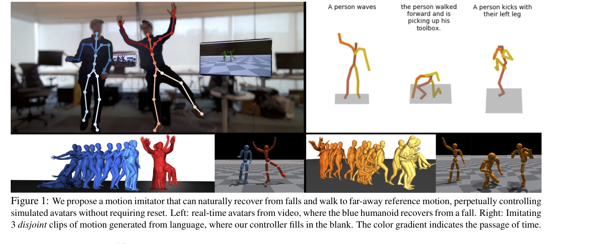
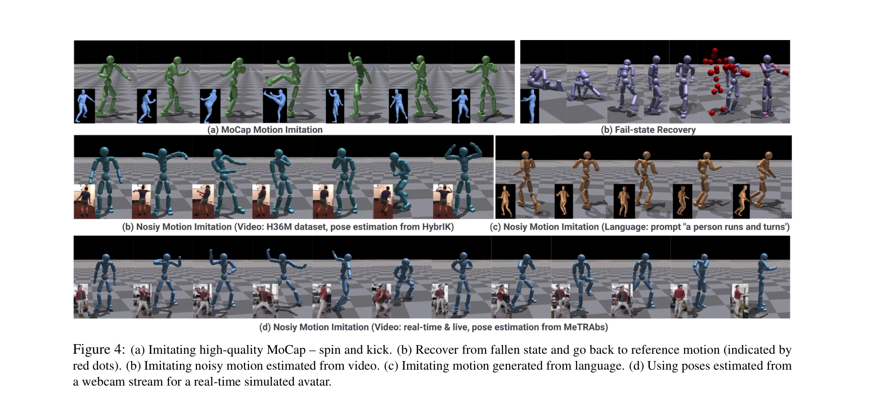
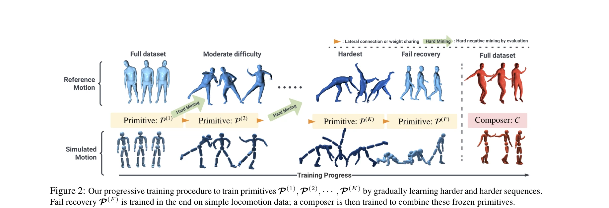

# Perpetual Humanoid Control for Real-time Simulated Avatars

> **저자**: Zhengyi Luo, Jinkun Cao, Alexander Winkler, Kris Kitani, Weipeng Xu | **날짜**: 2023-05-10 | **URL**: [https://arxiv.org/abs/2305.06456](https://arxiv.org/abs/2305.06456)

---

## Essence

*Figure 1: We propose a motion imitator that can naturally recover from falls and walk to far-away reference motion, perp*

Physics 기반 humanoid controller인 Perpetual Humanoid Controller (PHC)는 noisy input과 unexpected falls에 강건하면서 10,000개의 motion clips을 학습할 수 있으며, 새로운 Progressive Multiplicative Control Policy (PMCP)를 통해 catastrophic forgetting 없이 대규모 motion database에서 학습 가능하다.

## Motivation

- **Known**: Physics 기반 motion imitation은 자연스러운 인간 동작을 생성하지만, 대규모 dataset 학습은 challenging하며 기존 방법들은 external stabilizing forces를 사용하거나 제한된 success rate를 가진다.
- **Gap**: 기존 방법들(예: UHC)은 residual force control을 사용하여 97% success rate를 달성하지만 physical realism을 손상시키고, noisy video input이나 fail-state recovery를 자연스럽게 처리하지 못한다.
- **Why**: Real-time video 기반 avatar control 시스템 구현을 위해 external force 없이 high-fidelity motion imitation과 robust fail-state recovery 능력이 필수적이다.
- **Approach**: Progressive Multiplicative Control Policy (PMCP)로 motion difficulty에 따라 점진적으로 network capacity를 할당하고, Adversarial Motion Prior (AMP)를 활용하여 fail-state recovery 학습 시에도 자연스러운 동작을 유지한다.

## Achievement

*Figure 4: (a) Imitating high-quality MoCap – spin and kick. (b) Recover from fallen state and go back to reference motio*

- **AMASS 98.9% Success Rate**: External force 없이 전체 AMASS dataset의 98.9%를 성공적으로 imitate
- **Catastrophic Forgetting 해결**: PMCP를 통해 easy motion을 학습할 때 harder motion 학습을 방해하지 않음
- **자연스러운 Fail-state Recovery**: 넘어진 상태에서 자연스럽게 일어나 reference motion으로 돌아가는 능력
- **Noisy Input 강건성**: Video 기반 pose estimator의 noisy output과 language 기반 motion generator 모두 지원
- **Position-only Input**: Joint rotation 정보 없이 position만으로 control 가능하여 실무 적용성 향상

## How

*Figure 2: Our progressive training procedure to train primitives P(1), P(2), · · · , P(K) by gradually learning harder a*

- Motion difficulty로 tasks를 정렬하고 쉬운 것부터 어려운 것으로 curriculum 구성
- PMCP로 새로운 subnetwork를 dynamically allocate하여 이전 학습된 weights는 frozen 상태로 유지
- Goal-conditioned RL framework에서 reference motion을 tracking하도록 학습
- Adversarial Motion Prior (AMP)로 recovery motion도 natural한 human motion distribution을 따르도록 학습
- Noisy video pose estimates에 대해 robustness를 높이기 위해 diverse perturbation 적용

## Originality

- External force 없이 AMASS dataset scale에서 98.9% success rate 달성하는 첫 시도
- PMCP라는 novel architecture로 catastrophic forgetting을 motion difficulty 관점에서 해결
- Motion imitation에서 natural fail-state recovery를 comprehensive하게 해결한 첫 방법
- Position-only input 기반 control로 vision system과의 통합을 단순화
- Live 30fps multi-person avatar demo로 실시간 applicability 입증

## Limitation & Further Study

- PMCP의 curriculum learning order가 motion difficulty 기반이므로 objective difficulty metric 정의 필요
- Fail-state recovery 학습 시 충분한 fall data 수집의 challenge
- Real-time avatar application에서 vision 기반 pose estimator의 accuracy가 여전히 limiting factor
- 각 new task나 새로운 motion category 추가 시 network expansion 필요로 장기적 scalability 고려 필요
- 후속연구: 더 효율적인 network expansion 방법, 다양한 환경/신체 형태에 대한 adaptation, interactive control 통합

## Evaluation

- Novelty: 4/5
- Technical Soundness: 3/5
- Significance: 4/5
- Clarity: 4/5
- Overall: 4/5

**총평**: 이 논문은 external force 제거와 PMCP라는 novel mechanism으로 physics-based motion imitation의 scalability 문제를 효과적으로 해결하며, natural fail-state recovery와 noisy input 강건성으로 실제 video 기반 avatar application에 처음으로 실용적인 solution을 제공한다.
