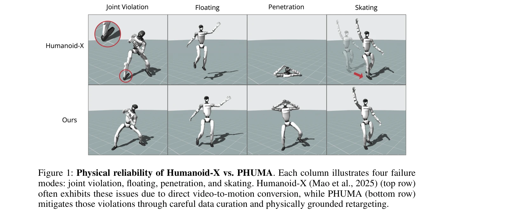
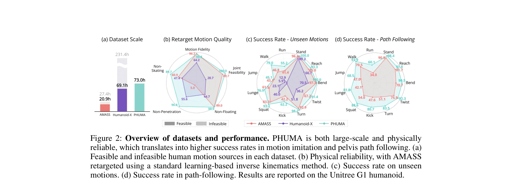

# PHUMA: Physically-Grounded Humanoid Locomotion Dataset

> **저자**: Kyungmin Lee, Sibeen Kim, Minho Park, Hyunseung Kim, Dongyoon Hwang, Hojoon Lee, Jaegul Choo | **날짜**: 2025-10-30 | **URL**: [https://arxiv.org/abs/2510.26236](https://arxiv.org/abs/2510.26236)

---

## Essence

*Figure 1: Physical reliability of Humanoid-X vs. PHUMA. Each column illustrates four failure*

PHUMA는 대규모 인터넷 비디오로부터 인간다운 보행을 위한 물리적으로 타당한 휴머노이드 모션 데이터셋을 구축하며, 데이터 큐레이션과 physics-constrained retargeting을 통해 floating, penetration, foot skating 등의 물리적 artifacts를 제거한다.

## Motivation

- **Known**: AMASS 같은 모션 캡처 데이터셋은 물리적으로 신뢰성 있으나 규모가 작고 다양성이 부족하며, Humanoid-X는 인터넷 비디오를 대규모로 활용하지만 심각한 물리적 artifacts를 포함한다.
- **Gap**: 기존 비디오 기반 모션 데이터셋들은 video-to-motion 변환 과정에서 발생하는 joint violations, floating, penetration 문제와 retargeting 단계의 물리적 부정확성으로 인한 foot skating을 효과적으로 해결하지 못한다.
- **Why**: 휴머노이드 로봇의 안정적이고 인간다운 보행을 위해서는 대규모이면서도 물리적으로 신뢰성 있는 모션 데이터가 필수적이며, 이는 motion imitation 기반의 reinforcement learning 정책 학습의 성능을 크게 좌우한다.
- **Approach**: Humanoid-X 데이터셋을 기반으로 두 단계 파이프라인을 적용한다: (1) 물리적으로 부정확한 모션을 필터링하는 physics-aware curation, (2) joint limits, ground contact, anti-skating constraints를 적용하는 PhySINK (Physically-grounded Shape-adaptive Inverse Kinematics)를 통한 물리 제약 retargeting.

## Achievement

*Figure 2: Overview of datasets and performance. PHUMA is both large-scale and physically*

- **데이터셋 규모와 품질의 균형**: AMASS보다 349.9% 더 많은 물리적으로 타당한 모션을 제공하면서 Humanoid-X의 규모를 유지하여 27.4시간에서 69.1시간으로 확장
- **물리적 신뢰성 향상**: joint feasibility, non-floating, non-penetration, non-skating 모든 지표에서 기존 데이터셋을 초과하며 특히 skating 제거에서 Humanoid-X 대비 5.5% 개선
- **모션 모방 성능**: 미학습 모션에 대해 AMASS 대비 1.2배, Humanoid-X 대비 2.1배 높은 성공률 달성
- **경로 추종 성능**: pelvis-only guidance 기반 경로 추종에서 AMASS 대비 1.4배, 수직 움직임에서 1.6배, 수평 움직임에서 2.1배 성공률 개선

## How

*Figure 3: Overview of the PHUMA pipeline. Our four-stage pipeline for motion imitation learning*

- Physics-aware motion curation: Humanoid-X에서 root jitter, 의자 앉기 등 외부 객체 상호작용이 포함된 약 70%의 부정확한 모션 필터링
- PhySINK 최적화: joint alignment fidelity를 유지하면서 soft joint limit loss, ground contact height loss, velocity-based anti-skating loss를 결합한 목적함수 구성
- Shape-adaptive inverse kinematics: 인간 신체 모델을 타겟 휴머노이드의 형태와 팔다리 비율에 적응시킨 후 global joint positions 정렬
- MaskedMimic 프레임워크 활용: 기존 RL 학습 기반 motion imitation 파이프라인에 PHUMA 데이터셋 적용
- 평가: Unitree G1 및 H1-2 휴머노이드 로봇에서 504개의 자기-녹화 테스트 비디오 (11가지 모션 타입)로 검증

## Originality

- 기존 SINK 방법들과 달리 joint limits, ground contact constraints, anti-skating loss를 결합하여 물리적으로 제약된 retargeting을 처음 체계적으로 제시
- 대규모 비디오 데이터의 물리적 artifacts를 식별하고 제거하는 physics-aware curation pipeline 개발
- Motion imitation 성능이 물리적 신뢰성과 강한 상관관계가 있음을 실증적으로 입증하는 벤치마킹
- 단순한 데이터셋 구축을 넘어 공개 리소스로 제공하여 휴머노이드 로봇 연구 커뮤니티에 기여

## Limitation & Further Study

- 필터링 과정에서 원본 Humanoid-X의 70%를 제거하므로 실제 활용 가능한 데이터 비율이 낮을 수 있음
- PhySINK의 다양한 loss term의 가중치 설정이 휴머노이드의 형태에 따라 달라질 가능성이 있으며 일반화 성능 검토 필요
- 평가가 Unitree G1, H1-2 등 제한된 로봇 모델에서만 수행되어 다른 휴머노이드 형태로의 전이 가능성 불명확
- **후속연구**: (1) 더 정교한 자동화된 curation 방법 개발으로 필터링 비율 개선, (2) 다양한 신체 형태의 휴머노이드에 대한 PhySINK 적응성 강화, (3) 실제 로봇 플랫폼에서의 in-the-wild 비디오 기반 모션 검증

## Evaluation

- Novelty: 4/5
- Technical Soundness: 3/5
- Significance: 4/5
- Clarity: 4/5
- Overall: 4/5

**총평**: PHUMA는 대규모 비디오 기반 모션 데이터의 물리적 신뢰성 문제를 체계적으로 해결하는 실용적인 데이터셋이며, physics-constrained retargeting 방법론과 실증적 성능 향상을 통해 휴머노이드 보행 학습 분야에 명확한 기여를 제시한다.

## Related Papers

- 🔄 다른 접근: [[papers/1666_Scaling_Large_Motion_Models_with_Million-Level_Human_Motions/review]] — 인터넷 비디오 대신 대규모 인간 모션 데이터를 직접 활용한 million-level 모션 학습 접근법이다.
- 🏛 기반 연구: [[papers/1933_FRAME_Floor-aligned_Representation_for_Avatar_Motion_from_Eg/review]] — 자기중심 영상에서 아바타 모션을 추출하는 기본 기술이 PHUMA의 비디오 기반 모션 추출에 활용된다.
- 🧪 응용 사례: [[papers/2089_ManiSkill-HAB_A_Benchmark_for_Low-Level_Manipulation_in_Home/review]] — 물리적으로 타당한 휴머노이드 모션 데이터가 가정 환경에서의 저수준 조작 벤치마크 구축에 필요한 기초 데이터를 제공한다.
- 🔄 다른 접근: [[papers/1996_Humanoid_Locomotion_as_Next_Token_Prediction/review]] — PHUMA는 인터넷 비디오에서 physics-constrained retargeting을 사용하는 반면 이 논문은 next token prediction 접근법을 사용함
- 🏛 기반 연구: [[papers/1826_Biomechanical_Comparisons_Reveal_Divergence_of_Human_and_Hum/review]] — 인간과 휴머노이드의 biomechanical 차이 분석이 PHUMA의 physics-constrained retargeting 방법론의 이론적 근거를 제공함
- 🏛 기반 연구: [[papers/2088_Make_Tracking_Easy_Neural_Motion_Retargeting_for_Humanoid_Wh/review]] — neural motion retargeting 기술이 PHUMA의 physics-constrained retargeting의 핵심 기술적 토대가 됨
- 🏛 기반 연구: [[papers/1934_From_Experts_to_a_Generalist_Toward_General_Whole-Body_Contr/review]] — From experts to generalist control의 일반화 접근법이 PHUMA의 대규모 인터넷 비디오 데이터로부터 일반적인 humanoid locomotion 학습의 기술적 토대를 제공합니다.
- 🔗 후속 연구: [[papers/2005_Humanoid_World_Models_Open_World_Foundation_Models_for_Human/review]] — Humanoid World Models의 open world foundation이 PHUMA의 physics-grounded 데이터셋을 더 포괄적인 world modeling으로 확장한 형태입니다.
- 🧪 응용 사례: [[papers/1893_ECHO_Edge-Cloud_Humanoid_Orchestration_for_Language-to-Motio/review]] — ECHO의 edge-cloud orchestration이 PHUMA의 대규모 데이터 처리와 physics-constrained retargeting을 분산 컴퓨팅 환경에 적용한 사례입니다.
- 🔗 후속 연구: [[papers/1816_Benchmarking_Humanoid_Imitation_Learning_with_Motion_Difficu/review]] — Motion Difficulty Score가 PHUMA 데이터셋의 물리 기반 휴머노이드 동작 평가에 확장되어 데이터셋 품질 평가에 활용될 수 있다
