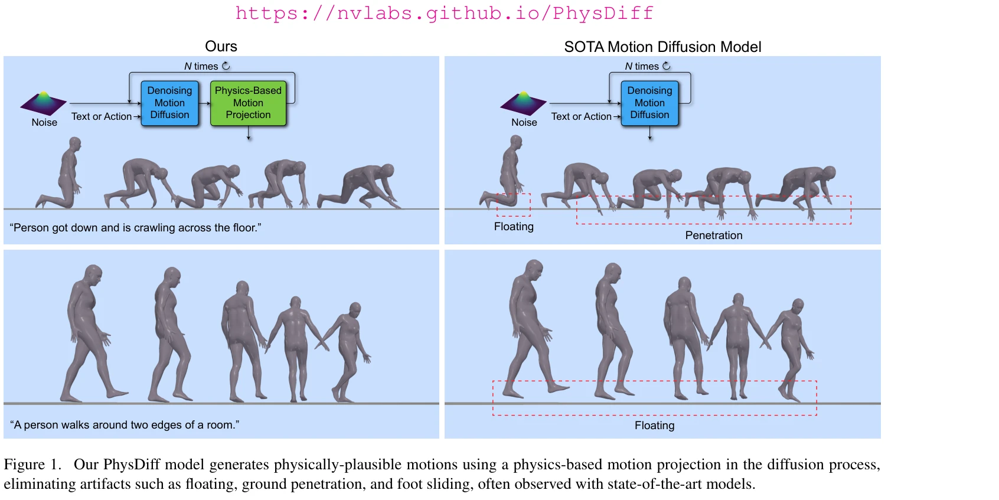
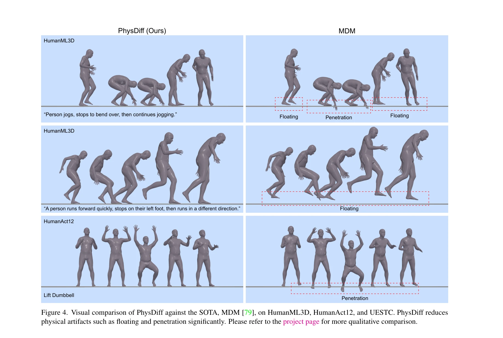
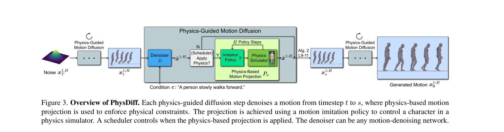

# PhysDiff: Physics-Guided Human Motion Diffusion Model

> **저자**: Ye Yuan, Jiaming Song, Umar Iqbal, Arash Vahdat, Jan Kautz | **날짜**: 2022-12-05 | **URL**: [https://arxiv.org/abs/2212.02500](https://arxiv.org/abs/2212.02500)

---

## Essence

*Figure 1. Our PhysDiff model generates physically-plausible motions using a physics-based motion projection in the diffu*

PhysDiff는 diffusion 과정에 물리 기반 motion projection 모듈을 통합하여 physically-plausible human motion을 생성하는 physics-guided motion diffusion 모델이다. 기존 motion diffusion 모델의 floating, foot sliding, ground penetration 같은 물리적 artifacts를 제거한다.

## Motivation

- **Known**: Denoising diffusion 모델은 복잡한 분포를 잘 모델링하여 image generation과 human motion generation에서 우수한 성능을 보인다. 그러나 기존 motion diffusion 모델은 물리 법칙을 명시적으로 고려하지 않아 physically-implausible motion을 생성한다.
- **Gap**: 기존 motion diffusion 모델은 diffusion 과정에서 물리 제약을 고려하지 않으며, 단순 post-processing으로는 너무 부자연스러운 motion을 보정할 수 없다. Physics-aware motion generation의 필요성이 있다.
- **Why**: Animation, gaming, virtual reality 등 실제 응용에서 physically-implausible motion은 사용자가 쉽게 감지하는 artifacts를 유발하여 품질을 심각하게 저하시킨다. Physics-aware generation은 현실적인 motion 활용을 가능하게 한다.
- **Approach**: Motion imitation을 통해 physics simulator에서 훈련한 policy를 motion projection 모듈로 사용하고, diffusion 과정의 각 스텝에서 denoised motion을 physically-plausible space로 projection한다. 이렇게 projected motion을 다음 diffusion 스텝의 가이드로 사용하여 iteratively physical plausibility를 개선한다.

## Achievement

*Figure 4. Visual comparison of PhysDiff against the SOTA, MDM [79], on HumanML3D, HumanAct12, and UESTC. PhysDiff reduce*

- **물리적 정확성 대폭 개선**: HumanML3D에서 physical error를 86% 이상 감소, HumanAct12에서 78% 이상 개선, UESTC에서 94% 개선
- **Motion quality 동시 개선**: HumanML3D에서 FID 20% 이상 개선하면서 물리 제약을 만족
- **SOTA 성능 달성**: MDM, MotionDiffuse 등 기존 SOTA motion diffusion 모델을 능가
- **Plug-and-play 유연성**: 서로 다른 kinematic diffusion 모델에 적용 가능한 구조
- **Physics-based projection scheduling 분석**: Projection 스텝 수에 따른 physical plausibility와 motion quality의 trade-off 관계 발견

## How

*Figure 3. Overview of PhysDiff. Each physics-guided diffusion step denoises a motion from timestep t to s, where physics*

- Large-scale motion capture 데이터로 motion imitation policy를 physics simulator에서 훈련
- 각 diffusion 스텝에서 denoised motion에 대해 trained motion imitation policy를 실행하여 physically-plausible motion으로 projection
- Projected motion을 다음 diffusion 스텝의 시작점으로 사용하여 iterative refinement 수행
- Projection을 적용할 diffusion 스텝을 선택하는 scheduling 전략 활용 (late steps에 더 효과적)
- Multiple projection steps를 사용하여 physical plausibility를 점진적으로 개선

## Originality

- Diffusion 과정 중간에 physics 제약을 반복적으로 적용하는 novel iterative approach로, 단순 post-processing과 구별됨
- Motion imitation policy를 물리 기반 projection 모듈로 재활용하는 creative solution
- Physics-based projection과 diffusion의 scheduling 및 trade-off 관계를 체계적으로 분석
- Plug-and-play 구조로 다양한 diffusion 모델 backbone에 적용 가능한 일반화된 프레임워크

## Limitation & Further Study

- Physics simulator의 motion imitation policy 훈련에 필요한 시간 비용과 computational overhead가 큼
- Non-differentiable physics simulator 특성으로 인해 모든 diffusion 스텝에 projection을 적용할 수 없음
- Motion quality와 physical plausibility 간의 trade-off로 인해 최적의 projection scheduling을 찾기 위한 추가 튜닝 필요
- **후속 연구**: 더 효율적인 physics constraint 적용 방법 탐색, differentiable physics simulator 활용, 다양한 motion type에 대한 robustness 강화

## Evaluation

- Novelty: 4/5
- Technical Soundness: 4/5
- Significance: 4/5
- Clarity: 4/5
- Overall: 4/5

**총평**: PhysDiff는 human motion generation에 physics 제약을 systematically 통합하여 physically-plausible motion 생성의 핵심 문제를 해결한 혁신적 연구이다. Iterative projection 전략과 철저한 실험 분석이 학계에 중요한 기여를 제공하며, 실제 animation/VR 응용의 현실화를 크게 앞당긴다.
