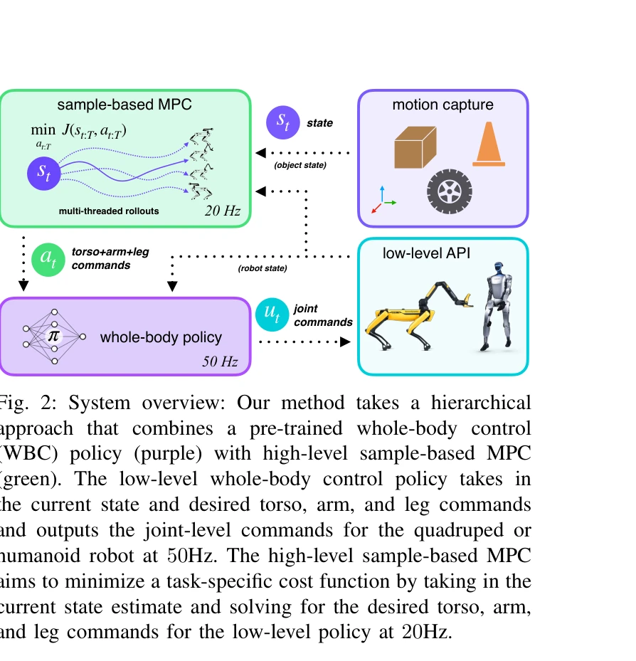
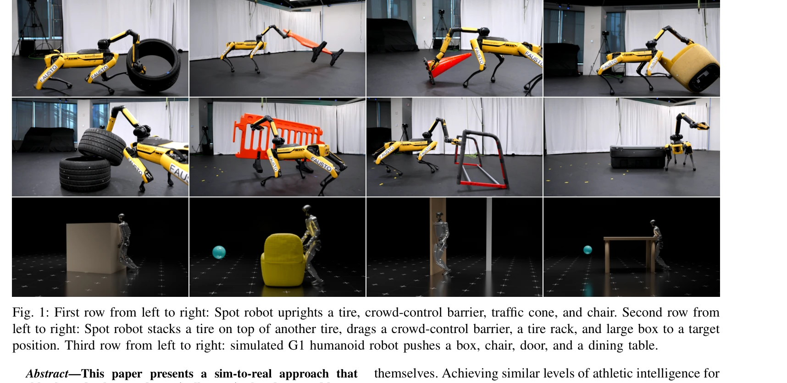

# Sumo: 동적이고 일반화 가능한 전신 이동-조작 제어

> **저자**:  | **날짜**: 2026-04-09 | **URL**: [https://arxiv.org/abs/2604.08508](https://arxiv.org/abs/2604.08508)

---

## Essence

*Fig. 2: System overview: Our method takes a hierarchical*

사전 학습된 전신 제어 정책과 테스트 시점 샘플 기반 계획을 결합하여 로봇이 동적으로 대형 중량 물체를 조작할 수 있게 하는 계층적 프레임워크 Sumo 제안. 재학습 없이 다양한 물체와 작업에 일반화 가능.

## Motivation

- **Known**: RL은 강건한 전신 제어를 학습할 수 있지만 작업별 보상 엔지니어링과 재학습이 필요하며, sample-based MPC는 훈련 무료이지만 고자유도 불안정 시스템에서 어려움. 최근 로봇 로코모션은 RL로 성공했으나 조작 일반화는 미흡.
- **Gap**: 로봇이 자율적으로 전신을 조정하여 동적으로 대형·중량 물체를 조작하면서도 새로운 물체와 작업에 재학습 없이 적응하는 방법이 부재. 접촉 풍부한 동역학에서 온라인 계획의 효과성이 미검증.
- **Why**: 인간과 동물처럼 로봇이 자신보다 크거나 무거운 물체를 조작하는 능력은 실세계 자율 로봇의 필수 기능이며, 이는 현장 배포 시 다양한 미지의 물체에 대응해야 하므로 중요.
- **Approach**: RL 기반의 사전학습 전신 제어 정책(저수준)을 고정하고, sample-based MPC(고수준)가 테스트 시점에 비용함수나 물체 모델만 변경하여 정책을 조향하는 계층적 구조. 이를 통해 RL의 안정성과 MPC의 유연성을 결합.

## Achievement

*Fig. 1: First row from left to right: Spot robot uprights a tire, crowd-control barrier, traffic cone, and chair. Second*

- **계층적 구조의 효과성**: 전신 정책의 명령 공간에서 계획함으로써 탐색 공간을 축소하고 동역학을 안정화하여 end-to-end RL 대비 유사 이상의 성능을 더 간단한 작업 목표로 달성
- **테스트 시점 일반화**: 물체 모델이나 비용함수만 변경하여 재학습 없이 새로운 물체·작업에 적응 가능(예: 타이어, 울타리, 의자 등 다양한 물체 조작)
- **강력한 실세계 성능**: Spot 사족보행 로봇으로 로봇의 명목 들기 용량을 초과하는 타이어 들기, 로봇보다 크고 높은 군중통제 울타리 끌기 등 8가지 실세계 시연
- **휴머노이드 확장성**: G1 휴머노이드의 문 열기, 테이블 푸싱 등 시뮬레이션에서 동일한 프레임워크로 일반화 가능함을 입증
- **공개 벤치마크**: 전신 조정이 필요한 로코조작 작업에 초점한 오픈소스 벤치마크 및 데이터셋 제공

## How

*Fig. 2: System overview: Our method takes a hierarchical*

- 저수준: 사전학습된 RL 정책 π가 현재 상태와 상체·팔·다리 명령을 받아 관절 수준 명령을 50Hz로 출력
- 고수준: sample-based MPC가 20Hz에서 작업별 비용함수 J를 최소화하여 상체·팔·다리 명령 생성
- 동역학 모델: 물체 접촉 포함 다체 동역학을 구성하되, 저수준 정책이 선형화 오차를 보상
- 다중 스레드 롤아웃: 병렬 하드웨어를 활용한 sample-based MPC 구현으로 실시간 계획 가능
- 상태 추정: 모션캡처 또는 센서로 로봇 상태와 물체 상태를 추정하여 MPC에 피드백
- 비용함수 설계: 작업(들기, 끌기, 밀기 등)마다 다른 비용항 정의 가능하며 테스트 시 유연 조정

## Originality

- RL과 sample-based MPC의 장점 결합 설계: 기존은 둘 중 하나만 사용했으나 계층적 결합으로 상호 약점 보완
- 저수준 정책의 안정화 효과: 동역학 불안정 시스템의 단일 슈팅 발산을 정책이 자동 안정화하는 메커니즘 제시
- 테스트 시점 일반화 정의 및 검증: 물체 모델/비용함수 변경만으로 재학습 없는 적응을 실증적으로 입증
- 대형·중량 물체 로코조작의 현실적 시연: 로봇 용량 초과 물체 조작 같은 도전적 과제를 실세계에서 달성
- 휴머노이드-사족 양쪽 플랫폼 통일 프레임워크: 같은 아키텍처로 형태 다른 로봇에 적용 가능성 시사

## Limitation & Further Study

- **상태 추정 의존**: 고정밀 모션캡처 시스템 사용으로 실제 시스템 배포 시 센서 요구사항 제약 가능
- **동역학 모델 정확성**: 물체 접촉·마찰 모델 오차가 누적되면 계획 정확도 저하 가능성
- **계산량**: 병렬 롤아웃 필요로 GPU 같은 가속 하드웨어 의존적
- **제한된 초기화**: 사전학습 정책의 훈련 분포 밖의 상황은 여전히 어려울 수 있음
- **후속연구 방향**: 온보드 센서 기반 상태 추정, 학습된 동역학 모델 통합, 온정책 정책 개선, 매니퓨레이터 동역학 세밀 튜닝 등

## Evaluation

- Novelty: 4/5
- Technical Soundness: 3/5
- Significance: 4/5
- Clarity: 4/5
- Overall: 4/5

**총평**: RL과 sample-based MPC의 계층적 결합으로 로봇의 동적 전신 조작 문제를 우아하게 해결하며, 테스트 시점 유연성과 재학습 없는 일반화를 동시에 달성한 강력한 접근. 실세계 시연과 공개 벤치마크 제공으로 로코조작 분야에 실질적 기여.
