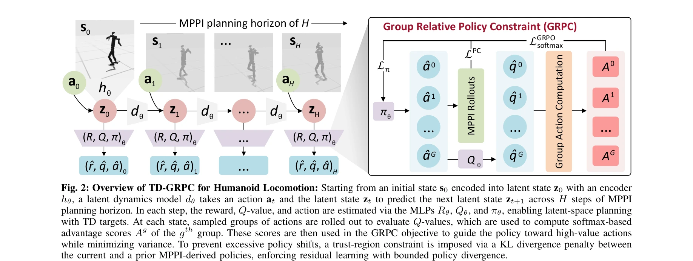
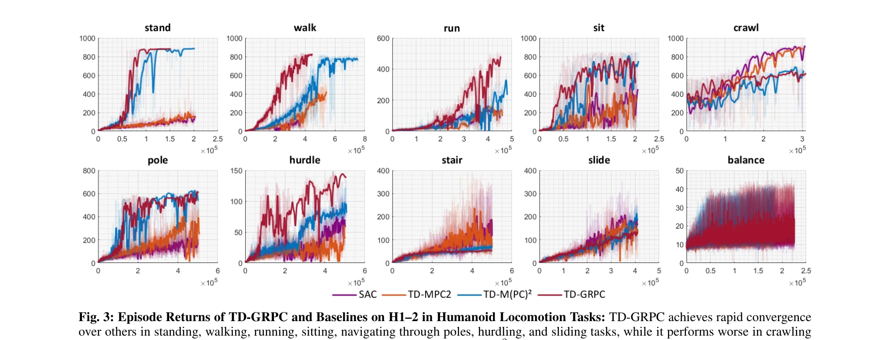

# TD-GRPC: Temporal Difference Learning with Group Relative Policy Constraint for Humanoid Locomotion

> **저자**: Khang Nguyen, Khai Nguyen, An T. Le, Jan Peters, Manfred Huber, Ngo Anh Vien, Minh Nhat Vu | **날짜**: 2025-05-19 | **URL**: [https://arxiv.org/abs/2505.13549](https://arxiv.org/abs/2505.13549)

---

## Essence

*Fig. 2: Overview of TD-GRPC for Humanoid Locomotion: Starting from an initial state s0 encoded into latent state z0 with*

본 논문은 Humanoid Locomotion을 위해 TD-MPC 프레임워크에 Group Relative Policy Optimization (GRPO)와 trust-region constraint를 통합한 TD-GRPC를 제안하여, off-policy 학습의 불안정성과 policy mismatch 문제를 해결한다.

## Motivation

- **Known**: TD-MPC와 TD-MPC2는 latent dynamics 모델과 value function을 결합하여 효율적인 planning을 가능하게 했으나, off-policy 업데이트로 인한 policy mismatch와 distributional shift 문제는 여전히 미해결 상태이다.
- **Gap**: 기존 TD-MPC 계열 방법들은 policy constraint를 명시적으로 적용하지 않아 aggressive policy 업데이트로 인한 불안정성이 발생하며, group-relative ranking을 통한 physical feasibility 검증이 부족하다.
- **Why**: Humanoid locomotion은 고차원 연속 제어, 불안정한 동역학, 복잡한 접촉 상호작용으로 인해 RL 알고리즘에 극도로 도전적이므로, 안정적이고 견고한 policy 학습이 critical하다.
- **Approach**: TD-MPC2 프레임워크에 GRPO를 통합하고 latent policy space에서 trust-region constraint (KL divergence 패널티)를 적용하여, planning 사전과 학습된 롤아웃 간의 일관성을 유지하면서 물리적 실현 가능성을 보존한다.

## Achievement

*Fig. 3: Episode Returns of TD-GRPC and Baselines on H1–2 in Humanoid Locomotion Tasks: TD-GRPC achieves rapid convergenc*

- **TD-GRPC 프레임워크 개발**: GRPO와 explicit trust-region constraint를 TD-MPC에 통합하여 off-policy MBRL의 안정성을 이론적, 알고리즘적으로 개선
- **Unitree H1-2 humanoid 검증**: 기본 보행부터 계단 오르기, 동적 움직임까지 8가지 locomotion task에서 improved stability, robustness, sample efficiency 달성
- **빠른 수렴**: 다른 baseline들 대비 더 빠른 convergence rate 달성

## How

*Fig. 2: Overview of TD-GRPC for Humanoid Locomotion: Starting from an initial state s0 encoded into latent state z0 with*

- Latent dynamics model dθ, reward model Rθ, Q-value function Qθ, policy πθ를 MPPI planning horizon H에서 joint training
- Group 단위로 action 샘플링 후 Q-value 평가를 통해 softmax 기반 advantage score Ag 계산
- GRPO objective를 통해 high-value action으로의 policy 유도와 variance 최소화
- 현재 policy와 prior 간 KL divergence 패널티를 통한 trust-region constraint 적용으로 excessive policy shift 방지
- Planner 자체 수정 없이 policy prior에만 constraint 적용으로 유연한 planning 유지

## Originality

- GRPO (주로 language model에 사용)를 continuous control MBRL 영역에 처음 적용하여 group-relative ranking의 이점 활용
- Latent policy space에서의 명시적 trust-region constraint를 통해 planning feasibility와 policy stability를 동시에 달성하는 novel 접근
- Planner를 수정하지 않으면서도 policy mismatch와 distributional shift를 완화하는 모듈식 설계

## Limitation & Further Study

- Simulation 결과만 제시되었으며, 실제 하드웨어 실험 (real robot H1-2)이 부재하여 sim-to-real transfer 성능 미검증
- Hyperparameter (GRPO 그룹 수, KL 페널티 계수 등) 선택에 대한 민감성 분석 부족
- 다른 고차원 locomotion 태스크 (쿼드러페드, bipedal variants) 또는 manipulation task로의 일반화 검증 미흡
- Computational cost가 낮다고 주장하지만, baseline들과의 정량적 런타임 비교 자료 부재
- Policy constraint의 이론적 수렴 보장이나 sample complexity 분석이 없음

## Evaluation

- Novelty: 4/5
- Technical Soundness: 3/5
- Significance: 4/5
- Clarity: 4/5
- Overall: 4/5

**총평**: 본 논문은 GRPO와 trust-region constraint를 통합한 TD-GRPC를 제안하여 humanoid locomotion의 off-policy 학습 안정성을 효과적으로 개선한 의미 있는 연구이나, 실제 로봇 검증과 이론적 분석 심화, 그리고 더 광범위한 task 평가가 필요하다.
