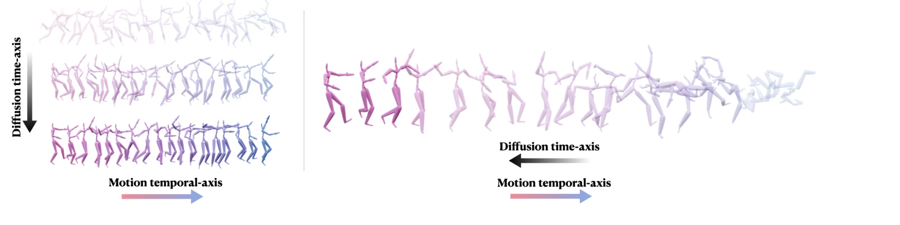
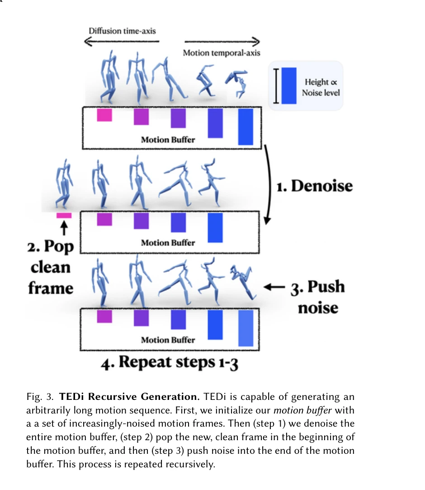
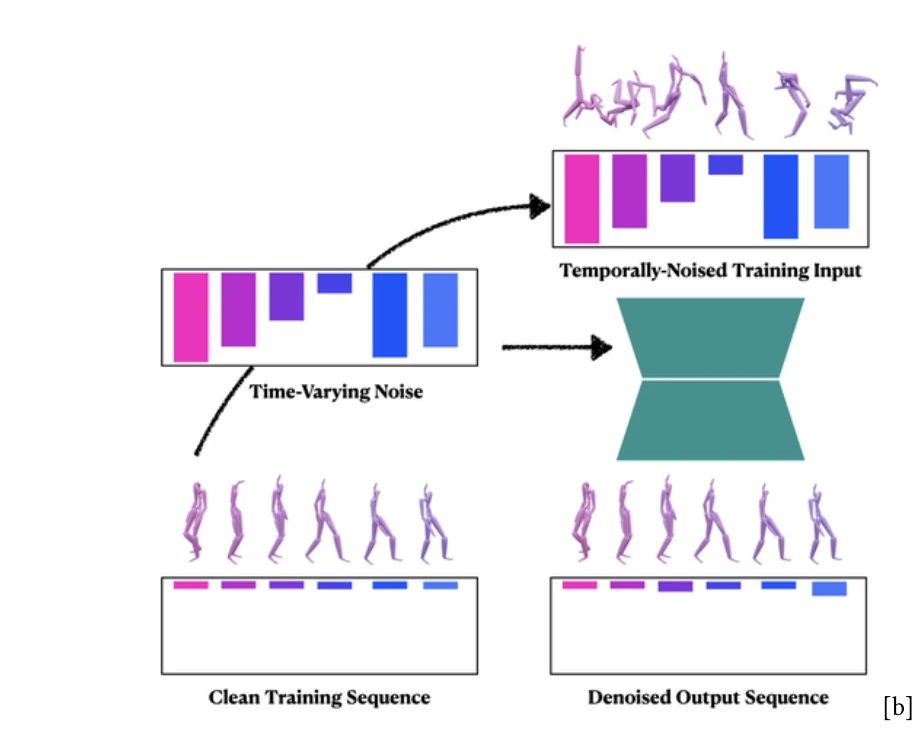

# TEDi: Temporally-Entangled Diffusion for Long-Term Motion Synthesis

> **저자**: Zihan Zhang, Richard Liu, Kfir Aberman, Rana Hanocka | **날짜**: 2023-07-27 | **URL**: [https://arxiv.org/abs/2307.15042](https://arxiv.org/abs/2307.15042)

---

## Essence

*Fig. 1. Inspired by the gradual nature of the diffusion process along a diffusion time-axis (left), our approach (right)*

TEDi는 Denoising Diffusion Probabilistic Models (DDPM)의 점진적 생성 개념을 모션 시퀀스의 시간축에 적용하여, 두 축을 얽혀 있게(entangle) 함으로써 임의 길이의 장기 모션 생성을 가능하게 한다. 시간에 따라 변하는 노이즈 레벨을 가진 모션 버퍼를 반복적으로 제거하는 자동회귀 메커니즘을 통해 연속적인 프레임 스트림을 생성한다.

## Motivation

- **Known**: DDPM은 이미지 생성에서 뛰어난 성능을 보였으며, 최근 Zhang et al., Kim et al., Tevet et al. 등에 의해 모션 생성으로 확장되었다. 그러나 기존 diffusion 기반 모션 모델들은 고정 길이 시퀀스만 생성하고 장기 생성 및 상호작용 제어가 불가능하다.
- **Gap**: 현존하는 diffusion 기반 모션 생성 방법들은 전체 모션을 이미지처럼 취급하여 고정 길이 시퀀스만 생성하며, 긴 시퀀스 생성을 위한 stitching 문제를 해결하지 못한다. 또한 diffusion 과정의 수백 번의 반복으로 인해 상호작용적 제어가 제한적이다.
- **Why**: 장기 모션 생성은 캐릭터 애니메이션, 모션 제어, HCI 등 실제 응용 분야에서 중요한 문제이며, 비반복적이고 자연스러운 장시간 시퀀스 생성 능력이 필수적이다. 또한 생성 과정 중 사용자 제어 및 계획 수립 능력이 필요하다.
- **Approach**: TEDi는 diffusion 시간축과 모션 시간축을 얽혀 있게 함으로써, 각 diffusion 단계에서 시간에 따라 변하는 노이즈 레벨을 가진 모션 버퍼를 점진적으로 제거한다. 모션 프라이머(primer)로 초기화된 버퍼에서 깨끗한 프레임을 앞에서 제거하고 노이즈 프레임을 뒤에 추가하는 방식으로 자동회귀적 생성을 수행한다.

## Achievement

*Fig. 3. TEDi Recursive Generation. TEDi is capable of generating an*

- **임의 길이 생성**: 자동회귀 메커니즘을 통해 고정 길이 제한 없이 임의로 긴 모션 시퀀스 생성 가능
- **Stitching 아티팩트 제거**: 연속적인 프레임 생성 방식으로 기존 모션 diffusion 모델의 stitching 문제 해결
- **대화형 제어**: 생성 과정 중 guiding motion을 주입하여 사용자가 모션 궤적을 직접 제어 및 계획 가능
- **다양성**: 동일한 초기화에서도 임의성으로 인해 다양한 모션 결과 생성
- **자연스러운 전환**: 모션 버퍼의 점진적 노이즈 감소로 자연스러운 모션 전환 및 계획적 조정 가능

## How

*Fig. 2. TEDi Training. We train our diffusion-based model to remove*

- **Training phase**: 깨끗한 모션 시퀀스에 시간에 따라 변하는 노이즈를 적용하여 supervised fashion으로 네트워크를 학습
- **모션 버퍼 구조**: 인접한 프레임들이 연속적인 노이즈 레벨을 가지도록 구성된 K개 프레임의 버퍼 유지
- **반복적 제거 과정**: 각 diffusion 단계에서 버퍼의 앞에서 깨끗한 프레임 제거 및 뒤에 새로운 노이즈 프레임 추가
- **프라이머 초기화**: 깨끗한 모션 frames를 증가하는 노이즈 레벨로 노이징하여 초기 버퍼 구성
- **조건부 생성**: guiding motion 주입으로 특정 모션 목표에 대한 예측 및 계획적 전환 유도
- **고정 diffusion 시간축**: Diffusion time-axis는 고정하고 모션의 temporal-axis만 진행시켜 안정성 확보

## Originality

- **Temporal-diffusion 얽힘**: Diffusion time-axis와 motion temporal-axis를 연결하는 혁신적 개념으로, 기존 parallel denoising과는 근본적으로 다른 접근법
- **자동회귀 diffusion**: 전통적 diffusion의 parallel 특성을 자동회귀 메커니즘과 결합한 최초의 시도
- **모션 버퍼 기반 설계**: 시간에 따라 변하는 노이즈 레벨을 명시적으로 모델링하는 구조적 혁신
- **맥락 윈도우 활용**: RNN의 메모리 소실 문제를 해결하기 위해 diffusion time-axis 크기의 명시적 컨텍스트 윈도우 사용
- **대화형 제어 메커니즘**: 생성 과정 중 현재 및 미래 프레임을 직접 조작할 수 있는 새로운 제어 패러다임

## Limitation & Further Study

- **계산 비용**: 실시간 생성을 위해서는 여전히 상당한 diffusion 단계 수가 필요하므로 인터랙티브 성능의 한계 가능
- **모션 프라이머 의존성**: 초기 모션 프라이머의 품질이 전체 생성 결과에 직접적 영향을 미칠 수 있음
- **모션 버퍼 크기**: 버퍼 크기 선택이 성능과 계산 효율성의 트레이드오프를 야기할 수 있음
- **평가 메트릭 부족**: 장기 모션 생성의 품질을 종합적으로 평가할 표준화된 메트릭 필요
- **후속 연구**: 조건부 생성(음악, 텍스트 기반)으로의 확장, 실시간 추론 최적화, 더 복잡한 모션 데이터셋 검증 필요

## Evaluation

- Novelty: 4/5
- Technical Soundness: 4/5
- Significance: 4/5
- Clarity: 4/5
- Overall: 4/5

**총평**: TEDi는 diffusion 모델의 시간축과 모션 시퀀스의 시간축을 창의적으로 얽혀 있게 함으로써 장기 모션 생성의 근본적인 문제를 우아하게 해결한 혁신적 작업이다. 임의 길이 생성, stitching 제거, 대화형 제어 등 기존 방법들의 한계를 동시에 극복하며, 명확한 설명과 견고한 기술적 기초로 높은 평가를 받을 만하다.

## Related Papers

- 🔄 다른 접근: [[papers/1930_Flexible_Motion_In-betweening_with_Diffusion_Models/review]] — 장기 모션 생성을 위해 TEDi는 시간축 얽힘을 사용하고 Flexible Motion In-betweening은 diffusion 모델로 중간 모션을 생성하는 서로 다른 접근법을 제시합니다.
- 🏛 기반 연구: [[papers/1952_GENMO_A_GENeralist_Model_for_Human_MOtion/review]] — GENMO의 일반화된 인간 모션 모델링 기법이 TEDi의 장기 모션 시퀀스 생성을 위한 기반 이론을 제공합니다.
- 🔗 후속 연구: [[papers/2119_OmniControl_Control_Any_Joint_at_Any_Time_for_Human_Motion_G/review]] — TEDi의 시간축 모션 생성을 OmniControl의 임의 시점 관절 제어와 결합하면 더 정밀한 장기 모션 제어가 가능합니다.
- 🏛 기반 연구: [[papers/2137_PhysDiff_Physics-Guided_Human_Motion_Diffusion_Model/review]] — 단기 모션에서 물리적 타당성을 보장하는 기본 기술이 TEDi의 장기 모션 합성에서도 필수적으로 요구된다.
- 🔄 다른 접근: [[papers/1701_Taming_Diffusion_Probabilistic_Models_for_Character_Control/review]] — temporally-entangled diffusion 대신 캐릭터 제어에 특화된 diffusion 확률 모델을 통해 모션 생성을 다룬다.
- 🔗 후속 연구: [[papers/2035_Kimodo_Scaling_Controllable_Human_Motion_Generation/review]] — Kimodo의 controllable motion generation이 TEDi의 장기 motion synthesis를 더 정교한 제어 가능성으로 확장한 형태입니다.
- 🔗 후속 연구: [[papers/1883_DoublyAware_Dual_Planning_and_Policy_Awareness_for_Temporal/review]] — 시간적 얽힘 확산을 통한 장기 모션 합성으로 발전됩니다.
- 🏛 기반 연구: [[papers/1886_DreamControl_Human-Inspired_Whole-Body_Humanoid_Control_for/review]] — temporally-entangled diffusion이 DreamControl의 whole-body manipulation 작업을 위한 long-term motion synthesis 능력을 강화한다.
- 🔗 후속 연구: [[papers/1917_Example-based_Motion_Synthesis_via_Generative_Motion_Matchin/review]] — TEDi의 장기간 모션 합성을 위한 temporally-entangled diffusion이 GenMM의 점진적 모션 정제 프레임워크를 시간적으로 확장할 수 있는 방향을 제시한다.
- 🏛 기반 연구: [[papers/1930_Flexible_Motion_In-betweening_with_Diffusion_Models/review]] — TEDi의 temporally-entangled diffusion 기법이 CondMDI의 keyframe 간 일관성 있는 모션 생성의 이론적 기반을 제공합니다.
- 🔄 다른 접근: [[papers/2119_OmniControl_Control_Any_Joint_at_Any_Time_for_Human_Motion_G/review]] — TEDi의 temporally-entangled diffusion이 OmniControl의 spatial joint control과 보완적으로 시간축에서의 flexible motion generation을 제공합니다.
- 🔗 후속 연구: [[papers/2121_OmniXtreme_Breaking_the_Generality_Barrier_in_High-Dynamic_H/review]] — TEDi의 장기간 모션 합성을 위한 시간적 얽힘 확산을 고동역 극단적 동작이라는 더 도전적인 영역으로 확장한 연구이다.
- 🔗 후속 연구: [[papers/2137_PhysDiff_Physics-Guided_Human_Motion_Diffusion_Model/review]] — 물리 기반 모션 생성의 시간적 확장으로, PhysDiff의 단기 물리 제약을 장기 모션 합성으로 발전시킨다.
