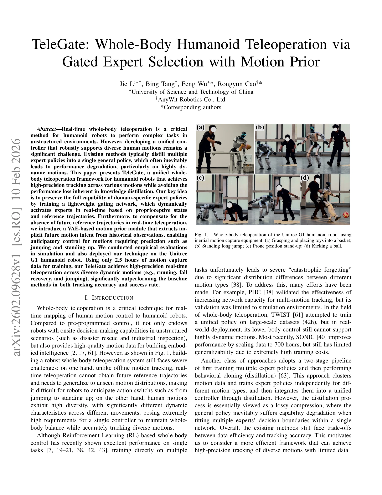
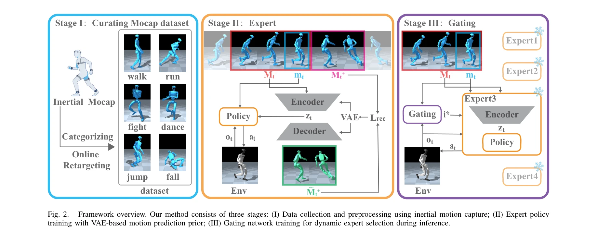

# TeleGate: Whole-Body Humanoid Teleoperation via Gated Expert Selection with Motion Prior

> **저자**: Jie Li, Bing Tang, Feng Wu, Rongyun Cao | **날짜**: 2026-02-10 | **URL**: [https://arxiv.org/abs/2602.09628](https://arxiv.org/abs/2602.09628)

---

## Essence

*Fig. 1.*

TeleGate는 가벼운 gating network를 통해 multiple domain-specific expert policies를 동적으로 선택하여 humanoid robot의 real-time whole-body teleoperation을 수행하며, VAE 기반 motion prior를 도입하여 미래 정보 없이도 점프나 일어서기 같은 동적 동작을 예측적으로 제어한다.

## Motivation

- **Known**: RL 기반 whole-body control은 단일 과제에서 우수하지만, multiple motion categories에 대해 학습하면 catastrophic forgetting이 발생한다. 기존 distillation 기반 접근법은 여러 expert를 하나의 정책으로 압축하면서 성능 저하를 초래한다.
- **Gap**: Real-time teleoperation에서 미래 reference trajectory가 없는 상황에서 다양한 동적 움직임을 고정밀도로 추적하면서도 knowledge distillation의 성능 손실을 피하고 제한된 학습 데이터로 효율적으로 수행할 수 있는 통합 프레임워크가 부재하다.
- **Why**: Humanoid robot의 재난 구조, 산업 검사 등 비정형 환경에서의 안정적인 실시간 제어와 고품질 학습 데이터 수집이 중요하며, 2.5시간의 적은 데이터로 높은 정밀도를 달성하면 실제 배포 비용을 크게 절감할 수 있다.
- **Approach**: TeleGate는 domain similarity에 따라 독립적으로 학습된 multiple expert policies를 고정하고, proprioceptive states와 reference trajectories를 기반으로 runtime에 동적으로 expert를 활성화하는 lightweight gating network를 학습한다. 또한 VAE 기반 motion prior 모듈로 역사적 관찰에서 암묵적 미래 동작 의도를 추출하여 anticipatory control을 가능하게 한다.

## Achievement

*Fig. 1.*

- **Data Efficiency**: 단 2.5시간의 motion capture 데이터만으로 running, fall recovery, jumping 등 다양한 동적 움직임의 고정밀도 real-time teleoperation 달성, 기존 SONIC(700h)에 비해 280배 효율적
- **Performance Preservation**: Knowledge distillation의 성능 저하를 회피하면서 expert-level의 추적 정확도를 유지하여 baseline 방법들 대비 tracking accuracy와 success rate에서 유의미한 우월성 입증
- **Anticipatory Control**: VAE 기반 motion prior로 미래 정보 부재 상황에서 점프, 일어서기 같은 예측 필요 동작에 대한 anticipatory control 능력 확보
- **Real-world Deployment**: Unitree G1 humanoid robot에서 완전한 physical deployment validation 수행하여 sim-to-real transfer 효과와 out-of-distribution 동작 일반화 능력 입증

## How

*Fig. 2.*

- Dynamic similarity를 기준으로 motion capture 데이터를 clustering하여 각 cluster별로 독립적인 domain expert policy를 RL로 학습
- Learned expert policies의 파라미터를 고정하고, proprioceptive states(로봇의 현재 상태)와 reference trajectories를 입력으로 받아 각 expert에 대한 활성화 가중치를 출력하는 lightweight gating network 학습
- Runtime에 gating network의 출력을 통해 experts를 동적으로 선택하여 seamless policy switching 구현
- VAE를 사용하여 historical motion observations에서 latent representation을 학습하고, 이를 policy에 입력하여 미래 동작 의도 예측
- Inertial motion capture 장비를 사용하여 teleoperation을 위한 motion capture 데이터 수집 및 학습
- Simulation 환경에서 systematic comparison 수행 후, Unitree G1 humanoid robot에서 physical validation

## Originality

- **Gated Expert Selection Architecture**: Knowledge distillation의 lossy compression 문제를 회피하고 expert policies의 전체 capability를 보존하면서 dynamic routing하는 새로운 구조
- **VAE-based Motion Prior for Real-time Control**: 미래 정보 부재 상황에서 historical observations로부터 implicit future motion intent를 추출하는 novel approach, 기존 adversarial motion priors와 다른 방식의 motion modeling
- **Inertial MoCap Device Selection**: VR, exoskeleton, optical motion capture 등 기존 방식 대비 휴대성과 정확도의 균형을 새롭게 고려한 입력 모달리티 선택
- **Limited Data, High Precision Paradigm**: 기존 data scaling 전략(SONIC 700h)과 달리, 제한된 데이터(2.5h)로 높은 정밀도 달성의 새로운 paradigm 제시

## Limitation & Further Study

- Gating network의 동적 expert 선택이 smooth하게 이루어지지 않을 경우 policy switching 순간 tracking quality 저하 가능성 — 향후 더 정교한 blending mechanism 필요
- VAE 기반 motion prior의 예측 horizon이 제한적일 수 있어 매우 긴 선행 시간이 필요한 동작에 대한 한계 가능성 — recurrent 구조나 attention mechanism 도입 검토
- Domain clustering에 사용된 dynamic similarity metric의 정의가 명확하지 않으며, 새로운 motion category 추가 시 기존 experts와의 상호작용 영향 미분석
- Real-world 실험이 Unitree G1 단일 로봇에 국한되어 다른 humanoid platforms로의 generalization 검증 필요
- Inertial motion capture의 누적 오류(drift) 문제와 실제 teleoperation 환경에서의 latency 영향에 대한 분석 부족

## Evaluation

- Novelty: 4/5
- Technical Soundness: 3/5
- Significance: 4/5
- Clarity: 4/5
- Overall: 4/5

**총평**: TeleGate는 gated expert selection과 VAE 기반 motion prior를 결합하여 제한된 데이터로도 높은 정밀도의 real-time whole-body humanoid teleoperation을 실현하는 혁신적인 프레임워크이며, Unitree G1에서의 성공적인 physical deployment로 실제 적용 가능성을 입증했다.
