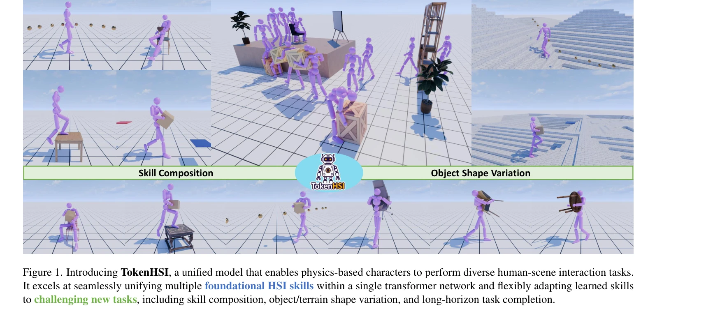
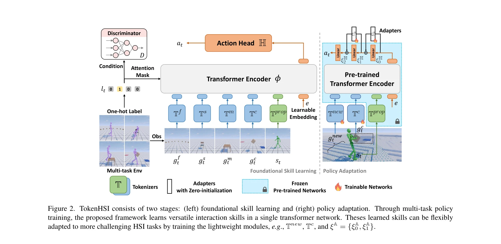

# TokenHSI: Unified Synthesis of Physical Human-Scene Interactions through Task Tokenization

> **저자**: Liang Pan, Zeshi Yang, Zhiyang Dou, Wenjia Wang, Buzhen Huang, Bo Dai, Taku Komura, Jingbo Wang | **날짜**: 2025-03-25 | **URL**: [https://arxiv.org/abs/2503.19901](https://arxiv.org/abs/2503.19901)

---

## Essence

*Figure 1. Introducing TokenHSI, a unified model that enables physics-based characters to perform diverse human-scene int*

TokenHSI는 transformer 기반의 통합 정책으로 humanoid 고유감각을 공유 토큰으로 모델링하고 task 토큰과 masking mechanism으로 결합하여 다양한 인간-장면 상호작용(HSI) 기술을 단일 네트워크에서 통합한다.

## Motivation

- **Known**: 기존 연구들은 특정 상호작용 작업마다 별도의 컨트롤러를 개발했으며, 일부 통합 컨트롤러도 정적 장면 상호작용과 제한된 일반화 능력에만 집중했다.
- **Gap**: 현재 방법들은 복합 작업(예: 물건을 들고 앉기)을 처리하거나 새로운 시나리오로의 유연한 적응이 부족하며, 여러 기술의 통합과 효율적인 정책 적응을 동시에 달성하지 못한다.
- **Why**: 현실에서 인간은 다양한 상호작용을 수행하고 새로운 환경에 적응하는 범용 에이전트이므로, 컴퓨터 애니메이션과 embodied AI 분야에서 이러한 다재다능성과 적응성을 구현하는 것이 중요하다.
- **Approach**: proprioception tokenizer를 통해 캐릭터 상태를 공유 토큰으로 모델링하고, 다양한 task tokenizer들과 transformer의 masking mechanism으로 결합하여 다중 기술을 학습한 후, 변수 길이 입력을 지원하는 아키텍처로 새로운 작업에 효율적으로 적응한다.

## Achievement

*Figure 1. Introducing TokenHSI, a unified model that enables physics-based characters to perform diverse human-scene int*

- **다중 기술 통합**: following, sitting, climbing, carrying 등 4가지 대표적 HSI 기술을 단일 transformer 네트워크에서 동시 학습
- **효율적 정책 적응**: 기초 기술 학습 후 task tokenizer와 adapter layer만 추가하여 새로운 작업에 빠르게 적응 가능
- **포괄적 일반화**: 기술 합성, 물체/지형 형태 변화, 장기 작업 완성 등 다양한 HSI 벤치마크에서 기존 방법 대비 성능 향상

## How

*Figure 2. TokenHSI consists of two stages: (left) foundational skill learning and (right) policy adaptation. Through mul*

- **Proprioception tokenizer**: 캐릭터 상태를 독립적인 공유 토큰으로 인코딩하여 모든 작업에서 재사용
- **Task tokenizer**: 각 작업의 관찰값을 표준화된 길이로 변환
- **Masking mechanism**: transformer encoder에서 proprioception 토큰과 task 토큰을 선택적으로 결합
- **Variable length input 지원**: 새로운 task tokenizer를 추가하여 정책 재훈련 없이 적응
- **Multi-task training**: 공유 proprioception tokenizer가 다양한 캐릭터 상태에 일반화되도록 함
- **Adapter layer**: MLP 기반 action head에 부분 미세조정 가능하게 함

## Originality

- **독립적 proprioception tokenizer**: 기존의 joint character-goal 상태 공간과 달리 proprioception을 분리하여 더 효과적인 지식 공유 실현
- **Masking mechanism의 다차원 활용**: task 토큰 결합뿐만 아니라 정책 적응과 기술 합성까지 확장
- **효율적 적응 전략**: 전체 정책 미세조정 대신 새로운 tokenizer와 adapter layer만 학습하는 parameter-efficient 접근

## Limitation & Further Study

- **동시성 제한**: 현재 4가지 기본 기술만 다루며, 더 많은 기술의 통합 시 scalability 미검증
- **물리 시뮬레이션 의존성**: physics engine에 의존하므로 실제 로봇 배포 시 sim-to-real gap 해결 필요
- **복합 작업의 제한**: 기술 합성이 기존 기술의 조합에만 한정되며, 완전히 새로운 합성 기술 학습 능력 미검증
- **후속연구**: (1) 더 많은 HSI 기술의 통합 시 성능 유지 방안 (2) 실제 로봇 환경에서의 검증 (3) 사용자 의도 입력 메커니즘 강화

## Evaluation

- Novelty: 4/5
- Technical Soundness: 4/5
- Significance: 4/5
- Clarity: 4/5
- Overall: 4/5

**총평**: TokenHSI는 독립적 proprioception tokenizer와 masking mechanism을 통해 다중 HSI 기술을 단일 네트워크에서 효과적으로 통합하고, 변수 길이 입력을 활용한 효율적 정책 적응까지 실현한 혁신적인 접근법으로, 컴퓨터 애니메이션과 embodied AI 분야에서 실질적인 기여를 한다.
