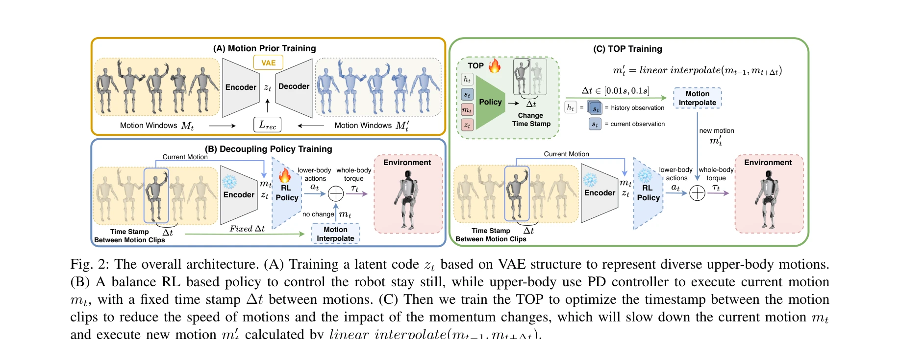
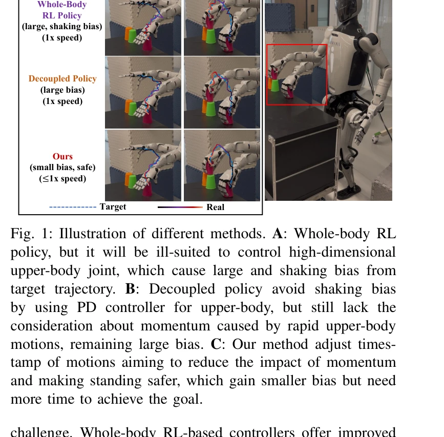

# TOP: Time Optimization Policy for Stable and Accurate Standing Manipulation with Humanoid Robots

> **저자**: Zhenghan Chen, Haocheng Xu, Haodong Zhang, Liang Zhang, He Li, Dongqi Wang, Jiyu Yu, Yifei Yang, Zhongxiang Zhou, Rong Xiong | **날짜**: 2025-08-01 | **URL**: [https://arxiv.org/abs/2508.00355](https://arxiv.org/abs/2508.00355)

---

## Essence

*Fig. 2: The overall architecture. (A) Training a latent code zt based on VAE structure to represent diverse upper-body m*

이 논문은 휴머노이드 로봇의 안정적인 서서하기 조작을 위해 상체 동작의 시간 궤적을 최적화하는 Time Optimization Policy (TOP)을 제안한다. 상체의 빠른 움직임으로 인한 모멘텀을 줄여 균형, 정확성, 시간 효율성을 동시에 달성한다.

## Motivation

- **Known**: 기존 방법은 전체 신체 RL 컨트롤러나 상하체 분리 컨트롤러를 사용하여 휴머노이드 로봇의 조작 제어를 수행한다. 그러나 상체의 빠른 움직임이 하체의 안정성에 미치는 영향을 충분히 고려하지 못한다.
- **Gap**: 기존 decoupled 컨트롤러는 PD 컨트롤러로 상체 정확성을 보장하고 RL로 하체 안정성을 유지하지만, 상체 동작으로 인한 모멘텀 변화가 균형을 해칠 수 있다. 상체 동작의 속도를 동적으로 조절하여 안정성과 정확성을 모두 확보하는 방법이 부족하다.
- **Why**: 휴머노이드 로봇이 산업용 조립, 가정용 서비스 등 복잡한 조작 작업을 안정적으로 수행하려면 빠른 상체 움직임 중에도 균형을 유지하면서 정확한 궤적 추적이 필요하기 때문이다.
- **Approach**: VAE를 통해 상체 동작의 구조화된 표현을 학습하고, 상체는 PD 컨트롤러, 하체는 RL 정책으로 분리 제어한 후, TOP을 이용해 motion 클립 사이의 timestamp를 최적화하여 동작 속도를 조절한다.

## Achievement

*Fig. 1: Illustration of different methods. A: Whole-body RL*

- **TOP 프레임워크**: 상체 동작의 timestamp 최적화를 통해 모멘텀 영향을 최소화하면서 균형, 정확성, 시간 효율성을 동시에 달성하는 통합 프레임워크를 제시
- **Motion Prior 학습**: VAE 기반 motion 표현 학습으로 상하체 협조 능력을 향상
- **Supervised RL 기반 TOP**: motion timestamp를 최적화하는 새로운 supervised 강화학습 모듈 제안
- **검증**: 시뮬레이션과 실제 로봇 실험을 통해 기존 방법 대비 더 작은 추적 오차와 높은 안정성을 입증

## How

*Fig. 2: The overall architecture. (A) Training a latent code zt based on VAE structure to represent diverse upper-body m*

- VAE를 사용하여 다양한 상체 동작을 latent code zt로 표현하는 motion prior 학습
- 상체에는 PD 컨트롤러를 적용하여 motion 클립 mt 추적, 하체에는 balance RL 정책 적용
- 고정된 timestamp ∆t 대신 TOP을 훈련하여 motion 클립 사이의 시간 간격을 동적으로 조정
- linear interpolation을 사용하여 조정된 timestamp에 따른 새로운 motion m't 생성", '전체 아키텍처를 end-to-end로 훈련하여 하체 안정성과 상체 정밀도를 모두 최적화

## Originality

- 상체 동작 속도 조절을 통한 모멘텀 관리라는 새로운 관점으로 서서하기 조작 문제에 접근
- 기존 PD-RL 분리 컨트롤에 시간 최적화 정책을 추가한 novel combination
- supervised RL을 사용하여 motion timestamp를 직접 최적화하는 새로운 방식 제시
- VAE 기반 motion representation과 TOP을 통합한 end-to-end 프레임워크

## Limitation & Further Study

- 논문에서 TOP의 일반화 능력이 다양한 상체 동작 타입에 대해 어느 정도인지 명확하지 않음
- 실제 로봇 실험의 규모가 제한적이고 다양한 환경 조건에 대한 평가 부족
- timestamp 최적화에 따른 작업 완료 시간 증가의 실제 trade-off에 대한 심화 분석 필요
- 외부 교란(external perturbation)에 대한 robustness 평가가 더 정밀하게 필요
- 다른 최신 humanoid 제어 방법들과의 직접적인 성능 비교 부족

## Evaluation

- Novelty: 4/5
- Technical Soundness: 3/5
- Significance: 4/5
- Clarity: 4/5
- Overall: 4/5

**총평**: 이 논문은 상체 동작 시간 최적화라는 직관적이면서도 효과적인 아이디어로 휴머노이드 서서하기 조작의 안정성-정확성-효율성 trade-off 문제를 창의적으로 해결한다. 이론과 실험이 잘 결합되어 있으며, humanoid 로봇 제어 분야에 실질적인 기여를 제공한다.

## Related Papers

- 🔄 다른 접근: [[papers/1980_HiWET_Hierarchical_World-Frame_End-Effector_Tracking_for_Lon/review]] — 서서하기 조작의 정확성과 안정성을 다른 방식의 계층적 끝점 추적으로 해결한 대안적 접근법이다.
- 🔗 후속 연구: [[papers/1965_HAIC_Humanoid_Agile_Object_Interaction_Control_via_Dynamics-/review]] — 휴머노이드 민첩한 객체 상호작용을 시간 최적화를 통해 더 안정적이고 정확하게 확장한 방법론이다.
- 🏛 기반 연구: [[papers/1694_SteadyTray_Learning_Object_Balancing_Tasks_in_Humanoid_Tray/review]] — 휴머노이드 트레이 균형 작업의 객체 밸런싱 기술이 서서하기 조작의 안정성 제어에 기반을 제공한다.
- 🧪 응용 사례: [[papers/1757_Whole-Body_Dynamic_Throwing_with_Legged_Manipulators/review]] — 전신 동적 던지기 제어 기술을 서서하기 조작의 상체 동작 최적화에 실제 적용할 수 있다.
- 🔗 후속 연구: [[papers/1982_Hold_My_Beer_Learning_Gentle_Humanoid_Locomotion_and_End-Eff/review]] — Hold My Beer의 gentle locomotion and end-effector control이 TOP의 안정적인 standing manipulation을 이동하면서도 수행할 수 있도록 확장한 형태입니다.
- 🏛 기반 연구: [[papers/1668_SEEC_Stable_End-Effector_Control_with_Model-Enhanced_Residua/review]] — SEEC의 stable end-effector control이 TOP의 상체 동작 시간 최적화에서 end-effector 안정성 보장의 기술적 토대를 제공합니다.
- 🧪 응용 사례: [[papers/1636_Reference-Free_Sampling-Based_Model_Predictive_Control/review]] — TOP의 시간 최적화 정책이 본 논문의 reference-free MPC를 안정적이고 정확한 기립 제어에 적용한 사례임
