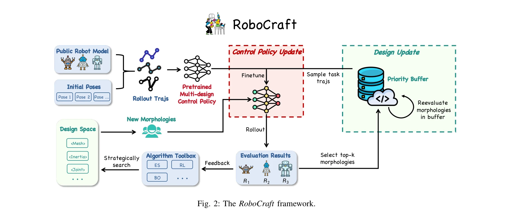
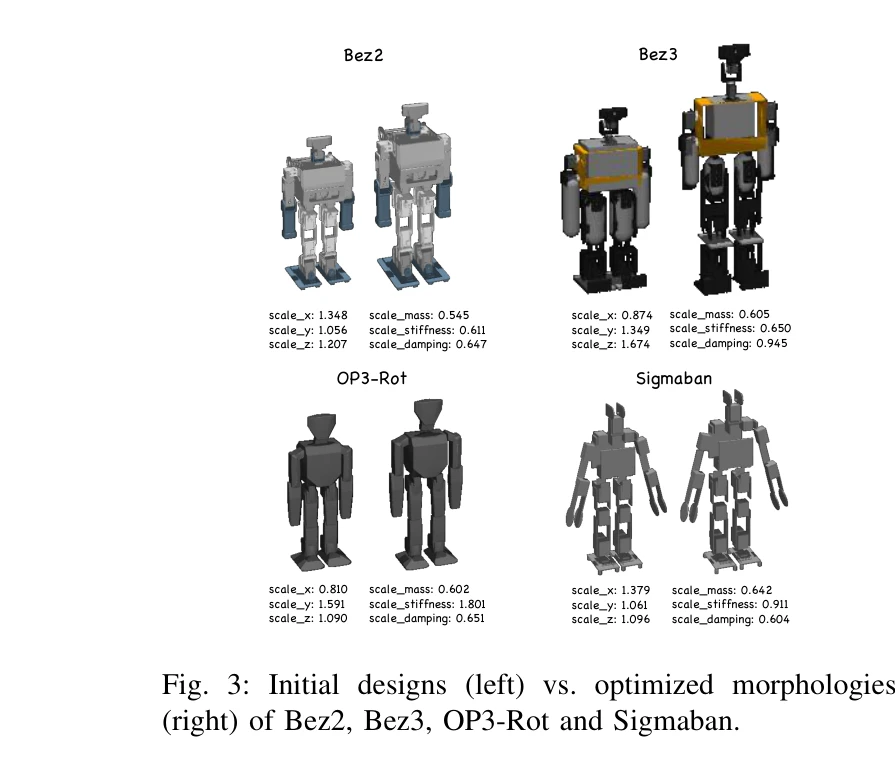

# Toward Humanoid Brain-Body Co-design: Joint Optimization of Control and Morphology for Fall Recovery

> **저자**: Bo Yue, Sheng Xu, Kui Jia, Guiliang Liu | **날짜**: 2025-10-25 | **URL**: [https://arxiv.org/abs/2510.22336](https://arxiv.org/abs/2510.22336)

---

## Essence

*Fig. 2: The RoboCraft framework.*

본 논문은 humanoid 로봇의 fall recovery 능력을 향상시키기 위해 제어 정책과 신체 형태를 동시에 최적화하는 RoboCraft 프레임워크를 제안한다. 공유 제어 정책의 사전학습과 설계 공간 탐색을 결합하여 효율적인 co-design을 실현한다.

## Motivation

- **Known**: Brain-body co-design은 로봇의 형태와 제어를 공동으로 최적화하는 bi-level optimization 문제로 알려져 있으며, 주로 soft robot이나 modular robot에 적용되었다. Fall recovery는 humanoid 로봇의 기본적인 능력으로 인식되고 있다.
- **Gap**: 기존 humanoid 제어 연구는 형태 최적화를 간과하고 제어 중심이었으며, 높은 자유도와 복잡한 신체 동역학을 가진 humanoid에 대한 실질적인 co-design 방법이 부재했다. Humanoid의 복잡한 설계 공간과 물리적 제약을 고려한 체계적인 co-design 프레임워크가 필요했다.
- **Why**: Fall recovery는 humanoid 로봇의 안전성과 자율성을 크게 향상시키는 기본 능력이며, 형태 최적화를 통해 제어 성능을 함께 개선할 수 있는 기회를 제공한다. 이를 통해 더 강건하고 효율적인 humanoid 설계가 가능해진다.
- **Approach**: RoboCraft는 다중 설계에 걸쳐 사전학습된 공유 정책을 고성능 형태에서 점진적으로 미세조정하고, 우선순위 버퍼를 통해 유망한 후보의 재평가와 새로운 설계 탐색의 균형을 맞춘다. 대칭성 제약과 human-inspired priors를 활용하여 형태 탐색 공간을 축소한다.

## Achievement

*Fig. 3: Initial designs (left) vs. optimized morphologies*

- **평균 성능 향상**: 7개의 공용 humanoid 로봇에서 평균 44.55% 성능 개선 달성
- **형태 최적화의 중요성 입증**: 4개 humanoid robot의 co-design에서 형태 최적화가 최소 40%의 성능 향상을 주도
- **확장성 있는 프레임워크**: 다양한 humanoid 로봇 구조와 최적화 알고리즘(ES, RL, BO)에 호환 가능한 체계 제시
- **효율적인 정책 전이**: 다중 설계 사전학습 정책 미세조정을 통해 각 형태마다 처음부터 재학습할 필요 제거

## How

*Fig. 2: The RoboCraft framework.*

- Bi-level optimization 프레임워크: 내부 루프에서 RL을 통한 정책 학습, 외부 루프에서 진화 알고리즘을 통한 형태 탐색
- 공유 정책의 다중 설계 사전학습으로 inter-design 지식 전이 실현
- 고성능 형태에 대한 design-specific 정책 미세조정으로 intra-design 적응 개선
- STL 파일의 mesh, inertia, joint 속성 수정을 통한 복잡한 신체 동역학 처리
- 대칭성 제약과 Denavit–Hartenberg 파라미터 제한으로 설계 공간 축소 및 물리적 타당성 보장
- 우선순위 버퍼: 유망한 형태의 재평가와 현재 정책 기반 새로운 형태 샘플링의 균형 조절
- Morphology-agnostic 보상 함수를 통해 모든 설계에 일관된 평가 기준 유지

## Originality

- Humanoid의 높은 자유도와 복잡한 신체 동역학, 물리적 제약을 명시적으로 고려하는 첫 체계적 co-design 프레임워크
- 다중 설계 사전학습 공유 정책을 통한 새로운 지식 전이 메커니즘 도입
- 우선순위 버퍼를 활용한 탐색-착취 균형의 혁신적 설계
- Human-inspired priors와 optimization 알고리즘을 결합한 실용적 형태 탐색 전략
- Fall recovery를 gateway task로 정의하여 humanoid 자율성 향상의 개발 이정표 제시

## Limitation & Further Study

- 시뮬레이션 기반 평가로 실제 로봇 구현의 sim-to-real gap 미검증
- 형태 수정 범위가 STL 파일 스케일링과 joint 파라미터에 제한되어 근본적 구조 변경 불가능
- Fall recovery 특화로 다른 작업(보행, 달리기 등)으로의 일반화 가능성 미확인
- 계산 비용 분석 부재 및 최적화 수렴 조건의 이론적 보장 미제공
- Human-inspired priors의 정의 및 설정 방식이 주관적일 수 있음
- 후속 연구: (1) 실제 humanoid에서 최적화 설계 검증, (2) 다중 작업 co-design 확장, (3) 설계 제약 완화를 위한 생성 모델 활용, (4) 형태-제어 관계의 이론적 분석

## Evaluation

- Novelty: 4/5
- Technical Soundness: 3/5
- Significance: 4/5
- Clarity: 4/5
- Overall: 4/5

**총평**: 본 논문은 복잡한 humanoid 로봇에 대한 실질적이고 확장 가능한 co-design 프레임워크를 처음 제시하며, 다중 설계 사전학습 정책과 우선순위 버퍼를 통한 효율적 최적화로 형태 최적화의 중요성을 명확히 입증했다. 시뮬레이션 기반 한계에도 불구하고 embodied AI 분야의 중요한 진전을 나타낸다.
