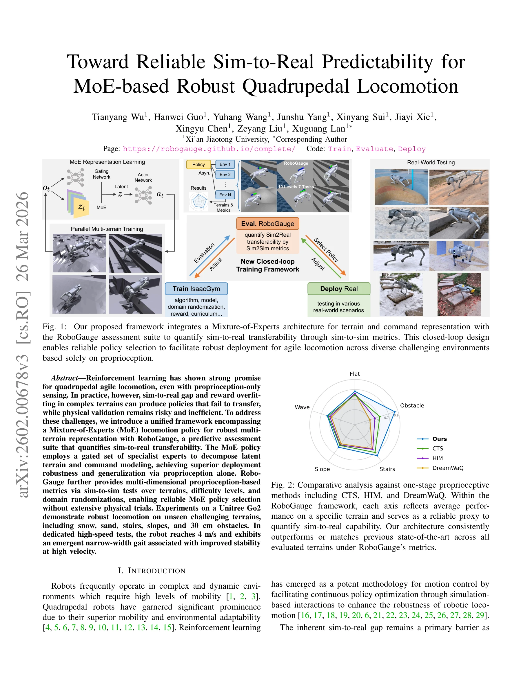

# Toward Reliable Sim-to-Real Predictability for MoE-based Robust Quadrupedal Locomotion

> **저자**: Tianyang Wu, Hanwei Guo, Yuhang Wang, Junshu Yang, Xinyang Sui, Jiayi Xie, Xingyu Chen, Zeyang Liu, Xuguang Lan | **날짜**: 2026-01-31 | **URL**: [https://arxiv.org/abs/2602.00678](https://arxiv.org/abs/2602.00678)

---

## Essence

*Fig. 1:*

본 논문은 Mixture-of-Experts (MoE) 기반 사족 로봇 이동 정책과 sim-to-real 전이 가능성을 정량화하는 RoboGauge 평가 프레임워크를 통합하여 신뢰할 수 있는 시뮬레이션-실제 간 갭을 해소하는 통합 프레임워크를 제시한다.

## Motivation

- **Known**: 강화학습을 통한 사족 로봇 이동 제어는 시뮬레이션 기반 훈련으로 유망성을 보였으나, sim-to-real 갭과 보상 과적합으로 인해 정책 전이 실패와 물리 검증의 위험성이 있다.
- **Gap**: 기존 연구는 높은 시뮬레이션 보상이 실제 로봇 안정성을 보장하지 못하며, 신뢰할 수 있는 정량적 지표의 부재로 인해 직접 물리 검증에 의존해야 하는 문제가 있다.
- **Why**: 신뢰할 수 있는 sim-to-real 전이 예측은 로봇 하드웨어 손상 위험을 줄이고 다양한 극한 지형에서의 견고한 이동성 달성을 위해 중요하다.
- **Approach**: MoE 아키텍처를 사용하여 고정된 전문가 네트워크의 게이팅을 통해 지형과 명령을 분해하고, 병렬화된 sim-to-sim 테스트를 통해 다차원 고유감각 기반 메트릭으로 sim-to-real 전이성을 정량화하는 RoboGauge 평가 스위트를 제안한다.

## Achievement

*Fig. 2: Comparative analysis against one-stage proprioceptive*

- **RoboGauge 평가 프레임워크**: 7개 지형, 10개 난이도 수준, 4개 도메인 무작위화를 포함한 병렬화된 sim-to-sim 방법론으로 실제 배포 전 하드웨어 손상 위험을 완화
- **MoE 정책 우월성**: 모든 지형 범주에서 CTS, HIM, DreamWaQ 등 기존 단계식 고유감각 방법을 능가하는 다중 지형 표현 능력
- **고속 이동 달성**: Unitree Go2 로봇이 평탄지에서 4 m/s 속도 달성 및 고속 안정성 향상과 관련된 신규 좁은 폭의 보행 출현
- **도전적 지형 횡단**: 눈, 모래, 계단, 경사면, 30cm 장애물 등 미지의 까다로운 지형에서 견고한 이동 성능 입증

## How

*Fig. 1:*

- POMDP로 모델링된 사족 로봇 이동 제어 문제에서 IMU와 조인트 인코더만 사용하는 고유감각 기반 관찰
- K개의 병렬 전문가 서브네트워크 {Ek}와 동적 가중치 할당을 위한 게이팅 네트워크 g로 구성된 MoE 구조
- Concurrent Teacher-Student (CTS) 프레임워크 내에서 MoE를 학생 인코더로 통합하여 학생 모델의 표현 능력 증강
- 6개 메트릭, 7개 지형, 10개 난이도 수준, 3개 목표, 4개 도메인 무작위화를 포함한 병렬화된 RoboGauge 평가
- PD 컨트롤러를 통한 토크 계산으로 목표 조인트 위치 달성
- 특권 관찰(privileged observation)을 훈련 중 사용하되 배포 시에는 관찰만 사용하는 교사-학생 분리

## Originality

- sim-to-real 전이 가능성을 정량화하는 전문적이고 종합적인 RoboGauge 평가 프레임워크의 개발이 신규적
- CTS 프레임워크에 MoE 구조를 통합하여 학생 모델의 표현 능력을 향상시키는 접근법이 기존 교사-학생 방법과 차별화
- 고유감각만을 사용하며 카메라, LiDAR, 발 접촉 센서 등 외수용 센서를 피하는 설계는 극한 환경에서의 견고성 확보에 신규적
- 4 m/s의 높은 속도에서 출현하는 좁은 폭의 보행 특성은 시뮬레이션 기반 정책 최적화의 신규한 발견

## Limitation & Further Study

- RoboGauge의 sim-to-sim 메트릭이 실제 sim-to-real 전이를 완전히 포괄하지 못할 가능성이 있으며, 메트릭과 실제 성능 간의 정확한 대응 관계 분석 필요
- 단일 로봇 플랫폼(Unitree Go2)에서만 검증되었으므로 다양한 사족 로봇 설계에 대한 일반화 가능성 미확인
- 지형 무작위화와 도메인 무작위화의 범위 및 현실성에 대한 자세한 분석이 부족하며, 더 극한적인 환경 조건에서의 성능 평가 필요
- MoE의 전문가 수 K 선택 기준과 게이팅 네트워크의 설계에 대한 이론적 근거와 민감도 분석이 제시되지 않음
- 후속 연구는 RoboGauge 메트릭의 타당성 검증, 다양한 로봇 플랫폼으로의 확장, 더 극한 환경에서의 실제 배포 시험이 필요

## Evaluation

- Novelty: 4/5
- Technical Soundness: 3/5
- Significance: 4/5
- Clarity: 4/5
- Overall: 4/5

**총평**: 본 논문은 MoE 기반 정책과 RoboGauge 평가 프레임워크를 통합하여 sim-to-real 갭 문제를 체계적으로 해결하고, 극한 지형에서 4 m/s의 견고한 이동 성능을 입증함으로써 사족 로봇 이동 제어 분야에 유의미한 기여를 한다.

## Related Papers

- 🏛 기반 연구: [[papers/1942_GaussGym_An_open-source_real-to-sim_framework_for_learning_l/review]] — GaussGym의 real-to-sim 프레임워크가 RoboGauge의 sim-to-real 예측 가능성 평가를 위한 기반 시뮬레이션 환경을 제공합니다.
- 🔄 다른 접근: [[papers/2155_Towards_bridging_the_gap_Systematic_sim-to-real_transfer_for/review]] — RoboGauge는 MoE 기반 사족 로봇에 집중하고 systematic sim-to-real transfer는 이족 로봇의 PMSM 에너지 모델을 사용하는 서로 다른 접근법입니다.
- 🧪 응용 사례: [[papers/1829_Bridging_the_Sim-to-Real_Gap_for_Athletic_Loco-Manipulation/review]] — RoboGauge의 신뢰성 평가 프레임워크를 athletic loco-manipulation의 sim-to-real 전이 검증에 적용하여 성능 예측 정확도를 높일 수 있습니다.
- 🔄 다른 접근: [[papers/1620_PolySim_Bridging_the_Sim-to-Real_Gap_for_Humanoid_Control_vi/review]] — MoE 기반 접근법 대신 diffusion 기반 방법으로 sim-to-real 문제를 해결하는 다른 관점을 제시함
- 🏛 기반 연구: [[papers/1850_Contrastive_Representation_Learning_for_Robust_Sim-to-Real_T/review]] — contrastive representation learning이 RoboGauge의 sim-to-real 예측성 평가에서 robust feature 추출을 위한 이론적 기반을 제공함
- 🔗 후속 연구: [[papers/1675_Sim-to-Real_of_Humanoid_Locomotion_Policies_via_Joint_Torque/review]] — joint torque 기반 sim-to-real 접근법에 MoE와 RoboGauge 평가를 통합하면 더 신뢰할 수 있는 전이 성능 예측 가능
- 🏛 기반 연구: [[papers/1650_Robot_Drummer_Learning_Rhythmic_Skills_for_Humanoid_Drumming/review]] — Robot crash course의 soft falling learning이 MoE 기반 robust locomotion에서 예외 상황 처리와 recovery 능력의 기술적 토대를 제공합니다.
- 🔄 다른 접근: [[papers/1924_FARM_Frame-Accelerated_Augmentation_and_Residual_Mixture-of-/review]] — FARM의 frame-accelerated mixture-of-experts가 MoE 기반 robust quadruped locomotion과 다른 가속화 접근법으로 전문가 네트워크를 활용합니다.
- 🔗 후속 연구: [[papers/1664_Sampling-Based_System_Identification_with_Active_Exploration/review]] — MoE 기반 로봇 제어의 sim-to-real 예측가능성을 샘플링 기반 시스템 식별로 더 정확하게 만든다.
- 🔄 다른 접근: [[papers/1620_PolySim_Bridging_the_Sim-to-Real_Gap_for_Humanoid_Control_vi/review]] — Multi-simulator training의 안정성을 MoE 기반 접근법으로 개선한 연구
- 🔄 다른 접근: [[papers/1632_RAPT_Model-Predictive_Out-of-Distribution_Detection_and_Fail/review]] — OOD detection을 MoE-based robustness로 해결하는 상호 보완적 접근법
- 🏛 기반 연구: [[papers/1746_VB-Com_Learning_Vision-Blind_Composite_Humanoid_Locomotion_A/review]] — MoE 기반 로봇 제어의 sim-to-real 예측가능성 개념을 시각 정보 결손이라는 구체적 문제에 적용하여 복합 제어 프레임워크를 개발했다.
- 🔗 후속 연구: [[papers/1829_Bridging_the_Sim-to-Real_Gap_for_Athletic_Loco-Manipulation/review]] — UAN의 액추에이터 모델링이 MoE 기반 로봇 sim-to-real 예측 가능성 향상에 확장되어 더 신뢰할 수 있는 전이를 달성할 수 있다
- 🏛 기반 연구: [[papers/1877_DiffCoTune_Differentiable_Co-Tuning_for_Cross-domain_Robot_C/review]] — MoE-based robot control의 신뢰성 있는 sim-to-real 예측이 DiffCoTune의 도메인 전이 최적화 방법론에 이론적 근거를 제공한다.
- 🔗 후속 연구: [[papers/1984_HoRD_Robust_Humanoid_Control_via_History-Conditioned_Reinfor/review]] — MoE-based robot의 sim-to-real predictability 향상 방법이 HoRD의 online distillation 단계에서 강건성을 더욱 개선할 수 있다.
- 🏛 기반 연구: [[papers/2031_Iterative_Closed-Loop_Motion_Synthesis_for_Scaling_the_Capab/review]] — MoE 기반 로봇 제어의 신뢰성 있는 sim-to-real 전이가 CLAIMS의 반복적 능력 확장에 실세계 적용 기반 제공
- 🔗 후속 연구: [[papers/2060_Learning_Perceptive_Humanoid_Locomotion_over_Challenging_Ter/review]] — MoE 기반 로봇 제어의 sim-to-real 예측 가능성을 지형 보행으로 확장
- 🧪 응용 사례: [[papers/2084_LiPS_Large-Scale_Humanoid_Robot_Reinforcement_Learning_with/review]] — MoE 기반 로봇 제어의 시뮬레이션-현실 예측 가능성을 대규모 병렬 훈련으로 개선할 수 있다.
- 🔗 후속 연구: [[papers/2154_Towards_Bridging_the_Gap_between_Large-Scale_Pretraining_and/review]] — MoE 기반 로봇 정책의 sim-to-real 예측 가능성을 더 안정적으로 보장하는 발전된 접근법이다.
- 🔄 다른 접근: [[papers/2155_Towards_bridging_the_gap_Systematic_sim-to-real_transfer_for/review]] — PMSM 에너지 모델은 이족 로봇의 물리 기반 접근을 사용하고 MoE-based Robust Quadruped은 사족 로봇의 혼합 전문가 모델을 사용하는 서로 다른 전이 방법입니다.
