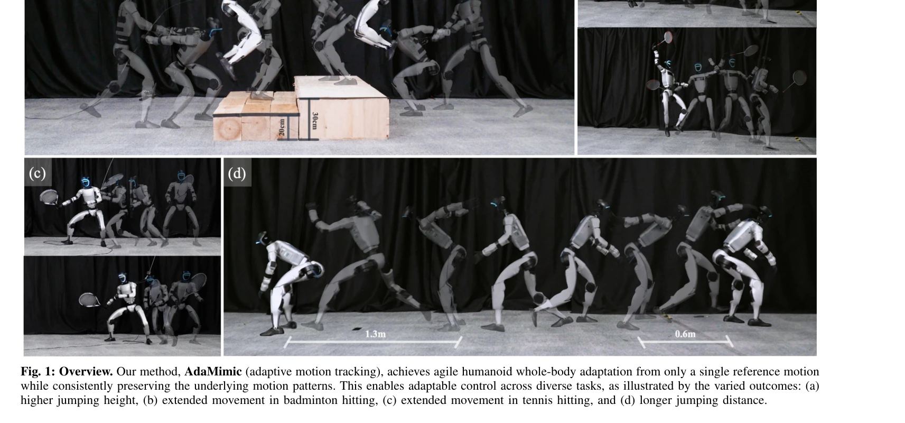

# Towards Adaptable Humanoid Control via Adaptive Motion Tracking

> **저자**: Tao Huang, Huayi Wang, Junli Ren, Kangning Yin, Zirui Wang, Xiao Chen, Feiyu Jia, Wentao Zhang, Junfeng Long, Jingbo Wang, Jiangmiao Pang | **날짜**: 2025-10-16 | **DOI**: [10.48550/arXiv.2510.14454](https://doi.org/10.48550/arXiv.2510.14454)

---

## Essence

*Fig. 2: Method overview. (a) Human motions are reconstructed into SMPL motions via GVHMR [21] and retargeted to the huma*

AdaMimic은 단일 참조 모션으로부터 휴머노이드 로봇의 적응 가능한 제어를 가능하게 하는 novel motion tracking 알고리즘으로, 키프레임 스파시피케이션과 adaptive phase warping을 통해 모션 패턴 보존과 적응성을 동시에 달성한다.

## Motivation

- **Known**: Motion prior 기반 방법들은 적응성이 우수하지만 모방 정확도를 희생하고, motion tracking 방법들은 정확한 모방을 달성하나 많은 학습 모션과 테스트 시 참조 모션을 요구한다.
- **Gap**: 단일 참조 모션으로부터 시작하면서 동시에 높은 모방 정확도와 광범위한 적응성을 보장하는 방법이 부재한다.
- **Why**: 휴머노이드 로봇이 실제 환경에서 다양한 조건에 맞춰 인간의 모션 패턴을 정확히 재현하면서 적응할 수 있는 능력은 실용적 배포에 필수적이다.
- **Approach**: 단일 모션을 키프레임으로 스파시피하고 최소한의 물리적 가정으로 편집하여 augmented dataset을 생성한 후, 고정 phase interval로 초기 tracking policy를 학습하고 phase adapter와 tracking adapter를 추가 학습하여 유연한 time warping을 구현한다.

## Achievement

*Fig. 1: Overview. Our method, AdaMimic (adaptive motion tracking), achieves agile humanoid whole-body adaptation from on*

- **단일 모션 기반 적응 제어**: 대규모 데이터 없이 단일 참조 모션만으로 다양한 조건에 적응하는 휴머노이드 제어 달성
- **이중 비평가 구조**: sparse global reward와 dense local reward를 분리하여 전역 궤적 추적과 지역 패턴 보존을 동시 최적화
- **Flexible time warping**: phase adapter와 tracking adapter를 통한 적응형 phase interval 조정으로 모방 정확도와 적응성 향상
- **실제 로봇 검증**: Unitree G1 휴머노이드에서 jumping, badminton, tennis 등 여러 작업에서 광범위한 적응 조건에서의 성능 입증

## How

*Fig. 2: Method overview. (a) Human motions are reconstructed into SMPL motions via GVHMR [21] and retargeted to the huma*

- GVHMR을 이용한 인간 모션 SMPL 재구성 및 로봇으로의 retargeting
- 스파시피케이션을 통한 키프레임 추출 및 최소 물리 가정으로 keyframe 편집하여 augmented dataset D_ref^edit 생성
- Stage 1: 고정 phase interval Δϕ_k로 tracking policy π_track을 학습, double critic 구조(V_track^dense, V_track^sparse)로 sparse global reward와 dense local reward 동시 최적화
- Stage 2: phase adapter π_phase^Δ로 adaptive phase interval Δϕ_k^ada 학습, tracking adapter π_track^Δ로 phase 변화에 따른 low-level action 조정
- PD controller(50Hz)로 policy의 action을 joint torque로 변환하여 500Hz control 주기로 실행
- IMU, joint encoders, Lidar odometry 정보와 5-step history를 포함한 observation으로 deployment

## Originality

- 기존 motion prior와 motion tracking의 강점을 결합하는 novel problem formulation: 단일 모션에서 출발하면서도 정확한 tracking 달성
- Keyframe sparsification과 light editing을 통한 data augmentation 전략으로 minimal physical assumption 유지
- Phase adapter와 tracking adapter의 이원 구조를 통한 flexible time warping 메커니즘으로 시간 스케일링과 action 보정을 분리
- Double critic 설계로 sparse global tracking과 dense local pattern 보존을 명시적으로 분리 최적화

## Limitation & Further Study

- 단일 모션으로부터 시작하는 제약으로 원본 모션의 근본적 패턴 범위 내에서만 적응 가능
- Keyframe editing 과정에서 '최소 물리 가정'의 구체적 정의와 편집 기준이 명확하지 않음", '실제 로봇 배포 시 sim-to-real gap에 대한 구체적 대응 메커니즘 설명 부족
- 다양한 체형의 휴머노이드나 다른 형태의 로봇으로의 일반화 가능성 미검증
- 후속 연구: 다중 모션 조합을 통한 더 광범위한 적응 범위 확장, motion editing 자동화 및 guideline 개발, 더 복잡한 상호작용 작업으로의 확대

## Evaluation

- Novelty: 4/5
- Technical Soundness: 3/5
- Significance: 4/5
- Clarity: 4/5
- Overall: 4/5

**총평**: AdaMimic은 단일 참조 모션으로부터 적응 가능한 휴머노이드 제어를 달성하는 창의적인 접근법으로, keyframe sparsification과 이중 adapter 구조의 조합을 통해 모방 정확도와 적응성의 기존 trade-off를 효과적으로 해소하며, Unitree G1에서의 광범위한 실험 검증으로 실용성이 입증된 우수한 연구이다.
