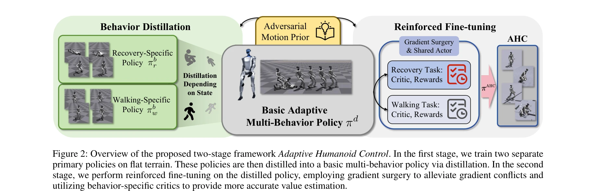
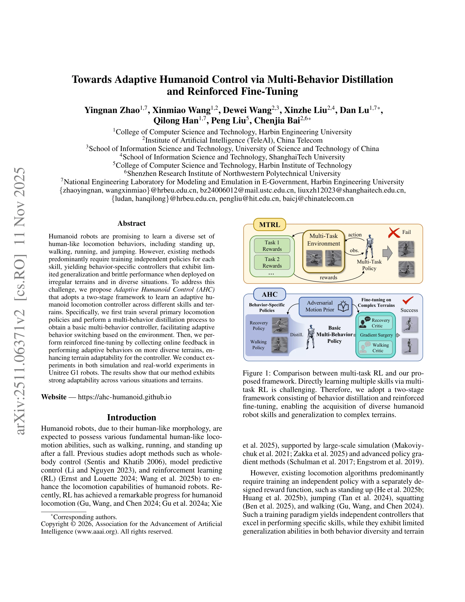

# Towards Adaptive Humanoid Control via Multi-Behavior Distillation and Reinforced Fine-Tuning

> **저자**: Yingnan Zhao, Xinmiao Wang, Dewei Wang, Xinzhe Liu, Dan Lu, Qilong Han, Peng Liu, Chenjia Bai | **날짜**: 2025-11-11 | **DOI**: [10.48550/arXiv.2511.06371](https://doi.org/10.48550/arXiv.2511.06371)

---

## Essence

*Figure 2: Overview of the proposed two-stage framework Adaptive Humanoid Control. In the first stage, we train two separ*

휴머노이드 로봇이 다양한 이족보행 행동(서기, 걷기, 뛰기, 점프)을 학습할 수 있도록 다중행동 증류(multi-behavior distillation)와 강화학습 미세조정을 통해 적응형 제어기를 개발한다.

## Motivation

- **Known**: 기존 방법들은 각 기술별로 독립적인 정책을 학습하여 행동 특화 제어기를 생성하므로 일반화 능력이 제한적이고 불규칙한 지형에서 성능이 취약하다.
- **Gap**: 다중 행동을 동시에 학습하는 것은 서로 다른 보상 함수로 인한 정책 그래디언트 충돌 문제로 인해 어렵고, 휴머노이드 로봇의 다중 기술 학습 연구는 여전히 부족하다.
- **Why**: 휴머노이드 로봇이 다양한 환경과 상황에서 적응적으로 행동을 전환하고 복잡한 지형에 견고하게 대응할 수 있는 능력은 실제 배포에 필수적이다.
- **Approach**: 2단계 프레임워크를 채택하여 먼저 행동 특화 정책들을 학습한 후 다중행동 증류를 통해 기본 다중행동 제어기를 얻고, 다양한 지형에서의 온라인 강화학습 미세조정으로 지형 적응성을 향상시킨다.

## Achievement

*Figure 1: Comparison between multi-task RL and our pro-*

- **다중행동 증류 기법**: 행동 특화 정책들(recovery, walking)을 감독 학습 방식으로 기본 다중행동 정책으로 증류하여 직접적인 다중 정책 학습의 어려움을 우회한다.
- **그래디언트 충돌 해결**: 2단계 미세조정에서 gradient surgery와 행동 특화 critic을 사용하여 다중 태스크 학습 시 그래디언트 충돌을 완화한다.
- **Adversarial Motion Prior 통합**: 인간 동작 사전을 통해 인간다운 제어를 학습하면서도 다중행동 확장성을 유지한다.
- **시뮬레이션 및 실로봇 검증**: Unitree G1 로봇에서 복잡한 지형(계단, 경사면)에서의 강건한 운동성을 달성한다.

## How

*Figure 2: Overview of the proposed two-stage framework Adaptive Humanoid Control. In the first stage, we train two separ*

- 1단계: 회복 동작(standing-up)과 보행 동작을 위한 행동 특화 정책 π_b^r, π_b^w를 PPO로 별도 학습
- 2단계: 행동 특화 정책의 출력을 감독 신호로 하여 기본 다중행동 정책 π_d로 증류
- 3단계: 다양한 지형에서 증류된 정책으로 궤적을 수집하고 온라인 강화학습으로 미세조정
- 특징: 관찰 공간을 행동 특화(privileged information s_priv 포함) 정책 학습과 실제 배포(proprioception s_prop만 사용) 정책으로 구분
- Gradient surgery를 통해 서로 다른 보상 함수로부터 발생하는 그래디언트 충돌 완화
- 행동 특화 critic을 유지하여 각 행동에 대한 정확한 가치 추정 제공

## Originality

- 다중행동 증류를 통한 새로운 휴머노이드 제어 접근법: 기존의 직접 다중 정책 학습 대신 증류 후 미세조정하는 2단계 프레임워크 제시
- Adversarial Motion Prior와 다중행동 학습의 결합: 인간 동작 사전을 다중행동 휴머노이드 제어에 통합하는 방법론
- Gradient surgery와 행동 특화 critic의 조합: 다중 태스크 RL에서 그래디언트 충돌 완화를 위한 구체적 기법 제시
- 실로봇 검증의 강화: 시뮬레이션뿐만 아니라 Unitree G1에서의 실제 배포 성공 사례 제시

## Limitation & Further Study

- 현재 구현은 회복과 보행 두 가지 주요 행동에만 집중되어 있으며, 뛰기나 점프 등 추가 행동으로의 확장성이 명확하지 않음
- 다중행동 증류 과정에서 개별 정책의 품질이 최종 다중행동 정책에 미치는 영향에 대한 분석 부족
- 그래디언트 surgery의 투영 메커니즘에 대한 상세한 수학적 유도 및 수렴 보장 조건 미충분
- 지형 적응성이 훈련에 사용된 지형 유형에 제한될 수 있으며, 완전히 새로운 지형에 대한 일반화 능력 검증 필요
- 후속연구: 더 많은 행동으로의 확장, 메타학습을 통한 빠른 지형 적응, 시뮬레이션-실제 갭 최소화 기법 개발

## Evaluation

- Novelty: 4/5
- Technical Soundness: 3/5
- Significance: 4/5
- Clarity: 4/5
- Overall: 4/5

**총평**: 다중행동 증류와 강화학습 미세조정을 결합한 2단계 프레임워크는 휴머노이드 로봇의 적응형 제어라는 중요한 문제에 대한 실용적이고 효과적인 해결책을 제시하며, 시뮬레이션과 실로봇 실험을 통해 그 타당성을 입증했다.

## Related Papers

- 🏛 기반 연구: [[papers/2005_Humanoid_World_Models_Open_World_Foundation_Models_for_Human/review]] — Humanoid World Models의 개방형 세계 기반 모델이 다중행동 학습을 위한 환경 이해와 적응형 제어기 개발의 기반을 제공합니다.
- 🔄 다른 접근: [[papers/1678_SkillBlender_Towards_Versatile_Humanoid_Whole-Body_Loco-Mani/review]] — 다중행동 증류는 여러 행동을 하나의 정책으로 통합하고 SkillBlender는 다양한 스킬을 조합하는 서로 다른 휴머노이드 제어 접근법입니다.
- 🔗 후속 연구: [[papers/1933_FRAME_Floor-aligned_Representation_for_Avatar_Motion_from_Eg/review]] — FRAME의 avatar motion 기법을 다중행동 증류와 결합하면 더 자연스럽고 다양한 휴머노이드 행동 생성이 가능합니다.
- 🏛 기반 연구: [[papers/1881_Distillation-PPO_A_Novel_Two-Stage_Reinforcement_Learning_Fr/review]] — Distillation-PPO의 two-stage RL framework가 다중행동 증류와 강화학습 미세조정의 단계적 학습 구조의 기술적 토대를 제공합니다.
- 🔄 다른 접근: [[papers/1940_Gait-Conditioned_Reinforcement_Learning_with_Multi-Phase_Cur/review]] — Gait-conditioned RL with multi-phase curriculum가 다중행동 증류와 다른 curriculum 접근법으로 다양한 이족보행 행동 학습을 달성합니다.
- 🔗 후속 연구: [[papers/1936_From_Motion_to_Behavior_Hierarchical_Modeling_of_Humanoid_Ge/review]] — From motion to behavior의 hierarchical gait modeling이 adaptive humanoid control의 다중행동 학습을 계층적 행동 모델링으로 확장한 형태입니다.
- 🔗 후속 연구: [[papers/1924_FARM_Frame-Accelerated_Augmentation_and_Residual_Mixture-of-/review]] — FARM의 residual MoE 구조를 multi-behavior distillation과 결합하면 더 적응적인 휴머노이드 제어가 가능하다.
- 🏛 기반 연구: [[papers/1962_H-Zero_Cross-Humanoid_Locomotion_Pretraining_Enables_Few-sho/review]] — 다중 행동 증류를 통한 적응형 humanoid 제어가 H-Zero의 cross-embodiment 전이 학습의 이론적 기반을 제공합니다.
- 🧪 응용 사례: [[papers/2108_Multi-task_Deep_Reinforcement_Learning_with_PopArt/review]] — 멀티 행동 증류를 통한 적응형 휴머노이드 제어에 PopArt의 불균형 해결 방법론을 적용할 수 있다.
