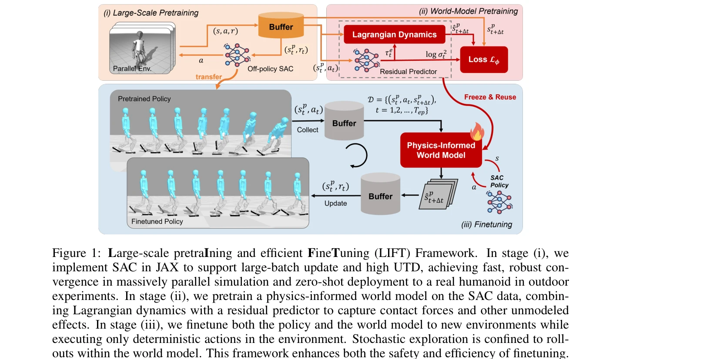
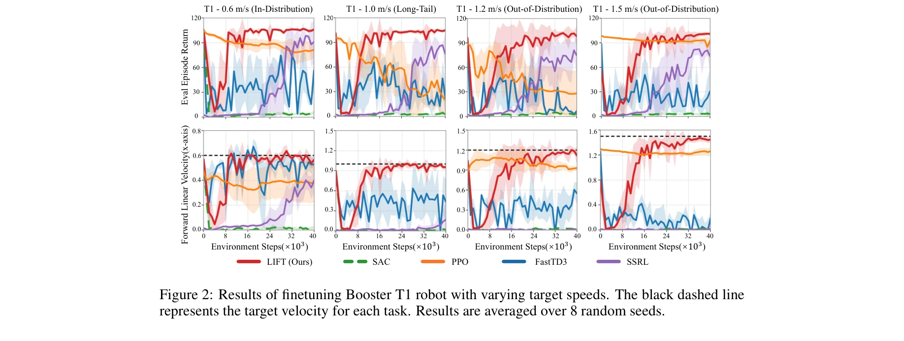

# Towards Bridging the Gap between Large-Scale Pretraining and Efficient Finetuning for Humanoid Control

> **저자**: Weidong Huang, Zhehan Li, Hangxin Liu, Biao Hou, Yao Su, Jingwen Zhang | **날짜**: 2026-01-29 | **URL**: [https://arxiv.org/abs/2601.21363](https://arxiv.org/abs/2601.21363)

---

## Essence

*Figure 1: Large-scale pretraIning and efficient FineTuning (LIFT) Framework. In stage (i), we*

대규모 병렬 시뮬레이션에서 SAC 기반 정책 사전학습과 물리-정보 기반 세계 모델을 활용한 효율적 미세조정을 결합하여 휴머노이드 로봇의 시뮬-투-리얼 전이와 안전한 적응을 실현한다.

## Motivation

- **Known**: PPO는 대규모 병렬 시뮬레이션에서 강력한 수렴을 보이고 실로봇 무샷 배포를 달성하지만, 온-정책 알고리즘의 낮은 샘플 효율성으로 인해 새로운 환경으로의 안전한 적응이 제한된다. 오프-정책 RL과 모델-기반 RL은 개선된 샘플 효율을 보이지만 휴머노이드 로봇의 대규모 사전학습과 효율적 미세조정 간의 격차는 여전히 존재한다.
- **Gap**: 기존 오프-정책 방법들은 환경 내 확률적 탐색 시 안전성 문제를 야기하고 대규모 병렬 시뮬레이션을 충분히 활용하지 못했으며, 물리-정보 기반 세계 모델 학습은 처음부터 훈련 시 시간이 오래 걸린다.
- **Why**: 휴머노이드 로봇은 작은 지지 다각형과 높은 불안정성으로 인해 무작위 탐색에 민감하므로, 안전하면서도 샘플 효율적인 적응 기법이 필수적이다.
- **Approach**: LIFT 프레임워크는 세 단계로 구성된다: (i) JAX 기반 SAC를 이용한 대규모 병렬 정책 사전학습, (ii) Lagrangian 역학과 잔차 예측기를 결합한 물리-정보 세계 모델 사전학습, (iii) 결정적 정책 실행과 세계 모델 내 확률적 탐색을 분리한 미세조정.

## Achievement

*Figure 2: Results of finetuning Booster T1 robot with varying target speeds. The black dashed line*

**확장 가능한 SAC 구현**: JAX 기반 SAC가 대규모 병렬 시뮬레이션에서 강력한 수렴을 지원하고 단일 NVIDIA RTX 4090에서 1시간 내에 실제 휴머노이드 로봇으로의 무샷 배포 달성
**안전하고 효율적인 미세조정 전략**: 결정적 정책 실행과 세계 모델 내 확률적 탐색 분리를 통해 적응 중 위험성 완화 및 샘플 효율성 개선
**공개 소스 파이프라인**: 사전학습, 무샷 배포, 미세조정을 아우르는 통합 휴머노이드 제어 파이프라인 공개

## How

*Figure 1: Large-scale pretraIning and efficient FineTuning (LIFT) Framework. In stage (i), we*

- JAX 기반 SAC 구현으로 대규모 배치 업데이트와 높은 Update-To-Data(UTD) 비율 지원
- Domain randomization을 활용한 견고한 정책 사전학습
- Lagrangian 역학을 기본 구조로 하고 학습된 잔차 예측기로 접촉력 등 미모델링 효과 포착하는 물리-정보 세계 모델
- 새로운 환경에서 결정적 정책만 실행하고 세계 모델 롤아웃 내에서만 확률적 탐색 수행
- 정책과 세계 모델을 동시에 미세조정

## Originality

- 기존 PPO 중심의 대규모 휴머노이드 학습을 오프-정책 SAC로 전환하여 샘플 재사용 가능성 확보
- 확률적 탐색과 결정적 정책 실행의 명확한 분리를 통한 미세조정 안전성 개선
- 물리-정보 세계 모델을 사전학습된 정책 데이터로부터 학습하여 훈련 시간 단축
- 실제 휴머노이드(Booster T1)를 이용한 시뮬-투-리얼 검증 및 현장 미세조정 실험

## Limitation & Further Study

- 오픈 루프 미세조정으로 제한되어 있으며, 시간에 따른 정책 성능 저하 또는 환경 변화에 대한 지속적 적응 가능성 미명확
- 물리-정보 모델이 Lagrangian 구조에 기반하므로 마찰, 공기 저항 등 비에너지 보존 효과 모델링에 제한
- 새로운 작업(예: 조작)으로의 확장 가능성 및 다양한 휴머노이드 플랫폼으로의 일반화 미검증
- 세계 모델 편향이 장기 미세조정 성능에 미치는 영향에 대한 심화 분석 부재

## Evaluation

- Novelty: 4/5
- Technical Soundness: 3/5
- Significance: 4/5
- Clarity: 4/5
- Overall: 4/5

**총평**: 본 논문은 대규모 시뮬레이션 효율성과 샘플-효율적 적응을 효과적으로 결합하고, 안전성을 강조한 미세조정 전략으로 휴머노이드 제어의 실질적 도전을 해결한다. 실로봇 검증과 공개 코드는 로보틱스 커뮤니티에 즉시 활용 가능한 기초를 제공한다.
