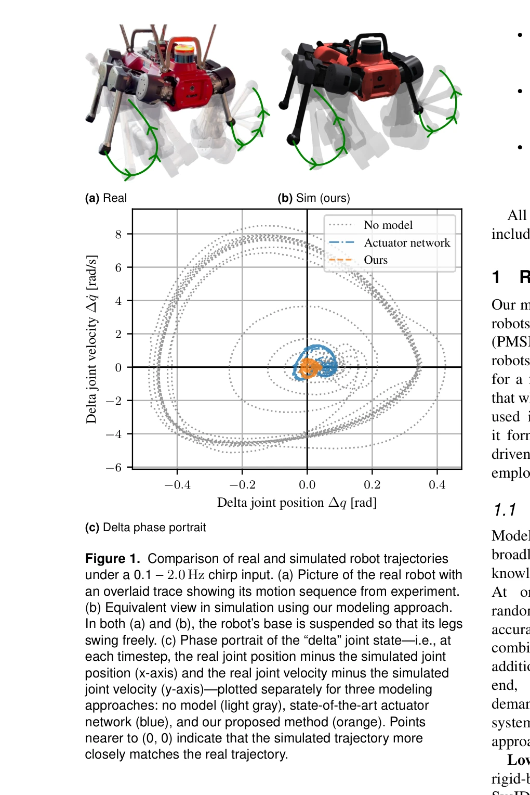
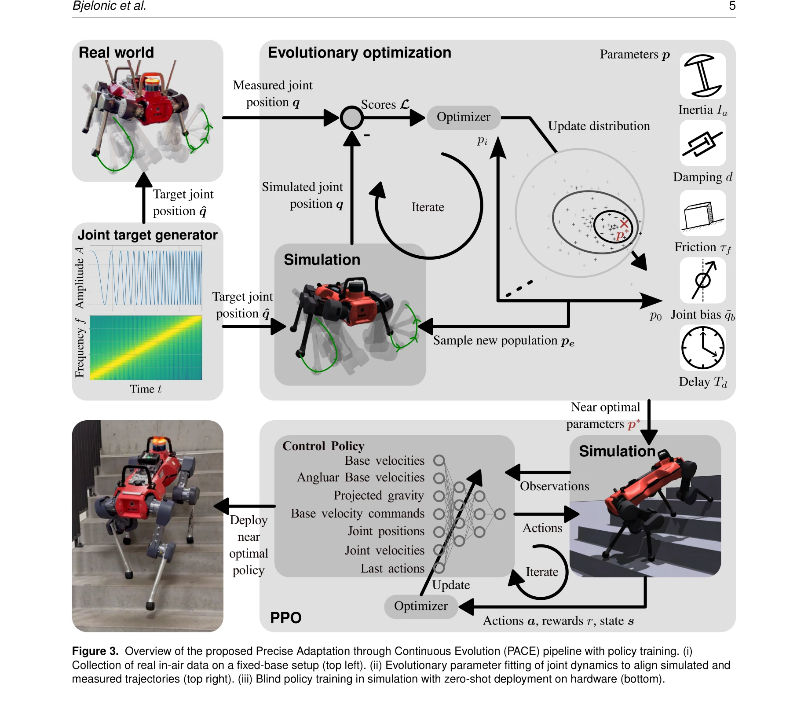

# Towards bridging the gap: Systematic sim-to-real transfer for diverse legged robots

> **저자**: Filip Bjelonic, Fabian Tischhauser, Marco Hutter | **날짜**: 2025-09-08 | **URL**: [https://arxiv.org/abs/2509.06342](https://arxiv.org/abs/2509.06342)

---

## Essence

*Figure 1. Comparison of real and simulated robot trajectories*

이족 로봇의 시뮬레이션-실제 전이 문제를 해결하기 위해 강화학습과 영구자석 동기 전동기(PMSM)의 물리 기반 에너지 모델을 통합한 프레임워크를 제안하며, 최소한의 파라미터로 현실성을 확보하면서 에너지 효율성을 달성한다.

## Motivation

- **Known**: 시뮬레이션으로 학습한 컨트롤러는 실제 로봇에 안정적으로 전이되지 않으며, 기존 방법들은 광범위한 도메인 랜더마이제이션, 복잡한 보상 함수 튜닝, 또는 전문 센서를 요구한다.
- **Gap**: 기존 접근법들은 엑추에이터의 전기적·기계적 손실을 무시하거나 복잡한 손으로 조정된 보상 공식을 의존하며, 실제 시스템 요구사항과 단순성 사이의 불균형이 존재한다.
- **Why**: 다리 로봇의 실용적 배포를 위해서는 견고한 로컬로모션과 에너지 효율성이 모두 필수적이며, 액추에이터 손실 모델링의 정확성은 로봇의 지구력과 페이로드 용량에 직접 영향을 미친다.
- **Approach**: Bottom-up 동적 파라미터 식별을 통해 액추에이터 레벨에서 시작하여 전체 로봇 시스템으로 확대하고, PMSM의 전기적·기계적 손실을 물리 원칙에 기반한 4항 보상 함수로 모델링한다.

## Achievement

*Figure 1. Comparison of real and simulated robot trajectories*

- **Sim-to-real 파이프라인**: 액추에이터 및 시스템 모델을 RL 훈련에 통합하는 오픈소스 모델링 파이프라인 개발
- **Bottom-up 성능 분석**: 단일 액추에이터부터 전체 로봇 로컬로모션까지 다단계 평가 및 최신 블랙박스 방법과의 비교
- **교차 플랫폼 검증**: ANYMAL, TYTAN, MINIMAL 등 3개 주요 플랫폼과 10개 이상의 추가 로봇 시스템에서 신뢰할 수 있는 정책 전이 달성
- **에너지 효율성 개선**: ANYMAL의 전체 수송 비용(Cost of Transport) 32% 감소 달성 (값: 1.27)

## How

*Figure 3. Overview of the proposed Precise Adaptation through Continuous Evolution (PACE) pipeline with policy training.*

- PMSM의 전기적 손실과 기계적 손실을 분리하여 모델링하고 물리 기반 에너지 공식 도입
- 최소 파라미터 집합으로 시뮬레이션-현실 간격을 포착하는 간결한 4항 보상 함수 설계 (각 항의 물리적 해석 유지)
- 다단계 검증: 액추에이터 특성화 → 전체 로봇 공중 궤적 식별 → 지상 로컬로모션 검증
- 관절 위치 제어 전략에 위치 포화(position saturation) 통합으로 하드웨어 보호 강화
- 동적 파라미터 랜더마이제이션 없이 신뢰성 있는 정책 전이 달성

## Originality

- PMSM의 물리 기반 에너지 모델을 RL 보상 함수에 직접 통합한 최초의 체계적 접근
- Bottom-up 파라미터 식별 방식으로 단순한 블랙박스 신경망 대신 물리적으로 해석 가능한 모델 제시
- 액추에이터 드라이브 동역학의 선형성을 실증하여 파라미터 최적화 가속화
- 복잡한 도메인 랜더마이제이션이나 잔여 모델링 없이 최소 파라미터로 신뢰할 수 있는 전이 달성
- 3개 플랫폼과 10개 추가 로봇에서 교차 검증하는 광범위한 실증적 근거 제공

## Limitation & Further Study

- PMSM을 사용하지 않는 로봇(유압식, 다른 액추에이터)에 대한 일반화 가능성 불명확
- 제안된 방법의 계산 복잡도 및 온라인 배포 성능에 대한 상세 분석 부재
- 서로 다른 로봇 플랫폼 간 파라미터 전이의 한계와 조정이 필요한 파라미터 범위에 대한 논의 부족
- 실시간 환경 변화(지형 변화, 동역학 왜곡)에 대한 적응성 및 강건성 평가 미흡
- 후속 연구로 온라인 적응 메커니즘 통합, 다양한 액추에이터 타입 확대, 동적 환경에서의 점진적 학습 방법 필요

## Evaluation

- Novelty: 4/5
- Technical Soundness: 4/5
- Significance: 4/5
- Clarity: 4/5
- Overall: 4/5

**총평**: 이 논문은 물리 기반 모델링과 강화학습을 체계적으로 결합하여 실제 다리 로봇의 시뮬레이션 전이 문제를 효과적으로 해결하며, 광범위한 플랫폼 검증과 에너지 효율성 개선으로 높은 실용성과 신뢰성을 입증한다.

## Related Papers

- 🏛 기반 연구: [[papers/1675_Sim-to-Real_of_Humanoid_Locomotion_Policies_via_Joint_Torque/review]] — Sim-to-Real of Humanoid Locomotion의 관절 토크 기반 전이 기법이 PMSM 에너지 모델을 통한 체계적 전이의 기반 방법론을 제공합니다.
- 🔄 다른 접근: [[papers/2151_Toward_Reliable_Sim-to-Real_Predictability_for_MoE-based_Rob/review]] — PMSM 에너지 모델은 이족 로봇의 물리 기반 접근을 사용하고 MoE-based Robust Quadruped은 사족 로봇의 혼합 전문가 모델을 사용하는 서로 다른 전이 방법입니다.
- 🧪 응용 사례: [[papers/1673_Sim-and-Real_Co-Training_A_Simple_Recipe_for_Vision-Based_Ro/review]] — PMSM 기반 에너지 효율 모델링을 vision-based robotic learning의 sim-and-real co-training에 적용하여 더 현실적인 에너지 제약을 반영할 수 있습니다.
- 🔄 다른 접근: [[papers/2061_Learning_Sim-to-Real_Humanoid_Locomotion_in_15_Minutes/review]] — 두 논문 모두 sim-to-real 전이를 다루지만 이 논문은 에너지 효율성에, Learning Sim-to-Real Humanoid Locomotion은 빠른 학습에 중점을 둡니다.
- 🏛 기반 연구: [[papers/1850_Contrastive_Representation_Learning_for_Robust_Sim-to-Real_T/review]] — 시뮬레이션-실제 전이에서 대조 표현 학습이 제공하는 견고성이 PMSM 에너지 모델 기반 전이 방법론의 이론적 기반이 됩니다.
- 🔗 후속 연구: [[papers/1829_Bridging_the_Sim-to-Real_Gap_for_Athletic_Loco-Manipulation/review]] — 운동 조작에서의 sim-to-real gap 해결을 systematic한 sim-to-real transfer로 확장하여 더 일반적인 해결책을 제시한다.
- 🔗 후속 연구: [[papers/1877_DiffCoTune_Differentiable_Co-Tuning_for_Cross-domain_Robot_C/review]] — 체계적 시뮬레이션-현실 전이 격차 해소로 발전됩니다.
- 🏛 기반 연구: [[papers/2107_MOSAIC_Bridging_the_Sim-to-Real_Gap_in_Generalist_Humanoid_M/review]] — 체계적인 sim-to-real 전이 연구가 MOSAIC의 시뮬레이션-실제 gap 해결을 위한 이론적 기반을 제공한다.
- 🔄 다른 접근: [[papers/2151_Toward_Reliable_Sim-to-Real_Predictability_for_MoE-based_Rob/review]] — RoboGauge는 MoE 기반 사족 로봇에 집중하고 systematic sim-to-real transfer는 이족 로봇의 PMSM 에너지 모델을 사용하는 서로 다른 접근법입니다.
