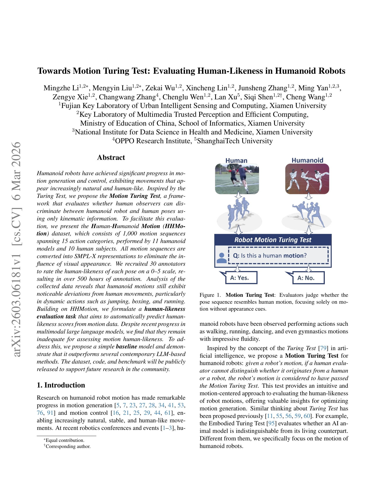
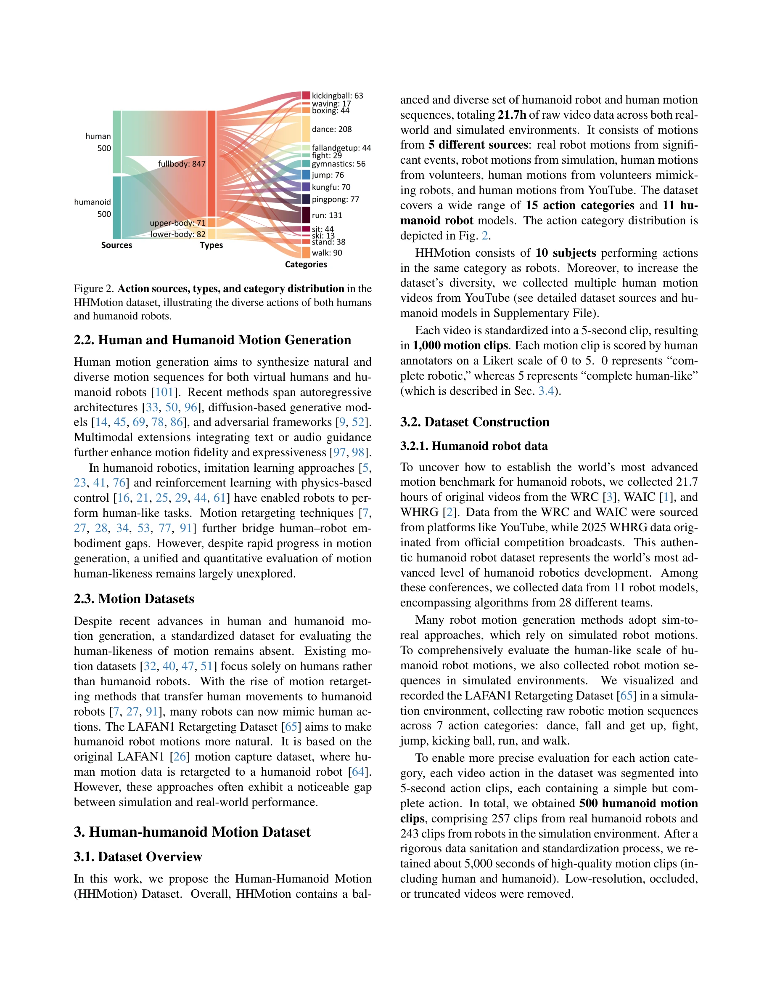
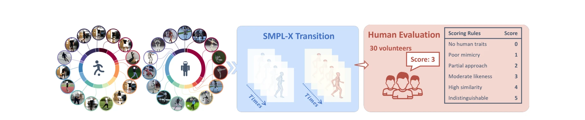

# Towards Motion Turing Test: Evaluating Human-Likeness in Humanoid Robots

> **저자**: Mingzhe Li, Mengyin Liu, Zekai Wu, Xincheng Lin, Junsheng Zhang, Ming Yan, Zengye Xie, Changwang Zhang, Chenglu Wen, Lan Xu, Siqi Shen, Cheng Wang | **날짜**: 2026-03-06 | **URL**: [https://arxiv.org/abs/2603.06181](https://arxiv.org/abs/2603.06181)

---

## Essence

*Figure 1.*

Motion Turing Test라는 개념을 제시하여 인간관찰자가 키네마틱 정보만으로 휴머노이드 로봇과 인간의 자세를 구분할 수 있는지를 평가하고, 이를 위해 1,000개의 모션 시퀀스로 구성된 HHMotion 데이터셋과 human-likeness 예측 기준선 모델을 제안한다.

## Motivation

- **Known**: 휴머노이드 로봇의 모션 생성 및 제어 기술이 상당한 진전을 이루었으며, 다양한 모션 생성 방법(autoregressive, diffusion-based, adversarial framework)이 존재한다. 그러나 모션의 human-likeness를 정량적으로 평가하는 통일된 방법이 부재하다.
- **Gap**: 기존 모션 데이터셋은 인간 모션에만 초점을 맞추거나 robot appearance 정보로 인해 평가가 편향될 수 있으며, 로봇과 인간 모션의 human-likeness를 직접 비교 평가할 수 있는 벤치마크와 정량화된 평가 메트릭이 없다.
- **Why**: 휴머노이드 로봇 모션의 자연스러움과 인간유사성은 로봇 개발의 핵심 목표이며, 이를 객관적으로 평가하고 개선하기 위한 체계적인 평가 프레임워크와 데이터가 필요하다.
- **Approach**: SMPL-X를 이용하여 RGB 비디오에서 텍스처 정보를 제거한 skeleton 기반 표현을 추출하고, 30명의 평가자가 0-5 Likert scale로 1,000개 모션 클립을 평가하여 ground truth human-likeness score를 구축한다. 이를 바탕으로 PTR-Net이라는 회귀 기반 기준선 모델을 제안하여 VLM 기반 방법들을 능가함을 보인다.

## Achievement

*Figure 2. Action sources, types, and category distribution in the*

- **HHMotion 데이터셋**: 11개 휴머노이드 로봇 모델과 10명의 인간 피험자로부터 수집한 21.7시간 분량의 1,000개 모션 클립, 15개 액션 카테고리, 500시간 이상의 human-likeness 점수 주석으로 구성
- **Motion Turing Test 프레임워크**: 모션의 human-likeness를 정량적으로 평가할 수 있는 체계적인 평가 기준 제시
- **상세한 분석**: 박싱, 점프, 달리기 등의 동적 액션에서 로봇 모션이 인간과 현저한 편차를 보이며, 걷기 같은 정적 액션에서는 더 유사함을 실증
- **PTR-Net 기준선 모델**: 다양한 prompt 전략을 사용한 VLM 기반 방법들(GPT-4V, Claude 등)을 능가하는 성능 달성
- **공개 자원**: 데이터셋, 코드, 벤치마크를 공개하여 향후 연구 지원

## How

*Figure 3. Overview of the human scoring pipeline, where all the humanoid robot and human motions are converted into SMPL*

- RGB 비디오에서 SMPL-X 전신 모델 추정으로 visual appearance 영향 제거 및 순수 모션 정보만 추출
- Motion Turing Test를 0-5 Likert scale의 회귀 작업으로 재정의하여 human-likeness 점수 예측
- Pose-Temporal Regression Network (PTR-Net) 설계: temporal 정보와 pose 정보를 결합하여 human-likeness 점수 회귀
- 30명의 평가자 리쿠르트 및 엄격한 annotation protocol 적용으로 신뢰성 있는 ground truth 구축
- 5개 소스(실제 로봇, 시뮬레이션 로봇, 자원봉사자 인간, 로봇 모방 인간, YouTube)에서 균형잡힌 데이터 수집
- VLM 기반 baseline(GPT-4V, Claude 등)과의 비교 평가를 통해 제안 모델의 우월성 입증

## Originality

- Motion Turing Test 개념의 명확한 정의 및 형식화: 기존의 모호한 Turing Test 개념을 모션 평가에 특화된 구체적인 프레임워크로 재구성
- Human-Humanoid Motion 직접 비교 데이터셋: 동일 액션을 수행하는 인간과 로봇 모션을 함께 수집하여 직접 비교 가능한 최초의 데이터셋
- SMPL-X 기반 appearance-agnostic 평가: 로봇 외형의 영향을 제거하고 순수 모션만으로 평가하는 혁신적 접근법
- 대규모 human-likeness annotation: 500시간 이상의 주석을 통한 신뢰성 있는 정량화된 평가 메트릭 제공
- human-likeness 회귀 작업의 공식화: 이진 판별이 아닌 연속적 human-likeness 점수 예측으로 더 세밀한 평가 가능

## Limitation & Further Study

- 평가 편향 가능성: 30명의 평가자 그룹이 제한적일 수 있으며, 문화적·배경적 차이가 human-likeness 인식에 영향을 미칠 수 있음
- SMPL-X 추정 오류: RGB 비디오에서 SMPL-X 모델을 추정하는 과정에서 발생하는 오류가 최종 평가에 영향을 줄 수 있음
- 액션 카테고리 한계: 15개 액션 카테고리는 모든 가능한 휴머노이드 로봇 모션을 대표하지 못할 수 있음
- 시뮬레이션과 실제 간격: 시뮬레이션 로봇 모션과 실제 로봇 모션 간의 성능 차이가 존재할 수 있음
- PTR-Net의 단순성: 제안된 기준선 모델은 상대적으로 단순하여 더 복잡한 temporal-spatial 특성을 충분히 포착하지 못할 가능성
- 후속 연구 방향: (1) 더 큰 규모의 평가자 풀을 통한 평가 신뢰성 강화, (2) 다양한 신체 유형의 로봇 포함, (3) human-likeness 점수를 보상 신호로 하는 reinforcement learning 기반 모션 생성 연구, (4) 다양한 문화권 평가자를 포함한 cross-cultural 분석, (5) temporal consistency와 physical plausibility 같은 추가 평가 차원 탐색

## Evaluation

- Novelty: 4/5
- Technical Soundness: 3/5
- Significance: 4/5
- Clarity: 4/5
- Overall: 4/5

**총평**: Motion Turing Test라는 명확한 개념 정의와 이를 뒷받침하는 포괄적인 HHMotion 데이터셋은 휴머노이드 로봇 모션 평가 분야에 중요한 기여를 한다. SMPL-X 기반 appearance-agnostic 평가 방식과 500시간의 대규모 인간 주석은 높은 신뢰성을 제공하며, 제안된 PTR-Net이 VLM 기반 방법들을 능가한 결과는 전문화된 모션 평가 모델의 필요성을 입증한다.

## Related Papers

- 🏛 기반 연구: [[papers/1758_Whole-body_Humanoid_Robot_Locomotion_with_Human_Reference/review]] — Whole-Body Humanoid Robot Locomotion의 인간 참조 기반 제어가 Motion Turing Test의 인간다움 평가를 위한 기준점을 제공합니다.
- 🔄 다른 접근: [[papers/1996_Humanoid_Locomotion_as_Next_Token_Prediction/review]] — Motion Turing Test는 관찰자 기반 인간다움 평가를 제안하고 Humanoid Locomotion as Next Token Prediction은 언어 모델 기반 접근법을 사용하는 서로 다른 평가 방식입니다.
- 🔗 후속 연구: [[papers/2000_Humanoid_Policy__Human_Policy/review]] — Motion Turing Test의 인간다움 평가 기준을 Humanoid Policy ~ Human Policy의 정책 유사성 측정과 결합하면 더 포괄적인 휴머노이드 성능 평가가 가능합니다.
- 🔗 후속 연구: [[papers/2133_PDF-HR_Pose_Distance_Fields_for_Humanoid_Robots/review]] — PDF-HR의 포즈 plausibility 평가를 실제 인간 관찰자 기반 human-likeness 판단으로 확장한 검증 방법이다.
- 🏛 기반 연구: [[papers/1816_Benchmarking_Humanoid_Imitation_Learning_with_Motion_Difficu/review]] — 모션 난이도 벤치마킹이 Motion Turing Test에서 human-likeness를 평가하는 기준 설정에 필요한 기초를 제공한다.
- 🏛 기반 연구: [[papers/1826_Biomechanical_Comparisons_Reveal_Divergence_of_Human_and_Hum/review]] — 인간과 휴머노이드의 biomechanical 차이 분석이 Motion Turing Test에서 human-likeness 평가 기준 설정의 과학적 근거를 제공함
- 🔗 후속 연구: [[papers/1882_Do_You_Have_Freestyle_Expressive_Humanoid_Locomotion_via_Aud/review]] — expressive locomotion 연구에 Motion Turing Test를 적용하면 인간다운 표현력의 정량적 평가가 가능해짐
- 🔄 다른 접근: [[papers/1695_StyleLoco_Generative_Adversarial_Distillation_for_Natural_Hu/review]] — StyleLoco의 GAN 기반 자연스러운 보행 생성과 Motion Turing Test의 인간 관찰자 기반 평가는 상호 보완적 접근법임
- 🔗 후속 연구: [[papers/1816_Benchmarking_Humanoid_Imitation_Learning_with_Motion_Difficu/review]] — Motion Difficulty Score를 확장하여 휴머노이드 모션의 human-likeness를 평가하는 motion turing test로 발전시킨다.
- 🔗 후속 연구: [[papers/1826_Biomechanical_Comparisons_Reveal_Divergence_of_Human_and_Hum/review]] — 인간다움 평가를 위한 Motion Turing Test가 GDAF의 생체역학적 차이 분석을 더욱 포괄적인 관점에서 확장한다
- 🏛 기반 연구: [[papers/2021_Implicit_Kinodynamic_Motion_Retargeting_for_Human-to-humanoi/review]] — 인간다운 동작 평가 메트릭이 IKMR의 모션 리타게팅 품질을 객관적으로 검증하는 기준 제공
- 🔗 후속 연구: [[papers/2088_Make_Tracking_Easy_Neural_Motion_Retargeting_for_Humanoid_Wh/review]] — 모션 리타겟팅의 품질을 Human-Likeness 평가 기준으로 확장하여 더 자연스러운 휴머노이드 동작을 달성할 수 있다.
- 🏛 기반 연구: [[papers/2133_PDF-HR_Pose_Distance_Fields_for_Humanoid_Robots/review]] — 휴머노이드 포즈의 plausibility 평가 기준이 Motion Turing Test의 human-likeness 평가 메트릭과 직접적으로 연관된다.
