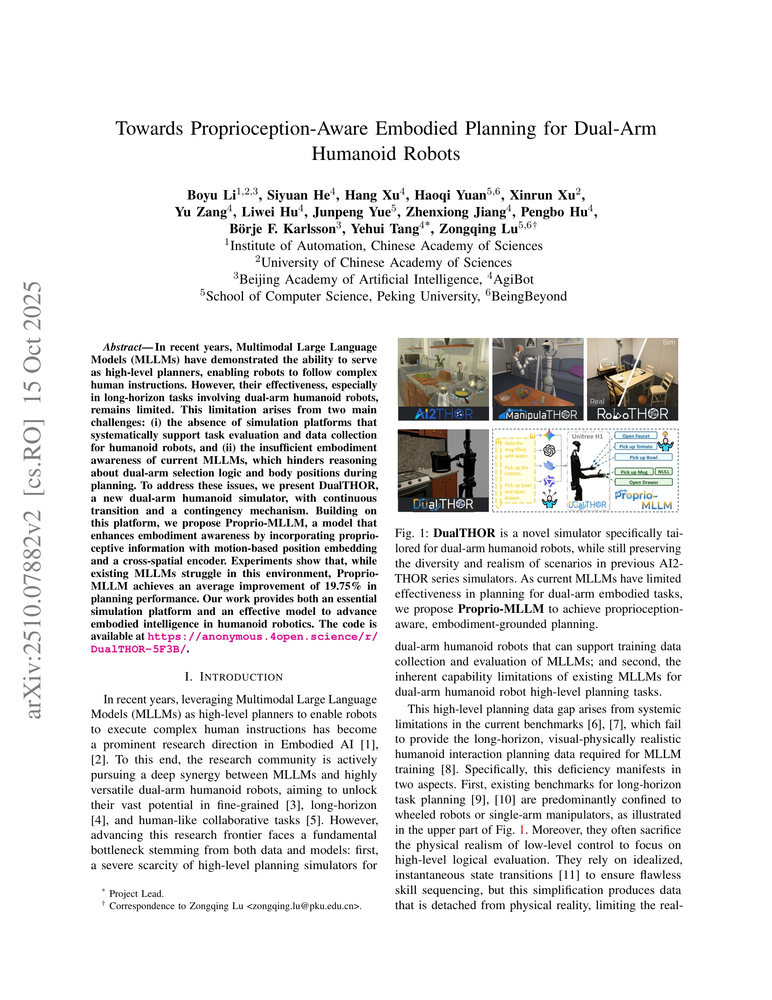
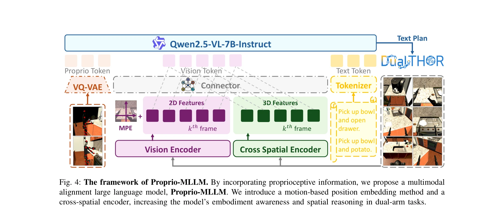

# Towards Proprioception-Aware Embodied Planning for Dual-Arm Humanoid Robots

> **저자**: Boyu Li, Siyuan He, Hang Xu, Haoqi Yuan, Xinrun Xu, Yu Zang, Liwei Hu, Junpeng Yue, Zhenxiong Jiang, Pengbo Hu, Börje F. Karlsson, Yehui Tang, Zongqing Lu | **날짜**: 2025-10-09 | **URL**: [https://arxiv.org/abs/2510.07882](https://arxiv.org/abs/2510.07882)

---

## Essence

*Fig. 1: DualTHOR is a novel simulator specifically tai-*

이 논문은 이중팔 휴머노이드 로봇의 장기 계획을 위해 DualTHOR 시뮬레이터와 고유감각(proprioception)을 인식하는 Proprio-MLLM을 제안하며, 기존 MLLM의 구현화 인식 부족을 해결한다.

## Motivation

- **Known**: MLLMs는 고수준 로봇 계획자로 활용되어 왔으나, 이중팔 휴머노이드 로봇의 장기 작업에서는 효과가 제한적이다. 기존 시뮬레이션 플랫폼들은 주로 바퀴달린 로봇이나 단일팔 매니퓰레이터에만 초점을 맞춰왔다.
- **Gap**: (i) 휴머노이드 로봇을 위한 장기 계획 데이터 수집 및 평가를 지원하는 통합 시뮬레이션 플랫폼의 부재, (ii) MLLMs의 불충분한 구현화 인식으로 인한 이중팔 선택 논리 및 신체 위치 추론의 어려움.
- **Why**: 이중팔 휴머노이드 로봇은 복잡한 일상 작업 수행의 잠재력이 크지만, 데이터 부족과 모델의 구현화 인식 부족이 이를 활용하기 위한 근본적인 병목이 되고 있다.
- **Approach**: DualTHOR이라는 새로운 이중팔 휴머노이드 시뮬레이터를 개발하여 연속 상태 전환과 우발 상황 메커니즘을 제공하고, Proprio-MLLM을 제안하여 고유감각 정보, motion-based position embedding, cross-spatial encoder를 통해 구현화 인식을 강화한다.

## Achievement

*Fig. 4: The framework of Proprio-MLLM. By incorporating proprioceptive information, we propose a multimodal*

- **DualTHOR 시뮬레이터**: AI2-THOR을 기반으로 한 이중팔 휴머노이드 로봇 전용 시뮬레이션 플랫폼으로, 연속 제어, 우발 상황 메커니즘, 다양한 가정용 이중팔 작업 스위트를 제공
- **Proprio-MLLM 모델**: 고유감각 정보를 통합하여 구현화 인식을 향상시킨 multimodal alignment MLLM으로, motion-based position embedding과 cross-spatial encoder를 도입
- **성능 개선**: 기존 MLLMs 대비 평균 19.75% 계획 성능 개선 달성

## How

*Fig. 4: The framework of Proprio-MLLM. By incorporating proprioceptive information, we propose a multimodal*

- Unity 엔진 기반의 물리 엔진으로 정밀한 이중팔 상호작용 시뮬레이션
- 연속 상태 전환을 통한 물리적으로 현실적인 로봇 동작 모델링
- 우발 상황 메커니즘으로 실행 오류에 대한 재계획 능력 개발
- 고유감각 정보(joint configuration, hand position, body state 등)를 MLLM의 임베딩 공간에 얕은 융합(shallow fusion) 방식으로 통합
- Motion-based position embedding으로 로봇의 신체 위치 인식 강화
- Cross-spatial encoder로 공간 추론 능력 개선

## Originality

- 기존 AI2-THOR 기반 플랫폼 중 처음으로 이중팔 휴머노이드 로봇을 중점적으로 지원하는 시뮬레이터 개발
- 연속 제어와 우발 상황 메커니즘을 결합한 현실적인 장기 계획 환경 제공
- 고유감각 정보를 MLLM에 명시적으로 통합하는 novel 접근법으로 구현화 인식 강화
- 이중팔 작업의 고수준 계획과 저수준 제어를 동시에 평가할 수 있는 통합 벤치마크 제공

## Limitation & Further Study

- 현재 두 가지 휴머노이드 로봇(Unitree H1, Boston Dynamics Atlas)으로만 검증되었으므로 다양한 로봇 형태에 대한 일반화 가능성 미확인
- 시뮬레이션 환경의 물리 엔진 단순화로 인한 sim-to-real 갭이 완전히 해결되지 않았을 가능성
- 고유감각 정보의 활용이 motion-based embedding과 cross-spatial encoder에만 제한되어 있으며, 더 심화된 구현화 인식 기법의 탐색 필요
- 후속 연구는 실제 로봇에서의 성능 검증, 더 복잡한 협력 작업 시나리오 추가, 다양한 신체 형태에 대한 적응적 고유감각 정보 통합 방향으로 진행되어야 함

## Evaluation

- Novelty: 4/5
- Technical Soundness: 3/5
- Significance: 4/5
- Clarity: 4/5
- Overall: 4/5

**총평**: 이 논문은 이중팔 휴머노이드 로봇의 장기 계획을 위한 체계적인 시뮬레이션 플랫폼과 고유감각 기반 MLLM을 제시함으로써 구현화 AI 분야에 중요한 기여를 한다. 실제 로봇에서의 성능 검증과 더 복잡한 협력 작업 확장이 이루어진다면 더욱 영향력 있는 연구가 될 것이다.

## Related Papers

- 🏛 기반 연구: [[papers/1974_Hierarchical_Vision-Language_Planning_for_Multi-Step_Humanoi/review]] — Hierarchical Vision-Language Planning의 다단계 계획 기법이 dual-arm 휴머노이드의 고유감각 인식 구현화 계획을 위한 기반 방법론을 제공합니다.
- 🔄 다른 접근: [[papers/2161_Trinity_A_Modular_Humanoid_Robot_AI_System/review]] — Proprio-MLLM은 고유감각 인식에 집중하고 Trinity는 모듈러 휴머노이드 AI 시스템을 통한 서로 다른 embodied intelligence 접근법입니다.
- 🔗 후속 연구: [[papers/1992_Humanoid_Agent_via_Embodied_Chain-of-Action_Reasoning_with_M/review]] — 고유감각 인식 MLLM을 Humanoid Agent의 chain-of-action reasoning과 결합하면 더 정확한 embodied planning과 실행이 가능합니다.
- 🏛 기반 연구: [[papers/1951_Genie_Sim_30__A_High-Fidelity_Comprehensive_Simulation_Platf/review]] — 고충실도 종합 시뮬레이션 플랫폼이 이중팔 휴머노이드의 고유감각 인식 계획에 필요한 시뮬레이션 환경을 제공한다.
- 🔄 다른 접근: [[papers/1847_Commanding_Humanoid_by_Free-form_Language_A_Large_Language_A/review]] — 고유감각 인식 MLLM 대신 자유 형식 언어를 통한 휴머노이드 명령 방식으로 구현화 문제를 다룬다.
- 🧪 응용 사례: [[papers/2089_ManiSkill-HAB_A_Benchmark_for_Low-Level_Manipulation_in_Home/review]] — 고유감각 인식 계획 기술이 가정 환경에서의 이중팔 저수준 조작 작업 수행에 직접 적용된다.
- 🔄 다른 접근: [[papers/1897_Ego-Vision_World_Model_for_Humanoid_Contact_Planning/review]] — 둘 다 고유감각을 활용한 휴머노이드 제어를 다루지만 이 논문은 이중팔 계획에, Ego-Vision World Model은 접촉 계획에 특화됩니다.
- 🔗 후속 연구: [[papers/2096_MetaWorld-X_Hierarchical_World_Modeling_via_VLM-Orchestrated/review]] — VLM 기반 계층적 세계 모델링 기법이 이중팔 휴머노이드의 고유감각 인식 계획 능력을 더욱 향상시킬 수 있습니다.
- 🏛 기반 연구: [[papers/1946_Generalizable_Geometric_Prior_and_Recurrent_Spiking_Feature/review]] — proprioception-aware embodied planning이 RGMP-S의 기하학적 선행 정보 활용에 이론적 기반을 제공한다.
