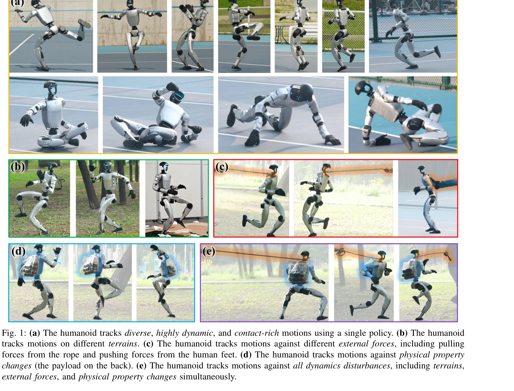
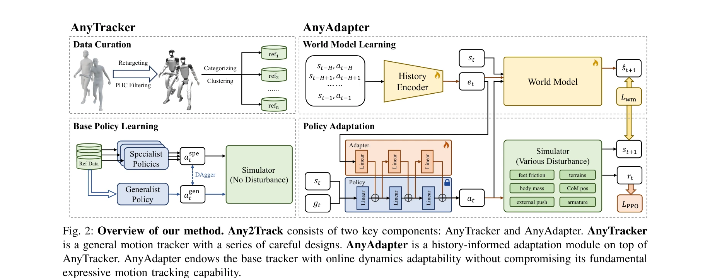

# Track Any Motions under Any Disturbances

> **저자**: Zhikai Zhang, Jun Guo, Chao Chen, Jilong Wang, Chenghuai Lin, Yunrui Lian, Han Xue, Zhenrong Wang, Maoqi Liu, Jiangran Lyu, Huaping Liu, He Wang, Li Yi | **날짜**: 2025-09-30 | **DOI**: [10.48550/arXiv.2509.13833](https://doi.org/10.48550/arXiv.2509.13833)

---

## Essence

*Fig. 1: (a) The humanoid tracks diverse, highly dynamic, and contact-rich motions using a single policy. (b) The humanoi*

Any2Track는 휴머노이드 로봇이 다양한 동작을 추적하면서 동시에 지형, 외력, 물리적 성질 변화 등 실제 환경 교란에 적응할 수 있도록 하는 두 단계 강화학습 프레임워크를 제안한다.

## Motivation

- **Known**: 기존 휴머노이드 모션 추적 방법들(GMT, ASAP 등)은 다양한 동작을 추적할 수 있지만, 실제 환경의 교란에 대한 적응 능력이 부족하거나 제한적이다. Domain randomization을 통한 단순한 강화성은 동적 변화에 대한 적극적 대응이 불가능하다.
- **Gap**: 통합된 단일 정책으로 다양하고 동적이며 접촉이 많은 동작을 추적하면서 동시에 온라인 동역학 적응을 통해 실제 환경의 여러 교란(지형, 외력, 물리적 특성 변화)에 대응할 수 있는 방법이 부재하다.
- **Why**: 휴머노이드 로봇의 실제 운용을 위해서는 단순한 동작 재현을 넘어 예측 불가능한 환경 변화에 강건하게 대응해야 하며, 이를 통해 일반적인 실용성을 갖춘 기초 모션 추적 시스템을 구축할 수 있다.
- **Approach**: Any2Track은 동역학 적응성을 기본 행동 실행 위의 추가 능력으로 재정의하며, 첫 번째 단계에서 AnyTracker로 일반적인 모션 추적 능력을 확보하고, 두 번째 단계에서 AnyAdapter를 통해 history 정보 기반의 온라인 적응을 수행한다.

## Achievement

*Fig. 1: (a) The humanoid tracks diverse, highly dynamic, and contact-rich motions using a single policy. (b) The humanoi*

- **통합 모션 추적 정책**: 정규화된 행동 공간과 specialist-to-generalist 전략을 통해 LAFAN1과 AMASS 데이터셋의 다양한 동작을 단일 정책으로 추적 가능
- **온라인 동역학 적응**: Dynamics-aware world model prediction을 보조 작업으로 사용하여 history 버퍼에서 추출한 동역학 임베딩을 통해 실시간 환경 적응
- **다중 교란 대응**: 지형, 외력(로프 당김, 사람의 밀기), 물리적 성질 변화(배 위의 하중) 등 여러 교란에 동시에 대응
- **Sim2real 성공**: Unitree G1 하드웨어에 zero-shot 전이로 성공적으로 배포되어 실제 환경에서 우수한 성능 달성

## How

*Fig. 2: Overview of our method. Any2Track consists of two key components: AnyTracker and AnyAdapter. AnyTracker*

- **AnyTracker 설계**: 복잡한 행동 공간으로 인한 최적화 어려움을 해결하기 위해 canonicalized action space 도입 및 specialist-to-generalist 학습 전략 적용
- **Adapter 아키텍처**: 기본 추적기의 파라미터 직접 미세조정 대신 adapter를 추가하여 동역학 임베딩을 입력으로 받아 행동을 적응적으로 조정
- **History 기반 동역학 인식**: 최근 상태 이력을 동역학 임베딩으로 인코딩하고 dynamics-aware world model prediction을 대리 작업으로 학습
- **Two-stage 분리 학습**: 동역학 교란이 없는 상태에서 AnyTracker 학습, 이후 동역학 변화를 도입하여 AnyAdapter 학습으로 추적 성능 저하 방지

## Originality

- 동역학 적응성을 추가 능력으로 명시적으로 재정의하고 두 단계 학습으로 분리하는 설계 철학의 혁신
- Dynamics-aware world model prediction을 보조 작업으로 활용하여 기존 온라인 적응 방법(RMA, DWL)보다 더 정보성 높은 동역학 표현 학습
- Adapter 아키텍처를 통해 기본 정책의 동작 추적 능력을 보존하면서 동역학 적응성을 추가하는 방식
- 지형, 외력, 물리적 성질 변화 등 여러 유형의 교란에 동시에 대응할 수 있는 통합된 적응 메커니즘

## Limitation & Further Study

- Unitree G1 플랫폼에서만 검증되었으며 다른 휴머노이드 로봇 플랫폼으로의 일반화 가능성이 명확하지 않음
- History 길이와 adapter 아키텍처의 설계 선택이 경험적 기반인 것으로 보이며, 이들이 성능에 미치는 영향에 대한 체계적 분석 필요
- Sim2real 전이 성공의 주요 기여 요인(domain randomization 수준, 시뮬레이션 환경 구성, 동역학 파라미터 범위 등)에 대한 상세한 분석 부재
- **후속 연구**: (1) 더 다양한 휴머노이드 플랫폼으로의 일반화, (2) 적응 모듈의 온라인 학습 속도 개선, (3) 보조 작업의 최적성 분석, (4) 예측 불가능한 새로운 교란 유형에 대한 대응 능력 강화

## Evaluation

- Novelty: 4/5
- Technical Soundness: 4/5
- Significance: 4/5
- Clarity: 4/5
- Overall: 4/5

**총평**: Any2Track는 동역학 적응성을 명시적으로 재정의하고 이를 기본 추적 능력과 분리하여 학습하는 혁신적 접근을 제시하며, Unitree G1에서 zero-shot sim2real 전이를 달성하여 실제 휴머노이드 로봇의 실용화에 중요한 기여를 한다.
