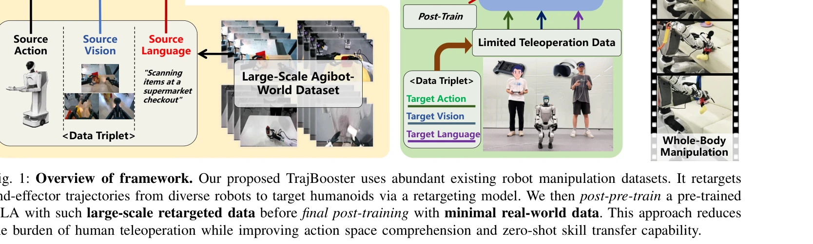

# TrajBooster: Boosting Humanoid Whole-Body Manipulation via Trajectory-Centric Learning

> **저자**: Jiacheng Liu, Pengxiang Ding, Qihang Zhou, Yuxuan Wu, Da Huang, Zimian Peng, Wei Xiao, Weinan Zhang, Lixin Yang, Cewu Lu, Donglin Wang | **날짜**: 2026-03-19 | **DOI**: [10.48550/arXiv.2509.11839](https://doi.org/10.48550/arXiv.2509.11839)

---

## Essence

*Fig. 1: Overview of framework. Our proposed TrajBooster uses abundant existing robot manipulation datasets. It retargets*

TrajBooster는 휠드 휴머노이드에서 추출한 다양한 궤적 데이터를 이족 휴머노이드(Unitree G1)로 전이학습하여, 부족한 이족 휴머노이드 데이터를 보충하고 Vision-Language-Action 모델의 성능을 향상시키는 실시간-시뮬레이션-실시간 파이프라인이다.

## Motivation

- **Known**: Vision-Language-Action 모델은 다양한 로봇 간 일반화 가능성을 보여주지만, 고품질 시연이 부족할 때 새로운 로봇의 액션 공간에 빠르게 적응하지 못한다. 특히 이족 휴머노이드의 전신 조작은 복잡한 동역학 균형 유지가 필요해 도전적이다.
- **Gap**: 기존 연구는 주로 탁상 조작이나 조잡한 전신 제어에 국한되어 있으며, 광범위한 높이에서의 이족 휴머노이드 전신 조작을 다루는 VLA 모델이 부족하다. 또한 이족 휴머노이드의 대규모 동작 데이터 수집은 비용이 높아 데이터 부족 문제가 심각하다.
- **Why**: 이족 휴머노이드의 가정용 조작 능력은 실제 환경에서의 로봇 자율성을 크게 향상시키며, 제한된 실제 데이터로도 효과적으로 훈련할 수 있는 방법은 로봇 응용의 실용성을 높인다.
- **Approach**: 말단 이펙터 6D 궤적을 형태학적 불변 인터페이스로 사용하여 휠드 휴머노이드 데이터를 이족 휴머노이드로 변환하고, heuristic-enhanced harmonized online DAgger를 통해 저차원 궤적 참조를 고차원 전신 동작으로 매핑한다. 생성된 합성 데이터로 VLA를 post-pre-train한 후 최소 10분의 실제 원격 조종 데이터로 미세조정한다.

## Achievement

*Fig. 1: Overview of framework. Our proposed TrajBooster uses abundant existing robot manipulation datasets. It retargets*

- **최초의 이족 휴머노이드 전신 조작 VLA**: 광범위한 끝점 궤적 커버리지를 가진 실제 환경에서의 첫 번째 cross-embodiment 이족 휴머노이드 전신 조작 VLA 달성
- **데이터 효율성 극대화**: 단 10분의 실제 원격 조종 데이터만으로 스쿼팅, 교차 높이 조작, 조정된 전신 운동 등의 가정용 작업 수행
- **강화된 강건성과 일반화**: 존재하는 휠드 휴머노이드 데이터를 활용하여 액션 공간 이해도와 영점(zero-shot) 기술 전이 능력 현저히 개선
- **형태학적 불변 인터페이스**: 말단 이펙터 궤적을 공통 인터페이스로 사용하여 다양한 로봇 형태 간 효과적인 지식 전이 가능

## How

*Fig. 1: Overview of framework. Our proposed TrajBooster uses abundant existing robot manipulation datasets. It retargets*

- Agibot-World Beta 데이터셋에서 휠드 휴머노이드의 6D 이중 팔 말단 이펙터 궤적 추출
- Isaac Gym 시뮬레이터에서 heuristic-enhanced harmonized online DAgger 알고리즘으로 Unitree G1의 전신 제어기 훈련하여 저차원 궤적 참조를 고차원 조인트 동작으로 매핑
- 생성된 합성 데이터로 ⟨source vision, source language, target action⟩ 형태의 이질적 삼중쌍 구성
- 기존 pre-trained VLA 모델을 합성 데이터로 post-pre-train한 후, 수집한 실제 원격 조종 데이터 ⟨target vision, target language, target action⟩로 미세조정
- Unitree G1 플랫폼에서 배포 및 다양한 전신 조작 작업에서 평가

## Originality

- **최초의 cross-embodiment 이족 휴머노이드 전신 조작**: 기존 연구를 넘어 휠드 휴머노이드에서 이족 휴머노이드로의 광범위 전신 조작 전이학습 달성
- **말단 이펙터 궤적 기반 실시간-시뮬레이션-실시간 파이프라인**: 형태학적 차이를 극복하는 새로운 cross-embodiment 전이 방식 제안
- **최소 실제 데이터 요구**: 기존 대규모 실제 데이터 수집의 필요성을 극적으로 감소시킴(10분)
- **Heuristic-enhanced harmonized online DAgger**: 저차원 궤적 참조를 고차원 전신 동작으로 효과적으로 매핑하는 새로운 훈련 알고리즘

## Limitation & Further Study

- **시뮬레이션-실제 간극(sim-to-real gap)**: 시뮬레이션 retargeting 결과가 실제 환경에서 완벽하게 재현되지 않을 수 있으며, 이로 인한 성능 저하 가능성
- **제한된 원본 데이터셋 의존성**: Agibot-World Beta 데이터셋의 작업 다양성과 질에 따라 성능이 크게 영향을 받을 수 있음
- **단일 타겟 플랫폼 평가**: Unitree G1에만 검증되어 다른 이족 휴머노이드로의 일반화 가능성 미검증
- **후속 연구 방향**: (1) 더 많은 이족 휴머노이드 플랫폼에서의 검증, (2) 도메인 적응 기법을 통한 sim-to-real 간극 감소, (3) 다양한 원본 로봇 형태로부터의 전이학습 효과 분석

## Evaluation

- Novelty: 4/5
- Technical Soundness: 3/5
- Significance: 4/5
- Clarity: 4/5
- Overall: 4/5

**총평**: TrajBooster는 형태학적으로 다른 로봇 간 전이학습이라는 어려운 문제에 대해 실용적이고 효과적인 해결책을 제시한다. 최소한의 실제 데이터만으로도 이족 휴머노이드의 광범위한 전신 조작을 가능하게 한 점에서 로봇 학습의 실용성 측면에서 매우 중요한 기여를 한다.
