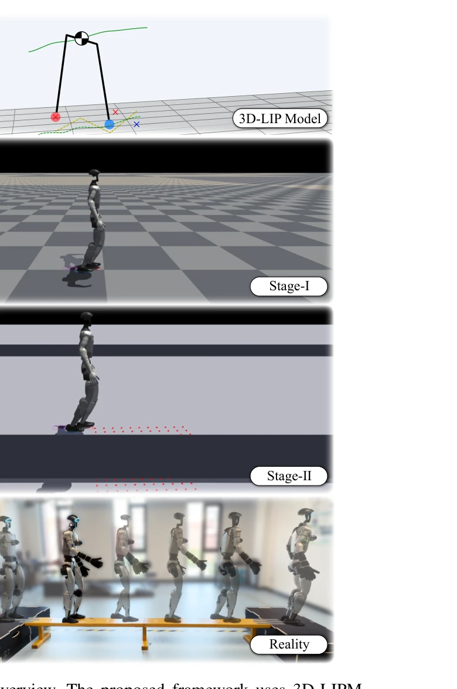
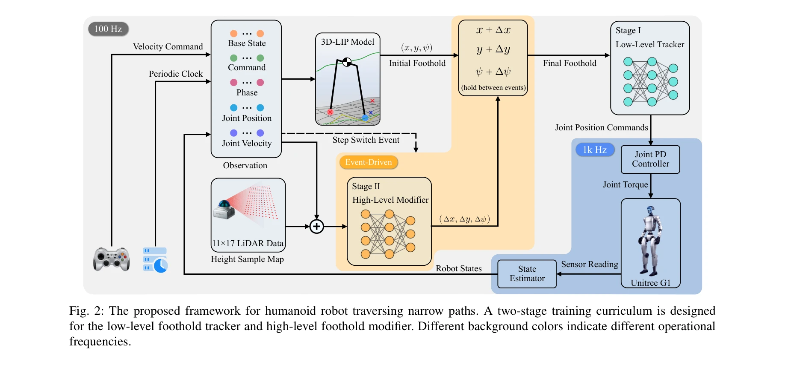

# Traversing Narrow Paths: A Two-Stage Reinforcement Learning Framework for Robust and Safe Humanoid Walking

> **저자**: TianChen Huang, Runchen Xu, Yu Wang, Wei Gao, Shiwu Zhang | **날짜**: 2025-08-28 | **URL**: [https://arxiv.org/abs/2508.20661](https://arxiv.org/abs/2508.20661)

---

## Essence

*Fig. 1: Overview. The proposed framework uses 3D-LIPM*

이 논문은 humanoid 로봇이 좁은 경로를 안전하게 통과하도록 하는 두 단계 reinforcement learning 프레임워크를 제안하며, physics-기반 LIPM foothold planner와 RL 기반 foothold tracker/modifier를 결합한다.

## Motivation

- **Known**: Physics-기반 foothold planning과 end-to-end RL 방법이 각각 존재하지만, 좁은 경로 같은 sparse foothold 환경에서는 순수 template-기반 방법은 모델 오차에 취약하고 순수 RL은 안전성과 해석 가능성이 부족하다.
- **Gap**: Physics-기반 모델과 data-driven 학습을 효과적으로 결합하여 sparse foothold 환경에서 높은 성공률과 안전성을 동시에 달성하는 방법이 부재하다.
- **Why**: Humanoid 로봇의 좁은 경로 통과는 로봇의 안전성과 자율성이 요구되는 실제 환경 배포에 중요하며, 0.2m 폭의 빔 통과는 현실적 도전 과제이다.
- **Approach**: Stage-I에서는 flat ground에서 LIPM 기반 planner의 foothold를 robustly track하는 low-level policy를 학습하고, Stage-II에서는 narrow path에서 body-frame residual을 생성하여 foothold를 안전하게 수정하는 high-level policy를 학습한다.

## Achievement

*Fig. 1: Overview. The proposed framework uses 3D-LIPM*

- **Two-stage curriculum learning framework**: Physics-guided foot placement learning으로 LIPM foothold를 bounded body-frame residual로 refine하는 구조
- **Minimal sensing requirement**: Compact anterior terrain height map과 onboard IMU/joint signal만으로 sim-to-real transfer 달성
- **Hardware validation**: Unitree G1 humanoid robot에서 0.2m 폭, 3m 길이의 빔을 20회 연속 성공 통과
- **성능 우월성**: Template-기반 또는 RL-기반 baseline 대비 success rate, centerline adherence, safety margin에서 우수한 성능

## How

*Fig. 2: The proposed framework for humanoid robot traversing narrow paths. A two-stage training curriculum is designed*

- 3D-LIPM을 이용한 초기 foothold target 계획으로 physics-based guidance 제공
- Stage-I: Flat ground에서 intentional target disturbance를 통해 robust foothold tracker 학습
- Stage-II: Narrow path에서 terrain-aware objectives를 최적화하여 foothold modifier 학습
- Body-frame residual을 bounded range로 제한하여 안전성 보장
- Low-level tracker에서 desired joint positions를 PD controller로 실행
- Anterior terrain height sampling map과 IMU/joint signals를 perception input으로 활용

## Originality

- Template-기반 foothold planner와 RL-기반 residual modifier의 명확한 분리로 interpretability와 generalization의 균형 달성
- Physics-guided curriculum (flat ground → narrow paths)을 통해 sparse reward 문제 해결
- Bounded body-frame residual 개념으로 안전성과 interpretability를 함께 보장하는 새로운 접근
- Minimal sensing 설계로 sim-to-real transfer의 domain gap 최소화

## Limitation & Further Study

- Narrow path 통과만 다루며, 더 복잡한 지형(계단, 불규칙 surface)에 대한 일반화 성능 미검증
- LIPM 모델은 3D 동역학을 완전히 포착하지 못하므로, 더 복잡한 terrain에서는 제한될 수 있음
- Stage-I과 Stage-II 간의 curriculum 설계가 휴리스틱한 부분이 있어, 다른 narrow path 기하학에 대한 적응성 미확인
- 후속 연구는 더 동적인 narrow path (moving obstacles, variable width) 환경과 다양한 humanoid 플랫폼에서의 검증 필요

## Evaluation

- Novelty: 4/5
- Technical Soundness: 3/5
- Significance: 4/5
- Clarity: 4/5
- Overall: 4/5

**총평**: 이 논문은 physics-기반 모델과 reinforcement learning을 창의적으로 결합하여 안전하고 해석 가능한 narrow path traversal을 달성했으며, 실제 humanoid robot에서 높은 성공률로 검증함으로써 로봇 제어의 실질적 응용 가치를 입증했다.
