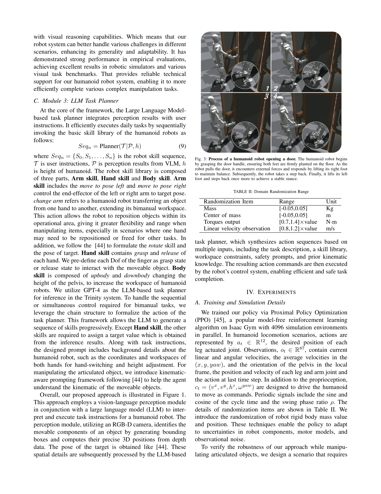

# Trinity: A Modular Humanoid Robot AI System

> **저자**: Jingkai Sun, Qiang Zhang, Gang Han, Wen Zhao, Zhe Yong, Yan He, Jiaxu Wang, Jiahang Cao, Yijie Guo, Renjing Xu | **날짜**: 2025-03-11 | **URL**: [https://arxiv.org/abs/2503.08338](https://arxiv.org/abs/2503.08338)

---

## Essence

*Fig. 1: Overview of the Modular Humanoid Robot AI System. In this system, task instructions are processed by both a visi*

LLM, VLM, RL을 통합한 모듈식 인간형 로봇 AI 시스템 Trinity를 제안하여 복잡한 환경에서 효율적인 제어를 실현한다. 계층적 아키텍처를 통해 언어 이해, 시각 인식, 동작 제어를 조화롭게 수행한다.

## Motivation

- **Known**: RL은 인간형 로봇의 동작 제어 성능을 향상시켰고, LLM과 VLM은 의미론적 계획과 환경 인식 능력을 제공한다. 하지만 기존 연구들은 이들 기술을 독립적으로 적용하거나 단순한 로봇 구성에만 적용해왔다.
- **Gap**: 복잡한 전신 제어와 조작이 필요한 인간형 로봇에서 RL, LLM, VLM을 효과적으로 통합하는 방법이 부재하며, 실제 로봇 플랫폼에서의 검증도 제한적이다.
- **Why**: 인간형 로봇이 인간 생활 공간에서 복잡한 작업을 수행하려면 언어 이해, 시각 인식, 안정적 동작 제어가 동시에 필요하며, 이는 로봇 지능화의 핵심 과제이다.
- **Approach**: 모듈식 계층 구조를 통해 LLM (의미론적 태스크 계획), VLM (환경 인식), RL (동작 제어)을 분리하고 상호작용하게 설계하여, 각 모듈의 독립적 최적화와 협력적 동작을 동시에 실현한다.

## Achievement

*Fig. 3: Process of a humanoid robot opening a door. The humanoid robot begins*

- **첫 통합 시스템**: LLM, VLM, RL을 인간형 로봇에 처음 통합하여 실제 대형 로봇에서의 실행 가능성과 효과성을 입증했다.
- **모듈식 계층 설계**: 복잡한 문제를 분해하고 교체 가능한 모델들로 처리하여 유연성과 확장성을 향상시켰다.
- **해석성과 안전성**: 다중 모듈 간 상호작용을 통해 시스템 해석성을 보장하고 로봇 동작의 안전성을 확보한다.

## How

*Fig. 1: Overview of the Modular Humanoid Robot AI System. In this system, task instructions are processed by both a visi*

- LLM을 사용하여 자연어 지시사항으로부터 의미론적 이해와 장기 태스크 계획을 수행
- VLM으로 환경 인식과 객체 감지를 통해 조작 대상의 위치와 특성을 파악
- RL 기반 보행 정책(locomotion policy)과 손 제어기(hand controller)로 안정적인 동작 제어 구현
- Arm Planner를 통해 상지 움직임에 대응하여 하지와 무게중심을 조정하여 균형 유지
- 시뮬레이션 환경에서 RL 정책을 학습하고 실제 로봇에 배포

## Originality

- 인간형 로봇의 전신 제어 문제에 RL, LLM, VLM을 처음으로 통합한 시스템 설계
- 보행(locomotion) 정책과 조작(manipulation) 네트워크를 분리하여 로코-조작 능력 향상
- 계층적 모듈 구조를 통해 각 기술의 장점을 활용하면서 시스템 안정성과 해석성을 동시에 확보
- 실제 대형 인간형 로봇 플랫폼에서의 포괄적 시스템 검증

## Limitation & Further Study

- 시뮬레이션-현실 간의 차이(sim-to-real gap)가 여전히 존재하며, 특히 복잡한 상호작용과 변형 가능한 환경에서의 일반화 능력 제한
- 데이터 수집 비용이 높으며, 특정 시나리오에 대한 의존성이 존재
- 모듈 간 통신 오류 또는 개별 모듈의 실패가 시스템 전체에 미치는 영향에 대한 분석 부재
- 후속 연구로 더 강력한 sim-to-real 전이 학습 기법, 온라인 학습과 적응(adaptation) 능력 강화, 복잡한 멀티-태스크 학습 방법 개발이 필요

## Evaluation

- Novelty: 4/5
- Technical Soundness: 3/5
- Significance: 4/5
- Clarity: 4/5
- Overall: 4/5

**총평**: Trinity는 RL, LLM, VLM을 효과적으로 통합한 혁신적 인간형 로봇 AI 시스템으로, 모듈식 설계를 통해 유연성과 해석성을 확보하고 실제 로봇에서의 동작을 입증함으로써 구현적 가치가 높다. 다만 sim-to-real 갭과 모듈 간 상호작용의 견고성에 대한 심화 분석이 필요하다.

## Related Papers

- 🔄 다른 접근: [[papers/1937_FRoM-W1_Towards_General_Humanoid_Whole-Body_Control_with_Lan/review]] — 모듈식 휴머노이드 AI 시스템과 일반적 전신 제어는 모두 통합적 접근법이지만 서로 다른 아키텍처 설계를 사용한다.
- 🔗 후속 연구: [[papers/1813_Being-0_A_Humanoid_Robotic_Agent_with_Vision-Language_Models/review]] — 비전-언어 모델 기반 휴머노이드 에이전트가 모듈식 AI 시스템의 구체적 확장이다.
- 🏛 기반 연구: [[papers/1812_Behavior_Foundation_Model_for_Humanoid_Robots/review]] — 행동 기반 모델이 모듈식 휴머노이드 AI 시스템의 핵심 기반이다.
- 🏛 기반 연구: [[papers/1915_Endowing_GPT-4_with_a_Humanoid_Body_Building_the_Bridge_Betw/review]] — GPT-4에 휴머노이드 신체를 부여하는 연구가 LLM, VLM, RL을 통합한 모듈식 AI 시스템 구축의 이론적 기반이 됩니다.
- 🔗 후속 연구: [[papers/2018_HYPERmotion_Learning_Hybrid_Behavior_Planning_for_Autonomous/review]] — 자율 휴머노이드를 위한 하이브리드 행동 계획 학습이 Trinity의 계층적 아키텍처를 실제 환경의 복잡한 작업으로 확장할 수 있습니다.
- 🧪 응용 사례: [[papers/1670_SENTINEL_A_Fully_End-to-End_Language-Action_Model_for_Humano/review]] — 언어 기반 휴머노이드 제어에서 SENTINEL의 언어-행동 모델이 Trinity의 모듈러 AI 시스템에 통합될 수 있다.
- 🔄 다른 접근: [[papers/1813_Being-0_A_Humanoid_Robotic_Agent_with_Vision-Language_Models/review]] — 계층적 휴머노이드 AI 시스템에서 하나는 Being-0, 다른 하나는 Trinity 모듈식 아키텍처를 제시한다.
- 🧪 응용 사례: [[papers/1819_Beyond_Tools_and_Persons_Who_Are_They_Classifying_Robots_and/review]] — Trinity 모듈식 인간형 로봇 AI 시스템이 제안된 CPST 공간 이론 기반 분류 프레임워크의 실제 적용 사례로 활용될 수 있다.
- 🧪 응용 사례: [[papers/1888_DreamZero_World_Action_Models_are_Zero-shot_Policies/review]] — VLA 모델의 이론적 프레임워크가 Trinity와 같은 modular humanoid AI system의 실제 구현에서 핵심 설계 원리로 활용된다.
- 🔗 후속 연구: [[papers/1893_ECHO_Edge-Cloud_Humanoid_Orchestration_for_Language-to-Motio/review]] — Trinity의 모듈형 AI 시스템이 ECHO의 엣지-클라우드 협업 구조를 더욱 체계화하고 확장한 형태입니다.
- 🧪 응용 사례: [[papers/1898_EgoActor_Grounding_Task_Planning_into_Spatial-aware_Egocentr/review]] — EgoActor의 VLM 기반 공간 인식 동작 변환이 Trinity의 modular humanoid AI system에서 핵심 구성 요소로 활용될 수 있다.
- 🧪 응용 사례: [[papers/1906_Embodiment-Aware_Generalist_Specialist_Distillation_for_Unif/review]] — Trinity의 모듈형 휴머노이드 로봇 AI 시스템이 EAGLE의 여러 이종 로봇 제어 프레임워크를 실제 통합 시스템에 적용하는 구체적인 사례를 제공한다.
- 🔄 다른 접근: [[papers/1937_FRoM-W1_Towards_General_Humanoid_Whole-Body_Control_with_Lan/review]] — FRoM-W1과 Trinity는 모두 언어 지시 기반 전신 제어를 목표로 하지만 서로 다른 모듈식 아키텍처를 사용한다.
- 🔄 다른 접근: [[papers/1951_Genie_Sim_30__A_High-Fidelity_Comprehensive_Simulation_Platf/review]] — 둘 다 통합된 휴머노이드 AI 시스템을 다루지만 Genie Sim은 시뮬레이션에, Trinity는 모듈식 실제 로봇에 초점을 맞춘다.
- 🧪 응용 사례: [[papers/1915_Endowing_GPT-4_with_a_Humanoid_Body_Building_the_Bridge_Betw/review]] — BiBo의 GPT-4 기반 embodied instruction compiler가 Trinity의 모듈형 휴머노이드 AI 시스템에 자연어 명령 처리 모듈로 통합될 수 있다.
- 🔄 다른 접근: [[papers/1992_Humanoid_Agent_via_Embodied_Chain-of-Action_Reasoning_with_M/review]] — Embodied Chain-of-Action과 Trinity의 modular AI system은 모두 고수준 추론을 humanoid 제어로 변환하는 서로 다른 아키텍처 접근법입니다.
- 🔄 다른 접근: [[papers/2157_Towards_Proprioception-Aware_Embodied_Planning_for_Dual-Arm/review]] — Proprio-MLLM은 고유감각 인식에 집중하고 Trinity는 모듈러 휴머노이드 AI 시스템을 통한 서로 다른 embodied intelligence 접근법입니다.
- 🔄 다른 접근: [[papers/2168_UniAct_Unified_Motion_Generation_and_Action_Streaming_for_Hu/review]] — Trinity의 modular AI system과 UniAct의 unified streaming framework는 휴머노이드 AI 시스템의 서로 다른 아키텍처 접근법임
