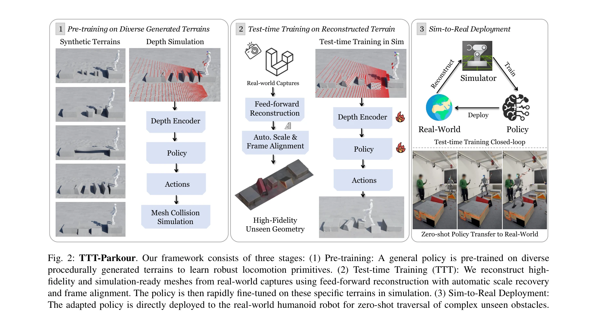
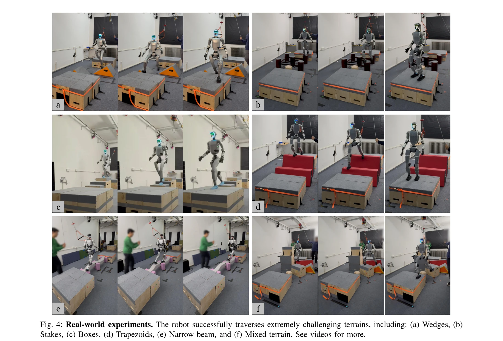
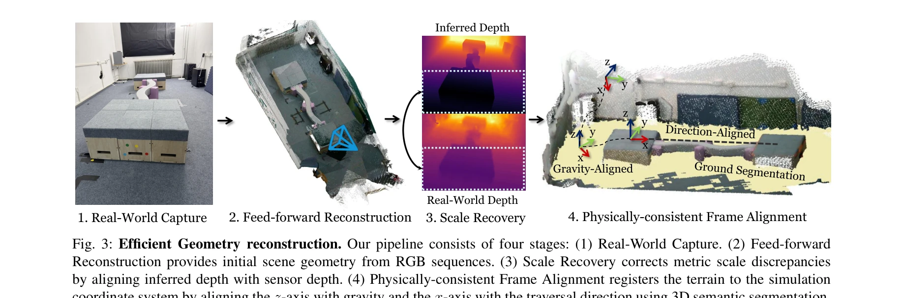

# TTT-Parkour: Rapid Test-Time Training for Perceptive Robot Parkour

> **저자**: Shaoting Zhu, Baijun Ye, Jiaxuan Wang, Jiakang Chen, Ziwen Zhuang, Linzhan Mou, Runhan Huang, Hang Zhao | **날짜**: 2026-02-02 | **DOI**: [10.48550/arXiv.2602.02331](https://doi.org/10.48550/arXiv.2602.02331)

---

## Essence

*Fig. 2: TTT-Parkour. Our framework consists of three stages: (1) Pre-training: A general policy is pre-trained on divers*

본 논문은 RGB-D 입력으로부터 고충실도 메시 재구성을 통해 미지의 복잡한 지형에서 휴머노이드 로봇의 빠른 테스트 시간 파인튜닝(TTT)을 가능하게 하는 real-to-sim-to-real 프레임워크를 제안한다.

## Motivation

- **Known**: 일반적인 보행 정책은 광범위한 지형 분포에서 강건성을 보이지만, 사전 학습 시 미지의 극도로 어려운 환경에는 일반화되지 못한다. NeRF와 3DGS 같은 고충실도 재구성 기법은 시각 합성에 우수하나 계산 비용이 높아 테스트 시간 적응에 부적합하다.
- **Gap**: 절차적으로 생성된 지형만으로 모든 현실 환경을 커버할 수 없으며, 피드포워드 재구성 방법은 스케일 모호성이나 기하학적 왜곡을 야기한다. 물리 시뮬레이션에 적합한 충돌 정확 메시를 10분 이내에 생성하는 것이 병목이다.
- **Why**: 휴머노이드 로봇의 도전적 환경 배포를 위해서는 사전 학습된 일반 정책과 실시간 적응을 결합하여 극도로 복잡한 장애물(쐐기, 말뚝, 상자, 사다리꼴, 좁은 빔 등)을 빠르게 극복할 수 있어야 한다.
- **Approach**: 두 단계 패러다임으로, 절차적 생성 지형에서 일반 정책을 사전 학습한 후 피드포워드 재구성 파이프라인(자동 스케일/프레임 정렬 포함)으로 실제 캡처로부터 시뮬레이션 준비 메시를 생성하고 테스트 시간 파인튜닝을 수행한다.

## Achievement

*Fig. 4: Real-world experiments. The robot successfully traverses extremely challenging terrains, including: (a) Wedges, *

- **두 단계 end-to-end 지각 보행 학습 패러다임**: 사전 학습과 테스트 시간 학습 모두 극도로 도전적인 지형 순회에 필수적임을 입증
- **고속 피드포워드 기하 재구성 파이프라인**: RGB-D 입력으로부터 시뮬레이션 준비 메시를 고충실도로 빠르게 생성하여 real-to-sim-to-real 워크플로우 효율성 확보
- **10분 이내 완전 파이프라인**: 캡처, 재구성, 테스트 시간 학습을 대부분의 지형에서 10분 이내에 완료
- **강건한 zero-shot sim-to-real 전이**: 테스트 시간 학습 후 정책이 실세계에서 강건한 민첩한 파쿠르 수행 능력 달성

## How

*Fig. 3: Efficient Geometry reconstruction. Our pipeline consists of four stages: (1) Real-World Capture. (2) Feed-forwar*

- CNN 기반 깊이 인코더와 고유감각을 결합한 관찰 공간 설계로 안정적 보행을 위한 종합적 상태 정보 제공
- PPO를 이용한 강화 학습으로 절차적 생성 지형 다양성에 대한 사전 학습
- 피드포워드 재구성 방법에 자동 스케일 복원 및 프레임 정렬 메커니즘 통합
- 재구성된 메시에 대한 정책의 빠른 파인튜닝으로 특정 지형 기하 제약 학습
- 깊이 카메라 입력을 기반으로 한 end-to-end 학습으로 고속 순회 중 강건성 확보
- 커리큘럼 학습을 통한 단계적 난이도 증가로 일반화 성능 향상

## Originality

- 로봇 파쿠르 영역에서 처음으로 rapid test-time training 패러다임 적용
- 스케일 모호성과 기하학적 왜곡을 극복하는 자동 스케일/프레임 정렬 기법이 포함된 피드포워드 재구성 파이프라인 개발
- 극도로 도전적인 지형(쐐기, 말뚝, 좁은 빔 등)에서의 동적 휴머노이드 파쿠르 실현
- 사전 학습과 테스트 시간 학습의 필수성을 실증적으로 입증하는 end-to-end 지각 보행 패러다임

## Limitation & Further Study

- 10분 파이프라인은 특정 지형 크기와 복잡도 범위에서만 평가되었으며, 더 큰 규모 또는 극도로 복잡한 지형에서의 확장성 미검증
- RGB-D 입력의 해상도와 깊이 정확도에 의존하며, 악천후나 반사 표면에서 재구성 품질 저하 가능성
- 피드포워드 재구성 방법이 매우 새로운 기하학적 특성을 완벽히 포착하지 못할 수 있음
- 테스트 시간 학습 과정에서의 계산 리소스 요구사항과 실시간 처리 가능성에 대한 상세 분석 부족
- 후속 연구: 더 큰 지형 규모로의 확장, 다중 센서 융합 전략, 시뮬레이션-현실 갭 최소화를 위한 도메인 무작위화 추가 연구

## Evaluation

- Novelty: 4/5
- Technical Soundness: 4/5
- Significance: 4/5
- Clarity: 4/5
- Overall: 4/5

**총평**: 본 논문은 피드포워드 기하 재구성과 빠른 테스트 시간 파인튜닝을 통합하여 휴머노이드 로봇의 미지 복잡 지형 순회 능력을 획기적으로 향상시키는 실용적이고 혁신적인 프레임워크를 제시한다. 10분 이내의 완전 파이프라인과 강건한 sim-to-real 전이는 로봇 배포의 현실성을 크게 높인다.

## Related Papers

- 🏛 기반 연구: [[papers/1861_Deep_Whole-body_Parkour/review]] — Deep Whole-body Parkour의 전신 파쿠어 기법이 TTT-Parkour의 빠른 테스트 시간 훈련을 위한 기본 파쿠어 기술 기반을 제공합니다.
- 🔄 다른 접근: [[papers/2134_Perceptive_Humanoid_Parkour_Chaining_Dynamic_Human_Skills_vi/review]] — TTT-Parkour는 RGB-D 기반 빠른 적응을 제안하고 Perceptive Humanoid Parkour는 동적 인간 스킬 연결을 통한 서로 다른 파쿠어 접근법입니다.
- 🔗 후속 연구: [[papers/1978_Hiking_in_the_Wild_A_Scalable_Perceptive_Parkour_Framework_f/review]] — TTT-Parkour의 실시간 메시 재구성 기법을 scalable perceptive parkour framework와 결합하면 더 광범위한 야외 지형 적응이 가능합니다.
- 🏛 기반 연구: [[papers/1942_GaussGym_An_open-source_real-to-sim_framework_for_learning_l/review]] — 실제에서 시뮬레이션으로의 메시 재구성 기술이 GaussGym의 open-source real-to-sim 프레임워크에 적용된다.
- 🏛 기반 연구: [[papers/1858_cuRoboV2_Dynamics-Aware_Motion_Generation_with_Depth-Fused_D/review]] — 동역학 인식 동작 생성과 깊이 융합 기법이 RGB-D 입력으로부터 고충실도 메시 재구성 기반 TTT 방법론의 기반이 됩니다.
- 🔗 후속 연구: [[papers/1619_PolygMap_A_Perceptive_Locomotion_Framework_for_Humanoid_Robo/review]] — PolygMap의 계단 등반 계획이 TTT-Parkour의 test-time 적응과 결합되어 더 동적인 환경 대응이 가능하다
- 🧪 응용 사례: [[papers/1755_Walk_the_PLANC_Physics-Guided_RL_for_Agile_Humanoid_Locomoti/review]] — TTT-Parkour의 실시간 적응형 parkour 기법이 PLANC의 제한된 발판 보행을 더 복잡한 지형으로 확장하는 데 활용될 수 있다.
- 🧪 응용 사례: [[papers/1789_Adapting_Humanoid_Locomotion_over_Challenging_Terrain_via_Tw/review]] — test-time training을 통한 실시간 적응이 Transformer 기반 terrain adaptation의 동적 환경 대응 능력을 강화할 수 있다.
- 🧪 응용 사례: [[papers/1791_Advancing_Humanoid_Locomotion_Mastering_Challenging_Terrains/review]] — TTT-Parkour의 test-time training 기법이 DWL의 zero-shot sim-to-real transfer 성능을 동적 환경에서 향상시킬 수 있다.
- 🧪 응용 사례: [[papers/1798_AME-2_Agile_and_Generalized_Legged_Locomotion_via_Attention-/review]] — teacher-student 학습 체계를 perceptive robot parkour에 적용하여 실시간 적응 능력을 향상시킨다.
