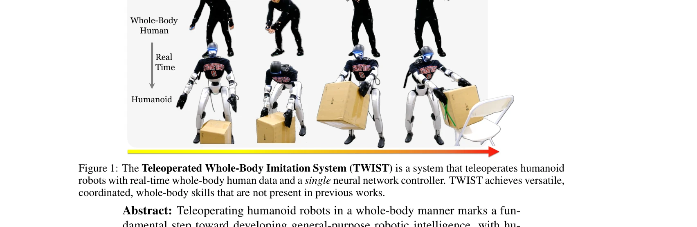
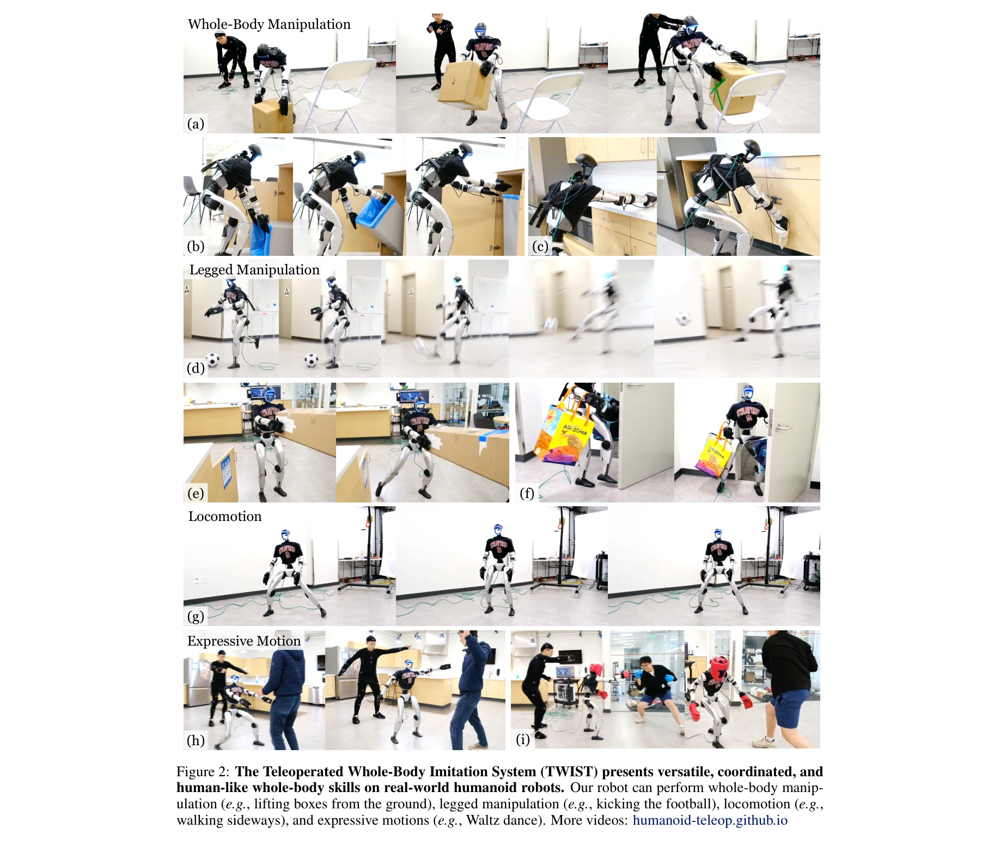

# TWIST: Teleoperated Whole-Body Imitation System

> **저자**: Yanjie Ze, Zixuan Chen, João Pedro Araújo, Zi-ang Cao, Xue Bin Peng, Jiajun Wu, C. Karen Liu | **날짜**: 2025-05-05 | **URL**: [https://arxiv.org/abs/2505.02833](https://arxiv.org/abs/2505.02833)

---

## Essence

*Figure 1: The Teleoperated Whole-Body Imitation System (TWIST) is a system that teleoperates humanoid*

TWIST는 모션 캡처 데이터의 실시간 리타겟팅과 RL+BC 기반의 통합 신경망 컨트롤러를 통해 휴머노이드 로봇의 전신 협응 제어를 실현하는 원격 조종 시스템이다.

## Motivation

- **Known**: 기존 휴머노이드 원격 조종 시스템은 보행 또는 조작 작업을 별도로 처리하는 모듈식 컨트롤러를 사용하거나 상체 동작만 캡처하여 전신 협응 능력이 제한적이다.
- **Gap**: 실시간 전신 추적 목표의 정확성 부족과 다양한 동작을 강건하게 추적하는 컨트롤러 개발의 어려움으로 인해 전신 협응 기술이 제한되어 있다.
- **Why**: 가정용 로봇이 문을 발로 열면서 양손에 물건을 들거나 쪼그려 앉아 상자를 들어올리는 등의 협응된 전신 동작을 수행할 수 있어야 범용 로봇으로 발전할 수 있다.
- **Approach**: 인터넷 인간 모션 데이터와 소규모 실시간 MoCap 데이터를 리타겟팅하여 휴머노이드 모션 데이터셋을 구성한 후, 이를 기반으로 미래 프레임 접근 권한이 있는 교사 정책과 단일 프레임만 관찰하는 학생 정책의 2단계 teacher-student 프레임워크로 RL+BC 컨트롤러를 학습한다.

## Achievement

*Figure 2: The Teleoperated Whole-Body Imitation System (TWIST) presents versatile, coordinated, and*

- **다양한 전신 협응 기술 달성**: 전신 조작, 다리 조작, 보행, 표현적 동작을 모두 단일 신경망으로 수행
- **저지연 원격 조종**: 실시간 MoCap 입력(120Hz)에서 50Hz 제어 루프로 반응성 있는 원격 조종 실현
- **분포 이동 완화**: 오프라인 데이터(15K 클립)와 소규모 온라인 MoCap 데이터(150 클립) 혼합으로 온라인 환경에서 강건성 향상
- **접촉 기반 작업 강화**: 엔드-이펙터 교란(perturbation) 학습으로 박스 들기 같은 힘 제어 작업 개선

## How

*Figure 3: The Teleoperated Whole-Body Imitation System (TWIST) consists of 3 stages: 1) curating a*

- 대규모 인터넷 휴먼 모션 데이터(~15K 클립)와 MoCap 장비로 수집한 소규모 데이터(150 클립)를 병합하여 모션 데이터셋 구성
- 오프라인 리타겟터로 고품질 참조 동작을 생성하고, 온라인 리타겟터로 실시간 인간 동작을 휴머노이드 관절 위치/근 속도로 변환
- Teacher 정책은 RL로 현재 + 미래 프레임(privileged future frames)을 관찰하여 부드러운 동작 학습, 학생 정책은 현재 프레임만 보고 teacher를 모방(BC)하여 저지연 달성
- 3D 관절 위치와 방향을 동시 최적화하여 오프라인-온라인 리타겟팅 간의 품질 격차 완화
- 도메인 랜더마이제이션(질량, 마찰, 모터 강도 등)과 엔드-이펙터 교란으로 sim-to-real 이행성 및 접촉 강건성 강화

## Originality

- Two-stage teacher-student 프레임워크로 저지연 원격 조종 요구사항과 부드러운 동작 학습의 상충을 체계적으로 해결
- 온라인 MoCap 데이터와 오프라인 데이터 혼합의 효과를 실증적으로 검증하여 분포 이동 문제를 실용적으로 해결
- 관절 위치+방향 동시 최적화 리타겟팅으로 온라인 속도 제약 환경에서 품질 유지
- 엔드-이펙터 교란 학습으로 motion tracking만으로는 학습 불가능한 힘 제어 기능 추가

## Limitation & Further Study

- MoCap 장비 의존으로 인한 공간 제약과 셋업 복잡성이 실제 배포 환경에서 확장성 제한
- 단일 대형 휴머노이드(Unitree G1, 29 DoF)에 대한 검증으로 다양한 로봇 형태로의 일반화 정도 불명확
- 학습 목표가 motion tracking에만 초점으로 높은 힘 제어나 정밀 조작이 필요한 복잡한 작업의 성능 미지수
- 실시간 리타겟팅의 안정성 문제로 인한 가끔의 불안정 행동이 여전히 발생 가능
- 후속 연구로 카메라 기반 자세 추정의 정확도 향상, 다양한 로봇 형태에 대한 적응 방법, 시각-청각 다중 모달 입력 통합 필요

## Evaluation

- Novelty: 4/5
- Technical Soundness: 4/5
- Significance: 4/5
- Clarity: 4/5
- Overall: 4/5

**총평**: TWIST는 전신 협응 휴머노이드 원격 조종의 오래된 과제를 teacher-student 프레임워크와 데이터 혼합 전략으로 우아하게 해결하며, 단일 신경망으로 다양한 협응 기술을 실현한 의미 있는 기여이다.

## Related Papers

- 🔄 다른 접근: [[papers/1756_Whole-Body_Bilateral_Teleoperation_with_Multi-Stage_Object_P/review]] — 전신 모방 원격조작과 양손 정교 원격조작은 모두 원격조작이지만 서로 다른 범위와 접근법을 사용한다.
- 🔗 후속 연구: [[papers/1839_CLONE_Closed-Loop_Whole-Body_Humanoid_Teleoperation_for_Long/review]] — 폐루프 전신 휴머노이드 원격조작이 전신 모방 시스템의 확장된 형태이다.
- 🏛 기반 연구: [[papers/1707_Teleoperation_of_Humanoid_Robots_A_Survey/review]] — 휴머노이드 로봇 원격조작 서베이가 전신 모방 시스템의 이론적 기반을 제공한다.
- 🏛 기반 연구: [[papers/1975_Hierarchical_visuomotor_control_of_humanoids/review]] — hierarchical visuomotor control이 TWIST의 RL+BC 기반 통합 신경망 컨트롤러의 핵심 구조적 기반을 제공함
- 🔗 후속 연구: [[papers/1690_Stability-Aware_Retargeting_for_Humanoid_Multi-Contact_Teleo/review]] — stability-aware retargeting과 TWIST의 실시간 리타겟팅을 결합하면 더 안정적인 전신 협응 제어 구현 가능
- 🔄 다른 접근: [[papers/2147_TeleGate_Whole-Body_Humanoid_Teleoperation_via_Gated_Expert/review]] — TeleGate의 gated expert 접근법과 TWIST의 통합 신경망 접근법은 휴머노이드 텔레오퍼레이션의 상이한 아키텍처를 비교할 수 있음
- 🏛 기반 연구: [[papers/2124_Open-TeleVision_Teleoperation_with_Immersive_Active_Visual_F/review]] — 몰입형 능동 시각 피드백을 통한 원격 조종 기법이 모션 캡처 데이터의 실시간 리타겟팅 기반 전신 협응 제어의 이론적 토대가 됩니다.
- 🔗 후속 연구: [[papers/1921_ExtremControl_Low-Latency_Humanoid_Teleoperation_with_Direct/review]] — 직접 행동 매핑을 통한 저지연 휴머노이드 원격 조종이 TWIST의 RL+BC 기반 통합 컨트롤러를 실시간 성능으로 향상시킬 수 있습니다.
- 🔗 후속 연구: [[papers/1690_Stability-Aware_Retargeting_for_Humanoid_Multi-Contact_Teleo/review]] — 텔레오퍼레이션 시스템의 안정성 개념을 Centroidal stability 기반으로 확장하여 다중 접촉 환경에서의 정밀한 제어를 실현했다.
- 🔗 후속 연구: [[papers/1839_CLONE_Closed-Loop_Whole-Body_Humanoid_Teleoperation_for_Long/review]] — TWIST의 전신 모방 시스템이 CLONE의 폐루프 제어에 더 정교한 전신 동작 모방 기능을 추가하여 확장된다.
- 🏛 기반 연구: [[papers/1842_CLOT_Closed-Loop_Global_Motion_Tracking_for_Whole-Body_Human/review]] — TWIST의 whole-body teleoperation 기술이 CLOT의 closed-loop global tracking 시스템 개발에 기본 프레임워크를 제공했다.
- 🔗 후속 연구: [[papers/1860_Deep_Imitation_Learning_for_Humanoid_Loco-manipulation_throu/review]] — 텔레오퍼레이션 전신 모방 시스템의 발전된 형태를 보여줍니다.
- 🔗 후속 연구: [[papers/2118_OmniClone_Engineering_a_Robust_All-Rounder_Whole-Body_Humano/review]] — OmniClone의 robust whole-body teleoperation을 TWIST의 전신 모방 시스템과 결합하여 더 포괄적인 휴머노이드 데이터 수집이 가능하다.
- 🔗 후속 연구: [[papers/2147_TeleGate_Whole-Body_Humanoid_Teleoperation_via_Gated_Expert/review]] — TWIST의 teleoperated whole-body imitation이 TeleGate의 gated expert selection을 더 포괄적인 imitation learning으로 확장한 형태입니다.
