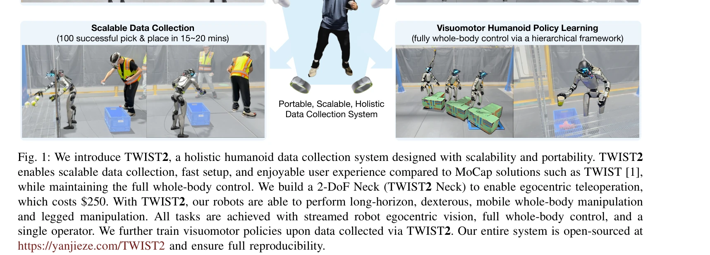
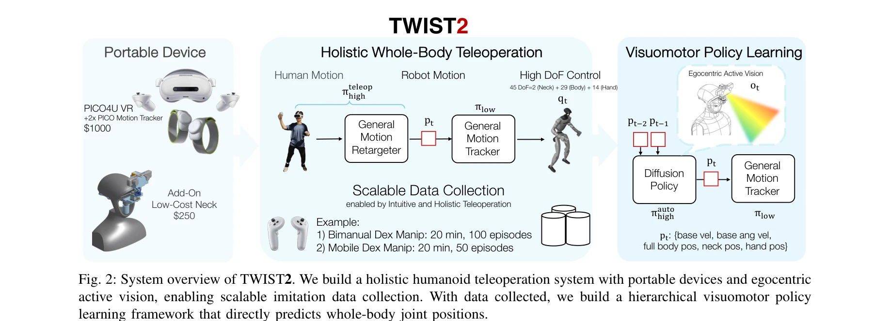

# TWIST2: Scalable, Portable, and Holistic Humanoid Data Collection System

> **저자**: Yanjie Ze, Siheng Zhao, Weizhuo Wang, Angjoo Kanazawa, Rocky Duan, Pieter Abbeel, Guanya Shi, Jiajun Wu, C. Karen Liu | **날짜**: 2025-11-04 | **DOI**: [10.48550/arXiv.2511.02832](https://doi.org/10.48550/arXiv.2511.02832)

---

## Essence

*Fig. 1: We introduce TWIST2, a holistic humanoid data collection system designed with scalability and portability. TWIST*

TWIST2는 mocap 없이 VR 기반의 포터블한 휴머노이드 텔레오퍼레이션 시스템으로, 전신 제어를 유지하면서 확장 가능한 데이터 수집을 가능하게 한다. 수집한 데이터로 hierarchical visuomotor policy를 학습하여 자율적인 전신 제어를 구현한다.

## Motivation

- **Known**: 기존 휴머노이드 텔레오퍼레이션 시스템은 motion capture 기반의 전신 제어(TWIST)는 포터블하지 못하고, VR 기반의 포터블 시스템(AMO, CLONE)은 부분적 제어만 가능한 한계가 있다.
- **Gap**: 전신 제어, 포터블성, 확장 가능성, 자기중심 시점(egocentric vision)을 모두 만족하는 휴머노이드 데이터 수집 시스템이 부재하다.
- **Why**: 대규모 데이터는 로봇 학습의 혁신을 주도했으나, 휴머노이드 로봇은 효과적인 데이터 수집 프레임워크가 부족하여 진전이 지연되고 있다.
- **Approach**: PICO4U VR 기기로 전신 인간 모션을 실시간 스트리밍하고, 저비용 2-DoF 로봇 목(약 $250)으로 자기중심 시각을 제공하며, 강화학습 기반 motion tracking controller와 hierarchical visuomotor policy를 통합한다.

## Achievement

*Fig. 1: We introduce TWIST2, a holistic humanoid data collection system designed with scalability and portability. TWIST*

- **포터블 mocap-free 시스템**: 1분 내 설치 가능하고 비용 효율적인 TWIST2 Neck 설계로 실외 환경에서의 배포 실현
- **확장 가능한 데이터 수집**: 15-20분 내 100개의 성공적인 시연 수집(거의 100% 성공률)
- **전신 제어 유지**: 팔, 다리, 몸통 포함 모든 관절을 통합 방식으로 직접 추적
- **장기적 복잡 작업**: 타올 폴딩/언폴딩, 문을 통한 물체 이송 등 다양한 전신 민첩성 기술 시연
- **자율 visuomotor 정책**: 자기중심 시각만으로 전신 제어 가능한 hierarchical diffusion-based policy 달성
- **완전 오픈소스**: 시스템, 수집 데이터, 모델 모두 공개하여 재현성 보장

## How

*Fig. 2: System overview of TWIST2. We build a holistic humanoid teleoperation system with portable devices and egocentri*

- PICO4U VR 디바이스(헤드셋, 핸드 컨트롤러, 발목 모션 트래커)를 통해 전신 인간 자세 캡처
- 2-DoF 로봇 목 설계로 자기중심 active stereo vision 제공(egocentric teleoperation 가능)
- 인간 자세에서 휴머노이드 관절 위치로의 holistic retargeting pipeline 구축
- 강화학습 기반 motion tracking controller (πlow) 학습으로 로봇의 자세 추적 로버스트성 확보
- Diffusion Policy를 사용한 고수준 정책 (πhigh) 설계로 시각 관찰에서 직접 전신 관절 위치 예측
- Two-level hierarchical framework: low-level motion tracker + high-level visuomotor policy
- 시뮬레이션 기반 대규모 상호작용 데이터로 controller 훈련
- 수집된 고품질 시연 데이터로 visuomotor policy 지도학습

## Originality

- **최초의 VR 기반 전신 제어 시스템**: Portability, scalability, holistic control을 모두 달성한 첫 휴머노이드 텔레오퍼레이션 시스템
- **저비용 자기중심 시각 솔루션**: 기존 mocap 기반 시스템의 고가 구속으로부터 해방된 2-DoF 로봇 목 설계
- **Hierarchical whole-body visuomotor 정책**: 기존 root velocity command 기반 제어를 넘어 전신 자율 제어 실현
- **효율적 데이터 수집 파이프라인**: Single operator로 15-20분 내 100개 성공적 시연 수집 가능
- **완전 재현 가능한 오픈 소스 생태계**: 시스템 설계, 소프트웨어, 데이터, 모델의 전면 공개

## Limitation & Further Study

- 현재 시스템은 Unitree G1 휴머노이드에만 통합되어 다른 로봇 플랫폼으로의 일반화 검증 부재
- 자기중심 active stereo vision의 필요성이 강조되나, 다른 시각 모달리티(예: RGB-D, LiDAR)와의 비교 분석 부족
- 학습된 visuomotor 정책의 물리적 환경 변화(조명, 객체 위치)에 대한 일반화 능력 평가 미흡
- Diffusion Policy의 예측 지연(latency) 특성이 매우 동적인 작업(예: 고속 킹)에 미치는 영향 분석 필요
- 단일 오퍼레이터 구조로 인한 수집 데이터의 다양성(operator bias) 한계 논의 부재
- 후속 연구: 다양한 휴머노이드 플랫폼으로의 확장, 다중 오퍼레이터 협력 수집, 시각 기반 정책의 온라인 적응 학습 메커니즘 개발

## Evaluation

- Novelty: 4/5
- Technical Soundness: 3/5
- Significance: 4/5
- Clarity: 4/5
- Overall: 4/5

**총평**: TWIST2는 휴머노이드 로봇의 대규모 데이터 수집 병목을 실질적으로 해결하는 혁신적인 시스템으로, 포터블성과 전신 제어의 오래된 trade-off를 극복했다. 완전 오픈소스 공개와 실증적 성과(whole-body dexterous manipulation, kick-T task)는 휴머노이드 로봇 학습 커뮤니티에 즉각적인 영향을 미칠 수 있는 중대한 기여다.
