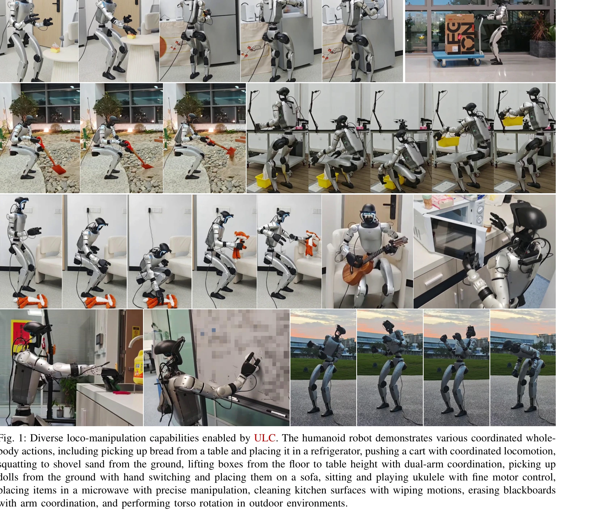
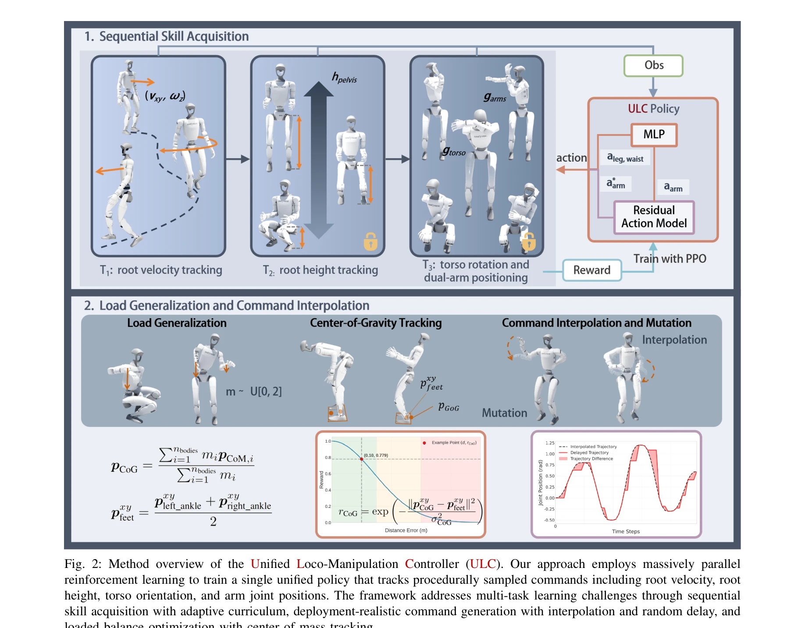

# ULC: A Unified and Fine-Grained Controller for Humanoid Loco-Manipulation

> **저자**: Wandong Sun, Luying Feng, Baoshi Cao, Yang Liu, Yaochu Jin, Zongwu Xie | **날짜**: 2025-07-09 | **URL**: [https://arxiv.org/abs/2507.06905](https://arxiv.org/abs/2507.06905)

---

## Essence

*Fig. 1: Diverse loco-manipulation capabilities enabled by ULC. The humanoid robot demonstrates various coordinated whole*

ULC는 인간형 로봇의 보행-조작을 위해 상체와 하체 제어를 통합한 단일 정책 프레임워크로, sequential skill acquisition, residual action modeling, 다항식 보간 등의 기술을 통해 추적 정확도, 넓은 작업 공간, 견고성을 동시에 달성한다.

## Motivation

- **Known**: 기존 연구는 보행(하체)과 조작(상체)을 분리된 정책으로 제어하는 계층적 구조를 주로 채택하여 훈련 복잡도를 감소시켰으나, 이는 부분 시스템 간 조율을 제한하고 인간의 전신 제어와 모순된다.
- **Gap**: 통합 제어가 성능(추적 정확도, 작업 공간, 견고성)을 희생하지 않으면서 달성 가능한지, 그리고 배포 실환경의 명령 변동성에 견디는 통합 제어기를 어떻게 설계할 것인지 불명확하다.
- **Why**: 인간형 로봇이 가정용 환경에서 복잡한 작업(물건 집기, 밀기, 정밀 조작)을 수행하려면 보행과 조작이 조율되어야 하며, 통합 제어는 이러한 전신 조율을 자연스럽게 구현할 수 있다.
- **Approach**: ULC는 진행적 커리큘럼 학습을 통해 복잡도를 단계적으로 증가시키고, residual action modeling으로 세밀한 제어 조정을, 다항식 보간과 random delay release로 배포 변동성에 대한 견고성을 확보하며, 대규모 병렬 reinforcement learning으로 단일 정책을 학습한다.

## Achievement

*Fig. 1: Diverse loco-manipulation capabilities enabled by ULC. The humanoid robot demonstrates various coordinated whole*

- **통합 제어 프레임워크**: root velocity, root height, torso rotation, dual-arm joint position을 동시에 추적하는 단일 정책으로 전신 조율 달성
- **향상된 추적 성능**: 분리된 방법 대비 더 나은 joint angle tracking 정확도 및 외부 부하 하에서의 정밀한 조작
- **넓은 작업 공간**: 기존 방법보다 큰 workspace coverage로 다양한 높이와 위치에서의 작업 가능
- **배포 견고성**: random delay release, load randomization, center-of-gravity tracking으로 실제 배포 변동성과 external disturbance에 대한 견고성 확보
- **다양한 작업 검증**: 냉장고에 물건 넣기, 상자 들기, 바닥에서 삽질, 악기 연주 등 10가지 이상의 복잡한 loco-manipulation 작업 성공

## How

*Fig. 2: Method overview of the Unified Loco-Manipulation Controller (ULC). Our approach employs massively parallel*

- **Sequential skill acquisition**: 간단한 보행 명령부터 시작하여 점진적으로 arm control, torso rotation 등을 추가하는 적응형 커리큘럼
- **Command space design**: 실행 가능성을 고려한 factorized command space (보행, 몸통, 팔 제어 분리) 설계로 탐색 공간 축소
- **Residual action modeling**: arm 제어를 desired position과 residual action의 합으로 모델링하여 정밀한 fine-grained control 실현
- **Polynomial interpolation**: 고정 간격 명령 샘플링과 5차 다항식 보간으로 smooth motion transition 구현
- **Stochastic command release**: 명령을 확률적으로 buffering/releasing하여 배포 시간 변동성을 에뮬레이션하고 견고성 향상
- **Load randomization**: 훈련 중 payload를 무작위로 변화시켜 external disturbance에 대한 일반화
- **Center-of-gravity tracking**: COM 투영이 support polygon 내에 유지되도록 명시적 보상 항 추가로 안정성 확보
- **Massive parallel RL**: 대규모 병렬 처리로 단일 정책 학습 가속화

## Originality

- **통합 제어의 실행 가능성 증명**: 계층적 분해 대신 단일 정책으로 전신 조율을 달성하면서도 성능 저하 없음을 처음으로 대규모 실험으로 입증
- **배포 현실성을 고려한 훈련 방법론**: random delay release와 polynomial interpolation을 결합하여 실제 배포 환경의 명령 시간 변동성을 훈련에 통합
- **Sequential skill acquisition의 체계적 적용**: 고차원 탐색 문제를 단계적 커리큘럼으로 해결하는 프레임워크를 humanoid loco-manipulation에 체계적으로 적용
- **Feasibility-aware command space**: 운동학적 실행 가능성을 고려한 명령 공간 설계로 기존 motion capture 기반 방법의 한계(noise, infeasibility, bias) 극복
- **Center-of-mass tracking 기반 안정성**: 외부 하중 변화에서 안정성을 유지하도록 COM tracking reward를 명시적으로 추가한 새로운 보상 설계

## Limitation & Further Study

- **하드웨어 검증 범위**: Unitree G1(3-DOF waist)에만 검증되었으므로, 다른 인간형 로봇 플랫폼(humanoid torso)에 대한 일반화 가능성 미확인
- **고차원 복잡 작업의 한계**: 현재 작업들은 단일 객체 조작 중심이며, 두 손의 복잡한 협력(dual-hand dexterous manipulation)이나 매우 동적인 이동(high-speed running)에 대한 성능 미상
- **시뮬레이션-현실 간극**: 대부분 시뮬레이션에서 훈련되었으므로 현실 배포 시 camera noise, actuator delay, unmodeled dynamics 등에 대한 견고성 정도가 불분명
- **명령 생성기의 독립성**: 논문은 low-level controller로 자리매김하며, 고수준 의도 파악(high-level decision-making) 부분은 별도 시스템(VLA models, Imitation Learning)에 의존
- **계산 비용 분석 부재**: 대규모 병렬 RL의 구체적인 계산 자원 요구 사항(GPUs, training time)이 명확하게 기술되지 않음
- **후속 연구**: (1) 더 자유도가 높은 torso 설계에 대한 확장, (2) vision-based feedback과의 통합으로 폐루프 제어 성능 향상, (3) 극한 상황(미끄러운 바닥, 비정상 자세)에서의 견고성 강화, (4) 실시간 재학습을 통한 적응형 제어

## Evaluation

- Novelty: 4/5
- Technical Soundness: 3/5
- Significance: 4/5
- Clarity: 4/5
- Overall: 4/5

**총평**: ULC는 humanoid loco-manipulation 분야에서 통합 제어의 실행 가능성을 처음으로 대규모 실험으로 입증한 의미 있는 논문이며, sequential skill acquisition, residual action modeling, deployment-realistic training 등의 체계적인 기술 조합으로 높은 추적 성능과 넓은 작업 공간을 동시에 달성했다. 다만 단일 하드웨어 플랫폼에만 검증되었고 시뮬레이션 기반 훈련의 현실 일반화 가능성에 대한 상세 분석이 부족한 점이 한계이다.

## Related Papers

- 🔄 다른 접근: [[papers/1784_A_Unified_and_General_Humanoid_Whole-Body_Controller_for_Ver/review]] — 기존 unified controller와 ULC의 loco-manipulation 통합 접근법을 비교하여 각각의 장단점을 분석할 수 있음
- 🏛 기반 연구: [[papers/1973_Hierarchical_Planning_and_Control_for_Box_Loco-Manipulation/review]] — hierarchical planning and control이 ULC의 상체-하체 통합 제어에서 sequential skill acquisition의 이론적 기반을 제공함
- 🔄 다른 접근: [[papers/2032_JAEGER_Dual-Level_Humanoid_Whole-Body_Controller/review]] — JAEGER의 dual-level control과 ULC의 unified single policy는 휴머노이드 전신 제어의 서로 다른 아키텍처 접근법임
- 🔗 후속 연구: [[papers/1678_SkillBlender_Towards_Versatile_Humanoid_Whole-Body_Loco-Mani/review]] — SkillBlender의 versatile whole-body skills에 ULC의 residual action modeling을 적용하면 더 정밀한 loco-manipulation 제어 가능
- 🔄 다른 접근: [[papers/1759_WoCoCo_Learning_Whole-Body_Humanoid_Control_with_Sequential/review]] — 둘 다 휴머노이드 전신 제어를 다루지만 이 논문은 보행-조작 통합에, WoCoCo는 순차적 전신 제어 학습에 중점을 둡니다.
- 🏛 기반 연구: [[papers/1700_TACT_Humanoid_Whole-body_Contact_Manipulation_through_Deep_I/review]] — 심층 강화학습을 통한 휴머노이드 전신 접촉 조작 기법이 상체-하체 통합 제어를 위한 단일 정책 프레임워크의 기반이 됩니다.
- 🔗 후속 연구: [[papers/1988_HuMam_Humanoid_Motion_Control_via_End-to-End_Deep_Reinforcem/review]] — 종단간 심층 강화학습을 통한 휴머노이드 동작 제어가 ULC의 보행-조작 통합 접근법을 더욱 자연스러운 인간-수준 제어로 발전시킬 수 있습니다.
- 🔗 후속 연구: [[papers/1784_A_Unified_and_General_Humanoid_Whole-Body_Controller_for_Ver/review]] — 통합되고 세밀한 휴머노이드 보행 제어를 HugWBC의 다목적 전신 제어 시스템으로 확장할 수 있습니다.
- 🔄 다른 접근: [[papers/1985_HOVER_Versatile_Neural_Whole-Body_Controller_for_Humanoid_Ro/review]] — ULC의 unified controller와 HOVER는 모두 다목적 humanoid 제어를 목표로 하지만 서로 다른 통합 방식을 사용한다.
